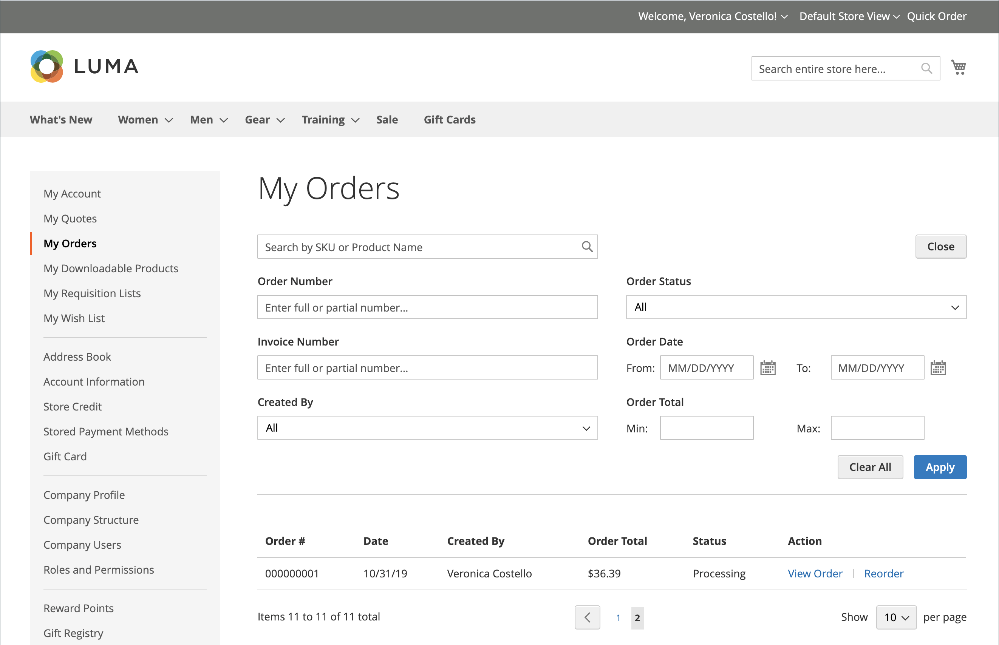
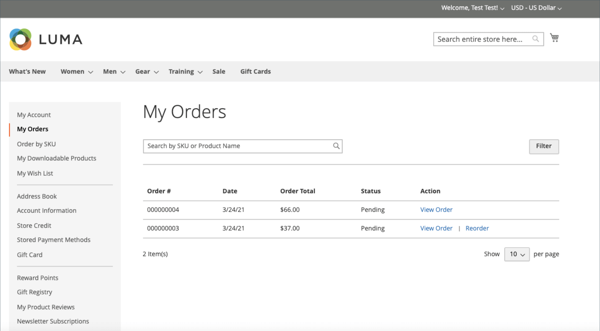

# Storefront 주문 관리

고객은 계정에서 모든 주문에 액세스할 수 있습니다. 주문을 새 주문으로 보고, 필터링하고, 추적하고, 다시 제출할 수 있습니다. 주문 상태에 따라 고객은 주문, 송장, 선적 및 환불 레코드를 인쇄할 수 있습니다.

## 주문 필터링

{{b2b-feature}}

내 이니셜 _[!UICONTROL My Orders]_결과는 또한 상거래 인스턴스 내의 모든 웹 사이트에서 하위 사용자의 일치하는 주문을 포함합니다. 회사 계정과 연결된 고객은 주문 목록을 필터링하여 결과 내에서 레코드를 빠르게 찾을 수 있습니다. 필터 옵션을 표시하기 위해 고객이 클릭&#x200B;**[!UICONTROL Filter]**, 및 클릭 수&#x200B;**[!UICONTROL Close]**필터를 숨깁니다.

{width="700" zoomable="yes"}

| 필터 | 설명 |
| ------ | ----------- |
| [!UICONTROL SKU or Product Name] | SKU 또는 제품 이름을 입력합니다. |
| [!UICONTROL Order Number] | 전체 또는 부분 주문 번호일 수 있습니다. |
| [!UICONTROL Order Status] | 드롭다운에서 상태별로 필터링할 값을 선택합니다. |
| [!UICONTROL Invoice Number] | 전체 또는 부분 송장 번호를 입력합니다. |
| [!UICONTROL Order Date] | 하나 또는 두 날짜 필드를 주문 날짜별로 필터링하도록 설정합니다. |
| [!UICONTROL Created by] | 주문 생성자가 회사 주문을 필터링합니다. |
| [!UICONTROL Order Total] | 최소, 최대 또는 두 값을 모두 설정하여 주문 합계로 필터링합니다. |

## 주문 보기

고객이 목록에서 주문을 찾고 클릭합니다. **[!UICONTROL View Order]**. 오픈 주문에서 다음 중 하나를 수행할 수 있습니다.

{width="700" zoomable="yes"}

### 최근에 주문한 제품 보기

다음 **[!UICONTROL Recent Orders]** 블록은 사이드바와 **[!UICONTROL My Account]** 주문 후 로그인한 고객의 페이지입니다. 지난번 구매한 제품 5개를 표시합니다.

고객은 제품을 선택하고 을 클릭하여 장바구니에 제품을 읽을 수 있습니다. **[!UICONTROL Add to Cart]**. 을 클릭하여 마지막 순서를 볼 수도 있습니다. **[!UICONTROL View all]**, (으)로 리디렉션됨 _[!UICONTROL My Account]_페이지 및&#x200B;**[!UICONTROL Recent Orders]**차단합니다.

### 인쇄 순서

1. 고객이 클릭 **[!UICONTROL Print Order]**.

1. 인쇄 대화 상자의 지침에 따라 인쇄를 완료합니다.

### 인보이스 인쇄

1. 다음에서 **[!UICONTROL Invoices]** 탭을 클릭하면 고객이 다음 중 하나를 클릭합니다.

   - **[!UICONTROL Print All Invoices]**

   - **[!UICONTROL Print Invoice]**

   {width="700" zoomable="yes"}

1. [인쇄] 대화 상자를 사용하여 인쇄를 완료합니다.

### 배송 인쇄

1. 다음에서 **[!UICONTROL Order Shipments]** 탭을 클릭하면 고객이 다음 중 하나를 클릭합니다.

   - **[!UICONTROL Print All Shipments]**

   - **[!UICONTROL Print Shipment]**

   {width="700" zoomable="yes"}

1. [인쇄] 대화 상자를 사용하여 인쇄를 완료합니다.

### 배송 추적

1. 다음에서 **[!UICONTROL Order Shipments]** 탭을 클릭하고 **[!UICONTROL Track this Shipment]**.

   사용할 수 있는 모든 추적 정보는 팝업 창에 나타납니다.

1. 준비가 되면 고객이 클릭 **[!UICONTROL Close Window]**.

### 환불 인쇄

1. 다음에서 **환불** 탭을 클릭하면 고객이 다음 중 하나를 클릭합니다.

   - **모든 환불 인쇄**

   - **환불 인쇄**

   {width="700" zoomable="yes"}

1. [인쇄] 대화 상자를 사용하여 인쇄를 완료합니다.

다음과 같은 경우에 고객이 재주문을 사용할 수 있습니다. [_순서 재지정 허용_](reorders-allow.md) 구성 옵션이 활성화되어 있습니다.

고객은 다음 두 페이지에서 특정 주문에 대한 순서 조정 기능을 시작할 수 있습니다.

- 내 주문 페이지
- 주문 보기 페이지

## 재주문

다음 _[!UICONTROL Reorder]_링크가 주문 근처의 목록에 표시됩니다._[!UICONTROL View]_ 링크를 클릭합니다.

{width="700" zoomable="yes"}

**사례 1.** 주문의 모든 제품은 재주문이 가능합니다

고객이 장바구니로 리디렉션되고 모든 제품이 장바구니에 추가됩니다.

**사례 2.** 주문의 일부/모든 제품은 재주문이 불가능합니다

>[!NOTE]
>
>순서를 변경할 수 있습니다. `Not Visible Individually` 제품.

다음 _[!UICONTROL Reorder]_링크가 다음 화면에 표시되지 않음_[!UICONTROL My Orders]_ 및 _[!UICONTROL View Order]_페이지.

{width="700" zoomable="yes"}

>[!TIP]
>
>장바구니가 비어 있지 않고 고객이 클릭하는 경우 **[!UICONTROL Reorder]** (다음에서) [!UICONTROL My Orders] 또는 [!UICONTROL Order View] page), 기존 제품은 추가된 재주문 제품과 함께 장바구니에 남아 있습니다.
