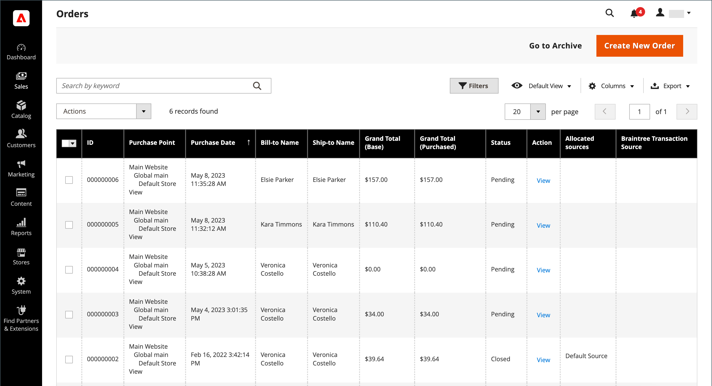

# 주문 수

다음 _주문 수_ 격자에 현재 주문이 모두 나열되고 진행 상황이 추적됩니다. [주문 상태](order-status.md) 다음을 통해 [워크플로우](order-processing.md). 기본 프로세스를 쉽게 이해할 수 있는 방법은 순서가 [인보이스](invoices.md), 그리고 송장이 [배송](shipments.md). 격자는 프로세스의 첫 번째 단계를 나타내며, 여기서 [업데이트](order-update.md) 기존 주문 및 주문 생성.

일반적으로 주문은 고객이 상점에서 체크아웃 프로세스를 완료할 때 생성됩니다. 그러나 고객의 지원이 필요한 경우 [장바구니](shopping-assisted-cart-manage.md) 또는 [주문 만들기](customer-account-create-order.md) 다음 중 하나에서 _주문 수_ 고객 계정에서 직접 또는 그리드를 작성합니다.

## 주문 작업 공간

주문 작업 공간에는 현재 주문이 모두 표시되며, 기존 주문 및 [만들기](customer-account-create-order.md) 주문. 그리드의 각 행은 고객 순서를 나타내고, 각 열은 속성 또는 데이터 필드를 나타냅니다. 표준 사용 [컨트롤](../getting-started/admin-grid-controls.md) 목록을 정렬 및 필터링하고 주문을 찾고 적용하려면 [작업](../getting-started/admin-actions-control.md) (으)로 변경되었습니다. 페이지 매김 컨트롤 위에 있는 탭을 사용하여 목록을 필터링하고, 기본 보기를 변경하고, 열을 변경 및 재배열하고, 데이터를 내보냅니다.

{width="700" zoomable="yes"}

### 그리드 레이아웃

선택한 열과 격자의 순서는 기본 설정에 따라 변경할 수 있습니다. 새 레이아웃을 격자로 저장할 수 있습니다 _보기_. 기본적으로 사용 가능한 20개의 열 중 9개의 열만 격자에 포함됩니다.

{width="600" zoomable="yes"}

#### 열 선택 변경

오른쪽 위 모서리에서 _열_ (  ) 를 제어하고 다음을 수행합니다.

- 그리드에 추가할 열의 확인란을 선택합니다.
- 그리드에서 제거할 열의 확인란을 선택 취소합니다.

#### 열 선택 재설정

1. 다음을 클릭합니다. _열_ (  ) 제어.

1. 그리드 열을 재설정하려면 **[!UICONTROL Reset]**.

   그리드 레이아웃이 표시 전용으로 변경됩니다. [기본 열](#column-descriptions).

#### 열 이동

1. 을(를) 클릭하고 열의 헤더를 유지합니다.

1. 열을 새 위치 및 릴리스로 드래그합니다.

#### 격자 보기 저장

1. 다음을 클릭합니다. **[!UICONTROL View]** (  ) 제어.

1. 클릭 **[!UICONTROL Save Current View]**.

1. 입력 **[!UICONTROL name]** 보기용입니다.

1. 모든 변경 사항을 저장하려면 화살표( )를 클릭합니다.  ).

   이제 뷰 이름이 현재 뷰로 나타납니다.

#### 보기 변경

다음을 클릭합니다. **[!UICONTROL View]** (  ) 제어. 그런 다음 다음 다음 중 하나를 수행합니다.

- 다른 뷰를 사용하려면 뷰 이름을 클릭합니다.

- 뷰 이름을 변경하려면 _편집_ (  ) 아이콘을 클릭하고 이름을 업데이트합니다.

### 작업 영역 컨트롤

| 제어 | 설명 |
|--- |--- |
| [!UICONTROL Create New Order] | 주문을 생성합니다. 다음을 참조하십시오 [주문 만들기](customer-account-create-order.md) 추가 정보. |
| [!UICONTROL Go to Archive] | 보관된 주문 목록을 표시합니다. |
| [!UICONTROL Search] | 현재 필터를 기반으로 주문 검색을 시작합니다. |
| [!UICONTROL Filters] | 그리드에 나타나는 레코드를 필터링하는 데 사용되는 검색 매개 변수 집합을 정의합니다. |
| [!UICONTROL Default View] | 그리드의 기본 열 레이아웃을 결정합니다. |
| [!UICONTROL Columns] | 열 선택 및 그리드에서 열 순서를 결정합니다. 열 레이아웃을 변경하여 다음과 같이 저장할 수 있습니다 _보기_. 기본적으로 일부 열만 격자에 포함됩니다. |
| [!UICONTROL Export] | 선택한 레코드를 CSV 또는 Excel XML 파일로 내보냅니다. |

{style="table-layout:auto"}

### 작업

특정 주문에 작업을 적용하려면 각 주문의 첫 번째 열에서 확인란을 선택합니다. 모든 주문을 선택하거나 선택 취소하려면 열 맨 위에 있는 컨트롤을 사용합니다.

{width="600" zoomable="yes"}

| 제어 | 설명 |
|--- |--- |
| [!UICONTROL Actions] | 선택한 주문에 적용할 수 있는 모든 작업을 나열합니다. 주문 또는 주문 그룹에 작업을 적용하려면 각 주문의 첫 번째 열에서 확인란을 선택합니다.  주문 작업: `Cancel` / `Hold` / `Unhold` / `Print Invoices` / `Print Packing Slips` / `Print Credit Memos` / `Print All` / `Print Shipping Labels` / `Move to Archive`  (Adobe Commerce 전용) |
| [!UICONTROL Mass Actions] | 여러 레코드를 작업 대상으로 선택하는 데 사용할 수 있습니다. 작업의 대상이 되는 각 레코드의 첫 번째 열에서 확인란을 선택합니다. 옵션: `Select All` / `Unselect All` / `Select Visible` / `Unselect Visible` |
| [!UICONTROL Submit] | 현재 작업을 선택한 주문 레코드에 적용합니다. |
| [!UICONTROL Edit] | 편집 모드로 주문을 엽니다. |

{style="table-layout:auto"}

### 열 설명

| 열 | 설명 |
|--- |--- |
| [!UICONTROL Select] | 견적에 대한 확인란을 선택하여 작업에 적용하거나 열 머리글에서 선택 컨트롤을 사용합니다. 옵션: 모두 선택 / 모두 선택 해제 |
| [!UICONTROL ID] | 새 순서가 처음 저장될 때 할당되는 고유한 순차적 번호입니다. |
| [!UICONTROL Purchase Point] | 주문이 이루어진 스토어 뷰를 식별합니다. |
| [!UICONTROL Purchase Date] | 주문이 이루어진 날짜 및 시간입니다. 항상 기본 시간대에 따라 표시됩니다. |
| [!UICONTROL Bill-to Name] | 주문에 대한 결제 책임이 있는 사람의 이름. |
| [!UICONTROL Ship-to Name] | 주문을 출하할 사람의 이름. |
| [!UICONTROL Grand Total (Base)] | 주문의 총 합계입니다. |
| [!UICONTROL Grand Total (Purchased)] | 주문에서 구매한 제품의 총 합계입니다. |
| [!UICONTROL Status] | 현재 주문 상태. |
| [!UICONTROL Action] | _[!UICONTROL View]_편집 모드로 주문을 엽니다. |
| [!UICONTROL Allocated sources] | 해당 특정 주문에 할당된 소스. |

{style="table-layout:auto"}

사용 가능한 추가 열:

| 열 | 설명 |
|--- |--- |
| [!UICONTROL Billing Address] | 주문한 고객의 청구 주소. |
| [!UICONTROL Shipping Address] | 주문이 배송될 주소입니다. |
| [!UICONTROL Shipping Information] | 주문을 출하하는 데 사용되는 방법. |
| [!UICONTROL Customer Email] | 주문한 사람의 이메일 주소입니다. |
| [!UICONTROL Customer Group] | 주문한 사람이 지정된 고객 그룹. |
| [!UICONTROL Subtotal] | 배송 및 취급 없이 주문 소계 및 세금. |
| [!UICONTROL Shipping and Handling] | 배송 및 처리에 대해 청구된 금액. |
| [!UICONTROL Customer Name] | 주문한 고객의 이름과 성입니다. |
| [!UICONTROL Payment Method] | 주문에 사용할 결제 방법. |
| [!UICONTROL Total Refunded] | 주문에서 고객에게 환불될 금액이 있습니다. |
| [!UICONTROL Refunded to Store Credit] |  (Adobe Commerce만 해당) 주문 후 고객의 스토어 크레딧으로 환불되는 모든 금액입니다. |
| [!UICONTROL Company Name] |  (Adobe Commerce B2B에서 사용 가능) [회사](../b2b/account-companies.md) 누가 주문을 했는지. |

{style="table-layout:auto"}

## 주문 검색

주문 그리드의 왼쪽 상단에 있는 검색 상자를 사용하여 키워드별로 특정 주문을 찾거나 그리드의 주문 레코드를 필터링할 수 있습니다.

{width="600" zoomable="yes"}

### 일치 항목 검색

1. 페이지 검색 상자에 검색어를 입력합니다.

1. 결과를 표시하려면 다음을 클릭합니다. _검색_ (  ).

### 검색 필터링

1. 선택한 검색 필터를 표시하려면 _필터_ (  ) 탭을 클릭합니다.

   {width="600" zoomable="yes"}

1. 찾으려는 주문을 설명하는 필터 수를 원하는 만큼 완료합니다.

1. 클릭 **[!UICONTROL Apply Filters]** 결과를 표시합니다.

### 검색 필터

| 필터 | 설명 |
|--- |--- |
| [!UICONTROL Purchase Date] | 구입한 날짜를 기준으로 검색을 필터링합니다. 일자 범위 내에서 주문을 찾으려면 **[!UICONTROL from]** 및 **[!UICONTROL to]** 날짜. |
| [!UICONTROL ID] | 주문 ID를 기반으로 검색을 필터링합니다. |
| [!UICONTROL Grand Total (Base)] | 주문에 적용된 크레딧을 포함하여 각 주문의 총 합계를 기반으로 검색을 필터링합니다. |
| [!UICONTROL Grand Total (Purchased)] | 각 주문에서 구매한 총 항목 수를 기준으로 검색을 필터링합니다. |
| [!UICONTROL Bill-to Name] | 주문 비용을 지불할 책임이 있는 사람의 이름에 따라 검색을 필터링합니다. |
| [!UICONTROL Ship-to Name] | 각 주문을 배송한 사람의 이름에 따라 검색을 필터링합니다. |
| [!UICONTROL Purchase Point] | 주문이 이루어진 웹 사이트, 스토어 또는 스토어 보기별로 검색을 필터링합니다. |
| [!UICONTROL Status] | 주문 상태를 기반으로 검색을 필터링합니다. 옵션: `Canceled` / `Closed` / `Complete` / `Suspected Fraud` / `On Hold` / `Payment Review` / `PayPal Canceled Reversal` /` PayPal Reversed` /` Pending` / `Pending Payment` / `Pending PayPal` / `Processing` |
| [!UICONTROL Braintree Transaction Source] | 거래 출처를 기반으로 검색을 필터링합니다. |

{style="table-layout:auto"}

### 검색 도구

| 도구 | 설명 |
|--- |--- |
| [!UICONTROL Apply Filters] | 모든 필터를 검색 결과에 적용합니다. |
| [!UICONTROL Cancel] | 현재 검색을 취소합니다. |
| [!UICONTROL Clear All] | 모든 검색 필터를 지웁니다. |

{style="table-layout:auto"}

## 리소스 문제 해결

주문 문제 해결에 대한 도움말은 다음 Commerce 지원 기술 자료 문서를 참조하십시오.

- [주문 표시 오류](https://experienceleague.adobe.com/docs/commerce-knowledge-base/kb/troubleshooting/storefront/magento-2.4.0-known-issue-orders-display-error.html)
- [PayPal 중복 주문 10415 오류](https://experienceleague.adobe.com/docs/commerce-knowledge-base/kb/support-tools/patches/v1-0-6/mdva-31006-magento-patch-paypal-duplicate-orders-10415-error.html)
- [새 주문이 아카이브로 전송됩니다.](https://experienceleague.adobe.com/docs/commerce-knowledge-base/kb/troubleshooting/known-issues-patches-attached/new-orders-are-sent-to-archive.html)
- [관리자의 주문 그리드에 표시되지 않는 주문](https://experienceleague.adobe.com/docs/commerce-knowledge-base/kb/troubleshooting/known-issues-patches-attached/orders-not-displayed-in-the-orders-grid-in-the-admin.html)
- [주문 상태 - REST API를 통해 생성된 잘못된 배송](https://experienceleague.adobe.com/docs/commerce-knowledge-base/kb/support-tools/patches/v1-0-7/mdva-30972-magento-patch-order-status-incorrect-shipment-created-via-rest-api.html)
