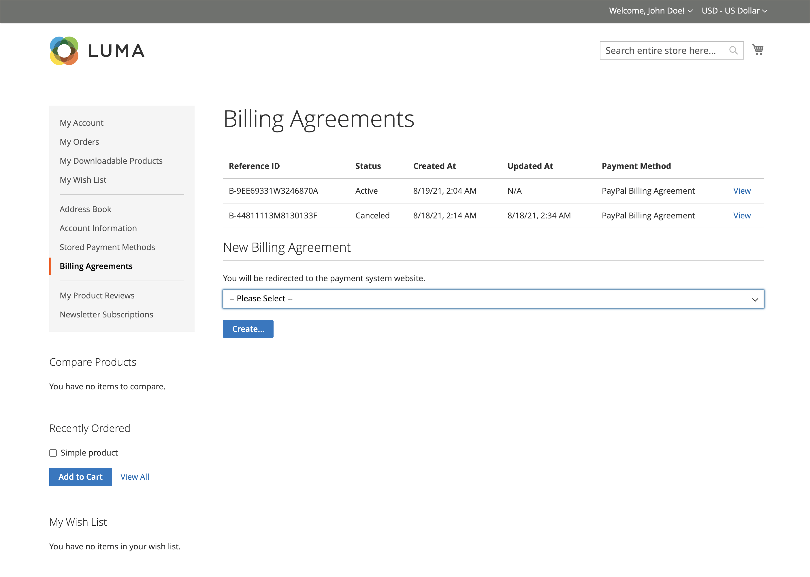
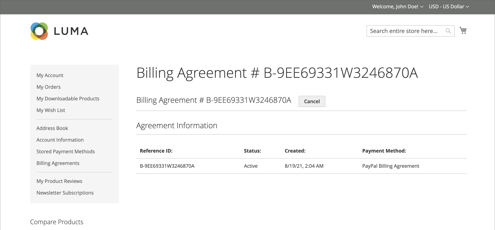

# PayPal 결제 계약

체크아웃 프로세스를 간소화하기 위해 고객은 결제 서비스 공급자로서 PayPal과 청구 계약을 체결할 수 있습니다. 체크아웃 시 고객은 결제 방법으로 청구 계약을 선택합니다. 결제 시스템은 고유한 번호로 청구 계약을 확인하고 고객 계정에 비용을 청구합니다. 청구 계약이 있는 경우 고객은 더 이상 각 구매에 대한 결제 정보를 입력할 필요가 없습니다. 고객은 고객 계정의 대시보드에서 청구 계약을 관리할 수 있으며, 각 상태는 _활성_ 또는 _취소됨_&#x200B;으로 표시됩니다. 청구 계약이 취소되면 다시 활성화할 수 없습니다.

## 청구 계약 워크플로우

1. **고객이 청구 계약에 등록합니다**. 청구 계약이 체결된 후에는 고객 계정에서만 추가 청구 계약을 추가할 수 있습니다. 고객이 만들 수 있는 청구 계약 수에는 제한이 없습니다. 고객은 다음 방법 중 하나를 사용하여 청구 계약에 등록할 수 있습니다.

   - **고객 계정에 등록** - 고객은 고객 계정에서 청구 계약에 등록할 수 있습니다.
   - **체크아웃 시 등록** - PayPal Express 체크아웃을 통해 구매하는 고객은 결제 계약을 만들기 위한 확인란을 선택할 수 있습니다. 현재 주문에는 청구 계약이 사용되지 않지만, 고객이 다음에 주문을 할 때 결제 방법 옵션으로 사용할 수 있습니다.
   - **스토어 관리자가 등록** - 고객 요청 시 스토어 관리자는 고객 청구 계약을 사용하여 판매 주문을 만들 수 있습니다.

1. **PayPal이 계약을 확인하고 기록합니다**. 고객이 청구별 지급결제로 주문하면 청구 계약 참조 ID와 판매 주문 결제 내역이 PayPal로 이전되고 참조 정보와 함께 고객 계정에 기록됩니다. 결제가 승인되면 Commerce에서 주문이 생성됩니다. 청구 계약 참조 ID가 고객과 스토어에 전송됩니다.

## 청구 계약 관리

_[!UICONTROL Billing Agreements]_&#x200B;페이지에는 스토어와 고객 간의 모든 청구 계약이 나열됩니다. 판매자는 청구 계약 참조 ID, 상태 및 생성 날짜를 포함하여 고객 또는 청구 계약 정보별로 레코드를 필터링할 수 있습니다. 각 레코드에는 청구 계약에 대한 일반 정보와 결제 수단으로 사용한 모든 판매 주문이 포함됩니다. 고객 청구 계약을 조회, 취소 또는 삭제할 수 있습니다. 취소된 청구 계약은 스토어 관리자만 삭제할 수 있습니다.

### 청구 계약 보기

1. _관리자_ 사이드바에서 **[!UICONTROL Sales]** > _[!UICONTROL Operations]_>**[!UICONTROL Billing Agreements]**(으)로 이동합니다.

1. 목록에서 청구 계약을 찾은 다음 을(를) 클릭하여 엽니다.

각 청구 계약 페이지는 두 개의 탭(_[!UICONTROL General Information]_&#x200B;및_[!UICONTROL Related Orders]_)으로 구성됩니다.

#### 일반 정보

이 탭에는 청구 계약에 대한 일반 정보가 포함되어 있습니다.

- [!UICONTROL Reference ID]: 현재 청구 계약에 할당된 고유한 숫자 식별자입니다.
- [!UICONTROL Customer]: 현재 청구 계약에 할당된 고객의 계정입니다.
- [!UICONTROL Status]: 결제 계약 상태.
- [!UICONTROL Created At]: 만든 날짜입니다.
- [!UICONTROL Updated At]: 날짜를 업데이트합니다.

{width="600" zoomable="yes"}

#### 관련 주문

이 탭에는 현재 청구 계약을 사용하여 수행한 주문 목록이 표시됩니다.

{width="600" zoomable="yes"}

### 청구 계약 취소

1. _관리자_ 사이드바에서 **[!UICONTROL Sales]** > _[!UICONTROL Operations]_>**[!UICONTROL Billing Agreements]**(으)로 이동합니다.

1. 목록에서 청구 계약을 찾은 다음 을(를) 클릭하여 엽니다.

1. 오른쪽 상단에서 **[!UICONTROL Cancel]**&#x200B;을(를) 클릭합니다.

1. 작업을 확인하려면 **[!UICONTROL OK]**&#x200B;을(를) 클릭합니다.

### 청구 계약 삭제

1. _관리자_ 사이드바에서 **[!UICONTROL Sales]** > _[!UICONTROL Operations]_>**[!UICONTROL Billing Agreements]**(으)로 이동합니다.

1. 목록에서 청구 계약을 찾은 다음 을(를) 클릭하여 엽니다.

1. 오른쪽 상단에서 **[!UICONTROL Delete]**&#x200B;을(를) 클릭합니다.

1. 작업을 확인하려면 **[!UICONTROL OK]**&#x200B;을(를) 클릭합니다.

### 열 설명

| 열 | 설명 |
|--- |--- |
| [!UICONTROL ID] | 각 청구 계약에 할당된 고유 숫자 식별자 |
| [!UICONTROL Email] | 고객 연락처 이메일 |
| [!UICONTROL First Name] | 고객의 이름 |
| [!UICONTROL Last Name] | 고객의 성 |
| [!UICONTROL Reference ID] | 각 청구 계약에 지정된 고유한 숫자 참조 식별자 |
| [!UICONTROL Status] | 결제 계약 상태. 옵션: `Active` 또는 `Canceled` |
| [!UICONTROL Created] | 제작일 |
| [!UICONTROL Updated] | 업데이트 일자 |

{style="table-layout:auto"}

## Storefront 경험

결제 제공자와 청구 계약을 체결한 고객은 계약에 따라 지금 구매하고 나중에 결제할 수 있습니다. 다음

{width="700" zoomable="yes"}

| 열 | 설명 |
|--- |--- |
| [!UICONTROL Reference ID] | 각 청구 계약에 지정된 고유한 숫자 참조 식별자 |
| [!UICONTROL Status] | 결제 계약 상태. 옵션: `Active` 또는 `Canceled` |
| [!UICONTROL Created At] | 제작일 |
| [!UICONTROL Updated At] | 업데이트 일자 |
| [!UICONTROL Payment Method] | 청구 계약의 결제 제공업체 |
| [!UICONTROL View] | 청구 계약 조회에 사용되는 버튼 |

{style="table-layout:auto"}

### 청구 계약 만들기

1. 계정 대시보드에서 고객이 **[!UICONTROL Billing Agreements]**&#x200B;을(를) 선택합니다.

1. **[!UICONTROL New Billing Agreement]**&#x200B;에서 결제 공급자를 선택합니다.

1. **[!UICONTROL Create]**&#x200B;을(를) 클릭합니다.

이 작업은 고객을 결제 시스템 웹 사이트로 리디렉션합니다.

{width="700" zoomable="yes"}

### 청구 계약 보기

1. 계정 대시보드에서 고객이 **[!UICONTROL Billing Agreements]**&#x200B;을(를) 선택합니다.

1. 청구 계약을 선택하고 **[!UICONTROL View]**&#x200B;을(를) 클릭합니다.

{width="700" zoomable="yes"}

### 청구 계약 취소

1. 계정 대시보드에서 고객이 **[!UICONTROL Billing Agreements]**&#x200B;을(를) 선택합니다.

1. 청구 계약을 선택하고 **[!UICONTROL View]**&#x200B;을(를) 클릭합니다.

1. 오른쪽 상단 모서리에서 **[!UICONTROL Cancel]**&#x200B;을(를) 클릭한 다음 **[!UICONTROL OK]**&#x200B;을(를) 클릭하여 확인합니다.

>[!NOTE]
>
>관리자 사용자(판매자)가 청구 계약을 취소하는 경우 상점 첫 화면에서 취소할 수 없습니다. 이 계약에 대해 _취소됨_ 상태가 표시됩니다.
