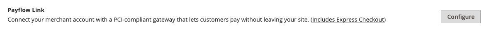

# PayPal 결제 링크

PayPal Payflow Link는 미국과 캐나다의 상인만 사용할 수 있습니다. 고객은 개인 PayPal 계정이 필요하지 않으며, PayPal에서 호스팅하는 양식에 신용카드 정보를 입력할 수 있습니다. 정보는 Adobe Commerce 또는 Magento Open Source 서버에 저장되지 않습니다. 관리자에서 생성된 주문에는 Payflow Link를 사용할 수 없습니다.

신용 메모는 온라인 및 오프라인 환불 모두에 대해 지원됩니다. 단, 복수의 온라인 환불은 지원되지 않습니다.

>[!IMPORTANT]
>
>**PSD2 요구 사항:**  
>2019년 9월 14일부터 유럽 은행들은 충족되지 않는 지불을 거절할 수 있습니다 [PSD2](../getting-started/compliance-payment-services-directive.md) 요구 사항. PSD2를 준수하려면 PayPal Payflow Link를 Cardinal Commerce와 통합해야 합니다. 자세한 내용은 다음을 참조하십시오. [Payflow용 3차원 보안](https://developer.paypal.com/api/nvp-soap/payflow/3d-secure-overview/).

## 요구 사항

- [PayPal 비즈니스 계정][1] PayPal Payflow Pro 게이트웨이는 PayPal의 판매자 계정을 판매자 웹사이트와 연결하여 게이트웨이와 판매자 계정 역할을 모두 수행합니다.

- 여러 상거래 웹 사이트를 관리하는 경우 각 웹 사이트에 대해 별도의 PayPal 판매자 계정이 있어야 합니다.

## 고객 워크플로우

1. **고객이 체크아웃합니다.** - 체크아웃 중에 고객이 PayPal Payflow 링크로 결제를 선택하고 신용카드 정보를 입력합니다. 고객은 개인 PayPal 계정을 가질 필요가 없습니다.
1. **고객이 지금 지불 선택** - 고객이 지금 지급 버튼을 눌러 주문을 실행합니다.
1. **고객이 신용 카드 정보를 입력합니다.** - 고객이 PayPal에서 호스팅하는 양식에 신용 카드 정보를 입력합니다. 고객이 _결제 취소_ 링크를 클릭하면 고객이 체크아웃의 결제 정보 단계로 돌아가서 주문 상태가 (으)로 변경됩니다. _취소됨_.
1. **고객이 주문을 제출함** - 신용카드 정보는 PayPal에 직접 제출되며 상거래 사이트의 어디에도 보관되지 않습니다.

## 주문 워크플로우

1. **PayPal 요청 수신** - PayPal은 고객으로부터 지금 지불하라는 요청을 받습니다.
1. **PayPal은 결제 정보를 확인합니다** - PayPal은 신용 카드 정보를 확인하고 적절한 상태를 지정합니다.
   - **결제 확인됨:** 확인되면 _보류 중인 결제_ 상태는 처음에 거래가 정산될 때까지 주문에 할당됩니다.
   - **처리 중** - 트랜잭션이 성공했습니다.
   - **보류 중인 결제** - 시스템이 PayPal로부터 응답을 받지 못했습니다.
   - **취소됨** - 어떤 이유로든 트랜잭션이 성공하지 않았습니다.
   - **사기 혐의** - 트랜잭션이 다음을 일부 전달하지 않았습니다. [PayPal 사기 필터](paypal.md#paypal-fraud-management-filters). 시스템은 페이팔로부터 해당 거래가 사기 서비스에 의해 검토 중이라는 응답을 받는다.
   - **결제 취소:** 고객이 _결제 취소_ 링크를 클릭하면 고객이 체크아웃의 결제 정보 단계로 돌아가서 주문 상태가 (으)로 변경됩니다. _취소됨_.
1. **고객이 확인 페이지로 리디렉션됨**  - 거래가 성공적으로 완료되면 고객은 상점의 주문 확인 페이지로 리디렉션됩니다. 어떤 이유로든 트랜잭션이 실패하는 경우, 체크아웃 페이지에 오류 메시지가 나타나고 고객은 체크아웃 프로세스를 반복하라는 안내를 받게 됩니다. 이러한 상황은 PayPal에서 관리합니다.
1. **판매자가 주문을 이행함** - 상인이 평소대로 송장을 발행하고 주문을 출하합니다.

## PayPal 계정 구성

1. 에 로그인 [PayPal 비즈니스 계정][2].

1. 구성 [호스팅된 체크아웃 페이지][4] 다음 설정으로 PayPal Manager 사용:

   - 아래 **[!UICONTROL Security Options]**, 다음 설정을 완료합니다.

     **[!UICONTROL AVS]**: `No`

     **[!UICONTROL CSC]**: `No`

     **[!UICONTROL Enable Secure Token]**: `Yes`

   - 선택 **[!UICONTROL Customize]**&#x200B;을 선택한 다음 을 선택합니다 **[!UICONTROL Layout C]**.

     레이아웃 C는 신용 카드 및 직불 카드 필드만 표시하며, 사이트에 프레임을 지정하거나 독립 실행형 팝업으로 사용할 수 있습니다. 크기는 490 x 565픽셀로 고정되며 오류 메시지를 위한 추가 공간이 있습니다. 일부 시스템에서 이 설정은 투명 리디렉션 문제를 수정합니다.

1. 구성 설정이 완료되면 다음을 클릭하십시오. **[!UICONTROL Save and Publish]**.

1. 추가 사용자 설정(PayPal 권장):

   - 기본 메뉴의 두 번째 행에서 **[!UICONTROL Manage Users]**.

   - 계정에 다른 사용자를 추가하려면 **[!UICONTROL Add User]**.

   - 의 다음 섹션에서 필수 필드를 작성합니다. _사용자 추가_ 양식:

      - [!UICONTROL Admin Confirmation]
      - [!UICONTROL User Information]
      - [!UICONTROL User Login Information]
      - [!UICONTROL Assign Privilege to User]

   - 클릭 **[!UICONTROL Update]**.

## PayPal 결제 링크 설정

>[!TIP]
>
>클릭 **[!UICONTROL Save Config]** 언제든지 진행 상황을 저장할 수 있습니다.

### 1단계: 구성 시작

이 설정 방법에서는 사용자에게 기존 PayPal 계정이 있다고 가정합니다.

1. 다음에서 _관리자_ 사이드바, 이동 **[!UICONTROL Stores]** > _[!UICONTROL Settings]_>**[!UICONTROL Configuration]**.

1. 왼쪽 패널에서 를 확장합니다. **[!UICONTROL Sales]** 및 선택 **[!UICONTROL Payment Methods]**.

1. 상거래 설치에 여러 웹 사이트, 스토어 또는 보기가 있는 경우 다음을 설정합니다. **[!UICONTROL Store View]** 이 구성을 적용할 저장소 보기로 이동합니다.

1. 다음에서 _[!UICONTROL Merchant Location]_섹션에서&#x200B;**[!UICONTROL Merchant Country]**비즈니스 위치.

   이 설정은 구성에 나타나는 PayPal 솔루션의 선택을 결정합니다.

   {width="600" zoomable="yes"}

1. 확장 **[!UICONTROL PayPal Payment Gateways]** (필요한 경우) 을 클릭하고 **[!UICONTROL Configure]** 대상 **[!UICONTROL Payflow Link]**.

   {width="600" zoomable="yes"}

### 2단계: 필요한 PayPal 설정 완료

{width="600" zoomable="yes"}

1. (선택 사항) **[!UICONTROL Email Associated with your PayPal Merchant Account]**.

   >[!IMPORTANT]
   >
   >이메일 주소는 대소문자를 구분합니다. 결제를 받으려면 이메일 주소가 PayPal 판매자 계정에 지정된 이메일 주소와 일치해야 합니다.

1. PayPal 판매자 계정에 로그인하는 데 사용하는 다음 자격 증명 중 하나를 입력하십시오.

   - **[!UICONTROL Partner]** - PayPal 파트너 ID입니다.
   - **[!UICONTROL User]** - PayPal 계정에 설정된 다른 사용자의 ID입니다.
   - **[!UICONTROL Vendor]** - PayPal 사용자 로그인 이름.

1. 다음을 입력합니다. **[!UICONTROL Password]** 페이팔 계정과 연결되어 있습니다.

1. 테스트 트랜잭션을 실행하려면 다음을 설정합니다. **[!UICONTROL Test Mode]** 끝 `Yes`.

   샌드박스에서 구성을 테스트할 때에는 만 사용하십시오 [신용 카드 번호][3] 페이팔에서 추천합니다. 프로덕션으로 이동할 준비가 되면 구성으로 돌아가 테스트 모드를 로 설정합니다. `No`.

1. 시스템이 프록시 서버를 사용하여 PayPal 시스템에 연결하는 경우 다음을 설정하십시오. **[!UICONTROL Test Mode]** 끝 `Yes` 다음을 수행합니다.

   - 의 IP 주소 입력 **[!UICONTROL Proxy Host]**.

   - 의 포트 번호 입력 **[!UICONTROL Proxy Port]**.

     서버 방화벽이 PayPal 서버에 대한 직접 액세스를 차단하는 경우 프록시가 사용됩니다. 이러한 경우 서드파티 서버가 트래픽을 중계하는 데 사용됩니다.

1. 설정 **[!UICONTROL Enable Payflow Link]** 끝 `Yes`.

1. 활성화하려는 경우 [PayPal Express 체크아웃](paypal-express-checkout.md) 고객을 위한 옵션, 설정 **[!UICONTROL Enable Express Checkout]** 끝 `Yes`.

1. 을(를) 제안하려면 [PayPal 신용](paypal.md#paypal-credit-and-pay-later) (으)로 설정합니다. **[!UICONTROL Enable PayPal Credit]** 끝 `Yes`.

### 단계 3: Advertising PayPal 크레딧/Advertising PayPal PayLater 설정(선택 사항)

2.4.3 릴리스부터 PayPal PayLater는 PayPal이 포함된 배포에서 지원됩니다. 이 기능을 통해 구매자는 구매 시 전체 금액을 지불하는 대신 2주 단위로 주문 금액을 지불하는 것이 가능하다. PayPal 크레딧 경험은 더 이상 사용되지 않습니다.

설정 **[!UICONTROL Enable PayPal PayLater Experience]** 다음 중 하나를 수행합니다.

- `Yes` - PayPal PayLater 광고를 설정하려면
- `No` - PayPal 크레딧을 광고하려면

#### PayPal 크레딧 광고

1. 확장  다음 **[!UICONTROL Advertise PayPal Credit]** 섹션.

   {width="600" zoomable="yes"}

1. 계정 정보를 얻으려면 다음을 클릭하십시오. **[!UICONTROL Get Publisher ID from PayPal]** 지침을 따르십시오.

1. 다음을 입력하십시오. **[!UICONTROL Publisher ID]**.

1. 확장  다음 **[!UICONTROL Home Page]** 섹션.

   {width="600" zoomable="yes"}

1. 페이지에 배너를 배치하려면 다음을 설정하십시오. **[!UICONTROL Display]** 끝 `Yes`.

1. 설정 **[!UICONTROL Position]** 다음 중 하나를 수행합니다.

   - `Header (center)`
   - `Sidebar (right)`

1. 설정 **[!UICONTROL Size]** 다음 중 하나를 수행합니다.

   - `190 x 100`
   - `234 x 60`
   - `300 x 50`
   - `468 x 60`
   - `728 x 90`
   - `800 x 66`

1. 확장  나머지 섹션 및 홈 페이지 구성에 대한 이전 단계를 반복합니다.

   - **[!UICONTROL Catalog Category Page]**
   - **[!UICONTROL Catalog Product Page]**
   - **[!UICONTROL Checkout Cart Page]**

#### PayPal PayLater 광고

1. 확장  다음 **[!UICONTROL Advertise PayPal PayLater]** 섹션.

1. 설정 **[!UICONTROL Enable PayPal PayLater]** 끝 `Yes`.

1. 확장  다음 **[!UICONTROL Home Page]** 섹션.

   {width="600" zoomable="yes"}

1. 페이지에 배너를 배치하려면 다음을 설정하십시오. **[!UICONTROL Display]** 끝 `Yes`.

1. 설정 **[!UICONTROL Position]** 다음 중 하나를 수행합니다.

   - `Header (center)`
   - `Sidebar`

1. 설정 **[!UICONTROL Style Layout]** 다음 중 하나를 수행합니다.

   - `Text`
   - `Flex`

1. 대상 [!UICONTROL Style Layout] **[!UICONTROL Text]** 만, 설정 **[!UICONTROL Logo Type]** 다음 중 하나를 수행합니다.

   - `Primary`
   - `Alternative`
   - `Inline`
   - `None`

1. 대상 [!UICONTROL Style Layout] **[!UICONTROL Text]** 만, 설정 **[!UICONTROL Logo Position]** 다음 중 하나를 수행합니다.

   - `Left`
   - `Right`
   - `Top`

1. 대상 [!UICONTROL Style Layout] **[!UICONTROL Text]** 만, 설정 **[!UICONTROL Text Color]** 다음 중 하나를 수행합니다.

   - `Black`
   - `White`
   - `Monochrome`
   - `Grayscale`

1. 대상 [!UICONTROL Style Layout] **[!UICONTROL Text]** 만, 설정 **[!UICONTROL Text Size]** 다음 중 하나를 수행합니다.

   - `10px`
   - `11px`
   - `12px`
   - `13px`
   - `14px`
   - `15px`
   - `16px`

1. 대상 [!UICONTROL Style Layout] **[!UICONTROL Flex]** 만, 설정 **[!UICONTROL Ratio]** 다음 중 하나를 수행합니다.

   - `1x1`
   - `1x4`
   - `8x1`
   - `20x1`

1. 대상 [!UICONTROL Style Layout] **[!UICONTROL Flex]** 만, 설정 **[!UICONTROL Color]** 다음 중 하나를 수행합니다.

   - `Blue`
   - `Black`
   - `White`
   - `White No Border`
   - `Gray`
   - `Monochrome`
   - `Grayscale`

1. 확장  나머지 섹션 및 이전 단계를 반복합니다.

   - **[!UICONTROL Catalog Product Page]**
   - **[!UICONTROL Checkout Cart Page]**
   - **[!UICONTROL Checkout Payment Step]**
   - **[!UICONTROL Catalog Category Page]**

### 4단계: 기본 설정 완료

1. 확장  다음 **[!UICONTROL Basic Settings - PayPal Payflow Link]** 섹션.

   {width="600" zoomable="yes"}

1. 대상 **[!UICONTROL Title]**&#x200B;을 클릭하고 체크아웃 중에 PayPal 결제 링크를 식별하는 제목을 입력합니다.

   제목을 사용하는 것이 좋습니다 _직불 카드 또는 신용카드_.

1. 여러 결제 방법을 제공하는 경우 숫자를 입력합니다. **[!UICONTROL Sort Order]** 다른 결제 방법과 함께 나열할 때 Payflow Link가 표시되는 순서를 결정합니다.

   이 번호는 다른 결제 방법과 관련이 있습니다. (`0` = 첫 번째, `1` = 초, `2` = 세 번째 등입니다.)

1. 설정 **[!UICONTROL Payment Action]** 다음 중 하나를 수행합니다.

   - `Authorization` - 구매를 승인하고 자금을 보류합니다. 그 금액은 상인에게 포획될 때까지 인출되지 않는다.
   - `Sale` - 구매 금액이 승인되어 즉시 고객의 계좌에서 인출됩니다.

### 5단계: 고급 설정 완료

1. 확장  다음 **[!UICONTROL Advanced Settings]** 섹션.

   {width="600" zoomable="yes"}

1. 설정 **[!UICONTROL Payment Applicable From]** 다음 중 하나를 수행합니다.

   - `All Allowed Countries` - 모든 고객의 고객 [국가](../getting-started/store-details.md#country-options) 스토어 구성에 지정된 경우 이 결제 방법을 사용할 수 있습니다.
   - `Specific Countries` - 이 옵션을 선택한 후 _[!UICONTROL Payment from Specific Countries]_목록이 나타납니다. Ctrl 키를 누른 채 목록에서 고객이 스토어에서 구매할 수 있는 각 국가를 선택합니다.

1. 결제 시스템과의 통신을 로그 파일에 기록하려면 다음을 설정합니다. **[!UICONTROL Debug Mode]** 끝 `Yes`.

   >[!NOTE]
   >
   >PCI 데이터 보안 표준에 따라 신용 카드 정보는 로그 파일에 기록되지 않습니다.

1. 호스트 신뢰성을 확인하려면 다음을 설정하십시오. **[!UICONTROL Enable SSL Verification]** 끝 `Yes`.

1. 고객이 신용 카드 뒷면에서 세 자리 CVV 보안 코드 입력을 수정할 수 있도록 하려면 다음을 설정합니다. **[!UICONTROL CVV Entry is Editable]** 끝 `Yes`.

1. 고객이 CVV 코드를 입력하도록 하려면 다음을 설정합니다 **[!UICONTROL Require CVV Entry]** 끝 `Yes`.

1. 결제 확인을 고객에게 보내려면 다음을 설정합니다. **[!UICONTROL Send Email Confirmation]** 끝 `Yes`.

1. 트랜잭션 중에 PayPal 서버와 정보를 교환하는 데 사용할 방법을 결정하려면 **[!UICONTROL URL method for Cancel URL and Return URL]** 다음 중 하나를 수행합니다.

   - `GET` - 프로세스(기본 메서드)의 결과인 정보를 검색합니다.
   - `POST` - 양식에 입력한 데이터와 같은 데이터 블록을 데이터 처리 프로세스에 제공합니다.

   다음 _URL 취소_ 및 _URL 반환_ payPal 서버에서 체크아웃 프로세스의 결제 부분을 완료하거나 취소한 후 고객이 다시 방문하는 페이지를 참조하십시오

1. 스토어에 필요한 경우 다음 섹션을 완료합니다.

   - [결제 보고서 설정](#settlement-report-settings)
   - [프론트엔드 경험 설정](#frontend-experience-settings)

#### 결제 보고서 설정

1. 확장  다음 **[!UICONTROL Settlement Report Settings]** 섹션.

   {width="600" zoomable="yes"}

1. 대상 **[!UICONTROL SFTP Credentials]**&#x200B;를 사용하여 다음을 수행합니다.

   - PayPal 보안 FTP 서버에 등록한 경우 다음 SFTP 로그인 자격 증명을 입력하십시오.

      - 로그인
      - 암호

   - 사이트에서 빠른 체크아웃으로 시작하기 전에 테스트 보고서를 실행하려면 을 설정합니다. **[!UICONTROL Sandbox Mode]** 끝 `Yes`.

   - 다음을 입력합니다. **[!UICONTROL Custom Endpoint Hostname or IP Address]**.

     기본적으로 값은 입니다. `reports.paypal.com`.

   - 다음을 입력합니다. **[!UICONTROL Custom Path]** 보고서가 저장되는 위치입니다.

     기본적으로 값은 입니다. `/ppreports/outgoing`.

1. 일정에 따라 보고서를 생성하려면 다음을 완료하십시오. **[!UICONTROL Scheduled Fetching]** 설정:

   - 설정 **[!UICONTROL Enable Automatic Fetching]** 끝 `Yes`.

   - 설정 **[!UICONTROL Schedule]** 다음 중 하나를 수행합니다.

      - `Daily`
      - `Every 3 Days`
      - `Every 7 Days`
      - `Every 10 Days`
      - `Every 14 Days`
      - `Every 30 Days`
      - `Every 40 Days`

     PayPal은 45일 동안 각 보고서를 유지합니다.

   - 설정 **[!UICONTROL Time of Day]** 보고서를 생성할 시간, 분 및 초로 설정합니다.

#### 프론트엔드 경험 설정

사용 _[!UICONTROL Frontend Experience Settings]_사이트에 표시할 PayPal 로고를 선택하고 PayPal 판매자 페이지의 모양을 사용자 지정합니다.

1. 확장  다음 **[!UICONTROL Frontend Experience Settings]** 섹션.

   {width="600" zoomable="yes"}

1. 다음 항목 선택 **[!UICONTROL PayPal Product Logo]** 스토어의 PayPal 블록에 표시하려는 경우입니다.

   PayPal 로고는 4가지 스타일과 2가지 크기로 제공됩니다.

   - `No Logo`
   - `We Prefer PayPal (150 x 60 or 150 x 40)`
   - `Now Accepting PayPal (150 x 60 or 150 x 40)`
   - `Payments by PayPal (150 x 60 or 150 x 40)`
   - `Shop Now Using PayPal (150 x 60 or 150 x 40)`

1. PayPal 판매자 페이지의 모양을 사용자 지정하려면:

   - 의 이름을 입력합니다. **[!UICONTROL Page Style]** PayPal 판매자 페이지에 적용할 대상:

      - `paypal` - PayPal 페이지 스타일을 사용합니다.
      - `primary` - 로 식별한 페이지 스타일을 사용합니다. _기본_ 계정 프로필에서 스타일을 지정합니다.
      - `your_custom_value` - 계정 프로필에 지정된 사용자 정의 결제 페이지 스타일을 사용합니다.

   - 대상 **[!UICONTROL Header Image URL]**&#x200B;결제 페이지의 왼쪽 위 모서리에 표시할 이미지의 URL을 입력합니다. 최대 파일 크기는 750픽셀 너비 x 90픽셀 높이입니다.

     >[!NOTE]
     >
     >PayPal은 이미지가 보안(https) 서버에 있는 것을 권장합니다. 그렇지 않으면 브라우저가 다음을 경고할 수 있습니다. _페이지에 보안 및 비보안 항목이 모두 포함되어 있습니다._.

   - 페이지의 색상을 설정하려면 6자의 16진수 코드를 `#` 기호, 각 항목:

      - **[!UICONTROL Header Background Color]** - 체크아웃 페이지 헤더의 배경색입니다.
      - **[!UICONTROL Header Border Color]** - 헤더 주위의 2픽셀 테두리 색입니다.
      - **[!UICONTROL Page Background Color]** - 체크아웃 페이지 및 헤더와 결제 양식 주변의 배경색입니다.

### 단계 6: PayPal Express 체크아웃에 대한 기본 설정 완료

1. 확장  다음 **[!UICONTROL Basic Settings - PayPal Express Checkout]** 섹션.

   {width="600" zoomable="yes"}

1. 대상 **[!UICONTROL Title]**&#x200B;을 클릭하고 체크아웃 중에 이 결제 방법을 식별하는 제목을 입력합니다.

   제목 설정 _PayPal_ 각 스토어 보기에 대해 권장됩니다.

1. 여러 결제 방법을 제공하는 경우 숫자를 입력합니다. **[!UICONTROL Sort Order]** 다른 결제 방법과 함께 나열할 때 PayPal Express Checkout이 표시되는 순서를 결정합니다.

   이 번호는 다른 결제 방법과 관련이 있습니다. (`0` = 첫 번째, `1` = 초, `2` = 세 번째 등입니다.)

1. 설정 **[!UICONTROL Payment Action]** 다음 중 하나를 수행합니다.

   - `Authorization` - 구매를 승인하고 자금을 보류합니다. 그 금액은 그때까지 인출되지 않는다 _캡처됨_ 상인에 의해.
   - `Sale` - 구매 금액이 승인되어 즉시 고객의 계좌에서 인출됩니다.

1. 다음을 표시합니다. _[!UICONTROL Check out with PayPal]_제품 페이지의 단추, 설정&#x200B;**[!UICONTROL Display on Product Details Page]**끝 `Yes`.

### 7단계: PayPal Express 체크아웃에 대한 고급 설정 완료

1. 확장  다음 **[!UICONTROL Advanced Settings]** 섹션.

   {width="600" zoomable="yes"}

1. 설정 **[!UICONTROL Display on Shopping Cart]** 끝 `Yes`.

1. 설정 **[!UICONTROL Payment Applicable From]** 다음 중 하나를 수행합니다.

   - `All Allowed Countries` - 스토어 구성에 지정된 모든 국가의 고객이 이 결제 방법을 사용할 수 있습니다.
   - `Specific Countries` - 이 옵션을 선택한 후 _[!UICONTROL Payment from Specific Countries]_목록이 나타납니다. 여러 국가를 선택하려면 Ctrl 키(PC) 또는 Command 키(Mac)를 누른 채 각 항목을 클릭합니다.

1. 결제 시스템과의 통신을 로그 파일에 기록하려면 다음을 설정합니다. **[!UICONTROL Debug Mode]** 끝 `Yes`.

   >[!NOTE]
   >
   >PCI 데이터 보안 표준에 따라 신용 카드 정보는 로그 파일에 기록되지 않습니다.

1. 호스트 신뢰성을 확인하려면 다음을 설정하십시오. **[!UICONTROL Enable SSL Verification]** 끝 `Yes`.

1. PayPal 사이트에서 라인 항목별로 고객 주문의 전체 요약을 표시하려면 다음을 설정합니다. **[!UICONTROL Transfer Cart Line Items]** 끝 `Yes`.

1. 고객이 주문 검토를 위해 스토어로 돌아가지 않고 PayPal 사이트에서 거래를 완료할 수 있도록 하려면 다음을 설정하십시오. **[!UICONTROL Skip Order Review Step]** 끝 `Yes`.

1. 완료되면 다음을 클릭하십시오. **[!UICONTROL Save Config]**.

[1]: https://www.paypal.com/webapps/mpp/how-to-sell-online
[2]: https://manager.paypal.com/
[3]: https://www.paypalobjects.com/en_AU/vhelp/paypalmanager_help/credit_card_numbers.htm
[4]: https://developer.paypal.com/docs/payflow/integration-guide/configure-hosted-checkout/#configuring-hosted-pages-using-paypal-manager
