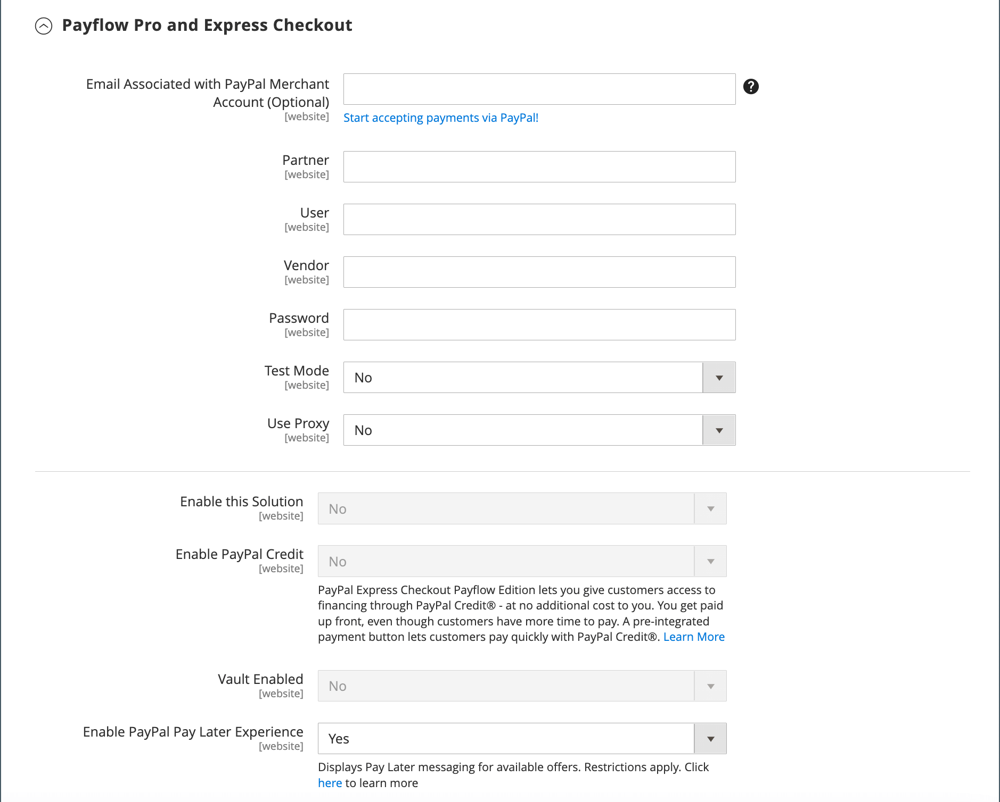
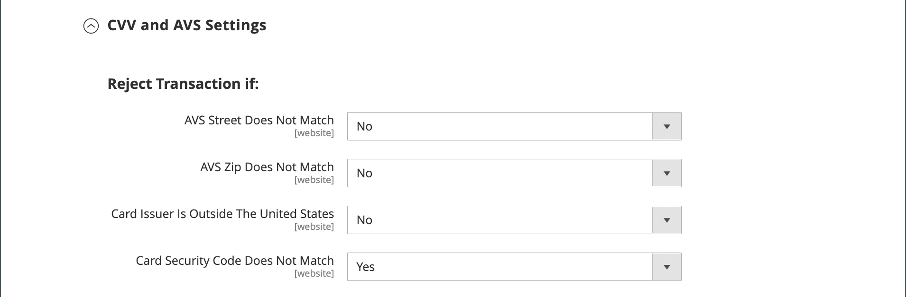

# Paypal Payflow Pro

이전에 _Verisign_(으)로 알려졌던 PayPal Payflow Pro 게이트웨이를 미국, 캐나다, 호주, 뉴질랜드 고객이 사용할 수 있습니다. 다른 페이팔 결제 방식과 달리 가맹점에는 숫자와 관계없이 매월 정해진 수수료에 거래 때마다 정해진 수수료가 붙는다.

{width="700" zoomable="yes"}

>[!IMPORTANT]
>
>**PSD2 요구 사항:**  
>2019년 9월 14일부터 유럽 은행은 [PSD2](../getting-started/compliance-payment-services-directive.md) 요구 사항을 충족하지 않는 결제를 거절할 수 있습니다. PSD2를 준수하려면 PayPal Payflow Pro를 서드파티 플러그인과 통합해야 합니다. 자세한 내용은 [Payflow용 3D 보안](https://developer.paypal.com/api/nvp-soap/payflow/3d-secure-mpi/)을 참조하세요.

## 요구 사항

- [PayPal 비즈니스 계정](https://www.paypal.com/webapps/mpp/how-to-sell-online) - PayPal Payflow Pro 게이트웨이는 PayPal의 판매자 계정을 판매자 웹 사이트와 연결하여 게이트웨이와 판매자 계정 역할을 모두 합니다.

- 여러 Adobe Commerce 및 Magento Open Source 웹 사이트를 관리하는 경우 각 웹 사이트에 대해 별도의 PayPal 판매자 계정이 있어야 합니다.

## 고객 워크플로우

1. **고객이 체크아웃으로 이동** - 체크아웃 중에 고객이 PayPal Payflow Pro로 결제를 선택하고 신용카드 정보를 입력합니다. 고객은 개인 PayPal 계정을 보유할 필요가 없습니다. 다만 상권국가에 따라 고객이 개인 페이팔 계좌를 이용해 주문대금을 결제할 수도 있다.
1. **고객이 주문을 제출함** - 고객이 주문을 제출하고 주문 정보가 처리를 위해 PayPal로 전송됩니다. 고객은 사이트의 체크아웃 페이지를 벗어나지 않습니다.
1. **PayPal이 트랜잭션을 완료합니다** - 주문이 이루어진 시점에 지불이 수락됩니다. 구성에 지정된 지급 조치에 따라 판매 주문이나 판매 주문 및 송장이 생성됩니다.

## 온라인 주문 처리 워크플로우

1. **관리자가 온라인 송장을 제출** - 스토어 관리자가 온라인 송장을 제출하면 해당 거래와 송장이 생성됩니다.
1. **PayPal이 트랜잭션을 받습니다** - 주문 정보가 PayPal로 전송됩니다. 거래 기록 및 송장이 생성됩니다. [PayPal 판매자 계정](https://manager.paypal.com/)에서 모든 Payflow Pro Gateway 트랜잭션을 볼 수 있습니다.

>[!NOTE]
>
>부분 송장 및 부분 환불은 PayPal Payflow Pro에서 지원되지 않습니다.

## PayPal 계정 구성

1. [PayPal 비즈니스 계정](https://manager.paypal.com/)에 로그인합니다.

1. 다음 설정으로 PayPal 관리자를 사용하여 [호스팅된 체크아웃 페이지](https://developer.paypal.com/docs/payflow/integration-guide/configure-hosted-checkout/#configuring-hosted-pages-using-paypal-manager)를 구성하십시오.

   - **[!UICONTROL Choose your settings]**&#x200B;에서 **[!UICONTROL Transaction Process Mode]**&#x200B;을(를) `Live`(으)로 설정합니다.

   - **[!UICONTROL Display options on payment page]**&#x200B;에서 **URL 메서드 취소**&#x200B;를 `POST`(으)로 설정합니다.

   - **[!UICONTROL Billing Information]**&#x200B;에서 필수 필드와 편집 가능한 필드 모두에 대해 카드 보안 코드 **[!UICONTROL CSC]** 확인란을 선택하십시오.

   - **[!UICONTROL Payment Confirmation]**&#x200B;에서 **[!UICONTROL Return URL Method]**&#x200B;을(를) `POST`(으)로 설정합니다.

   - **[!UICONTROL Security Options]**&#x200B;에서 다음 설정을 완료합니다.

      - **[!UICONTROL AVS]**: `No`
      - **[!UICONTROL CSC]**: `No`
      - **[!UICONTROL Enable Secure Token]**: `Yes`

   - **[!UICONTROL Customize]**&#x200B;을(를) 선택한 다음 **[!UICONTROL Layout C]**&#x200B;을(를) 선택하십시오.

     레이아웃 C는 신용 카드 및 직불 카드 필드만 표시하며, 사이트에 프레임을 지정하거나 독립 실행형 팝업으로 사용할 수 있습니다. 크기는 490 x 565픽셀로 고정되며 오류 메시지를 위한 추가 공간이 있습니다. 일부 시스템에서 이 설정은 투명 리디렉션 문제를 수정합니다.

1. 구성 설정이 완료되면 **[!UICONTROL Save and Publish]**&#x200B;을(를) 클릭합니다.

1. PayPal 관리자 메뉴에서 **[!UICONTROL Account Administration]**&#x200B;을(를) 선택합니다.

1. **[!UICONTROL Manage Security]**&#x200B;에서 **[!UICONTROL Transaction Settings]**&#x200B;을(를) 클릭하고 다음을 수행합니다.

   - **[!UICONTROL Allow reference transactions]**&#x200B;을(를) `Yes`(으)로 설정합니다.

   - **[!UICONTROL Confirm]**&#x200B;을(를) 클릭합니다.

     >[!NOTE]
     >
     >여러 Commerce 웹 사이트가 있는 경우 각각에 대해 별도의 PayPal 결제 고급 계정을 만들어야 합니다.

1. 다른 사용자 설정(PayPal 권장):

   - 기본 메뉴의 두 번째 행에서 **[!UICONTROL Manage Users]**&#x200B;을(를) 클릭합니다.

   - 계정에 다른 사용자를 추가하려면 **[!UICONTROL Add User]**&#x200B;을(를) 클릭합니다. 링크는 사용자 관리 제목 바로 위에 있습니다.

   - _[!UICONTROL Add User]_양식의 다음 섹션에서 필수 필드를 작성합니다.

      - [!UICONTROL Admin Confirmation]
      - [!UICONTROL User Information]
      - [!UICONTROL User Login Information]
      - [!UICONTROL Assign Privilege to User]

   - **[!UICONTROL Update]**&#x200B;을(를) 클릭합니다.

1. PayPal 계정에서 로그아웃해야 합니다.

## Commerce에서 PayPal Payflow Pro 설정

>[!TIP]
>
>언제든지 **[!UICONTROL Save Config]**&#x200B;을(를) 클릭하여 진행 상황을 저장합니다.

### 1단계: 구성 시작

이 설정 방법에서는 사용자에게 기존 PayPal 계정이 있다고 가정합니다.

1. _관리자_ 사이드바에서 **[!UICONTROL Stores]** > _[!UICONTROL Settings]_>**[!UICONTROL Configuration]**(으)로 이동합니다.

1. 왼쪽 패널에서 **[!UICONTROL Sales]**&#x200B;을(를) 확장하고 **[!UICONTROL Payment Methods]**&#x200B;을(를) 선택합니다.

1. Commerce 설치에 웹 사이트, 스토어 또는 보기가 여러 개 있는 경우 이 구성을 적용할 스토어 보기로 **[!UICONTROL Store View]**&#x200B;을(를) 설정합니다.

1. _[!UICONTROL Merchant Location]_섹션에서 비즈니스가 있는&#x200B;**[!UICONTROL Merchant Country]**을(를) 선택합니다.

   이 설정은 구성에 나타나는 PayPal 솔루션의 선택을 결정합니다.

   {width="600" zoomable="yes"}

1. 필요한 경우 **[!UICONTROL PayPal Payment Gateways]**&#x200B;을(를) 확장하고 **[!UICONTROL Configure]**&#x200B;에 대해 **[!UICONTROL Payflow Pro]**&#x200B;을(를) 클릭합니다.

   {width="600" zoomable="yes"}

### 2단계: 필요한 PayPal 설정 완료

{width="600" zoomable="yes"}

1. (선택 사항) **[!UICONTROL Email Associated with your PayPal Merchant Account]**&#x200B;을(를) 입력합니다.

   >[!IMPORTANT]
   >
   >이메일 주소는 대소문자를 구분합니다. 결제를 받으려면 이메일 주소가 PayPal 판매자 계정에 지정된 이메일 주소와 일치해야 합니다.

1. PayPal 판매자 계정에 로그인하는 데 사용하는 다음 자격 증명 중 하나를 입력하십시오.

   - **[!UICONTROL Partner]** - PayPal 파트너 ID입니다.
   - **[!UICONTROL User]** - 계정에 한 명 이상의 추가 사용자를 설정하는 경우 이 값은 트랜잭션을 처리할 권한이 있는 사용자의 ID입니다. 그러나 추가 사용자를 설정하지 않은 경우 **[!UICONTROL USER]**&#x200B;의 값은 **[!UICONTROL Vendor]**&#x200B;과(와) 같습니다.
   - **[!UICONTROL Vendor]** - 계정에 등록할 때 만든 판매자 로그인 ID입니다.

1. PayPal 계정과 연결된 **[!UICONTROL Password]**&#x200B;을(를) 입력하십시오.

1. 테스트 트랜잭션을 실행하려면 **[!UICONTROL Test Mode]**&#x200B;을(를) `Yes`(으)로 설정합니다.

   샌드박스에서 구성을 테스트할 때 PayPal에서 권장하는 [신용 카드 번호](https://www.paypalobjects.com/en_AU/vhelp/paypalmanager_help/credit_card_numbers.htm)만 사용하십시오. 프로덕션으로 전환할 준비가 되면 구성으로 돌아가 테스트 모드를 `No`(으)로 설정하십시오.

1. 시스템이 프록시 서버를 사용하여 PayPal 시스템에 연결하는 경우 **[!UICONTROL Use Proxy]**&#x200B;을(를) `Yes`(으)로 설정하고 다음을 수행하십시오.

   - **[!UICONTROL Proxy Host]**&#x200B;의 IP 주소를 입력하십시오.

   - **[!UICONTROL Proxy Port]**&#x200B;의 포트 번호를 입력하십시오.

     서버 방화벽이 PayPal 서버에 대한 직접 액세스를 차단하는 경우 프록시가 사용됩니다. 이러한 경우 서드파티 서버가 트래픽을 중계하는 데 사용됩니다.

1. **[!UICONTROL Enable this Solution]**&#x200B;을(를) `Yes`(으)로 설정합니다.

1. 고객에게 [PayPal 크레딧](paypal.md#paypal-credit-and-pay-later)을 제공하려면 **[!UICONTROL Enable PayPal Credit]**&#x200B;을(를) `Yes`(으)로 설정하십시오.

1. 고객이 매번 결제 정보를 다시 입력할 필요가 없도록 고객 결제/신용 카드 세부 정보를 안전하게 저장하려면 **[!UICONTROL Vault Enabled]**&#x200B;을(를) `Yes`(으)로 설정하십시오.

### 단계 3: Advertising PayPal 크레딧/Advertising PayPal PayLater 설정(선택 사항)

2.4.3 릴리스부터 PayPal PayLater는 PayPal이 포함된 배포에서 지원됩니다. 이 기능을 통해 구매자는 구매 시 전체 금액을 지불하는 대신 2주 단위로 주문 금액을 지불하는 것이 가능하다. PayPal 크레딧 경험은 더 이상 사용되지 않습니다.

**[!UICONTROL Enable PayPal PayLater Experience]**&#x200B;을(를) 다음 중 하나로 설정합니다.

- `Yes` - Advertising PayPal PayLater를 설정하려면
- `No` - Advertising PayPal 크레딧을 설정하려면

#### PayPal 크레딧 광고

1. 확장 선택기&#x200B;**[!UICONTROL Advertise PayPal Credit]**&#x200B;를 확장합니다.

   {width="600" zoomable="yes"}

1. 계정 정보를 보려면 **[!UICONTROL Get Publisher ID from PayPal]**&#x200B;을(를) 클릭하고 지침을 따르십시오.

1. **[!UICONTROL Publisher ID]**&#x200B;을(를) 입력하십시오.

1. 확장 선택기&#x200B;**[!UICONTROL Home Page]**&#x200B;를 확장합니다.

   {width="600" zoomable="yes"}

1. 페이지에 배너를 배치하려면 **[!UICONTROL Display]**&#x200B;을(를) `Yes`(으)로 설정합니다.

1. **[!UICONTROL Position]**&#x200B;을(를) 다음 중 하나로 설정합니다.

   - `Header (center)`
   - `Sidebar (right)`

1. **[!UICONTROL Size]**&#x200B;을(를) 다음 중 하나로 설정합니다.

   - `190 x 100`
   - `234 x 60`
   - `300 x 50`
   - `468 x 60`
   - `728 x 90`
   - `800 x 66`

1. 나머지 를 확장하고 홈 페이지 설정에 대해 이전 단계를 반복합니다.

   - **[!UICONTROL Catalog Category Page]**
   - **[!UICONTROL Catalog Product Page]**
   - **[!UICONTROL Checkout Cart Page]**

#### PayPal PayLater 광고

1. 확장 선택기&#x200B;**[!UICONTROL Advertise PayPal PayLater]**&#x200B;를 확장합니다.

1. **[!UICONTROL Enable PayPal PayLater]**&#x200B;을(를) `Yes`(으)로 설정합니다.

1. 확장 선택기&#x200B;**[!UICONTROL Home Page]**&#x200B;를 확장합니다.

   {width="600" zoomable="yes"}

1. 페이지에 배너를 배치하려면 **[!UICONTROL Display]**&#x200B;을(를) `Yes`(으)로 설정합니다.

1. **[!UICONTROL Position]**&#x200B;을(를) 다음 중 하나로 설정합니다.

   - `Header (center)`
   - `Sidebar`

1. **[!UICONTROL Style Layout]**&#x200B;을(를) 다음 중 하나로 설정합니다.

   - `Text`
   - `Flex`

1. [!UICONTROL Style Layout] **[!UICONTROL Text]**&#x200B;에 대해서만 **[!UICONTROL Logo Type]**&#x200B;을(를) 다음 중 하나로 설정하십시오.

   - `Primary`
   - `Alternative`
   - `Inline`
   - `None`

1. [!UICONTROL Style Layout] **[!UICONTROL Text]**&#x200B;에 대해서만 **[!UICONTROL Logo Position]**&#x200B;을(를) 다음 중 하나로 설정하십시오.

   - `Left`
   - `Right`
   - `Top`

1. [!UICONTROL Style Layout] **[!UICONTROL Text]**&#x200B;에 대해서만 **[!UICONTROL Text Color]**&#x200B;을(를) 다음 중 하나로 설정하십시오.

   - `Black`
   - `White`
   - `Monochrome`
   - `Grayscale`

1. [!UICONTROL Style Layout] **[!UICONTROL Text]**&#x200B;에 대해서만 **[!UICONTROL Text Size]**&#x200B;을(를) 다음 중 하나로 설정하십시오.

   - `10px`
   - `11px`
   - `12px`
   - `13px`
   - `14px`
   - `15px`
   - `16px`

1. [!UICONTROL Style Layout] **[!UICONTROL Flex]**&#x200B;에 대해서만 **[!UICONTROL Ratio]**&#x200B;을(를) 다음 중 하나로 설정하십시오.

   - `1x1`
   - `1x4`
   - `8x1`
   - `20x1`

1. [!UICONTROL Style Layout] **[!UICONTROL Flex]**&#x200B;에 대해서만 **[!UICONTROL Color]**&#x200B;을(를) 다음 중 하나로 설정하십시오.

   - `Blue`
   - `Black`
   - `White`
   - `White No Border`
   - `Gray`
   - `Monochrome`
   - `Grayscale`

1. 나머지 를 확장하고 이전 단계를 반복합니다.

   - **[!UICONTROL Catalog Product Page]**
   - **[!UICONTROL Checkout Cart Page]**
   - **[!UICONTROL Checkout Payment Step]**
   - **[!UICONTROL Catalog Category Page]**

### 4단계: 기본 설정 완료

1. 확장 선택기&#x200B;**[!UICONTROL Basic Settings - PayPal Payflow Pro]**&#x200B;를 확장합니다.

   {width="600" zoomable="yes"}

1. **[!UICONTROL Title]**&#x200B;의 경우 체크아웃 중에 PayPal Payflow Pro를 식별하는 제목을 입력하십시오.

   _직불 또는 신용 카드_&#x200B;라는 제목을 사용하는 것이 좋습니다.

1. 여러 결제 방법을 제공하는 경우 **[!UICONTROL Sort Order]**&#x200B;에 대한 숫자를 입력하여 다른 결제 방법과 함께 나열될 때 Payflow Pro가 표시되는 순서를 결정합니다.

   이 번호는 다른 결제 방법과 관련이 있습니다. (`0` = 첫 번째, `1` = 두 번째, `2` = 세 번째 등)

1. **[!UICONTROL Payment Action]**&#x200B;을(를) 다음 중 하나로 설정합니다.

   - `Authorization` - 구매를 승인하고 자금을 보류합니다. 그 금액은 상인에게 포획될 때까지 인출되지 않는다.
   - `Sale` - 구매 금액이 승인되어 고객 계정에서 즉시 인출됩니다.

1. **[!UICONTROL Credit Card Settings]**&#x200B;의 경우 스토어에서 결제에 사용할 수 있는 신용 카드를 선택하십시오.

   여러 카드를 선택하려면 Ctrl 키(PC) 또는 Command 키(Mac)를 누른 상태에서 각 카드를 클릭합니다.

   >[!NOTE]
   >
   >아메리칸 익스프레스는 추가 합의가 필요합니다.

### 5단계: 고급 설정 완료

1. 확장 선택기&#x200B;**[!UICONTROL Advanced Settings]**&#x200B;를 확장합니다.

   {width="600" zoomable="yes"}

1. **[!UICONTROL Payment Applicable From]**&#x200B;을(를) 다음 중 하나로 설정합니다.

   - `All Allowed Countries` - 스토어 구성에 지정된 모든 [국가](../getting-started/store-details.md#country-options)의 고객이 이 결제 방법을 사용할 수 있습니다.
   - `Specific Countries` - 이 옵션을 선택하면 _[!UICONTROL Payment from Specific Countries]_목록이 나타납니다. Ctrl 키(PC) 또는 Command 키(Mac)를 누른 채로 목록에서 고객이 스토어에서 구매할 수 있는 각 국가를 선택합니다.

1. 결제 시스템과의 통신을 로그 파일에 기록하려면 **[!UICONTROL Debug Mode]**&#x200B;을(를) `Yes`(으)로 설정합니다.

   >[!NOTE]
   >
   >PCI 데이터 보안 표준에 따라 신용 카드 정보는 로그 파일에 기록되지 않습니다.

1. 호스트 정품 인증을 사용하려면 **[!UICONTROL Enable SSL Verification]**&#x200B;을(를) `Yes`(으)로 설정하십시오.

1. 고객이 CVV 코드를 입력하도록 하려면 **[!UICONTROL Require CVV Entry]**&#x200B;을(를) `Yes`(으)로 설정하십시오.

1. 스토어에 필요한 경우 다음 섹션을 완료합니다.

   - [CVV 및 AVS 설정](#cvv-and-avs-settings)
   - [결제 보고서 설정](#settlement-report-settings)
   - [프론트엔드 경험 설정](#frontend-experience-settings)

#### CVV 및 AVS 설정

주소 확인 시스템에서 불일치를 식별할 때 트랜잭션이 거부되어야 하는 시기를 확인하려면 다양한 시나리오를 처리하는 방법을 지정하십시오.

1. 확장 선택기&#x200B;**[!UICONTROL CVV and AVS Settings]**&#x200B;를 확장합니다.

   {width="600" zoomable="yes"}

1. 일치하지 않는 거리 불일치를 기준으로 트랜잭션을 거부하려면 **[!UICONTROL AVS Street Does Not Match]**&#x200B;을(를) `Yes`(으)로 설정하십시오.

1. 일치하지 않는 ZIP 코드를 기반으로 트랜잭션을 거부하려면 **[!UICONTROL AVS Zip Does Not Match]**&#x200B;을(를) `Yes`(으)로 설정하십시오.

1. 일치하지 않는 국가 식별자를 기반으로 트랜잭션을 거부하려면 **[!UICONTROL International AVS Indicator Does Not Match]**&#x200B;을(를) `Yes`(으)로 설정하십시오.

1. 일치하지 않는 CVV 코드를 기준으로 트랜잭션을 거부하려면 **[!UICONTROL International Card Security Code Does Not Match]**&#x200B;을(를) `Yes`(으)로 설정하십시오.

#### 결제 보고서 설정

1. 확장 선택기&#x200B;**[!UICONTROL Settlement Report Settings]**&#x200B;를 확장합니다.

   {width="600" zoomable="yes"}

1. **[!UICONTROL SFTP Credentials]**&#x200B;의 경우 다음을 수행합니다.

   - PayPal 보안 FTP 서버에 등록한 경우 다음 SFTP 로그인 자격 증명을 입력하십시오.

      - 로그인
      - 암호

   - 사이트에서 빠른 체크아웃을 사용하기 전에 테스트 보고서를 실행하려면 **[!UICONTROL Sandbox Mode]**&#x200B;을(를) `Yes`(으)로 설정합니다.

   - **[!UICONTROL Custom Endpoint Hostname or IP Address]** 입력.

     기본적으로 값은 `reports.paypal.com`입니다.

   - 보고서가 저장된 **[!UICONTROL Custom Path]**&#x200B;을(를) 입력하십시오.

     기본적으로 값은 `/ppreports/outgoing`입니다.

1. 일정에 따라 보고서를 생성하려면 **[!UICONTROL Scheduled Fetching]** 설정을 완료하십시오.

   - **[!UICONTROL Enable Automatic Fetching]**&#x200B;을(를) `Yes`(으)로 설정합니다.

   - **[!UICONTROL Schedule]**&#x200B;을(를) 다음 중 하나로 설정합니다.

      - `Daily`
      - `Every 3 Days`
      - `Every 7 Days`
      - `Every 10 Days`
      - `Every 14 Days`
      - `Every 30 Days`
      - `Every 40 Days`

     PayPal은 45일 동안 각 보고서를 유지합니다.

   - 보고서를 생성할 시간, 분, 초로 **[!UICONTROL Time of Day]**&#x200B;을(를) 설정합니다.

#### 프론트엔드 경험 설정

프론트엔드 경험 설정을 사용하여 사이트에 표시할 PayPal 로고를 선택하고 PayPal 판매자 페이지의 모양을 사용자 지정합니다.

1. 확장 선택기&#x200B;**[!UICONTROL Frontend Experience Settings]**&#x200B;를 확장합니다.

   {width="600" zoomable="yes"}

1. 스토어의 PayPal 블록에 표시할 **[!UICONTROL PayPal Product Logo]**&#x200B;을(를) 선택하십시오.

   PayPal 로고는 4가지 스타일과 2가지 크기로 제공됩니다.

   - `No Logo`
   - `We Prefer PayPal (150 x 60 or 150 x 40)`
   - `Now Accepting PayPal (150 x 60 or 150 x 40)`
   - `Payments by PayPal (150 x 60 or 150 x 40)`
   - `Shop Now Using PayPal (150 x 60 or 150 x 40)`

1. PayPal 판매자 페이지의 모양을 사용자 지정하려면:

   - PayPal 판매자 페이지에 적용할 **[!UICONTROL Page Style]**&#x200B;의 이름을 입력하십시오.

      - `paypal` - PayPal 페이지 스타일을 사용합니다.
      - `primary` - 계정 프로필에서 _primary_ 스타일로 식별한 페이지 스타일을 사용합니다.
      - `your_custom_value` - 계정 프로필에 지정된 사용자 지정 결제 페이지 스타일을 사용합니다.

   - **[!UICONTROL Header Image URL]**&#x200B;의 경우 결제 페이지의 왼쪽 위 모서리에 표시할 이미지의 URL을 입력하십시오. 최대 파일 크기는 750픽셀 너비 x 90픽셀 높이입니다.

     >[!NOTE]
     >
     >PayPal은 이미지가 보안(https) 서버에 있는 것을 권장합니다. 그렇지 않으면 _페이지에 보안 및 비보안 항목이 모두 포함되어 있습니다_.

   - 페이지의 색상을 설정하려면 다음 각 페이지에 대해 6자의 16진수 코드(기호 `#` 제외)를 입력하십시오.

      - **[!UICONTROL Header Background Color]** - 체크아웃 페이지 헤더의 배경색입니다.
      - **[!UICONTROL Header Border Color]** - 머리글 주변의 2픽셀 테두리 색입니다.
      - **[!UICONTROL Page Background Color]** - 체크아웃 페이지와 머리글 및 결제 양식 주변의 배경색입니다.

### 단계 6: PayPal Express 체크아웃에 대한 기본 설정 완료

1. 확장 선택기&#x200B;**[!UICONTROL Basic Settings - PayPal Express Checkout]**&#x200B;를 확장합니다.

   {width="600" zoomable="yes"}

1. **[!UICONTROL Title]**&#x200B;의 경우 체크아웃 중에 이 결제 방법을 식별하는 제목을 입력하십시오.

   각 스토어 보기에 대해 제목을 _PayPal_(으)로 설정하는 것이 좋습니다.

1. 여러 결제 방법을 제공하는 경우 **[!UICONTROL Sort Order]**&#x200B;에 대한 숫자를 입력하여 다른 결제 방법과 함께 나열될 때 PayPal Express Checkout이 표시되는 순서를 결정합니다.

   이 번호는 다른 결제 방법과 관련이 있습니다. (`0` = 첫 번째, `1` = 두 번째, `2` = 세 번째 등)

1. **[!UICONTROL Payment Action]**&#x200B;을(를) 다음 중 하나로 설정합니다.

   - `Authorization` - 구매를 승인하고 자금을 보류합니다. 판매자가 _캡처한_&#x200B;이 될 때까지 금액이 인출되지 않습니다.
   - `Sale` - 구매 금액이 승인되어 고객 계정에서 즉시 인출됩니다.

1. 제품 페이지에 _[!UICONTROL Check out with PayPal]_단추를 표시하려면&#x200B;**[!UICONTROL Display on Product Details Page]**을(를) `Yes`(으)로 설정하십시오.

### 7단계: PayPal Express 체크아웃에 대한 고급 설정 완료

1. 확장 선택기&#x200B;**[!UICONTROL Advanced Settings]**&#x200B;를 확장합니다.

   {width="600" zoomable="yes"}

1. **[!UICONTROL Display on Shopping Cart]**&#x200B;을(를) `Yes`(으)로 설정합니다.

1. **[!UICONTROL Payment Applicable From]**&#x200B;을(를) 다음 중 하나로 설정합니다.

   - `All Allowed Countries` - 스토어 구성에 지정된 모든 국가의 고객이 이 결제 방법을 사용할 수 있습니다.
   - `Specific Countries` - 이 옵션을 선택하면 _[!UICONTROL Payment from Specific Countries]_목록이 나타납니다. 여러 국가를 선택하려면 Ctrl 키(PC) 또는 Command 키(Mac)를 누른 채 각 항목을 클릭합니다.

1. 결제 시스템과의 통신을 로그 파일에 기록하려면 **[!UICONTROL Debug Mode]**&#x200B;을(를) `Yes`(으)로 설정합니다.

   >[!NOTE]
   >
   >PCI 데이터 보안 표준에 따라 신용 카드 정보는 로그 파일에 기록되지 않습니다.

1. 호스트 정품 인증을 사용하려면 **[!UICONTROL Enable SSL Verification]**&#x200B;을(를) `Yes`(으)로 설정하십시오.

1. PayPal 사이트의 항목별 고객 주문에 대한 전체 요약을 표시하려면 **[!UICONTROL Transfer Cart Line Items]**&#x200B;을(를) `Yes`(으)로 설정하십시오.

1. 고객이 주문 검토를 위해 스토어로 돌아가지 않고 PayPal 사이트에서 거래를 완료할 수 있도록 하려면 **[!UICONTROL Skip Order Review Step]**&#x200B;을(를) `Yes`(으)로 설정하십시오.

1. 완료되면 **[!UICONTROL Save Config]**&#x200B;을(를) 클릭합니다.

### 8단계: Google reCAPTCHA 추가

PayPal Payflow Pro 체크아웃을 더 잘 보호하려면 Google reCAPTCHA를 활성화하십시오. 여기에는 클릭 가능한 인터페이스 또는 보이지 않는 검사를 사용하여 reCAPTCHA를 실행하여 고객을 확인하는 옵션이 포함되어 있습니다. 판매 전환을 높이고 매장을 보호하기 위해 보이지 않는 옵션이 권장됩니다. 자세한 내용은 [Google reCAPTCHA](../systems/security-google-recaptcha.md)을(를) 참조하십시오.
