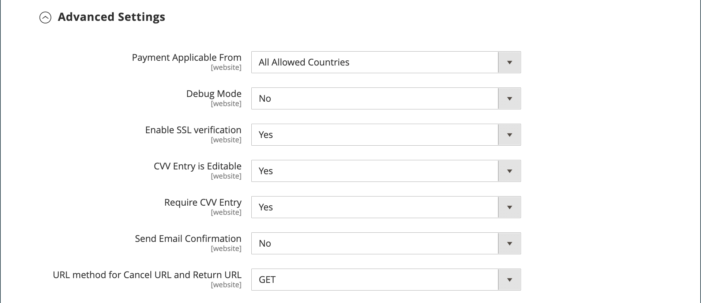

# PayPal 결제 고급

[PayPal 결제 고급][4] 다음 값: [PCI 호환](../getting-started/compliance-pci.md) 고객이 사이트를 나가지 않고 직불 또는 신용 카드로 결제할 수 있는 솔루션입니다. 여기에는 매끄럽고 안전한 체크아웃 경험을 만들도록 사용자 지정할 수 있는 포함된 체크아웃 페이지가 포함되어 있습니다.

PayPal 계정이 없는 고객도 PayPal 보안 결제 게이트웨이를 통해 구매할 수 있습니다. 허용되는 카드에는 미국 및 영국의 Visa, MasterCard, Switch/Maestro 및 Solo 신용 카드가 포함됩니다. 추가적인 편의를 위해 PayPal Express Checkout은 PayPal Payments Advanced에 포함되어 있습니다.

>[!IMPORTANT]
>
>**PSD2 요구 사항:**  
>2019년 9월 14일부터 유럽 은행들은 충족되지 않는 지불을 거절할 수 있습니다 [PSD2](../getting-started/compliance-payment-services-directive.md) 요구 사항. PSD2를 준수하려면 PayPal Payments Advanced를 타사 플러그인과 통합해야 합니다. 자세한 내용은 다음을 참조하십시오. [Payflow용 3차원 보안](https://developer.paypal.com/api/nvp-soap/payflow/3d-secure-mpi/).

>[!NOTE]
>
>PayPal Payments Advanced는 스토어 관리자가 생성한 주문에 사용할 수 없습니다.

## 요구 사항

- [PayPal 비즈니스 계정][1]
- 여러 Adobe Commerce 및 Magento Open Source 웹 사이트를 관리하는 경우 각 웹 사이트에 대해 별도의 PayPal 판매자 계정이 있어야 합니다.

## 체크아웃 워크플로우

1. **고객이 결제 방법 선택** - 체크아웃 중에 고객은 PayPal Payments Advanced로 결제를 선택합니다. 주문 버튼 대신 지금 지급 버튼이 나타납니다.

1. **지금 결제** - 고객이 클릭/탭 _지금 결제_&#x200B;을 입력하면 PayPal 호스팅 양식이 표시됩니다. 고객이 카드 정보를 입력하면 카드가 검증된다. 성공하면 주문 확인 페이지가 나타납니다.

   **PayPal 결제** - 양식에는 _PayPal 결제_ 버튼을 누르면 고객이 PayPal 사이트로 리디렉션되며, 여기서 PayPal Express Checkout으로 결제를 수행할 수 있습니다.

1. **문제 해결** - 어떤 이유로든 트랜잭션이 실패하는 경우, 체크아웃 페이지에 오류 메시지가 나타나고 고객에게 다시 시도하라는 메시지가 표시됩니다. 모든 문제는 PayPal에서 관리합니다.

## 주문 처리 워크플로우

PayPal Payments Advanced를 사용한 주문 처리는 일반 PayPal 주문과 동일합니다. 주문은 송장이 발행되고 출하되며, 대변 메모는 온라인 및 오프라인 환불 모두에 대해 생성됩니다. 단, PayPal Payments Advanced로 결제된 주문의 경우 여러 온라인 환불이 불가능합니다.

1. **고객 주문** - 체크아웃 마지막 단계에서 고객은 주문 버튼을 탭합니다.

1. **Paypal 응답** - PayPal이 요청을 평가합니다. 유효한 것으로 확인되면 PayPal에서 거래를 처리합니다.

1. **Commerce에서 주문 상태 설정** - Commerce가 PayPal로부터 응답을 받고 주문 상태를 다음 중 하나로 설정합니다.

   - **처리 중** - 트랜잭션이 성공했습니다.
   - **보류 중인 결제** - 시스템이 PayPal로부터 응답을 받지 못했습니다.
   - **취소됨** - 어떤 이유로 트랜잭션이 완료되지 않았습니다.
   - **사기 혐의** - 트랜잭션이 다음을 일부 전달하지 않았습니다. [PayPal 사기 필터](paypal.md#paypal-fraud-management-filters). 시스템은 페이팔로부터 해당 거래가 사기 서비스에 의해 검토 중이라는 응답을 받는다.

1. **판매자가 주문을 이행함** - 상인이 송장을 발행하고 주문을 출하합니다.

## PayPal 계정 구성

Commerce에서 PayPal Payments Advanced를 설정하기 전에 PayPal 웹 사이트에서 계정을 구성해야 합니다.

1. 에 로그인 [PayPal 비즈니스 계정][2].

1. 다음으로 이동 **[!UICONTROL Service Settings]** > **[!UICONTROL Hosted Checkout Pages]** > **[!UICONTROL Set Up Menu]** 다음 설정을 완료합니다.

   - **[!UICONTROL AVS]**: `No`
   - **[!UICONTROL CSC]**: `No`
   - **[!UICONTROL Enable Secure Token]**: `Yes`

1. **[!UICONTROL Save]** 설정.

   >[!NOTE]
   >
   >여러 상거래 웹 사이트가 있는 경우 각각에 대해 별도의 PayPal Payments Advanced 계정을 만들어야 합니다.

1. 레이아웃을 만들라는 메시지가 표시되면 다음을 수행합니다.

   - 페이지 맨 위에서 을 클릭합니다. **[!UICONTROL Customize]**.

   - 선택 **[!UICONTROL Layout C]**.

   - 클릭 **[!UICONTROL Save and Publish]**.

1. 다른 사용자 설정(PayPal 권장):

   - 에 로그인 [PayPal 비즈니스 계정][2].

   - 다른 사용자를 설정하려면 지침을 따르십시오.

   - **[!UICONTROL Save]** 변경 사항.

## Commerce에서 PayPal 결제 고급 설정

>[!NOTE]
>
>두 개의 PayPal 솔루션을 동시에 활성화할 수 있습니다. 익스프레스 체크아웃과 모든 올인원 또는 결제 게이트웨이 솔루션이 이에 해당합니다. 결제 솔루션을 변경하는 경우 이전에 사용한 솔루션이 비활성화됩니다.

>[!TIP]
>
>클릭 **[!UICONTROL Save Config]** 언제든지 진행 상황을 저장할 수 있습니다.

### 1단계: 구성 시작

1. 다음에서 _관리자_ 사이드바, 이동 **[!UICONTROL Stores]** > _[!UICONTROL Settings]_>**[!UICONTROL Configuration]**.

1. 왼쪽 패널에서 를 확장합니다. **[!UICONTROL Sales]** 및 선택 **[!UICONTROL Payment Methods]**.

1. 상거래 설치에 여러 웹 사이트, 스토어 또는 보기가 있는 경우 다음을 설정합니다. **[!UICONTROL Store View]** 이 구성을 적용할 저장소 보기로 이동합니다.

1. 다음에서 _[!UICONTROL Merchant Location]_섹션에서&#x200B;**[!UICONTROL Merchant Country]**비즈니스 위치.

   이 설정은 구성에 나타나는 PayPal 솔루션의 선택을 결정합니다.

   {width="600" zoomable="yes"}

1. 확장 **[!UICONTROL PayPal All-in-One Payment Solution]** 및 클릭 **[!UICONTROL Configure]** 대상 **[!UICONTROL Payments Advanced]**.

   {width="600" zoomable="yes"}

### 2단계: 필요한 설정 완료

1. 확장  다음 **[!UICONTROL Required PayPal Settings]** 섹션에 있는 마지막 항목이 될 필요가 없습니다.

   {width="600" zoomable="yes"}

1. (선택 사항) **[!UICONTROL Email Associated with your PayPal Merchant Account]**.

   >[!IMPORTANT]
   >
   >이메일 주소는 대소문자를 구분합니다. 결제를 받으려면 이메일 주소가 PayPal 판매자 계정에 지정된 이메일 주소와 일치해야 합니다.

   PayPal 계정이 없는 경우 **[!UICONTROL Start accepting payments via PayPal]**.

1. PayPal 판매자 계정에 로그인하는 데 사용하는 다음 자격 증명 중 하나를 입력하십시오.

   - **[!UICONTROL Partner]** - PayPal 파트너 ID입니다.
   - **[!UICONTROL Vendor]** - PayPal 사용자 로그인 이름.
   - **[!UICONTROL User]** - PayPal 계정에 설정된 다른 사용자의 ID입니다.

1. 다음을 입력합니다. **[!UICONTROL Password]** 페이팔 계정과 연결되어 있습니다.

1. 테스트 트랜잭션을 실행하려면 다음을 설정합니다. **[!UICONTROL Test Mode]** 끝 `Yes`.

   샌드박스에서 구성을 테스트할 때에는 만 사용하십시오 [신용 카드 번호][3] 페이팔에서 추천합니다. 프로덕션으로 이동할 준비가 되면 구성으로 돌아가 테스트 모드를 로 설정합니다. `No`.

1. 시스템이 프록시 서버를 사용하여 PayPal 시스템에 연결하는 경우 다음을 설정하십시오. **[!UICONTROL Use Proxy]** 끝 `Yes` 다음을 수행합니다.

   - 의 IP 주소 입력 **[!UICONTROL Proxy Host]**.

   - 의 포트 번호 입력 **[!UICONTROL Proxy Port]**.

     서버 방화벽이 PayPal 서버에 대한 직접 액세스를 차단하는 경우 프록시가 사용됩니다. 이 경우 서드파티 서버가 트래픽을 중계하는 데 사용됩니다.

1. 설정 **[!UICONTROL Enable this Solution]** 끝 `Yes`.

1. 을(를) 제안하려면 [PayPal 신용](paypal.md#paypal-credit-and-pay-later) (으)로 설정합니다. **[!UICONTROL Enable PayPal Credit]** 끝 `Yes`.

### 단계 3: Advertising PayPal 크레딧/Advertising PayPal PayLater 설정(선택 사항)

2.4.3 릴리스부터 PayPal PayLater는 PayPal이 포함된 배포에서 지원됩니다. 이 기능을 통해 구매자는 구매 시 전체 금액을 지불하는 대신 2주 단위로 주문 금액을 지불하는 것이 가능하다. PayPal 크레딧 경험은 더 이상 사용되지 않습니다.

설정 **[!UICONTROL Enable PayPal PayLater Experience]** 다음 중 하나를 수행합니다.

- `Yes` - PayPal PayLater 광고를 설정하려면
- `No` - PayPal 크레딧을 광고하려면

#### PayPal 크레딧 광고

1. 확장  다음 **[!UICONTROL Advertise PayPal Credit]** 섹션.

   {width="600" zoomable="yes"}

1. 계정 정보를 얻으려면 다음을 클릭하십시오. **[!UICONTROL Get Publisher ID from PayPal]** 지침을 따르십시오.

1. 다음을 입력하십시오. **[!UICONTROL Publisher ID]**.

1. 확장  다음 **[!UICONTROL Home Page]** 섹션.

1. 페이지에 배너를 배치하려면 다음을 설정하십시오. **[!UICONTROL Display]** 끝 `Yes`.

1. 설정 **[!UICONTROL Position]** 다음 중 하나를 수행합니다.

   - `Header (center)`
   - `Sidebar (right)`

1. 설정 **[!UICONTROL Size]** 다음 중 하나를 수행합니다.

   - `190 x 100`
   - `234 x 60`
   - `300 x 50`
   - `468 x 60`
   - `728 x 90`
   - `800 x 66`

   {width="600" zoomable="yes"}

1. 확장  나머지 섹션 및 이전 단계를 반복합니다.

   - **[!UICONTROL Catalog Category Page]**
   - **[!UICONTROL Catalog Product Page]**
   - **[!UICONTROL Checkout Cart Page]**

#### PayPal PayLater 광고

1. 확장  다음 **[!UICONTROL Advertise PayPal PayLater]** 섹션.

1. 설정 **[!UICONTROL Enable PayPal PayLater]** 끝 `Yes`.

1. 확장  다음 **[!UICONTROL Home Page]** 섹션.

1. 페이지에 배너를 배치하려면 다음을 설정하십시오. **[!UICONTROL Display]** 끝 `Yes`.

1. 설정 **[!UICONTROL Position]** 다음 중 하나를 수행합니다.

   - `Header (center)`
   - `Sidebar`

1. 설정 **[!UICONTROL Style Layout]** 다음 중 하나를 수행합니다.

   - `Text`
   - `Flex`

1. 대상 [!UICONTROL Style Layout] **[!UICONTROL Text]** 만, 설정 **[!UICONTROL Logo Type]** 다음 중 하나를 수행합니다.

   - `Primary`
   - `Alternative`
   - `Inline`
   - `None`

1. 대상 [!UICONTROL Style Layout] **[!UICONTROL Text]** 만, 설정 **[!UICONTROL Logo Position]** 다음 중 하나를 수행합니다.

   - `Left`
   - `Right`
   - `Top`

1. 대상 [!UICONTROL Style Layout] **[!UICONTROL Text]** 만, 설정 **[!UICONTROL Text Color]** 다음 중 하나를 수행합니다.

   - `Black`
   - `White`
   - `Monochrome`
   - `Grayscale`

1. 대상 [!UICONTROL Style Layout] **[!UICONTROL Text]** 만, 설정 **[!UICONTROL Text Size]** 다음 중 하나를 수행합니다.

   - `10px`
   - `11px`
   - `12px`
   - `13px`
   - `14px`
   - `15px`
   - `16px`

1. 대상 [!UICONTROL Style Layout] **[!UICONTROL Flex]** 만, 설정 **[!UICONTROL Ratio]** 다음 중 하나를 수행합니다.

   - `1x1`
   - `1x4`
   - `8x1`
   - `20x1`

1. 대상 [!UICONTROL Style Layout] **[!UICONTROL Flex]** 만, 설정 **[!UICONTROL Color]** 다음 중 하나를 수행합니다.

   - `Blue`
   - `Black`
   - `White`
   - `White No Border`
   - `Gray`
   - `Monochrome`
   - `Grayscale`

   {width="600" zoomable="yes"}

1. 확장  나머지 섹션 및 이전 단계를 반복합니다.

   - **[!UICONTROL Catalog Product Page]**
   - **[!UICONTROL Checkout Cart Page]**
   - **[!UICONTROL Checkout Payment Step]**
   - **[!UICONTROL Catalog Category Page]**

### 4단계: 기본 설정 완료

1. 확장  다음 **[!UICONTROL Basic Settings - PayPal Payments Advanced]** 섹션에 있는 마지막 항목이 될 필요가 없습니다.

   {width="600" zoomable="yes"}

1. 체크아웃 중 PayPal 결제 고급을 식별하려면 **[!UICONTROL Title]**.

   제목을 사용하는 것이 좋습니다 _직불 카드 또는 신용카드_.

1. 여러 결제 방법을 제공하는 경우 숫자를 입력합니다. **[!UICONTROL Sort Order]** 체크아웃 중에 다른 결제 방법과 함께 나열할 때 PayPal Payments Advanced가 나타나는 순서를 결정하려면

   이 번호는 다른 결제 방법과 관련이 있습니다. (`0` = 첫 번째, `1` = 초, `2` = 세 번째 등입니다.)

1. 설정 **[!UICONTROL Payment Action]** 다음 중 하나를 수행합니다.

   - `Authorization` - 구매를 승인하지만 자금을 보류합니다. 그 금액은 그때까지 인출되지 않는다 _캡처됨_ 상인에 의해.
   - `Sale` - 구매 금액이 승인되어 즉시 고객의 계좌에서 인출됩니다.

### 5단계: 고급 설정 완료

1. 확장  다음 **[!UICONTROL Advanced Settings]** 섹션.

   {width="600" zoomable="yes"}

1. 설정 **[!UICONTROL Payment Applicable From]** 다음 중 하나를 수행합니다.

   - `All Allowed Countries` - 모든 고객의 고객 [국가](../getting-started/store-details.md#country-options) 스토어 구성에 지정된 경우 이 결제 방법을 사용할 수 있습니다.
   - `Specific Countries` - 이 옵션을 선택한 후 _[!UICONTROL Payment from Specific Countries]_목록이 나타납니다. Ctrl 키(PC) 또는 Command 키(Mac)를 누른 채로 목록에서 고객이 스토어에서 구매할 수 있는 각 국가를 선택합니다.

1. 결제 시스템과의 통신을 로그 파일에 기록하려면 다음을 설정합니다. **[!UICONTROL Debug Mode]** 끝 `Yes`.

   PayPal Payments Advanced 로그 파일은 `payments_payflow_advanced.log`.

   >[!NOTE]
   >
   >PCI 데이터 보안 표준에 따라 신용 카드 정보는 로그 파일에 기록되지 않습니다.

1. 호스트 신뢰성을 확인하려면 다음을 설정하십시오. **[!UICONTROL Enable SSL Verification]** 끝 `Yes`.

1. 고객이 신용 카드 뒷면에서 3자리 CVV 보안 코드 입력을 수정할 수 있도록 하려면 다음을 설정합니다. **[!UICONTROL CVV Entry is Editable]** 끝 `Yes`.

1. 고객이 CVV 코드를 입력하도록 하려면 다음을 설정합니다 **[!UICONTROL Require CVV Entry]** 끝 `Yes`.

1. 결제 확인을 고객에게 보내려면 다음을 설정합니다. **[!UICONTROL Send Email Confirmation]** 끝 `Yes`.

1. 트랜잭션 중에 PayPal 서버와 정보를 교환하는 데 사용할 방법을 결정하려면 **[!UICONTROL URL method for Cancel URL and Return URL]** 다음 중 하나를 수행합니다.

   - `GET` - (기본값) 프로세스의 결과인 정보를 검색합니다.
   - `POST` - 양식에 입력한 데이터와 같은 데이터 블록을 데이터 처리 프로세스에 제공합니다.

   다음 _URL 취소_ 및 _URL 반환_ payPal 서버에서 체크아웃 프로세스의 결제 부분을 완료하거나 취소한 후 고객이 다시 방문하는 페이지를 참조하십시오.

1. 스토어에 필요한 경우 다음 섹션을 완료합니다.

   - [결제 보고서 설정](#settlement-report-settings)
   - [프론트엔드 경험 설정](#frontend-experience-settings)

#### 결제 보고서 설정

1. 확장  다음 **[!UICONTROL Settlement Report Settings]** 섹션.

   {width="600" zoomable="yes"}

1. 대상 **[!UICONTROL SFTP Credentials]**&#x200B;를 사용하여 다음을 수행합니다.

   - PayPal의 보안 FTP 서버에 등록한 경우 다음 SFTP 로그인 자격 증명을 입력하십시오.

      - 로그인
      - 암호

   - 시작하기 전에 테스트 보고서를 실행하려면 다음을 설정합니다. **[!UICONTROL Sandbox Mode]** 끝 `Yes`.

   - 다음을 입력합니다. **[!UICONTROL Custom Endpoint Hostname or IP Address]**.

     기본적으로 값은 입니다. `reports.paypal.com`.

   - 다음을 입력합니다. **[!UICONTROL Custom Path]** 보고서가 저장되는 위치입니다.

     기본적으로 값은 입니다. `/ppreports/outgoing`.

1. 일정에 따라 보고서를 생성하려면 다음을 완료하십시오. **[!UICONTROL Scheduled Fetching]** 설정:

   - 설정 **[!UICONTROL Enable Automatic Fetching]** 끝 `Yes`.

   - 설정 **[!UICONTROL Schedule]** 다음 중 하나를 수행합니다.

      - `Daily`
      - `Every 3 Days`
      - `Every 7 Days`
      - `Every 10 Days`
      - `Every 14 Days`
      - `Every 30 Days`
      - `Every 40 Days`

     PayPal은 45일 동안 각 보고서를 유지합니다.

   - 설정 **[!UICONTROL Time of Day]** 보고서를 생성할 시간, 분 및 초로 설정합니다.

#### 프론트엔드 경험 설정

사용 _[!UICONTROL Frontend Experience Settings]_사이트에 표시할 PayPal 로고를 선택하고 PayPal 판매자 페이지의 모양을 사용자 지정합니다.

1. 확장  다음 **[!UICONTROL Frontend Experience Settings]** 섹션.

   {width="600" zoomable="yes"}

1. 다음 항목 선택 **[!UICONTROL PayPal Product Logo]** 스토어의 PayPal 블록에 표시하려는 경우입니다.

   PayPal 로고는 4가지 스타일과 2가지 크기로 제공됩니다.

   - `No Logo`
   - `We Prefer PayPal (150 x 60 or 150 x 40)`
   - `Now Accepting PayPal (150 x 60 or 150 x 40)`
   - `Payments by PayPal (150 x 60 or 150 x 40)`
   - `Shop Now Using PayPal (150 x 60 or 150 x 40)`

1. PayPal 판매자 페이지의 모양을 사용자 지정하려면:

   - 의 이름을 입력합니다. **[!UICONTROL Page Style]** PayPal 판매자 페이지에 적용할 대상:

      - `paypal` - PayPal 페이지 스타일을 사용합니다.
      - `primary` - 로 식별한 페이지 스타일을 사용합니다. _기본_ 계정 프로필에서 스타일을 지정합니다.
      - `your_custom_value` - 계정 프로필에 지정된 사용자 정의 결제 페이지 스타일을 사용합니다.

   - 대상 **[!UICONTROL Header Image URL]**&#x200B;결제 페이지의 왼쪽 위 모서리에 표시할 이미지의 URL을 입력합니다. 최대 파일 크기는 750픽셀 너비 x 90픽셀 높이입니다.

   >[!NOTE]
   >
   >PayPal은 이미지가 보안(https) 서버에 있는 것을 권장합니다. 그렇지 않으면 브라우저가 다음을 경고할 수 있습니다. _페이지에 보안 및 비보안 항목이 모두 포함되어 있습니다._.

   - 페이지의 색상을 설정하려면 6자의 16진수 코드를 `#` 기호, 각 항목:

      - **[!UICONTROL Header Background Color]** - 체크아웃 페이지 헤더의 배경색입니다.
      - **[!UICONTROL Header Border Color]** - 헤더 주위의 2픽셀 테두리 색입니다.
      - **[!UICONTROL Page Background Color]** - 체크아웃 페이지 및 헤더와 결제 양식 주변의 배경색입니다.

### 단계 6: PayPal Express 체크아웃에 대한 기본 설정 완료

1. 확장  다음 **[!UICONTROL Basic Settings - PayPal Express Checkout]** 섹션.

   {width="600" zoomable="yes"}

1. 대상 **[!UICONTROL Title]**&#x200B;을 클릭하고 체크아웃 중에 이 결제 방법을 식별하는 제목을 입력합니다.

   제목 설정 _PayPal_ 각 스토어 보기에 대해 권장됩니다.

1. 여러 결제 방법을 제공하는 경우 숫자를 입력합니다. **[!UICONTROL Sort Order]** 다른 결제 방법과 함께 나열할 때 PayPal Express Checkout이 표시되는 순서를 결정합니다.

   이 번호는 다른 결제 방법과 관련이 있습니다. (`0` = 첫 번째, `1` = 초, `2` = 세 번째 등입니다.)

1. 설정 **[!UICONTROL Payment Action]** 다음 중 하나를 수행합니다.

   - `Authorization` - 구매를 승인하고 자금을 보류합니다. 그 금액은 그때까지 인출되지 않는다 _캡처됨_ 상인에 의해.
   - `Sale` - 구매 금액이 승인되어 즉시 고객의 계좌에서 인출됩니다.

1. 다음을 표시합니다. _[!UICONTROL Check out with PayPal]_제품 페이지의 단추, 설정&#x200B;**[!UICONTROL Display on Product Details Page]**끝 `Yes`.

### 7단계: 고급 설정 완료 - PayPal Express 체크아웃

1. 확장  다음 **[!UICONTROL Advanced Settings]** 섹션.

   {width="600" zoomable="yes"}

1. 장바구니와 미니 장바구니 모두에서 PayPal Express Checkout을 사용할 수 있도록 하려면 다음을 설정하십시오. **[!UICONTROL Display on Shopping Cart]** 끝 `Yes`.

1. 설정 **[!UICONTROL Payment Applicable From]** 다음 중 하나를 수행합니다.

   - `All Allowed Countries` - 모든 고객의 고객 [국가](../getting-started/store-details.md#country-options) 스토어 구성에 지정된 경우 이 결제 방법을 사용할 수 있습니다.
   - `Specific Countries` |이 옵션을 선택한 후 _특정 국가의 결제 목록_ 가 표시됩니다. Ctrl 키(PC) 또는 Command 키(Mac)를 누른 채로 목록에서 고객이 스토어에서 구매할 수 있는 각 국가를 클릭합니다.

1. 결제 시스템과의 통신을 로그 파일에 기록하려면 다음을 설정합니다. **[!UICONTROL Debug Mode]** 끝 `Yes`.

   >[!NOTE]
   >
   >에 따라 [PCI 데이터 보안 표준](../getting-started/compliance-pci.md)에 신용 카드 정보가 로그 파일에 기록되지 않습니다.

1. 호스트 신뢰성을 확인하려면 다음을 설정하십시오. **[!UICONTROL Enable SSL Verification]** 끝 `Yes`.

1. PayPal 사이트에서 라인 항목별로 고객의 주문에 대한 전체 요약을 표시하려면 다음을 설정합니다. **[!UICONTROL Transfer Cart Line Items]** 끝 `Yes`.

1. 고객이 주문 검토를 위해 스토어로 돌아가지 않고 PayPal 사이트에서 거래를 완료할 수 있도록 하려면 다음을 설정하십시오. **[!UICONTROL Skip Order Review Step]** 끝 `Yes`.

1. 완료되면 다음을 클릭하십시오. **[!UICONTROL Save Config]**.

[1]: https://www.paypal.com/webapps/mpp/how-to-sell-online
[2]: https://manager.paypal.com/
[3]: https://www.paypalobjects.com/en_AU/vhelp/paypalmanager_help/credit_card_numbers.htm
[4]: https://developer.paypal.com/docs/payflow/gs-ppa-hosted-pages/
