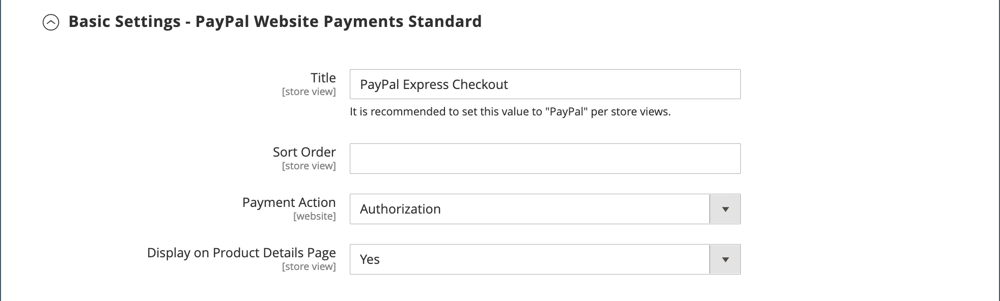

# PayPal 결제 표준

[PayPal 결제 표준][4] 은 온라인으로 결제를 수락하는 가장 쉬운 방법입니다. 고객에게는 신용 카드와 PayPal을 통해 결제 시 체크아웃 버튼을 추가하면 됩니다.

>[!NOTE]
>
>미국 이외의 상인들에게는 그렇게 불립니다 _PayPal 웹 사이트 결제 표준_.

PayPal 결제 표준을 사용하면 모바일 장치에서 신용카드를 긁을 수 있습니다. 월 사용료는 없으며 이베이를 통해 결제하실 수 있습니다. 지원되는 신용 카드에는 Visa, MasterCard, Discover 및 American Express가 있습니다. 또 고객이 개인 페이팔 계좌에서 직접 결제할 수 있다. PayPal 결제 표준은 PayPal 전 세계 참조 목록의 모든 국가에서 사용할 수 있습니다.

>[!IMPORTANT]
>
>**PSD2 요구 사항:**  
>2019년 9월 14일부터 유럽 은행들은 충족되지 않는 지불을 거절할 수 있습니다 [PSD2](../getting-started/compliance-payment-services-directive.md) 요구 사항. 모든 요구 사항이 PayPal에 의해 처리되므로 PayPal 결제 표준이 PSD2를 준수하는 데 필요한 조치는 없습니다.

## 판매자 요구 사항

- [PayPal 비즈니스 계정][1]

## 체크아웃 워크플로우

고객의 경우 PayPal 결제 표준은 개인 PayPal 계정에 대한 신용카드 정보가 최신 상태인 경우 한 단계로 진행되는 프로세스입니다.

1. **고객 주문** - 고객이 다음을 클릭/탭함 _지금 결제_ 단추를 클릭하여 구매를 완료합니다.

1. **PayPal에서 거래 처리** - 고객이 PayPal 사이트로 리디렉션되어 트랜잭션을 완료합니다.

## PayPal 결제 표준 설정

>[!NOTE]
>
>PayPal 결제 표준은 빠른 체크아웃을 포함하여 다른 PayPal 방법과 동시에 사용할 수 없습니다. 결제 솔루션을 변경하는 경우 이전에 사용한 솔루션이 비활성화됩니다.

>[!TIP]
>
>클릭 **[!UICONTROL Save Config]** 언제든지 진행 상황을 저장할 수 있습니다.

### 1단계: 구성 시작

이 설정 방법에서는 사용자에게 기존 PayPal 계정이 있다고 가정합니다.

1. 다음에서 _관리자_ 사이드바, 이동 **[!UICONTROL Stores]** > _[!UICONTROL Settings]_>**[!UICONTROL Configuration]**.

1. 왼쪽 패널에서 를 확장합니다. **[!UICONTROL Sales]** 및 선택 **[!UICONTROL Payment Methods]**.

1. 상거래 설치에 여러 웹 사이트, 스토어 또는 보기가 있는 경우 다음을 설정합니다. **[!UICONTROL Store View]** 이 구성을 적용할 저장소 보기로 이동합니다.

1. 다음에서 _[!UICONTROL Merchant Location]_섹션에서&#x200B;**[!UICONTROL Merchant Country]**비즈니스 위치.

   이 설정은 구성에 나타나는 PayPal 솔루션의 선택을 결정합니다.

   {width="600" zoomable="yes"}

1. 확장 **[!UICONTROL PayPal All-in-One Payment Solutions]** 및 클릭 **[!UICONTROL Configure]** 대상 **[!UICONTROL Payments Standard]**.

   {width="700" zoomable="yes"}

### 2단계: PayPal 계정 활성화 및 연결

{width="600" zoomable="yes"}

1. 테스트 또는 프로덕션용 계정 연결:

   - 테스트(개발) 모드의 경우 **[!UICONTROL Sandbox Credentials]** 및 을(를) 입력합니다. [PayPal 샌드박스][3] 자격 증명.
   - 프로덕션 모드의 경우 **[!UICONTROL Connect with PayPal]** 프로덕션 계정 자격 증명을 입력합니다.

   연결이 확인되면 계속 진행할 수 있습니다.

1. 설정 **[!UICONTROL Enable this Solution]** 끝 `Yes`.

1. 을(를) 제안하려면 [PayPal 신용](paypal.md#paypal-credit-and-pay-later) (으)로 설정합니다. **[!UICONTROL Enable PayPal Credit]** 끝 `Yes`.

### 3단계: 지급 표준 설정 완료

1. 확장  다음 **[!UICONTROL Payments Standard]** 섹션.

   {width="600" zoomable="yes"}

1. 다음을 입력합니다. **[!UICONTROL Email Associated with your PayPal Merchant Account]**.

   >[!IMPORTANT]
   >
   >이메일 주소는 대소문자를 구분합니다. 결제를 받으려면 입력한 이메일 주소가 PayPal 판매자 계정에 지정된 이메일 주소와 일치해야 합니다.

   PayPal 계정이 없는 경우 **[!UICONTROL Start accepting payments via PayPal]**.

1. 설정 **[!UICONTROL API Authentication Methods]** 다음 중 하나를 수행합니다.

   - `API Signature` - 이 PayPal 인증 방법은 구현하기 가장 쉬운 방법이며 사용자 이름, 암호 및 계정을 식별하는 문자 및 숫자의 고유한 문자열을 기반으로 합니다. API 서명 자격 증명이 만료되지 않습니다.
   - `API Certificate` - 이 PayPal 인증 방법은 보다 안전하며 사용자 이름, 암호 및 다운로드 가능한 인증서를 기반으로 합니다. API 자격 증명은 3년 후에 만료되며 갱신해야 합니다.

   필요한 경우 다음을 완료합니다.

   - **[!UICONTROL API Username]**
   - **[!UICONTROL API Password]**
   - **[!UICONTROL API Signature]**

1. 샌드박스 계정의 자격 증명을 사용하는 경우 다음을 설정합니다. **[!UICONTROL Sandbox Mode]** 끝 `Yes`.

   샌드박스에서 구성을 테스트할 때에는 만 사용하십시오 [신용 카드 번호][2] 페이팔에서 추천합니다. 프로덕션으로 이동할 준비가 되면 구성으로 돌아가 샌드박스 모드 를 로 설정합니다. `No` 프로덕션 PayPal 계정에 연결합니다.

1. 시스템이 프록시 서버를 사용하여 Adobe Commerce 또는 Magento Open Source과 PayPal 결제 시스템 간의 연결을 설정하는 경우 다음을 설정하십시오. **[!UICONTROL API Uses Proxy]** 끝 `Yes` 다음을 완료합니다.

   - **[!UICONTROL Proxy Host]**
   - **[!UICONTROL Proxy Port]**

### 단계 4: Advertising PayPal 크레딧/Advertising PayPal PayLater 설정(선택 사항)

2.4.3 릴리스부터 PayPal PayLater는 PayPal이 포함된 배포에서 지원됩니다. 이 기능을 통해 구매자는 구매 시 전체 금액을 지불하는 대신 2주 단위로 주문 금액을 지불하는 것이 가능하다. PayPal 크레딧 경험은 더 이상 사용되지 않습니다.

설정 **[!UICONTROL Enable PayPal PayLater Experience]** 다음 중 하나를 수행합니다.

- `Yes` - PayPal PayLater 광고를 설정하려면
- `No` - PayPal 크레딧을 광고하려면

#### PayPal 크레딧 광고

1. 확장  다음 **[!UICONTROL Advertise PayPal Credit]** 섹션.

   {width="600" zoomable="yes"}

1. 계정 정보를 얻으려면 다음을 클릭하십시오. **[!UICONTROL Get Publisher ID from PayPal]** 지침을 따르십시오.

1. 다음을 입력하십시오. **[!UICONTROL Publisher ID]**.

   {width="600" zoomable="yes"}

1. 확장  다음 **[!UICONTROL Home Page]** 섹션.

1. 페이지에 배너를 배치하려면 다음을 설정하십시오. **[!UICONTROL Display]** 끝 `Yes`.

1. 설정 **[!UICONTROL Position]** 다음 중 하나를 수행합니다.

   - `Header (center)`
   - `Sidebar (right)`

1. 설정 **[!UICONTROL Size]** 다음 중 하나를 수행합니다.

   - `190 x 100`
   - `234 x 60`
   - `300 x 50`
   - `468 x 60`
   - `728 x 90`
   - `800 x 66`

1. 확장  나머지 섹션 및 이전 단계를 반복합니다.

   - **[!UICONTROL Catalog Category Page]**
   - **[!UICONTROL Catalog Product Page]**
   - **[!UICONTROL Checkout Cart Page]**

#### PayPal PayLater 광고

1. 확장  다음 **[!UICONTROL Advertise PayPal PayLater]** 섹션.

1. 설정 **[!UICONTROL Enable PayPal PayLater]** 끝 `Yes`.

1. 확장  다음 **[!UICONTROL Home Page]** 섹션.

   {width="600" zoomable="yes"}

1. 페이지에 배너를 배치하려면 다음을 설정하십시오. **[!UICONTROL Display]** 끝 `Yes`.

1. 설정 **[!UICONTROL Position]** 다음 중 하나를 수행합니다.

   - `Header (center)`
   - `Sidebar`

1. 설정 **[!UICONTROL Style Layout]** 다음 중 하나를 수행합니다.

   - `Text`
   - `Flex`

1. 대상 [!UICONTROL Style Layout] **[!UICONTROL Text]** 만, 설정 **[!UICONTROL Logo Type]** 다음 중 하나를 수행합니다.

   - `Primary`
   - `Alternative`
   - `Inline`
   - `None`

1. 대상 [!UICONTROL Style Layout] **[!UICONTROL Text]** 만, 설정 **[!UICONTROL Logo Position]** 다음 중 하나를 수행합니다.

   - `Left`
   - `Right`
   - `Top`

1. 대상 [!UICONTROL Style Layout] **[!UICONTROL Text]** 만, 설정 **[!UICONTROL Text Color]** 다음 중 하나를 수행합니다.

   - `Black`
   - `White`
   - `Monochrome`
   - `Grayscale`

1. 대상 [!UICONTROL Style Layout] **[!UICONTROL Text]** 만, 설정 **[!UICONTROL Text Size]** 다음 중 하나를 수행합니다.

   - `10px`
   - `11px`
   - `12px`
   - `13px`
   - `14px`
   - `15px`
   - `16px`

1. 대상 [!UICONTROL Style Layout] **[!UICONTROL Flex]** 만, 설정 **[!UICONTROL Ratio]** 다음 중 하나를 수행합니다.

   - `1x1`
   - `1x4`
   - `8x1`
   - `20x1`

1. 대상 [!UICONTROL Style Layout] **[!UICONTROL Flex]** 만, 설정 **[!UICONTROL Color]** 다음 중 하나를 수행합니다.

   - `Blue`
   - `Black`
   - `White`
   - `White No Border`
   - `Gray`
   - `Monochrome`
   - `Grayscale`

1. 확장  나머지 섹션 및 이전 단계를 반복합니다.

   - **[!UICONTROL Catalog Product Page]**
   - **[!UICONTROL Checkout Cart Page]**
   - **결제 단계 체크아웃**
   - **[!UICONTROL Catalog Category Page]**

### 5단계: 기본 설정 완료

1. 확장  다음 **[!UICONTROL Basic Settings - PayPal Website Payments Standard]** 섹션.

   {width="600" zoomable="yes"}

1. 대상 **[!UICONTROL Title]**&#x200B;을 클릭하고 체크아웃 중에 이 결제 방법을 식별하는 제목을 입력합니다.

   제목을 사용하는 것이 좋습니다 _PayPal_ 모든 스토어 조회수.

1. 여러 결제 방법을 제공하는 경우 숫자를 입력합니다. **[!UICONTROL Sort Order]** 다른 결제 방법과 함께 나열할 때 PayPal 결제 표준이 표시되는 순서를 결정합니다.

   이 번호는 다른 결제 방법과 관련이 있습니다. (`0` = 첫 번째, `1` = 초, `2` = 세 번째 등입니다.)

1. 설정 **[!UICONTROL Payment Action]** 다음 중 하나를 수행합니다.

   - `Authorization` - 구매를 승인하고 자금을 보류합니다. 그 금액은 상인에게 포획될 때까지 인출되지 않는다.
   - `Sale` - 구매 금액이 승인되어 즉시 고객의 계좌에서 인출됩니다.

1. 다음을 표시합니다. _[!UICONTROL Check out with PayPal]_제품 페이지의 단추, 설정&#x200B;**[!UICONTROL Display on Product Details Page]**끝 `Yes`.

### 6단계: 고급 설정 완료

1. 확장  다음 **[!UICONTROL Advanced Settings]** 섹션.

   {width="600" zoomable="yes"}

1. 장바구니와 미니 장바구니 모두에서 PayPal 결제 표준을 사용할 수 있도록 하려면 다음을 설정하십시오. **[!UICONTROL Display on Shopping Cart]** 끝 `Yes`.

1. 설정 **[!UICONTROL Payment from Applicable Countries]** 다음 중 하나를 수행합니다.

   - `All Allowed Countries` - 모든 고객의 고객 [국가](../getting-started/store-details.md#country-options) 스토어 구성에 지정된 경우 이 결제 방법을 사용할 수 있습니다.
   - `Specific Countries` - 이 옵션을 선택하면 _[!UICONTROL Payment from Specific Countries]_목록이 나타납니다. 여러 국가를 선택하려면 Ctrl 키(PC) 또는 Command 키(Mac)를 누른 채 각 옵션을 클릭합니다.

1. 로그 파일에 결제 시스템과의 통신을 기록하려면 다음을 설정합니다 **[!UICONTROL Debug Mode]** 끝 `Yes`.

   >[!NOTE]
   >
   >로그 파일은 서버에 저장되며 개발자만 액세스할 수 있습니다. PCI 데이터 보안 표준에 따라 신용 카드 정보는 로그 파일에 기록되지 않습니다.

1. SSL 인증을 활성화하려면 다음을 설정하십시오. **[!UICONTROL Enable SSL Verification]** 끝 `Yes`.

1. PayPal 결제 페이지의 주문에 각 라인 항목의 요약을 표시하려면 다음을 설정합니다. **[!UICONTROL Transfer Cart Line Items]** 끝 `Yes`.

   요약에 최대 10개의 운송 옵션을 포함하려면 다음을 설정합니다. **[!UICONTROL Transfer Shipping Options]** 끝 `Yes`. 이 옵션은 라인 항목이 이전으로 설정된 경우에만 나타납니다.

1. PayPal 수락 단추에 사용되는 이미지 유형을 확인하려면 을 설정합니다 **[!UICONTROL Shortcut Buttons Flavor]** 다음 중 하나를 수행합니다.

   - `Dynamic` - (권장) PayPal 서버에서 동적으로 변경할 수 있는 이미지를 표시합니다.
   - `Static` - 동적으로 변경할 수 없는 특정 이미지를 표시합니다.

1. PayPal 계정이 없는 고객이 이 방법으로 구매할 수 있도록 하려면 을 설정합니다. **[!UICONTROL Enable PayPal Guest Checkout]** 끝 `Yes`.

1. 설정 **[!UICONTROL Require Customer's Billing Address]** 다음 중 하나를 수행합니다.

   - `Yes` - 모든 구매에 대해 고객 청구 주소가 필요합니다.
   - `No` - 구매에 고객 청구 주소가 필요하지 않습니다.
   - `For Virtual Quotes Only` - 가상 견적에 대한 고객 청구 주소만 필요합니다.

1. 고객이 을 입력하도록 허용하려면 [PayPal 청구 계약](paypal-billing-agreements.md) 고객 계정에 사용 가능한 활성 청구 계약이 없을 때 스토어를 사용하여 다음을 설정합니다. **[!UICONTROL Billing Agreement Signup]** 다음 중 하나를 수행합니다.

   - `Auto` - 고객은 빠른 체크아웃 플로우 중에 청구 계약을 체결하거나 다른 결제 방법을 사용할 수 있습니다.
   - `Ask Customer` - 고객은 빠른 체크아웃 워크플로우 중에 청구 계약을 체결할지 여부를 결정할 수 있습니다.
   - `Never` - 고객이 빠른 체크아웃 워크플로우 중에는 청구 계약을 체결할 수 없습니다.

   >[!NOTE]
   >
   >가맹점은 PayPal 가맹점 기술 지원을 요청하여 자신의 계정에서 청구 계약을 사용하도록 해야 합니다. 다음 _청구 계약 등록_ 매개 변수는 PayPal에서 가맹점 계정에 대해 청구 계약이 활성화되어 있음을 확인한 후에만 활성화할 수 있습니다.

1. 고객이 주문 검토를 위해 스토어로 돌아가지 않고 PayPal 사이트에서 거래를 완료할 수 있도록 하려면 다음을 설정하십시오. **[!UICONTROL Skip Order Review Step]** 끝 `Yes`.

### 7단계: 구성 설정 완료 및 저장

1. 스토어에 필요한 경우 다음 섹션을 완료합니다.

   - [PayPal 청구 계약 설정](#paypal-billing-agreement-settings)
   - [결제 보고서 설정](#settlement-report-settings)
   - [프론트엔드 경험 설정](#frontend-experience-settings)

1. 완료되면 다음을 클릭하십시오. **[!UICONTROL Save Config]**.

#### PayPal 청구 계약 설정

A [청구 계약](paypal-billing-agreements.md) 은 여러 주문과 함께 사용하도록 PayPal에서 승인한 판매자와 고객 간의 판매 계약입니다. 체크아웃 프로세스 중에 청구 계약 결제 옵션은 이미 귀사와 청구 계약을 체결한 고객에게만 표시됩니다. PayPal이 계약을 승인한 후에는 결제 시스템에서 고유한 참조 ID를 발행하여 계약과 연관된 각 주문을 식별합니다. 구매 주문과 마찬가지로 고객이 귀사와 설정할 수 있는 청구 계약 수에는 제한이 없습니다.

1. 확장  다음 **[!UICONTROL PayPal Billing Agreement Settings]** 섹션.

   {width="600" zoomable="yes"}

1. 설정 **[!UICONTROL Enabled]** 끝 `Yes`.

1. 대상 **[!UICONTROL Title]**&#x200B;을 클릭하고 체크아웃 중에 PayPal 결제 계약 방법을 식별하는 제목을 입력합니다.

1. 여러 결제 방법을 제공하는 경우 **[!UICONTROL Sort Order]** 체크아웃 중에 다른 결제 방법과 함께 나열될 때 청구 계약이 표시되는 순서를 결정하는 필드입니다.

1. 설정 **[!UICONTROL Payment Action]** 다음 중 하나를 수행합니다.

   - `Authorization` - 구매를 승인하고 자금을 보류합니다. 상인에게 &#39;포착&#39;되기 전까지는 그 금액이 인출되지 않는다.
   - `Sale` - 구매 금액이 승인되어 즉시 고객의 계좌에서 인출됩니다.

1. 설정 **[!UICONTROL Payment Applicable From]** 다음 중 하나를 수행합니다.

   - `All Allowed Countries` - 스토어 구성에 지정된 모든 국가의 고객이 이 결제 방법을 사용할 수 있습니다.
   - `Specific Countries` - 이 옵션을 선택한 후 _[!UICONTROL Payment from Specific Countries]_목록이 나타납니다. 여러 국가를 선택하려면 Ctrl 키(PC) 또는 Command 키(Mac)를 누른 상태에서 각 국가를 클릭합니다.

1. 로그 파일에 결제 시스템과의 통신을 기록하려면 다음을 설정합니다 **[!UICONTROL Debug Mode]** 끝 `Yes`.

   >[!NOTE]
   >
   >로그 파일은 서버에 저장되며 개발자만 액세스할 수 있습니다. PCI 데이터 보안 표준에 따라 신용 카드 정보는 로그 파일에 기록되지 않습니다.

1. SSL 인증을 활성화하려면 다음을 설정하십시오. **[!UICONTROL Enable SSL Verification]** 끝 `Yes`.

1. PayPal 결제 페이지에서 고객 주문에 있는 각 라인 항목의 요약을 표시하려면 다음을 설정합니다. **[!UICONTROL Transfer Cart Line Items]** 끝 `Yes`.

1. 고객이 고객 계정의 대시보드에서 청구 계약을 시작할 수 있도록 하려면 다음을 설정합니다. **[!UICONTROL Allow in Billing Agreement Wizard]** 끝 `Yes`.

#### 결제 보고서 설정

1. 확장  다음 **[!UICONTROL Settlement Report Settings]** 섹션.

   {width="600" zoomable="yes"}

1. 대상 **[!UICONTROL SFTP Credentials]**&#x200B;를 사용하여 다음을 수행합니다.

   - PayPal 보안 FTP 서버에 등록한 경우 다음 SFTP 로그인 자격 증명을 입력하십시오.

      - 로그인
      - 암호

   - 사이트에서 빠른 체크아웃으로 시작하기 전에 테스트 보고서를 실행하려면 을 설정합니다. **[!UICONTROL Sandbox Mode]** 끝 `Yes`.

   - 다음을 입력합니다. **[!UICONTROL Custom Endpoint Hostname or IP Address]**.

     기본적으로 값은 입니다. `reports.paypal.com`.

   - 다음을 입력합니다. **[!UICONTROL Custom Path]** 보고서가 저장되는 위치입니다.

     기본적으로 값은 입니다. `/ppreports/outgoing`.

1. 일정에 따라 보고서를 생성하려면 다음을 완료하십시오. **[!UICONTROL Scheduled Fetching]** 설정:

   - 설정 **[!UICONTROL Enable Automatic Fetching]** 끝 `Yes`.

   - 설정 **[!UICONTROL Schedule]** 다음 중 하나를 수행합니다.

      - `Daily`
      - `Every 3 Days`
      - `Every 7 Days`
      - `Every 10 Days`
      - `Every 14 Days`
      - `Every 30 Days`
      - `Every 40 Days`

     PayPal은 45일 동안 각 보고서를 유지합니다.

   - 설정 **[!UICONTROL Time of Day]** 보고서를 생성할 시간, 분 및 초로 설정합니다.

#### 프론트엔드 경험 설정

사용 _[!UICONTROL Frontend Experience Settings]_사이트에 표시할 PayPal 로고를 선택하고 PayPal 판매자 페이지의 모양을 사용자 지정합니다.

1. 확장  다음 **[!UICONTROL Frontend Experience Settings]** 섹션.

   {width="600" zoomable="yes"}

1. 다음 항목 선택 **[!UICONTROL PayPal Product Logo]** 스토어의 PayPal 블록에 표시하려는 경우입니다.

   PayPal 로고는 4가지 스타일과 2가지 크기로 제공됩니다.

   - `No Logo`
   - `We Prefer PayPal (150 x 60 or 150 x 40)`
   - `Now Accepting PayPal (150 x 60 or 150 x 40)`
   - `Payments by PayPal (150 x 60 or 150 x 40)`
   - `Shop Now Using PayPal (150 x 60 or 150 x 40)`

1. PayPal 판매자 페이지의 모양을 사용자 지정하려면:

   - 의 이름을 입력합니다. **[!UICONTROL Page Style]** PayPal 판매자 페이지에 적용할 대상:

      - `paypal` - PayPal 페이지 스타일을 사용합니다.
      - `primary` - 로 식별한 페이지 스타일을 사용합니다. _기본_ 계정 프로필에서 스타일을 지정합니다.
      - `your_custom_value` - 계정 프로필에 지정된 사용자 정의 결제 페이지 스타일을 사용합니다.

   - 대상 **[!UICONTROL Header Image URL]**&#x200B;결제 페이지의 왼쪽 위 모서리에 표시할 이미지의 URL을 입력합니다. 최대 파일 크기는 750픽셀 너비 x 90픽셀 높이입니다.

     >[!NOTE]
     >
     >PayPal은 이미지가 보안(https) 서버에 있는 것을 권장합니다. 그렇지 않으면 브라우저가 다음을 경고할 수 있습니다. _페이지에 보안 및 비보안 항목이 모두 포함되어 있습니다._.

   - 페이지의 색상을 설정하려면 6자의 16진수 코드를 `#` 기호, 각 항목:

      - **[!UICONTROL Header Background Color]** - 체크아웃 페이지 헤더의 배경색입니다.
      - **[!UICONTROL Header Border Color]** - 헤더 주위의 2픽셀 테두리 색입니다.
      - **[!UICONTROL Page Background Color]** - 체크아웃 페이지 및 헤더와 결제 양식 주변의 배경색입니다.

[1]: https://www.paypal.com/webapps/mpp/how-to-sell-online
[2]: https://www.paypalobjects.com/en_AU/vhelp/paypalmanager_help/credit_card_numbers.htm
[3]: https://developer.paypal.com/docs/api-basics/sandbox/
[4]: https://developer.paypal.com/docs/paypal-payments-standard/mobile-paypal-payments-standard/
