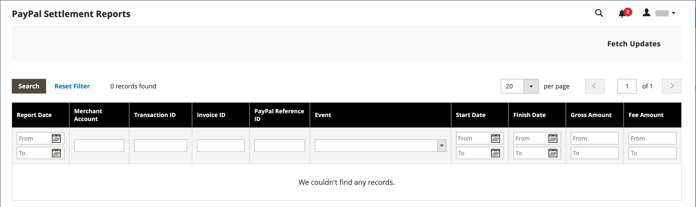

# PayPal 결제 보고서

PayPal 결산 보고서는 자금 결산에 영향을 미치는 각 거래에 대한 정보를 가맹점에 제공합니다.

>[!NOTE]
>
>결제 보고서를 생성하기 전에 매장 관리자는 PayPal 판매자 기술 서비스에 SFTP 사용자 계정을 만들고 결제 보고서 생성을 사용하도록 설정하고 PayPal 비즈니스 계정에서 SFTP를 사용하도록 설정해야 합니다.

Adobe Commerce 및 Magento Open Source은 PayPal 판매자 계정에서 결제 보고서를 구성하고 활성화한 후 다음 24시간 동안 보고서 생성을 시작합니다. 사용 가능한 결제 보고서 목록은 관리자로부터 볼 수 있습니다.

**_결제 보고서를 조회하려면_**

1. 다음에서 _관리자_ 사이드바, 이동 **[!UICONTROL Reports]** > _[!UICONTROL Sales]_>**[!UICONTROL PayPal Settlement]**.

   {width="600" zoomable="yes"}

1. 최신 업데이트를 보려면 **[!UICONTROL Fetch Updates]** 오른쪽 상단 모서리입니다.

   시스템은 PayPal SFTP 서버에 연결하여 보고서를 가져옵니다. 프로세스가 완료되면 가져온 보고서 수와 함께 메시지가 나타납니다. 이 보고서에는 각 트랜잭션에 대한 다음 정보가 포함됩니다.

   | 보고서 열 | 설명 |
   | ------------ | ----------- |
   | [!UICONTROL PayPal Reference ID Type] | 다음 참조 코드 중 하나: - IDT 주문 - 거래 ID - 구독 ID |
   | [!UICONTROL Preapproved Payment ID] | **[!UICONTROL Custom]** - 가맹점이 PayPal에서 거래할 때 입력한 텍스트. **[!UICONTROL Transaction Debit or Credit]**- 총액의 자금이동 방향. **[!UICONTROL Fee Debit or Credit]** - 유료로 돈을 움직이는 방향. |

   {style="table-layout:auto"}
