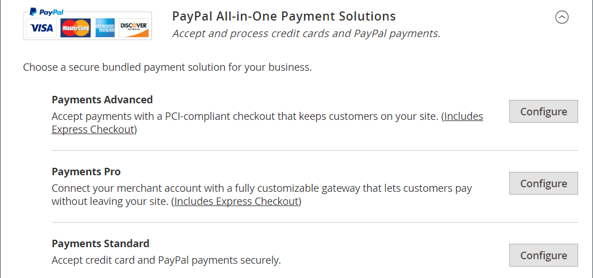

# PayPal 결제 솔루션

PayPal은 온라인 결제 분야의 글로벌 리더이며 고객이 온라인으로 빠르고 안전하게 결제할 수 있는 방법입니다. 사용 가능한 PayPal 솔루션의 선택은 판매자 위치에 따라 다릅니다. PayPal Express Checkout 및 PayPal Payments Standard는 전 세계 모든 지역에서 사용할 수 있습니다. 자세한 내용은 [국가별 PayPal 솔루션](#paypal-solutions-by-country)을 참조하세요.

>[!IMPORTANT]
>
>**PSD2 요구 사항:**  
>2019년 9월 14일부터 유럽 은행은 [PSD2](../getting-started/compliance-payment-services-directive.md) 요구 사항을 충족하지 않는 결제를 거절할 수 있습니다. 대부분의 PayPal 솔루션의 경우 PSD2를 준수하기 위해 필요한 작업은 PayPal에서 처리하므로 필요하지 않습니다.

## PayPal 비즈니스 계정

스토어에서 결제 방법으로 PayPal을 제공하려면 PayPal [비즈니스 계정][1] 및/또는 [PayPal 결제 계정][2]이 있어야 합니다. 계정 요구 사항은 각 PayPal 솔루션의 설명에 명시되어 있습니다. PayPal 판매자 계정은 상점에서 구매한 항목에 적용되는 [사기 필터](#paypal-fraud-management-filters)를 관리하는 데에도 사용됩니다.

Payflow Pro용 PayPal Express Checkout 또는 Express Checkout을 사용하는 고객은 PayPal 구매자 계정이 있어야 합니다. 판매자가 _PayPal 계정 선택 사항_&#x200B;을 사용하도록 설정하면 PayPal 결제 표준(일부 국가의 웹 사이트 결제 표준)을 직접 사용하거나 구매자 계정을 통해 사용할 수 있습니다. 기본적으로 이 매개변수를 활성화하여 고객이 신용 카드 정보를 입력하거나 PayPal을 사용하여 구매자 계정을 만들 수 있습니다. 비활성화되면 고객은 구매하기 전에 먼저 PayPal 구매자 계정을 만들어야 합니다.

Website Payments Pro, Website Payments Pro Payflow Edition, Payflow Pro Gateway 및 Payflow Link는 체크아웃 시 고객이 신용 카드 정보를 입력해야 합니다.

## PayPal 크레딧 및 PayLater

PayPal PayLater는 고객에게 신속한 금융 서비스를 제공하므로 고객에게 추가 비용 없이 지금 구매하고 시간 경과에 따라 결제할 수 있습니다. 고객이 PayPal Credit 옵션을 선택할 때는 요금이 부과되지 않으며, 일반 PayPal 거래 수수료만 지불합니다. 자세한 내용은 [PayPal 웹 사이트][3]를 참조하세요.

당신이 융자를 광고할 때 당신의 매출을 증대시키세요. PayPal은 PayPal PayLater로 자금을 조달하여 브라우저를 구매자로 전환하도록 도와줍니다. 고객은 추가 비용 없이 선불로 지불하는 동안 시간이 지남에 따라 비용을 지불할 수 있습니다. PayPal 무료 배너 광고를 사용하여 고객이 PayPal로 체크아웃할 때 결제 옵션으로 PayPal 금융을 광고합니다. PayPal Advertising 프로그램은 추가 구매를 생성하고 평균 구매 크기를 15% 이상 증가시키는 것으로 나타났습니다.

결제가 완료된 무료 배너 광고를 사이트 페이지에 쉽게 추가할 수 있으며, 결제 시 장바구니에 _PayPal 크레딧_ 버튼을 추가하여 고객에게 즉시 융자를 받을 수 있음을 미리 알릴 수 있습니다.

>[!NOTE]
>
>2.4.3 릴리스부터 PayPal PayLater는 PayPal이 포함된 배포에서 지원됩니다. 이 기능을 통해 구매자는 구매 시 전체 금액을 지불하는 대신 2주 단위로 주문 금액을 지불하는 것이 가능하다. PayPal 크레딧 경험은 더 이상 사용되지 않습니다.

미국 판매자의 경우 [PayPal Express 체크아웃](paypal-express-checkout.md) 결제 옵션에 대해 PayPal 크레딧이 기본적으로 활성화됩니다. 이 결제 방법에 대해 사용하지 않도록 설정하려면 [PayPal Express 체크아웃 구성](paypal-express-checkout.md#features)의 _기능_ 섹션을 참조하세요.

PayPal 크레딧은 다른 PayPal 결제 솔루션에 대해 기본적으로 비활성화되지만, 지원 솔루션에 대한 결제 방법 구성에서 활성화할 수 있습니다.

- [결제 고급](paypal-payments-advanced.md)
- [Payments Pro](paypal-payments-pro.md)
- [결제 표준](paypal-payments-standard.md)
- [Payflow Pro](paypal-payflow-pro.md)
- [Payflow 링크](paypal-payflow-link.md)

>[!IMPORTANT]
>
>스토어에 대해 PayPal Credit 또는 PayPal PayLater를 구성하기 전에 PayPal 판매자 계정에서 활성화되었는지 확인하십시오.

## 통합 PayPal 솔루션

PayPal과 Adobe Commerce을 사용하면 모든 주요 직불 카드와 신용 카드의 결제를 받을 수 있습니다. PayPal은 PayPal 계정이 없는 고객도 PayPal로 구매 비용을 결제할 수 있으므로 별도의 노력 없이 추가 편의를 제공합니다.

>[!NOTE]
>
>PayPal Express Checkout을 제외하고 스토어에서 한 번에 두 개 이상의 PayPal 메서드를 사용할 수 없습니다. PayPal Express Checkout은 PayPal 결제 표준을 제외한 다른 PayPal 결제 방법과 함께 사용할 수 있습니다. 결제 솔루션을 변경하면 이전 방법이 비활성화됩니다.

### PayPal Express 체크아웃

[PayPal Express 체크아웃](paypal-express-checkout.md)

### PayPal 올인원 결제 솔루션

미국에서 PayPal은 성장하는 비즈니스의 요구 사항을 충족하기 위해 다음과 같은 PCI 호환 솔루션을 제공합니다.

- [PayPal 결제 고급](paypal-payments-advanced.md)
- [PayPal 결제 프로](paypal-payments-pro.md)
- [PayPal 결제 표준](paypal-payments-standard.md)

{width="600" zoomable="yes"}

### PayPal 결제 게이트웨이

결제 게이트웨이는 신용카드 또는 직접 결제 처리를 허가하는 전자상거래 애플리케이션 서비스 제공자가 제공하는 가맹점 서비스이다. 그들은 고객과 은행 사이의 중개자 역할을 한다.

결제 게이트웨이는 온라인 및 오프라인 환경에서 사용할 수 있습니다. 지불은 전화, 온라인 또는 모바일 앱을 통해 수락할 수 있습니다. 해당 거래는 서비스 제공자의 처리시스템으로 보내진 후 고객의 은행으로 보내져 확인 및 확인이 이루어진다. 확인되면 가맹점이 고객의 은행 계좌와 직접 접촉하지 않고 대금을 수령한다.

직접 및 호스팅 두 가지 유형의 결제 게이트웨이가 있습니다.

- 직불 결제 게이트웨이를 이용하면 매장 홈페이지에 카드 내역을 입력할 수 있다.
- 호스팅된 결제 게이트웨이는 사용자를 스토어 웹 사이트 외부의 호스팅된 결제 페이지로 리디렉션합니다.

결제 게이트웨이는 거래에 관련된 모든 당사자에 대해 보안과 보호를 제공합니다.

PayPal은 귀사의 비즈니스를 위한 두 가지 지불 게이트웨이 솔루션을 제공합니다. PayPal을 통해 보안 결제 사이트에서 체크아웃을 호스팅하거나 사용자 지정 가능한 솔루션으로 전체 결제 환경을 제어할 수 있습니다.

- [Paypal Payflow Pro](paypal-payflow-pro.md)
- [PayPal 결제 링크](paypal-payflow-link.md)

{width="600" zoomable="yes"}

## PayPal 사기 행위 관리 필터

PayPal 사기 행위 관리 필터를 사용하면 사기성 거래를 보다 쉽게 감지하고 대응할 수 있으며, 더 위험한 지불에 대해 플래그 지정, 검토 보류 또는 거부하도록 구성할 수 있습니다. Commerce [주문 상태](order-status.md) 값과 관련된 작업이 사기 행위 필터 설정에 따라 변경되었습니다.

| 작업 | 결과 |
| --- | --- |
| [!UICONTROL Review] | 의심되는 주문은 주문 시 _결제 검토_ 상태를 받습니다. 관리자 또는 PayPal 측에서 주문을 검토하고 결제를 승인하거나 취소할 수 있습니다. **[!UICONTROL Accept Payment]** 또는 **[!UICONTROL Deny Payment]**&#x200B;을(를) 클릭하면 주문에 대한 새 트랜잭션이 만들어지지 않습니다.   PayPal 사이트에서 거래 상태를 변경하는 경우 관리자의 [순서] 페이지에서 **[!UICONTROL Get Payment Update]**&#x200B;을 클릭하여 변경 내용을 적용해야 합니다. **[!UICONTROL Accept Payment]** 또는 **[!UICONTROL Deny Payment]**&#x200B;을(를) 클릭하면 PayPal 사이트에서 변경한 내용이 적용됩니다. |
| [!UICONTROL Deny] | 해당 거래는 페이팔에서 거부되기 때문에 고객이 의심 주문을 할 수 없습니다.   관리자의 결제를 거부하려면 페이지의 오른쪽 상단에 있는 **[!UICONTROL Deny Payment]**&#x200B;을(를) 클릭하십시오. 주문 상태가 `Canceled`(으)로 변경되고 거래가 취소되며 고객 계정에서 자금이 해제됩니다. 주문 보기의 _[!UICONTROL Comments History]_&#x200B;섹션에 해당 정보가 추가됩니다. |
| [!UICONTROL Flag] | 의심되는 주문이 배치되면 상태 `Processing`을(를) 가져옵니다. 해당 거래는 머천트 계좌 거래 목록에 플래그로 표시되어 있다. |

{style="table-layout:auto"}

## 국가별 PayPal 솔루션

| 국가 | PayPal 결제 솔루션 |
|--- |--- |
| 오스트레일리아 | [!DNL PayPal Website Payments Standard] [[!DNL PayPal Payflow Pro]](paypal-payflow-pro.md) [!DNL PayPal Website Payments Pro Hosted Solution] [[!DNL PayPal Express Checkout]](paypal-express-checkout.md) |
| 캐나다 | [!DNL PayPal Website Payments Standard] [!DNL PayPal Website Payments Pro] [[!DNL PayPal Payflow Pro]](paypal-payflow-pro.md) [[!DNL PayPal Payflow Link]](paypal-payflow-link.md)(빠른 체크아웃 포함) [[!DNL PayPal Express Checkout]](paypal-express-checkout.md) |
| 프랑스 | [!DNL PayPal Integral Evolution] [!DNL PayPal Website Payments Standard] [[!DNL PayPal Express Checkout]](paypal-express-checkout.md) |
| 독일 | [[!DNL PayPal Express Checkout]](paypal-express-checkout.md) |
| 홍콩 특별행정구 | [!DNL PayPal Website Payments Pro Hosted Solution] [!DNL PayPal Website Payments Standard] [[!DNL PayPal Express Checkout]](paypal-express-checkout.md) |
| 이탈리아 | [!DNL PayPal ProPay] [[!DNL Pal Payments Standard]](paypal-payments-standard.md) [[!DNL PayPal Express Checkout]](paypal-express-checkout.md) |
| 일본 | [!DNL PayPal Website Payments Plus] [!DNL PayPal Website Payments Standard] [[!DNL PayPal Express Checkout]](paypal-express-checkout.md) |
| 뉴질랜드 | [[!DNL PayPal Payflow Pro]](paypal-payflow-pro.md) [!DNL PayPal Website Payments Standard] [[!DNL PayPal Express Checkout]](paypal-express-checkout.md) |
| 스페인 | [!DNL PayPal Pasarela Integral] [!DNL PayPal Website Payments Standard] [[!DNL PayPal Express Checkout]](paypal-express-checkout.md) |
| 영국 | [!DNL PayPal Payments Pro Hosted Solution]&#x200B;(빠른 체크아웃 포함) [[!DNL PayPal Payments Standard]](paypal-payments-standard.md) [[!DNL PayPal Express Checkout]](paypal-express-checkout.md) |
| 미국 | [[!DNL PayPal Payments Advanced]](paypal-payments-advanced.md)(빠른 체크아웃 포함) [[!DNL PayPal Payments Pro]](paypal-payments-pro.md)(빠른 체크아웃 포함) [[!DNL PayPal Payments Standard+]](paypal-payments-standard.md) [[!DNL PayPal Payflow Pro]](paypal-payflow-pro.md)(빠른 체크아웃 포함) [[!DNL PayPal Payflow Link]](paypal-payflow-link.md)(빠른 체크아웃 포함) [[!DNL PayPal Express Checkout]](paypal-express-checkout.md) |

{style="table-layout:auto"}

### 기타 국가

PayPal Express 체크아웃 및 PayPal 웹사이트 결제 표준은 다음 국가에서 사용할 수 있습니다.

- 아르헨티나
- 오스트리아
- 벨기에
- 브라질
- 불가리아
- 칠레
- 코스타리카
- 키프로스
- 체코
- 덴마크
- 도미니카 공화국
- 에콰도르
- 에스토니아
- 핀란드
- 프랑스령 기아나
- 지브롤터
- 그리스
- 과들루프
- 헝가리
- 아이슬란드
- 인도
- 인도네시아
- 아일랜드
- 이스라엘
- 자메이카
- 라트비아
- 리히텐슈타인
- 리투아니아
- 룩셈부르크
- 말레이시아
- 몰타
- 마르티니크
- 멕시코
- 네덜란드
- 노르웨이
- 필리핀
- 폴란드
- 포르투갈
- 레위니옹
- 루마니아
- 산마리노
- 싱가포르
- 슬로바키아
- 슬로베니아
- 남아프리카
- 대한민국
- 스웨덴
- 스위스
- 대만
- 태국
- 터키
- 아랍에미리트
- 우루과이
- 베네수엘라
- 베트남

[1]: https://manager.paypal.com/
[2]: https://developer.paypal.com/docs/payflow/payflow-gateway/
[3]: https://www.paypal.com/us/business/buy-now-pay-later
