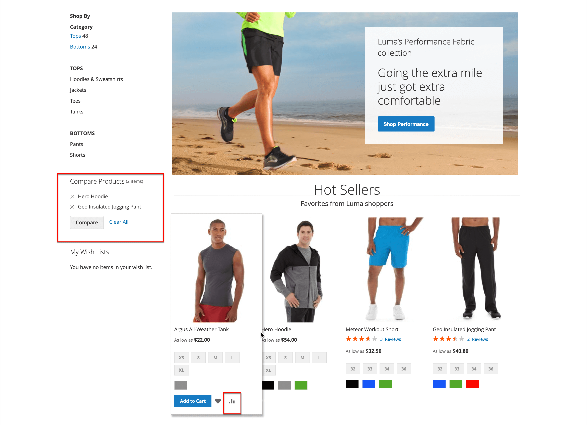

# 제품 비교

제품 비교 는 둘 이상의 제품에 대한 자세한 병렬 비교를 생성합니다. 테마에 따라 비교에 추가 링크가 아이콘 또는 텍스트로 표시될 수 있습니다. 다음 _제품 비교_ 블록은 일반적으로 카탈로그 페이지의 왼쪽 또는 오른쪽 사이드바에 나타납니다.

{width="700" zoomable="yes"}

와(과) 달리 [최근에 본/비교한 제품](products-viewed-compared.md) 블록에서 관리자는 제품 비교에 대한 추가 구성 설정을 포함하지 않습니다.

## 상점 첫 화면에서 제품 비교

상점 첫 화면의 비교 목록을 사용하는 방법에는 몇 가지가 있습니다.

### 카탈로그 페이지에서

1. 고객이 비교하려는 제품을 찾아서 **[!UICONTROL Add to Compare]** 각각에 대한 링크입니다.

1. 연결된 범주 페이지로 이동합니다.

   테마 및 페이지 레이아웃에 따라 _제품 비교_ 사이드바에서 차단합니다. 이 경우 비교 대상으로 표시된 카테고리의 항목이 나열됩니다.

   고객은 다음을 클릭할 수 있습니다 _삭제_ (  )을 클릭하여 비교 보고서에서 제품을 제거하거나 **[!UICONTROL Clear All]** 모든 항목을 제거하고 비교 선택 항목으로 다시 시작합니다.

1. 클릭수 **[!UICONTROL Compare]**.

1. 비교 정보를 인쇄하려면 **[!UICONTROL Print This Page]**.

1. 비교 페이지에서 단일 제품을 제거하려면 다음을 클릭합니다. _삭제_ (  ).

### 알림 메시지에서

1. 고객이 비교 목록에 제품을 추가하면 페이지에 알림 메시지가 표시됩니다.

1. 표시된 상단 메시지 알림에서 _비교 목록_ 링크를 클릭합니다.

   {width="700" zoomable="yes"}

이 작업을 수행하면 고객이 추가 작업에 액세스할 수 있는 비교 목록으로 리디렉션됩니다.

### 다음에서 _제품 비교_ 차단

1. 고객이 비교하려는 제품을 찾아서 **[!UICONTROL Add to Compare]** 각각에 대한 링크입니다.

1. 검색 필드 근처의 헤더에서 _제품 비교_ 링크를 클릭합니다.

   {width="700" zoomable="yes"}

### 내 계정 대시보드에서

1. 고객은 필요한 제품을 비교 목록에 추가합니다.

1. 로 이동합니다. **[!UICONTROL My Account]**.

1. 다음에서 _제품 비교_ 블록, 클릭 수 **[!UICONTROL Compare]**.

   {width="700" zoomable="yes"}

## 추가 비교 목록 작업

| [!UICONTROL Action] | 설명 |
|------|-----------|
|  | 비교 목록에서 단일 항목을 삭제합니다. |
| **[!UICONTROL Add to Cart]** | 장바구니에 제품을 추가합니다. 제품에 구성이 있으면 페이지에서 고객이 구성 가능한 옵션을 선택한 다음 를 클릭하는 제품 페이지로 리디렉션합니다 **[!UICONTROL Add to Cart]**. |
| _위시리스트 아이콘_ | 제품을 위시리스트에 추가합니다(저장소 구성에서 위시리스트 기능을 활성화해야 함). |
| _이 페이지 인쇄_ | 비교 목록 페이지를 인쇄합니다. |

{style="table-layout:auto"}
