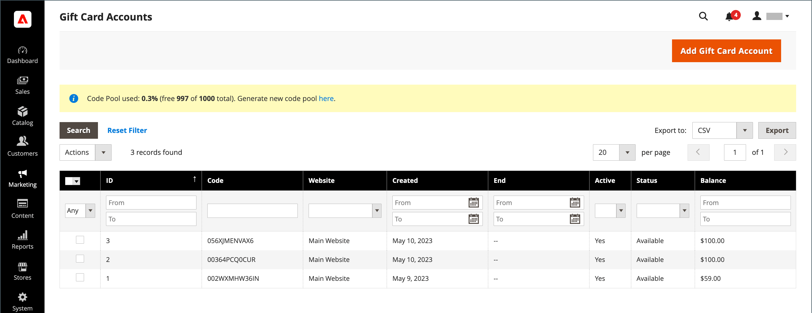
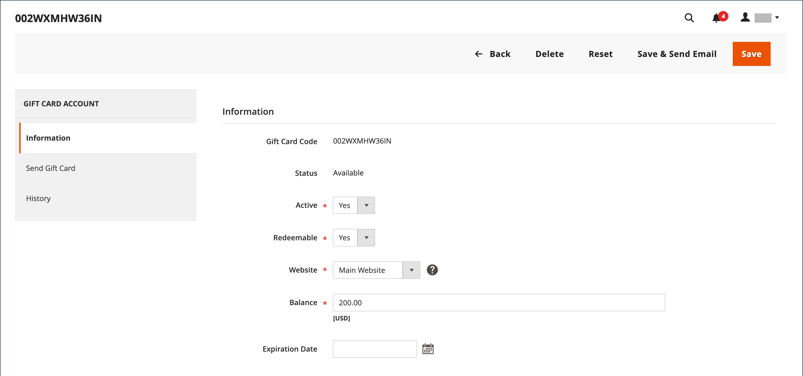
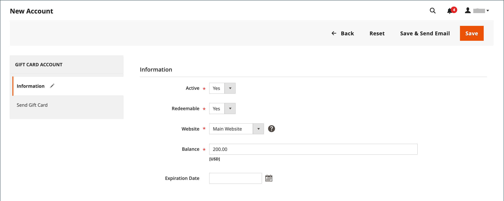

# 기프트 카드 계정

기프트 카드 계정은 구매한 각 기프트 카드에 대해 자동으로 만들어집니다. 그런 다음 기프트 카드의 가치를 상점에서 제품을 구매할 때 적용할 수 있습니다. 고객을 위한 프로모션 또는 서비스로 책임자로부터 기프트 카드 계정을 생성할 수도 있습니다. 기프트 카드 계좌 번호는 기프트 카드 코드에 해당합니다.

{width="700" zoomable="yes"}

## 기프트 카드 계정 구성

기프트 카드 구성은 스토어 보기에 대한 모든 기프트 카드의 기본 설정을 지정하고 코드 풀을 관리합니다. 코드 풀은 특정 형식의 고유한 기프트 카드 코드 세트입니다. 수영장 코드는 기프트 카드 계정이 생성될 때마다 사용됩니다. 기프트 카드 판매에 사용할 수 있는 코드가 충분한지 확인하는 것은 매장 관리자의 책임입니다. 판매용 기프트 카드를 제공하기 전에 코드 풀을 생성해야 합니다. 기본적으로 Adobe Commerce은 1,000개의 코드를 생성합니다. 현재 풀에 사용할 수 있는 코드가 더 이상 없을 때까지 새 코드 풀이 생성되지 않습니다.

### 1단계: 이메일 알림 구성

1. _관리자_ 사이드바에서 **[!UICONTROL Stores]** > _[!UICONTROL Settings]_>**[!UICONTROL Configuration]**(으)로 이동합니다.

1. 왼쪽 패널에서 **[!UICONTROL Sales]**&#x200B;을(를) 확장하고 **[!UICONTROL Gift Cards]**&#x200B;을(를) 선택합니다.

1. _[!UICONTROL Gift Card Email Settings]_&#x200B;섹션에서 를 확장하고 다음을 수행합니다.

   - 기프트 카드 알림을 보낸 사람으로 표시되는 스토어 ID로 **[!UICONTROL Gift Card Notification Email Sender]**&#x200B;을(를) 설정합니다.

   - 알림에 사용되는 템플릿으로 **[!UICONTROL Gift Card Notification Email Template]**&#x200B;을(를) 설정합니다.

   {width="600" zoomable="yes"}

1. _[!UICONTROL Email Sent from Gift Card Account Management]_&#x200B;섹션에서 를 확장하고 다음을 수행합니다.

   - 선물 카드를 보낸 사람으로 나타나도록 스토어 ID에 **[!UICONTROL Gift Card Email Sender]**&#x200B;을(를) 설정합니다.

   - 기프트 카드에 사용할 템플릿에 **[!UICONTROL Gift Card Template]**&#x200B;을(를) 설정합니다.

특정 구성 필드 및 옵션을 보려면 [전자 메일 주소 저장](../configuration-reference/general/store-email-addresses.md)을 참조하세요.

### 2단계: 일반 설정 완료

1. _[!UICONTROL Gift Card General Settings]_&#x200B;섹션에서 를 확장합니다.

1. 고객이 카드의 값을 현금으로 상환할 수 있도록 하려면 **[!UICONTROL Redeemable]**&#x200B;을(를) `Yes`(으)로 설정하십시오.

1. **[!UICONTROL Lifetime (days)]**&#x200B;의 경우 카드가 만료될 때까지 일 수를 입력하십시오.

   만료 날짜가 없으면 필드를 비워 둡니다.

   >[!NOTE]
   >
   >위치에 따라 기프트 카드가 만료되는 것은 불법일 수 있습니다. 기프트 카드의 라이프타임을 정하기 전에 현지 법률을 확인하십시오.

1. 고객에게 선물 카드와 함께 메시지를 입력할 수 있는 옵션을 제공하려면 **[!UICONTROL Allow Gift Message]**&#x200B;을(를) `Yes`(으)로 설정하고 **[!UICONTROL Gift Message Maximum Length]**&#x200B;에 사용할 수 있는 문자 수를 입력하십시오.

1. **[!UICONTROL Generate Gift Card Account when Orders Item is]**&#x200B;을(를) 다음 중 하나로 설정합니다.

   - `Ordered` - 주문 시 기프트 카드 계정이 만들어집니다.
   - `Invoiced` - 기프트 카드 계정은 결제가 캡처되고 주문 송장이 발행된 후에 만들어집니다.

   {width="600" zoomable="yes"}

### 3단계: 기프트 카드 코드 풀 설정

1. _[!UICONTROL Gift Card Account General Settings]_&#x200B;섹션에서 를 확장하고 다음을 수행합니다.

   {width="600" zoomable="yes"}

   - 코드를 사용자 지정하려면 기본 설정에 따라 다음을 완료하십시오.

      - 코드 길이
      - 코드 형식
      - 코드 접두사
      - 코드 접미사
      - X자마다 대시

   - 생성할 코드 수를 확인하려면 **[!UICONTROL New Pool Size]**&#x200B;을(를) 입력하십시오.

   - 코드 풀을 다시 저장하라는 알림을 받을 시기를 지정하려면 **[!UICONTROL Low Code Pool Threshold]**&#x200B;을(를) 입력하십시오.

1. 코드 풀을 생성하기 전에 **[!UICONTROL Save Config]**&#x200B;을(를) 클릭합니다.

1. **[!UICONTROL Generate]**&#x200B;을(를) 클릭합니다.

1. 완료되면 **[!UICONTROL Save Config]**&#x200B;을(를) 클릭합니다.

## 기존 기프트 카드 계정 검토

1. 현재 주문의 기프트 카드 계좌 번호를 찾으려면 다음을 수행하십시오.

   - _관리자_ 사이드바에서 **[!UICONTROL Sales]** > _[!UICONTROL Operations]_>**[!UICONTROL Orders]**(으)로 이동합니다.

   - 목록에서 순서를 찾아 _[!UICONTROL Action]_&#x200B;열에서&#x200B;**[!UICONTROL View]**&#x200B;을(를) 클릭합니다.

   - _[!UICONTROL Items Ordered]_&#x200B;섹션까지 아래로 스크롤합니다.

   숫자는 **[!UICONTROL Gift Card Accounts]** 아래 _[!UICONTROL Product]_&#x200B;열에 있습니다.

1. _관리자_ 사이드바에서 **[!UICONTROL Marketing]** > _[!UICONTROL Promotions]_>**[!UICONTROL Gift Card Accounts]**(으)로 이동합니다.

1. 그리드에서 기프트 카드 계정을 찾아 편집 모드로 엽니다.

   기프트 카드 코드가 _정보_ 섹션 맨 위에 나타납니다.

   {width="600" zoomable="yes"}

## 기프트 카드 계정 만들기

1. _관리자_ 사이드바에서 **[!UICONTROL Marketing]** > _[!UICONTROL Promotions]_>**[!UICONTROL Gift Card Accounts]**(으)로 이동합니다.

1. 오른쪽 상단에서 **[!UICONTROL Add Gift Card Account]**&#x200B;을(를) 클릭합니다.

1. _[!UICONTROL Information]_&#x200B;섹션에서&#x200B;**[!UICONTROL Active]**&#x200B;을(를) `Yes`(으)로 설정하고 다음을 수행합니다.

   - 카드 잔액을 체크아웃 시 상환하거나 고객의 스토어 크레딧으로 전송하려면 **[!UICONTROL Redeemable]**&#x200B;을(를) `Yes`(으)로 설정합니다.

   - 기프트 카드 계정을 사용할 수 있는 **[!UICONTROL Website]**&#x200B;을(를) 선택하세요.

   - 기프트 카드에 초기 **[!UICONTROL Balance]**&#x200B;을(를) 입력하십시오.

   - _(선택 사항)_ 기프트 카드에 대해 **[!UICONTROL Expiration Date]**&#x200B;을(를) 설정하려면 달력 에서 날짜를 선택하세요.

     비워 두면 기프트 카드 계정이 만료되지 않습니다.

     {width="600" zoomable="yes"}

1. 왼쪽 패널에서 **[!UICONTROL Send Gift Card]**&#x200B;을(를) 선택하고 다음을 수행합니다.

   - **[!UICONTROL Recipient Email]** 주소를 입력하십시오.

   - **[!UICONTROL Recipient Name]** 입력.

   - 기프트 카드 알림을 보낸 사람으로 표시되는 스토어 보기로 **[!UICONTROL Send Email from the Following Store View]**&#x200B;을(를) 설정합니다.

   {width="600" zoomable="yes"}

1. 다음 중 하나를 수행하여 새 계정을 저장합니다.

   - 선물 카드를 보낼 준비가 되지 않았다면 **[!UICONTROL Save]**&#x200B;을(를) 클릭하십시오.

   - 변경 사항을 저장하고 받는 사람에게 전자 메일로 선물 카드를 보내려면 **전자 메일 저장 및 보내기**&#x200B;를 클릭하세요.

## 기프트 카드 계정 내역 보기

1. **[!UICONTROL Marketing]** > _[!UICONTROL Promotions]_>**[!UICONTROL Gift Card Accounts]**(으)로 이동합니다.

1. 편집 모드에서 기프트 카드를 엽니다.

1. 기프트 카드의 **[!UICONTROL History]**&#x200B;이(가) 표시됩니다.

   {width="600" zoomable="yes"}

| 열 | 설명 |
|--- |--- |
| [!UICONTROL ID] | 기프트 카드를 사용한 고유 액션 숫자. |
| [!UICONTROL Date] | 작업 날짜. |
| [!UICONTROL Action] | 기프트 카드로 가능한 모든 작업을 결정합니다. 옵션: `Created` / `Updated` / `Sent` / `Used` / `Redeemed` / `Expired` |
| [!UICONTROL Balance Change] | 기프트 카드의 잔액이 변경된 금액을 표시합니다. |
| [!UICONTROL Balance] | 사용 가능한 잔액을 나타냅니다. |
| [!UICONTROL More Information] | 기프트 카드의 잔액을 변경한 사람에 대한 정보를 표시합니다. |

{style="table-layout:auto"}

## 기프트 카드 계정 삭제

1. _관리자_ 사이드바에서 **[!UICONTROL Marketing]** > _[!UICONTROL Promotions]_>**[!UICONTROL Gift Card Accounts]**(으)로 이동합니다.

1. 삭제할 기프트 카드 계정을 선택하고 편집 모드로 엽니다.

1. 메뉴 모음에서 **[!UICONTROL Delete]**&#x200B;을(를) 클릭합니다.

1. 작업을 확인하려면 **[!UICONTROL OK]**&#x200B;을(를) 클릭합니다.

## 열 설명

| 열 | 설명 |
|--- |--- |
| [!UICONTROL ID] | 기프트 카드 계정에 할당된 고유 숫자 식별자입니다. |
| [!UICONTROL Code] | 기프트 카드를 적용하려면 입력해야 하는 코드입니다. |
| [!UICONTROL Website] | 기프트 카드 계정을 사용할 수 있는 웹 사이트를 나타냅니다. |
| [!UICONTROL Created] | 제작일. |
| [!UICONTROL End] | 기프트 카드 만료일(예약된 경우). |
| [!UICONTROL Active] | 기프트 카드가 활성 상태인지 확인합니다. |
| [!UICONTROL Status] | 기프트 카드가 고객 계정에서 상환되는지 또는 사용 가능한지 여부를 결정합니다. 옵션: `Used` / `Redeemed` / `Expired` |
| [!UICONTROL Balance] | 사용 가능한 잔액을 나타냅니다. |

{style="table-layout:auto"}
