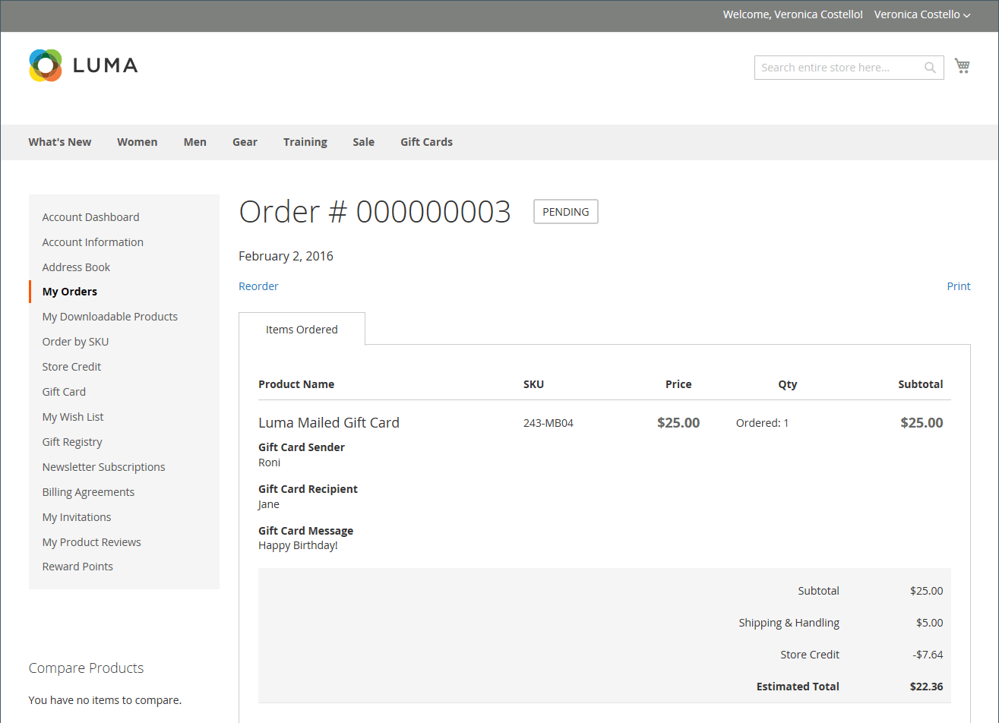

# 기프트 카드 구매 및 환매

{{ee-feature}}

장바구니에서 상품권은 주문에 쿠폰이 적용되는 방식과 유사하게 상환됩니다. 체크아웃 중에 쇼핑객이 기프트 카드 코드를 입력하여 기프트 카드의 금액을 구매에 적용합니다. 고객 계좌가 있는 기프트 카드 소지자는 계좌 대시보드에서 보유 현황과 잔액을 확인할 수 있다. 단일 및 다중 기프트 카드를 사용하여 주문의 전부 또는 일부를 결제할 수 있습니다.

적용된 기프트 카드 코드는 _관리자_&#x200B;에서 주문을 열어 볼 수 있으며, 필요한 경우 실제 기프트 카드에 넣을 코드를 검색할 수 있습니다. 기프트 카드 주문이 취소되거나 환급되는 경우, 관련 기프트 카드 계정을 수동으로 취소해야 합니다. 계정을 완전히 삭제하거나 비활성화할 수 있습니다.

{width="700" zoomable="yes"}

예를 들어, 데모 Luma 스토어에서 쇼핑하는 고객은 가상 또는 실제 기프트 카드를 구입할 수 있습니다.

**가상 선물 카드** - Luma 가상 선물 카드를 받는 사람에게 선택적 메시지로 보냅니다. Luma 웹 사이트 제품군에서는 상환할 수 있으며 만료되지 않습니다.

**실제 기프트 카드** - Luma 기프트 카드는 사용자 지정 아트 메일 장치에 포장되어 무료로 받는 사람에게 전송됩니다. 미리 제작하여 고유 코드로 레이블을 지정하고 매장, 전화 또는 Luma 웹 사이트 제품군에서 리딩할 수 있습니다. 만료되지 않습니다.

**결합된 기프트 카드** - 결합된 기프트 카드는 가상 기프트 카드와 실제 기프트 카드의 특성을 모두 갖습니다. Luma 결합 기프트 카드가 배송되어 수신자에게 이메일로 전송됩니다. 상품권을 구매하는 동안 이메일과 배송 주소가 필요합니다. 만료되지 않습니다.

## 기프트 카드 라이프사이클

1. **고객이 기프트 카드 값을 결정합니다**.

   고객은 제품 페이지에서 기프트 카드의 가치를 결정합니다. 구성에 따라 고정 가격 필드, 가격 옵션 목록 또는 둘 다 있습니다. 모든 금액은 스토어에서 사용되는 통화로 표시됩니다.

1. **고객이 기프트 카드 정보를 완료합니다**.

   실제 기프트 카드의 경우 고객이 **보낸 사람 이름** 및 **받는 사람 이름**&#x200B;을 입력합니다. 가상 또는 복합 기프트 카드의 경우 고객은 **보낸 사람 전자 메일** 및 **받는 사람 전자 메일**&#x200B;도 입력합니다. 고객이 로그인한 경우 해당 계정에서 보낸 사람 이름(및 해당되는 경우 보낸 사람 이메일)이 자동으로 입력됩니다. 구성에 따라 고객이 수신자에게 메시지를 입력할 수도 있습니다.

1. **고객이 체크아웃을 완료합니다**.

   선물 카드는 해당하는 경우 보낸 사람, 받는 사람 및 메시지의 이름을 보여주는 세부 정보와 함께 장바구니에 라인 항목으로 표시됩니다. 기프트 카드와 연계된 금액은 장바구니에 추가될 때 스토어의 기본 통화로 전환됩니다.

1. **고객이 주문 확인을 받습니다**.

   기프트 카드 구매자는 확인 링크를 클릭하여 계정 대시보드에서 주문을 추적할 수 있습니다.

1. **받는 사람이 기프트 카드를 받습니다**.

   가상 또는 결합 기프트 카드의 경우 수신자는 기프트 카드 코드, 발신자 이름 및 메시지가 포함된 이메일을 수신합니다(해당하는 경우). 여러 기프트 카드를 단일 주문으로 구매하고 유형이 가상 또는 조합인 경우 해당 기프트 카드 코드는 모두 단일 이메일로 수신자에게 전송됩니다. 실제 기프트 카드는 수령인 또는 고객에게 직접 배송할 수 있으며, 고객은 기프트 카드를 수령인에게 직접 배송할 수 있습니다.

1. **받는 사람이 선물 카드를 구입에 적용합니다**.

   받는 사람이 스토어에서 항목을 구입하고 체크아웃 중에 기프트 카드 코드를 적용합니다. 체크아웃 중에 기프트 카드가 적용될 때마다 금액은 주문 합계 블록에 나타나고 총합계에서 뺍니다. 장바구니 합계에서 각 기프트 카드의 전체 잔액을 뺍니다. 여러 기프트 카드를 구매에 사용한 경우, 잔액이 가장 적은 카드부터 시작하여 모두 적용되거나 총합이 0이 될 때까지 오름차순으로 적용됩니다. 총계가 0이 되면 장바구니에 적용된 마지막 기프트 카드 계정이 부분 공제를 받습니다. 장바구니에 적용되지 않은 모든 카드는 잔액 공제를 받지 않습니다. 주문이 완료된 후에만 기프트 카드 계좌에서 금액이 차감된다.

## Storefront 경험

상점 앞에서 기프트 카드가 작동하는 방식:

- 기프트 카드 코드는 장바구니에서 또는 체크아웃 시 적용하여 주문 총액을 계산할 수 있습니다.

- 카탈로그에는 상품권이 별도의 상품으로 제시되어 있다.

- 주문 송장 발행 후 기프트 카드 코드가 활성화됩니다. 주문이 결제되지 않은 경우 수령 고객은 기프트 카드를 사용할 수 없다.

- 특정 바우처의 잔액을 추적하기 위해 기프트 코드에 대한 계정이 만들어집니다. 매장 관리자는 수동으로 잔액을 조정할 수 있습니다.

받는 고객은 계정 대시보드의 _[!UICONTROL Gift Card]_&#x200B;섹션을 사용하여 [기프트 카드 계정](product-gift-card-accounts.md)의 잔액을 확인하고 [스토어 신용](../customers/store-credit-using.md)에 대한 기프트 카드를 사용할 수 있습니다.

{width="700" zoomable="yes"}

### 기프트 카드 상태 및 잔액 확인

1. 상점 첫 화면에서 고객은 로그인하고 고객 계정 페이지를 엽니다.

1. 고객이 **[!UICONTROL Gift Card]** 페이지를 열고 기프트 카드 코드를 입력합니다.

1. 고객이 **[!UICONTROL Check status and balance]**&#x200B;을(를) 클릭합니다.

{width="700" zoomable="yes"}

기프트 카드의 잔액이 표시됩니다.

### 기프트 카드 활성화

1. _[!UICONTROL Gift Card]_&#x200B;페이지에서 고객이 기프트 카드 코드를 입력합니다.

1. 고객이 **[!UICONTROL Redeem Gift Card]**&#x200B;을(를) 클릭합니다.

{width="700" zoomable="yes"}

기프트 카드 금액이 활성화 되어 총 매장 신용 잔액에 추가됩니다.

{width="700" zoomable="yes"}

기프트 카드 잔액에 대한 모든 작업은 _[!UICONTROL Store Credit]_&#x200B;페이지에서 사용할 수 있습니다.

### 체크아웃 시 기프트 카드 적용

기프트 카드를 상환할 수 없는 경우 체크아웃 시 기프트 카드 코드를 적용할 수 있습니다.

1. _검토 및 결제_ 단계에서 고객은 **[!UICONTROL Apply Gift Card]**&#x200B;을(를) 클릭합니다.

1. 기프트 카드 코드를 입력한 다음 **[!UICONTROL Apply]**&#x200B;을(를) 클릭합니다.

   할인은 _[!UICONTROL Order Summary]_&#x200B;에 반영되어야 합니다.

1. **[!UICONTROL Place Order]**&#x200B;을(를) 클릭하여 주문을 완료합니다.
