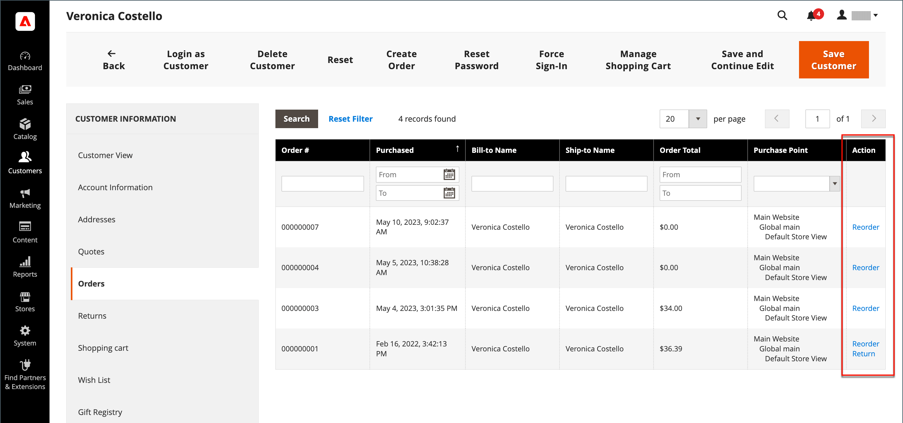
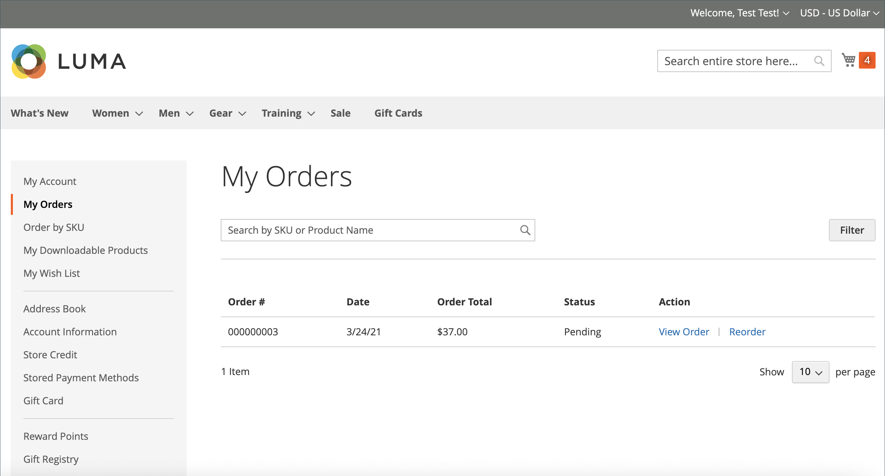
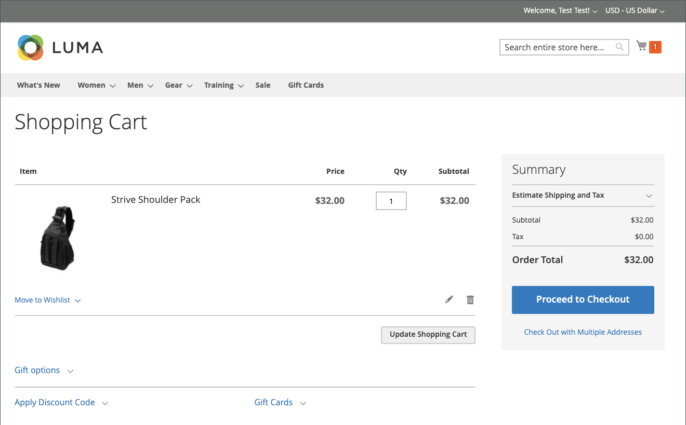
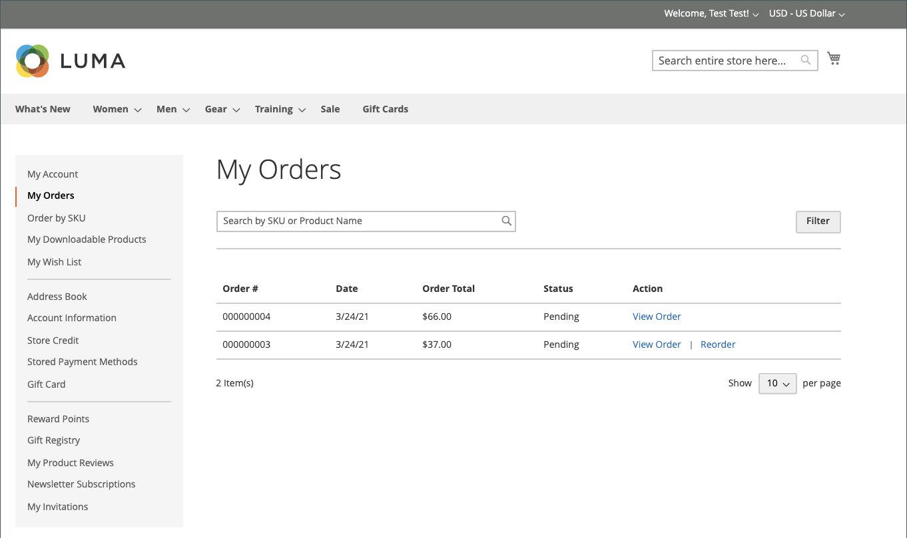
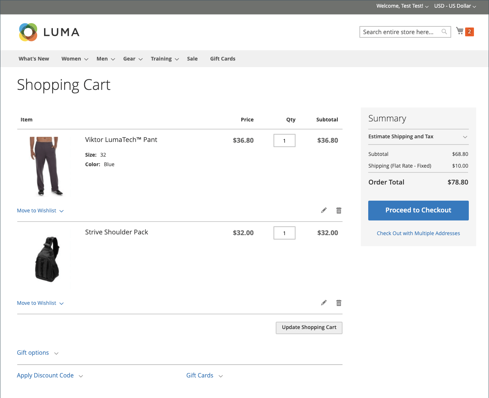

# 재주문 허용

사용하도록 설정하면 고객 계정이나 _관리자_&#x200B;의 원래 주문에서 직접 재주문을 할 수 있습니다. 재주문은 기본적으로 활성화되어 있습니다.

{width="700" zoomable="yes"}

## 주문에 사용할 수 있는 순서 조정 기준

- _순서 바꾸기 허용_ 구성 옵션을 사용하도록 설정해야 합니다.

- 순서가 `Hold` 또는 `Payment Review` 상태인 경우 순서 조정 옵션이 비활성화됩니다.

- 주문된 항목을 사용할 수 없거나, 재고가 없거나, 비활성화된 경우 상점 전면에서 재주문 옵션이 비활성화됩니다.

- _관리자_&#x200B;는 항목이 품절되거나 사용하지 않도록 설정된 경우에도 순서를 변경할 수 있습니다.

## 고객 재주문을 허용하도록 구성

1. _관리자_ 사이드바에서 **[!UICONTROL Stores]** > _[!UICONTROL Settings]_>**[!UICONTROL Configuration]**(으)로 이동합니다.

1. 왼쪽 패널에서 **[!UICONTROL Sales]**&#x200B;을(를) 확장하고 아래의 **[!UICONTROL Sales]**&#x200B;을(를) 선택합니다.

1. **[!UICONTROL Reorder]** 섹션에서 를 확장합니다.

   {width="600" zoomable="yes"}

1. **[!UICONTROL Allow Reorder]**&#x200B;을(를) `Yes`(으)로 설정합니다.

   이 설정을 사용하면 관리자의 상점 또는 주문 목록에 있는 고객 계정의 순서 조정 기능을 사용할 수 있습니다.

1. **[!UICONTROL Save Config]**&#x200B;을(를) 클릭합니다.

## 상점 앞에서 순서 바꾸기

고객은 다음 두 페이지에서 특정 주문에 대한 순서 조정 기능을 시작할 수 있습니다.

- _내 주문_ 페이지

- _주문 보기_ 페이지

### 내 주문

_순서 바꾸기_ 단추는 항상 Orders가 있는 목록에 표시됩니다(주문의 모든 제품을 순서 바꾸기에 사용할 수 없는 경우에도).

{width="700" zoomable="yes"}

**사례 1.** 주문의 모든 제품이 재주문에 대해 **사용 가능**&#x200B;합니다.

사용자가 장바구니로 리디렉션되고 모든 제품이 장바구니에 추가됩니다

{width="700" zoomable="yes"}

**사례 2.** 주문의 일부/모든 제품을 재주문하기 위해 **사용할 수 없음**

>[!NOTE]
>
>`Not Visible Individually` 제품의 순서를 변경할 수 있습니다.

_순서 바꾸기_ 단추가 _내 주문_ 및 _순서 보기_ 페이지에 표시되지 않습니다.

{width="700" zoomable="yes"}

### 주문 보기 페이지

**사례 1.** 주문의 모든 제품을 재정렬할 수 있습니다.

사용자가 장바구니로 리디렉션되고 모든 제품이 장바구니에 추가됩니다

**사례 2.** 주문의 일부/모든 제품을 재주문하기 위해 **사용할 수 없음**

>[!NOTE]
>
>`Not Visible Individually` 제품의 순서를 변경할 수 있습니다.

_순서 바꾸기_ 단추가 _내 주문_ 및 _순서 보기_ 페이지에 표시되지 않습니다.

{width="700" zoomable="yes"}

### 장바구니가 비어 있지 않음

장바구니가 비어 있지 않고 사용자가 **[!UICONTROL Reorder]**&#x200B;을(를) 클릭하는 경우(_내 주문_ 또는 _주문 보기_ 페이지), 기존 제품은 추가된 순서 변경 제품과 함께 장바구니에 남아 있습니다.

{width="700" zoomable="yes"}

## 책임자로부터 순서 바꾸기

1. _관리자_ 사이드바에서 **[!UICONTROL Sales]** > **[!UICONTROL Orders]**(으)로 이동합니다.

1. 주문을 찾아 **[!UICONTROL View]** 모드로 엽니다.

1. 맨 위 단추 모음에 표시되는 **[!UICONTROL Reorder]**&#x200B;을(를) 클릭합니다.

   {width="600" zoomable="yes"}

   **[!UICONTROL Reorder]**&#x200B;을(를) 클릭하면 제품 순서 바꾸기가 포함된 _새 순서 만들기_ 페이지가 열립니다.

   {width="600" zoomable="yes"}

1. 필요에 따라 모든 필수 필드를 완료합니다.

1. 주문을 제출하려면 **[!UICONTROL Submit Order]**&#x200B;을(를) 클릭합니다.
