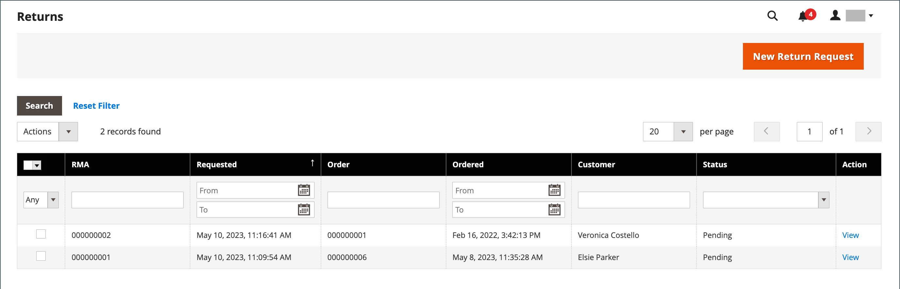
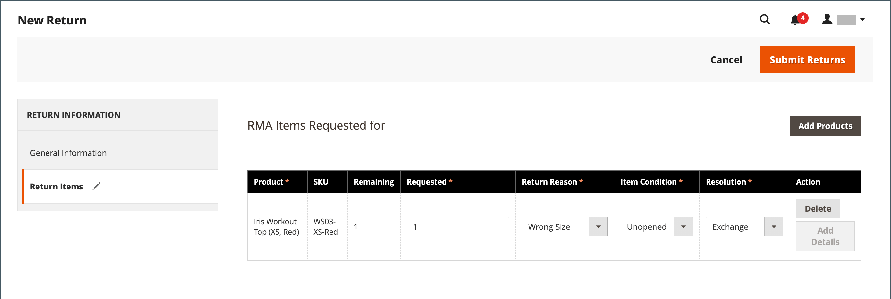

# 반환

_반품된 상품 승인_(RMA)은 교환 또는 환불을 위해 품목을 반품하도록 요청하는 고객에게 부여될 수 있습니다. 일반적으로 고객은 가맹점에 연락하여 환불을 요청합니다. 승인된 경우, 반품 제품을 식별하기 위해 고유한 RMA 번호가 지정됩니다. 구성에서 모든 제품에 대해 RMA를 활성화하거나 특정 제품에 대해서만 RMA를 허용할 수 있습니다. _[!UICONTROL Returns]_그리드는 현재 반품된 제품 요청(RMA)을 나열하며 새 반품된 요청을 입력하는 데 사용됩니다.

{width="600" zoomable="yes"}

RMA는 단순, 그룹화, 구성 및 번들 제품 유형에 대해 발급할 수 있습니다. 단, 가상 상품, 다운로드 가능 상품, 기프트 카드 등에는 RMA를 사용할 수 없다.

## 열 설명

| 열 | 설명 |
|--- |--- |
| [!UICONTROL Select] | 반환에 대한 확인란을 선택하여 작업을 적용하거나 열 머리글에서 선택 컨트롤을 사용합니다. 옵션: `Select All` / `Deselect All` / `Select Visible` / `Unselect Visible` |
| [!UICONTROL RMA] | 각 반환에 할당된 고유한 숫자 식별자 |
| [!UICONTROL Requested] | 반환 날짜 및 시간 |
| [!UICONTROL Order] | 원래 주문의 고유 번호 |
| [!UICONTROL Ordered] | 주문이 이루어진 날짜와 시간 |
| [!UICONTROL Customer] | 주문을 한 고객 또는 구매자의 이름 |
| [!UICONTROL Status] | 반환 상태. 옵션: `Pending` / `Authorized` / `Partially Authorized` / `Approved` / `Rejected` / `Processed and Closed` / `Closed` |
| [!UICONTROL Action] | **[!UICONTROL View]**&#x200B;이(가) 편집 모드에서 반환을 엽니다. |

{style="table-layout:auto"}

## RMA 및 반품 워크플로우

1. **요청 받기** - 상점에 대해 [활성화](rma-configure.md#enable-rmas-for-your-store)된 경우 등록된 고객과 게스트 모두 RMA를 요청할 수 있습니다. [책임자에서 RMA 요청을 제출](#create-a-return-request-in-the-admin)할 수도 있습니다.

2. **발급된 RMA** - 요청을 고려한 후 요청을 부분, 전체 또는 취소하거나 승인할 수 있습니다. 귀하가 반품을 승인하고 반품 배송에 대한 지불에 동의하는 경우, 지원되는 운송업자와 함께 관리자로부터 선적 주문을 생성할 수 있습니다.

3. **제품 입고 및 제품 반품이 처리됨** - 다음 순서도는 반품 프로세스를 완료하기 위한 운영 순서에 대해 설명합니다.

   {width="500"}

## RMA 상태

라이프사이클 동안 반품된 상품 승인(RMA)은 많은 지정된 상태(예: 보류 중 또는 승인)를 가질 수 있습니다. RMA 상태는 사용자 또는 판매자가 제기한 RMA 요청의 진행 상황을 나타냅니다.

| 상태 | 설명 |
|--- |--- |
| [!UICONTROL Pending] | 상점의 사용자 또는 관리자의 판매자가 RMA 요청을 제기할 때 할당된 초기 상태. |
| [!UICONTROL Authorized] | 이 상태는 요청된 모든 품목이 반품에 대해 관리자의 상인이 인증한 경우 RMA에 할당됩니다. |
| [!UICONTROL Partially Authorized] | 요청된 품목 중 하나라도 거부되고 다른 제품이 승인된 경우 이 상태는 RMA에 할당됩니다. |
| [!UICONTROL Denied] | 요청 품목이 모두 반품에 대해 관리자의 판매자에 의해 거부된 경우 이 상태는 RMA에 할당됩니다. |
| [!UICONTROL Return Received] | 이 상태는 요청된 품목이 사용자로부터 입고될 때 판매자가 RMA에 지정합니다. |
| [!UICONTROL Return Partially Received] | 요청된 품목이 부분적으로 반품되고 일부 품목의 처리가 거부되면 판매자는 이 상태를 RMA에 지정합니다. |
| [!UICONTROL Approved] | 이 상태는 요청된 품목이 추가 처리를 위해 승인될 때 판매자가 RMA에 지정합니다. |
| [!UICONTROL Rejected] | 요청된 품목이 추가 처리를 거부하는 경우 판매자는 이 상태를 RMA에 지정합니다. |
| [!UICONTROL Processed and Closed] | 요청된 모든 품목이 추가 처리를 위해 승인될 때 판매자는 이 상태를 RMA에 지정합니다. |
| [!UICONTROL Closed] | 요청된 품목이 반품처리를 거부하는 경우 판매자는 이 상태를 RMA에 지정합니다. |

{style="table-layout:auto"}

## 책임자에서 반환 요청 만들기

판매자는 관리자로부터 고객을 대신하여 반환 요청을 생성할 수 있습니다. 고객은 Adobe Commerce 스토어에 대해 [반환 요청을 만들 수 있습니다](rma-customer-experience.md).

1. _관리자_ 사이드바에서 **[!UICONTROL Sales]** > **[!UICONTROL Returns]**(으)로 이동합니다.

1. **[!UICONTROL New Return Request]**&#x200B;을(를) 클릭합니다.

1. 반환 요청을 만들려면 `Complete` 상태의 주문을 클릭합니다.

1. _[!UICONTROL Return Information]_섹션에서&#x200B;**[!UICONTROL Return Items]**탭을 선택합니다.

1. 반환할 항목을 추가하려면 **[!UICONTROL Add Items]**&#x200B;을(를) 클릭하십시오.

1. 필요한 제품에 대한 확인란을 선택하고 **[!UICONTROL Add Selected Product to returns]**&#x200B;을(를) 클릭합니다.

1. **[!UICONTROL Requested]**&#x200B;에 대해 반환할 항목 수를 입력하십시오.

1. **[!UICONTROL Return Reason]**&#x200B;을(를) 다음 중 하나로 설정합니다.

   - `Wrong Color`
   - `Wrong Size`
   - `Out of Service`
   - `Other`

   반환된 이유가 나열된 선택 사항과 다른 경우 `Other` 옵션을 선택하면 직접 입력할 수 있습니다.

1. **[!UICONTROL Item Condition]**&#x200B;을(를) 다음 중 하나로 설정합니다.

   - `Unopened`
   - `Opened`
   - `Damaged`

1. **[!UICONTROL Resolution]**&#x200B;을(를) 다음 중 하나로 설정합니다.

   - `Exchange`
   - `Refund`
   - `Store Credit`

1. 반환을 만들려면 **[!UICONTROL Submit Returns]**&#x200B;을(를) 클릭합니다.

   {width="600" zoomable="yes"}

   새로 제출된 RMA 요청이 **[!UICONTROL Returns]** 페이지에 `Pending` 상태로 나타납니다.
