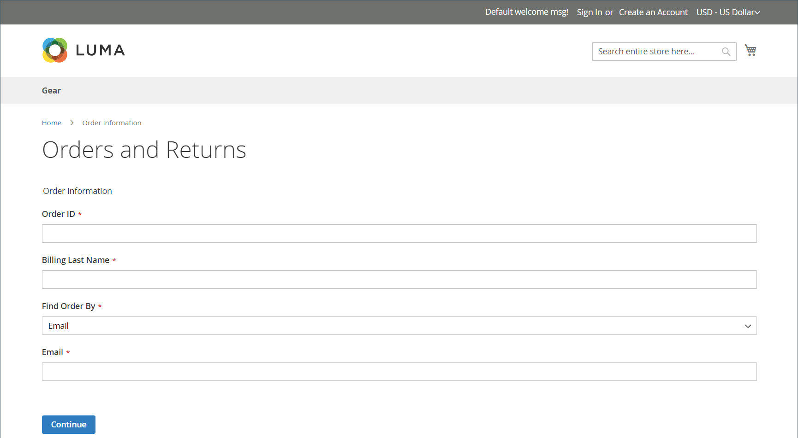

# 상점 경험을 반환합니다.

{{ee-feature}}

고객은 다음 중 하나를 사용하여 상점에서 RMA를 요청할 수 있습니다.

- [주문 및 반품 위젯](../content-design/widget-orders-returns.md) 사이드바에서
- _주문 및 반품_ 바닥글의 링크

가장 좋은 방법은 고객 서비스 정책에 RMA 요구 사항 및 프로세스에 대한 설명을 포함하는 것입니다.

>[!NOTE]
>
>반환과 관련된 추가 정보를 수집하려는 경우 사용자 지정 항목을 추가할 수 있습니다 [속성을 반환합니다.](attributes-returns.md).

모든 고객 RMA 정보는 **[!UICONTROL My Returns]** 고객 계정 대시보드의 페이지입니다.

{width="700" zoomable="yes"}

## RMA 요청

고객이 상점 첫 화면에서 다음 단계를 완료하여 RMA를 제출합니다.

1. 바닥글에서 을 클릭합니다. **[!UICONTROL Orders and Returns]**.

1. 주문 정보를 입력합니다.

   - 주문 ID
   - 청구 성
   - 이메일

1. 클릭수 **[!UICONTROL Continue]**.

   {width="700" zoomable="yes"}

1. 주문 날짜 아래에서 **[!UICONTROL Return]**.

   {width="700" zoomable="yes"}

1. 반환할 항목을 선택하고 **[!UICONTROL Quantity to Return]**.

1. 세트 **[!UICONTROL Resolution]** 다음 중 하나를 수행합니다.

   - Exchange
   - [환불](../customers/refunds-customer-account.md)
   - [스토어 크레딧](../customers/store-credit-using.md)

1. 세트 **[!UICONTROL Item Condition]** 다음 중 하나를 수행합니다.

   - `Unopened`
   - `Opened`
   - `Damaged`

1. 세트 **[!UICONTROL Reason to Return]** 다음 중 하나를 수행합니다.

   - `Wrong Color`
   - `Wrong Size`
   - `Out of Service`
   - `Other`

   {width="700" zoomable="yes"}

1. 필요한 경우 를 설정합니다. **[!UICONTROL Contact Email Address]** 및 **[!UICONTROL Comments]**.

   >[!NOTE]
   >
   >주문에 여러 항목이 포함되어 있고 고객이 다른 항목을 반환하려는 경우 다음을 클릭할 수 있습니다. **[!UICONTROL Add Item To Return]**&#x200B;을 클릭하고 항목을 선택한 다음 언급된 모든 옵션을 설정합니다.

1. 클릭수 **[!UICONTROL Submit]**.
