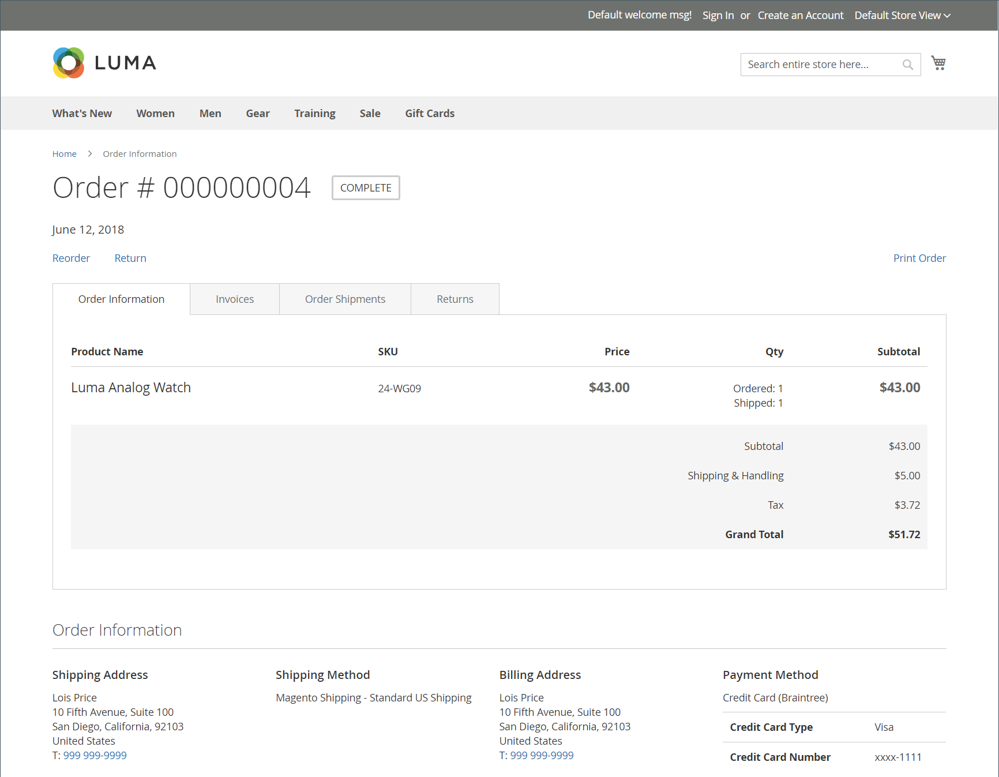

# 상점 경험을 반환합니다.

{{ee-feature}}

고객은 다음 중 하나를 사용하여 상점에서 RMA를 요청할 수 있습니다.

- 사이드바의 [주문 및 반품 위젯](../content-design/widget-orders-returns.md)
- 바닥글의 _주문 및 반환_ 링크

가장 좋은 방법은 고객 서비스 정책에 RMA 요구 사항 및 프로세스에 대한 설명을 포함하는 것입니다.

>[!NOTE]
>
>반환과 관련된 추가 정보를 수집하려면 사용자 지정 [반환 특성](attributes-returns.md)을(를) 추가할 수 있습니다.

모든 고객 RMA 정보가 고객 계정 대시보드의 **[!UICONTROL My Returns]** 페이지에 표시됩니다.

{width="700" zoomable="yes"}

## RMA 요청

고객이 상점 첫 화면에서 다음 단계를 완료하여 RMA를 제출합니다.

1. 바닥글에서 **[!UICONTROL Orders and Returns]**&#x200B;을(를) 클릭합니다.

1. 주문 정보를 입력합니다.

   - 주문 ID
   - 청구 성
   - 이메일

1. **[!UICONTROL Continue]**&#x200B;을(를) 클릭합니다.

   {width="700" zoomable="yes"}

1. 주문 날짜 아래에서 **[!UICONTROL Return]**&#x200B;을(를) 클릭합니다.

   {width="700" zoomable="yes"}

1. 반환할 항목을 선택하고 **[!UICONTROL Quantity to Return]**&#x200B;을(를) 입력합니다.

1. **[!UICONTROL Resolution]**&#x200B;을(를) 다음 중 하나로 설정합니다.

   - Exchange
   - [환불](../customers/refunds-customer-account.md)
   - [스토어 크레딧](../customers/store-credit-using.md)

1. **[!UICONTROL Item Condition]**&#x200B;을(를) 다음 중 하나로 설정합니다.

   - `Unopened`
   - `Opened`
   - `Damaged`

1. **[!UICONTROL Reason to Return]**&#x200B;을(를) 다음 중 하나로 설정합니다.

   - `Wrong Color`
   - `Wrong Size`
   - `Out of Service`
   - `Other`

   {width="700" zoomable="yes"}

1. 필요한 경우 **[!UICONTROL Contact Email Address]** 및 **[!UICONTROL Comments]**&#x200B;을(를) 설정합니다.

   >[!NOTE]
   >
   >주문에 여러 항목이 포함되어 있고 고객이 다른 항목을 반환하려는 경우 **[!UICONTROL Add Item To Return]**&#x200B;을(를) 클릭하고 항목을 선택한 다음 언급된 모든 옵션을 설정할 수 있습니다.

1. **[!UICONTROL Submit]**&#x200B;을(를) 클릭합니다.
