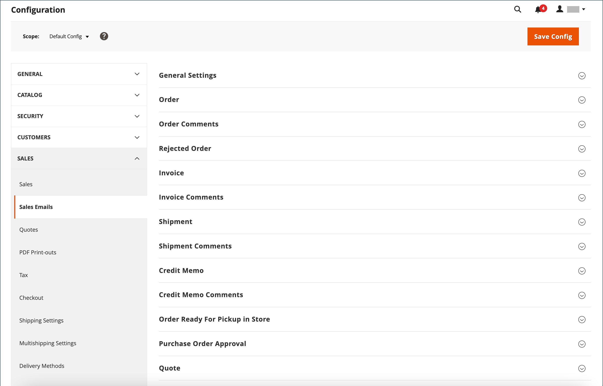

# 영업 이메일

몇 가지 이메일 메시지는 주문과 관련된 이벤트에 의해 트리거되며 구성은 유사합니다. 메시지 발신자로 표시되는 스토어 연락처, 사용할 이메일 템플릿 및 메시지 사본을 받을 사용자를 식별해야 합니다. 영업 이메일은 이벤트에 의해 트리거될 때 또는 사전 결정된 간격에 따라 전송될 수 있습니다.

{width="600" zoomable="yes"}

## 1단계. 이메일 템플릿 업데이트

[전자 메일 헤더](../systems/email-template-custom.md#header-template) 템플릿이 브랜드를 반영하도록 업데이트하고 필요에 따라 다른 전자 메일 템플릿을 업데이트하십시오. 전체 템플릿 목록은 [전자 메일 템플릿](../systems/email-templates.md)을 참조하세요.

## 2단계. 전송 유형 선택

1. _관리자_ 사이드바에서 **[!UICONTROL Stores]** > _[!UICONTROL Settings]_>**[!UICONTROL Configuration]**(으)로 이동합니다.

1. 왼쪽 패널에서 **[!UICONTROL Sales]**&#x200B;을(를) 확장하고 **[!UICONTROL Sales Emails]**&#x200B;을(를) 선택합니다.

1. 필요한 경우 **[!UICONTROL General Settings]** 섹션에서 를 확장합니다.

   {width="600" zoomable="yes"}

   기본적으로 비동기 전송은 `Disable`(으)로 설정됩니다. 시스템 설정을 변경하려면 **[!UICONTROL Use system value]** 확인란의 선택을 취소하고 **[!UICONTROL Asynchronous sending]**&#x200B;을(를) 다음 중 하나로 설정합니다.

   - `Disable` - 이벤트에 의해 트리거되면 판매 이메일을 보냅니다.
   - `Enable` - 미리 결정된 일정한 간격으로 판매 이메일을 보냅니다.

   Adobe Commerce 지원에서는 주문 배치 성능을 개선하기 위해 비동기 전송을 활성화할 것을 권장합니다. Adobe Commerce 지원 기술 자료에서 [주문 처리에 대한 구성 모범 사례](https://experienceleague.adobe.com/docs/commerce-operations/implementation-playbook/best-practices/maintenance/order-processing-configuration.html)를 참조하십시오.

## 3단계. 각 판매 이메일 메시지에 대한 세부 정보를 작성합니다

1. 필요한 경우 **[!UICONTROL Order]** 섹션에서 를 확장합니다.

   {width="600" zoomable="yes"}

1. **[!UICONTROL Enabled]**&#x200B;이(가) `Yes`(기본값)로 설정되어 있는지 확인하십시오.

1. 메시지를 보낸 사람으로 표시되는 저장소 연락처로 **[!UICONTROL New Order Confirmation Email]**&#x200B;을(를) 설정합니다.

1. 등록된 고객에게 보내는 전자 메일에 사용되는 템플릿으로 **[!UICONTROL New Order Confirmation Template]**&#x200B;을(를) 설정합니다.

1. 스토어에 계정이 없는 게스트에게 보내는 전자 메일에 사용되는 템플릿으로 **[!UICONTROL New Order Confirmation Template for Guest]**&#x200B;을(를) 설정합니다.

1. **[!UICONTROL Send Order Email Copy To]**&#x200B;의 경우 새 주문 전자 메일의 복사본을 받을 사용자의 전자 메일 주소를 입력하십시오.

   여러 수신자에게 복사본을 보내는 경우 각 주소는 쉼표로 구분하십시오.

1. **[!UICONTROL Send Order Email Copy Method]**&#x200B;을(를) 다음 중 하나로 설정합니다.

   - `Bcc` - 고객에게 보내는 것과 동일한 전자 메일의 헤더에 받는 사람을 포함하여 _무료 사본_&#x200B;을 보냅니다. BCC 수신자는 고객에게 표시되지 않습니다.
   - `Separate Email` - 복사본을 별도의 전자 메일로 보냅니다.

1. **[!UICONTROL Order Comments]** 섹션에서 를 확장하고 이 단계를 반복합니다.

   {width="600" zoomable="yes"}

1. 나머지 판매 이메일 유형에 대한 구성을 완료합니다.

   - **[!UICONTROL Invoice]** / **[!UICONTROL Invoice Comments]**
   - **[!UICONTROL Shipment]** / **[!UICONTROL Shipment Comments]**
   - **[!UICONTROL Credit Memo]** / **[!UICONTROL Credit Memo Comments]**

1. 완료되면 **[!UICONTROL Save Config]**&#x200B;을(를) 클릭합니다.

   메시지가 표시되면 작업 영역 상단에 있는 메시지에서 [캐시 관리](../systems/cache-management.md) 링크를 클릭하고 잘못된 캐시를 모두 지우십시오.
