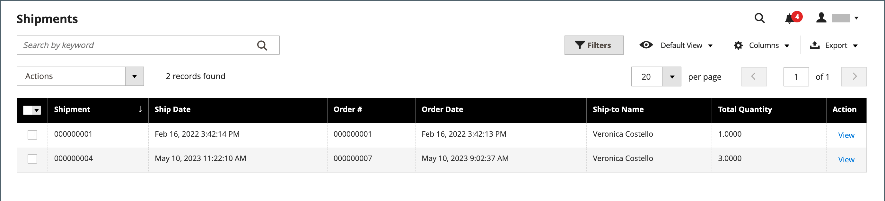
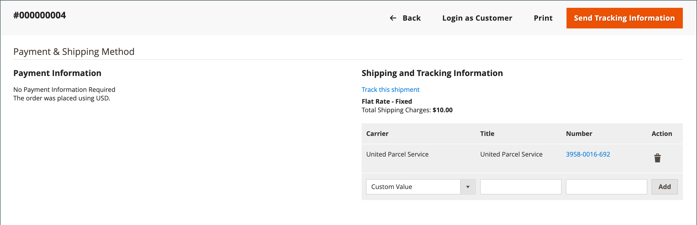

# 배송

_[!UICONTROL Shipments]_&#x200B;그리드에는 배송을 위해 준비된 모든 송장의 배송 기록이 나열됩니다. 주문이 [인보이스 발행](invoices.md) 이상일 때 배송 기록을 생성할 수 있습니다.

Adobe Commerce 및 Magento Open Source은 부분 주문 및 전체 주문 배송을 지원하며, [Inventory management](../inventory-management/introduction.md) 및 타사 확장에서 추가 옵션을 사용할 수 있습니다.

{width="600" zoomable="yes"}

## 열 설명

| 열 또는 컨트롤 | 설명 |
|--- |--- |
| [!UICONTROL Select] | 각 견적에 대한 확인란을 선택하여 작업을 수행하거나 열 헤더에서 선택 컨트롤을 사용합니다. 옵션: `Select All` / `Deselect All` |
| [!UICONTROL Shipment] | 신규 선적이 처음 저장될 때 지정되는 고유한 순차적 번호 |
| [!UICONTROL Ship Date] | 배송 날짜 |
| [!UICONTROL Order] | 고유 주문 번호 |
| [!UICONTROL Order Date] | 주문이 이루어진 날짜와 시간 |
| [!UICONTROL Ship-to Name] | 주문이 발송된 사람의 이름 |
| [!UICONTROL Total Quantity] | 출하할 품목의 총 수량 |
| [!UICONTROL Action] | 조회 편집 모드로 납품을 엽니다. |

{style="table-layout:auto"}

추가 열:

| 열 | 설명 |
|--- |--- |
| [!UICONTROL Order Status] | 주문 상태를 나타냅니다. |
| [!UICONTROL Purchased From] | 주문이 이루어진 웹 사이트, 스토어 및 스토어 보기를 나타냅니다. |
| [!UICONTROL Customer Name] | 주문을 한 고객 또는 구매자의 이름 |
| [!UICONTROL Email] | 등록된 고객의 이메일 주소 |
| [!UICONTROL Customer Group] | 고객이 할당된 고객 그룹 또는 공유 카탈로그의 이름 |
| [!UICONTROL Billing Address] | 주문을 한 고객 또는 구매자의 이름 |
| [!UICONTROL Shipping Address] | 주문이 발송된 사람의 이름 |
| [!UICONTROL Payment Method] | 주문에 사용할 결제 방법 |
| [!UICONTROL Shipping Information] | 주문 배송에 사용되는 방법 |

{style="table-layout:auto"}

## 배송 만들기

다음 지침은 Adobe Commerce 또는 Magento Open Source에서 선적을 작성하는 프로세스를 안내합니다. Inventory management을 활성화한 경우 [다중 Source 배송 만들기](../inventory-management/shipments-create.md)를 검토하고 라인 항목당 보낼 소스(또는 위치)와 수량을 선택할 수 있습니다.

1. _관리자_ 사이드바에서 **[!UICONTROL Sales]** > **[!UICONTROL Orders]**(으)로 이동합니다.

1. 그리드에서 순서를 찾아 엽니다.

1. 주문이 지불되고 송장이 발행되었으며 배송 준비가 된 경우 **[!UICONTROL Ship]**&#x200B;을(를) 클릭합니다.

   선적 상단에 있는 섹션에는 판매 주문의 이름, 주소 및 결제 정보가 포함됩니다.

1. 다음 섹션의 지침에 따라 선적 양식의 각 섹션을 작성하십시오.

### [!UICONTROL Items to Ship]

주문의 각 라인 항목에 대해 필요에 따라 **[!UICONTROL Qty to Ship]**&#x200B;을(를) 수정합니다.

### [!UICONTROL Shipping Information]

주문 페이지를 사용하는 **메서드 1:**

1. _관리자_ 사이드바에서 **[!UICONTROL Sales]** > **[!UICONTROL Orders]**(으)로 이동합니다.

1. 선택한 순서에 대한 **[!UICONTROL Action]** 열에서 **[!UICONTROL View]**&#x200B;을(를) 클릭합니다.

1. **[!UICONTROL Ship]**&#x200B;을(를) 클릭합니다.

1. _[!UICONTROL Payment & Shipping Method]_&#x200B;블록까지 아래로 스크롤한 다음&#x200B;**[!UICONTROL Add Tracking Number]**&#x200B;을(를) 클릭합니다.

1. **[!UICONTROL Carrier]** 설정:

   - `Custom Value`
   - `DHL`
   - `Federal Express`
   - `United Parcel Service`
   - `United States Postal Service`

1. 게재를 추적하려면 **[!UICONTROL Title]** 및 **[!UICONTROL Number]** 을(를) 입력하십시오.

배송 페이지를 사용하는 **방법 2:**

이 방법은 주문 페이지에서 주문 선적이 이미 생성된 경우에만 허용됩니다.
직접 선적 페이지를 사용하여 필요에 따라 선적 및 추적 정보를 수정할 수 있습니다.

1. _관리자_ 사이드바에서 **[!UICONTROL Sales]** > **[!UICONTROL Shipments]**(으)로 이동합니다.

1. 편집 모드에서 선적을 찾아 엽니다.

1. _[!UICONTROL Payment & Shipping Method]_&#x200B;블록까지 아래로 스크롤합니다.

1. **[!UICONTROL Carrier]** 선택.

1. 패키지의 **[!UICONTROL Title]**&#x200B;을(를) 입력하십시오.

1. 추적 **[!UICONTROL Number]**&#x200B;을(를) 입력하십시오.

1. **[!UICONTROL Add]**&#x200B;을(를) 클릭합니다.

1. 고객에게 추적 정보가 포함된 전자 메일을 보내려면 **[!UICONTROL Send Tracking Information]**&#x200B;을(를) 클릭하고 작업을 확인하십시오.

   배송의 위치를 추적하려면 편집 모드에서 필요한 배송을 열고 **[!UICONTROL Track this shipment]**&#x200B;을(를) 클릭합니다.

   {width="600" zoomable="yes"}

### 버튼

| 단추 | 설명 |
|--- |--- |
| **[!UICONTROL Back]** | 새 배송 양식을 닫고 주문으로 돌아가기 |
| **[!UICONTROL Submit Shipment]** | 주문에 대한 선적을 추가합니다. |
| **[!UICONTROL Reset]** | 모든 필드를 원래 값으로 복원합니다. |

{style="table-layout:auto"}

### 배송 댓글

1. 필요한 경우 배송에 대한 **댓글**&#x200B;을 입력하십시오.

1. 배송이 준비되면 **배송 제출**&#x200B;을 클릭합니다.

## 납품에 대한 주석 설정

1. _관리자_ 사이드바에서 **[!UICONTROL Stores]** > _[!UICONTROL Settings]_>**[!UICONTROL Configuration]**(으)로 이동합니다.

1. _[!UICONTROL Sales]_&#x200B;에서&#x200B;**[!UICONTROL Sales Email]**&#x200B;을(를) 선택합니다.

1. **배송 설명** 섹션을 확장하고 필요에 따라 설정을 수정합니다.

   {width="600" zoomable="yes"}

   - **[!UICONTROL Enabled]** 옵션은 기본적으로 `Yes`(으)로 설정되어 있습니다. 즉, 배송 설명을 입력할 때 고객에게 전자 메일이 전송됩니다.

   - **[!UICONTROL Shipment Comment Email Sender]**&#x200B;의 경우 배송 댓글 전자 메일을 보낼 사람을 선택하십시오. 기본값은 5개의 이메일 주소를 제공합니다.

   - **[!UICONTROL Shipment Comment Email Template]**&#x200B;의 경우 요구 사항에 따라 템플릿을 선택하거나 기본 옵션을 선택하십시오.

   - **[!UICONTROL Shipment Comment Email Template for Guests]**&#x200B;의 경우 스토어에 계정이 없는 고객에 대해 사용되는 템플릿을 선택하십시오.

   - **[!UICONTROL Shipment Comment Email Copy To]**&#x200B;의 경우 배송 댓글 전자 메일 복사본을 보낼 전자 메일 주소를 입력하십시오. 여러 이메일 주소는 쉼표로 구분합니다.

   - **[!UICONTROL Shipment Comment Email Copy Method]**&#x200B;의 경우 기본 설정에 따라 `bcc`(숨은 참조) 또는 `separate email copy` 메서드를 선택하십시오.

1. **[!UICONTROL Save Config]**&#x200B;을(를) 클릭합니다.

## 배송 취소

운송회사가 운송회사에 발송되기 전에, 운송회사가 취소를 지원하는 경우 주문을 열고 운송으로 이동하여 운송을 취소할 수 있습니다. 일부 이동통신사는 예약 후 취소를 제한하거나 제한합니다. 예를 들어 UPS는 취소를 허용하지만, 선적이 예약된 후 24시간을 기다려야 합니다. 운송물이 취소되면 취소는 취소되지 않습니다. 순서를 다시 만드는 것만이 유일한 방법입니다.

1. _관리자_ 사이드바에서 **[!UICONTROL Sales]** > **[!UICONTROL Orders]**(으)로 이동합니다.

1. 표에서 순서를 찾습니다.

1. _Action_ 열에서 **[!UICONTROL View]**&#x200B;을(를) 선택합니다.

1. 왼쪽 패널에서 **[!UICONTROL Shipments]**&#x200B;을(를) 선택합니다.

   게재를 취소할 수 있는 경우 _[!UICONTROL Cancel Shipment]_&#x200B;이(가) 맨 위 단추 모음에 옵션으로 나타납니다.

1. **[!UICONTROL Cancel Shipment]**&#x200B;을(를) 클릭합니다.

1. 확인 메시지가 표시되면 **[!UICONTROL OK]**&#x200B;을(를) 클릭합니다.

배송 상태가 `Canceled`(으)로 변경됩니다. 운송회사가 취소를 지원하지 않는 경우, 운송을 취소할 수 없는 이유를 설명하는 오류 메시지가 나타납니다.

## 배송 필드 설명

### [!UICONTROL Shipping Information]

| 필드 | 설명 |
|-----|-----------|
| [!UICONTROL Carrier] | 선택한 통신사의 이름 |
| [!UICONTROL Title] | 통신사가 패키지에 할당한 수사적 이름. |
| [!UICONTROL Number] | 패키지에 할당된 연결된 추적 번호입니다. |
| [!UICONTROL Action] |  - 배송 레코드에서 패키지 정보를 삭제합니다. |
| [!UICONTROL Add] | 배송에 다른 패키지를 추가합니다. |

{style="table-layout:auto"}

### [!UICONTROL Route Information]

| 필드 | 설명 |
|-----|-----------|
| [!UICONTROL Origin Location] | 사용 가능한 위치 목록을 표시합니다. |
| [!UICONTROL International] | 선택하면 선적이 국제 선적으로 식별됩니다. |

{style="table-layout:auto"}

### [!UICONTROL Items Ordered]

| 필드 | 설명 |
|-----|-----------|
| [!UICONTROL Description] | 항목에 대한 설명입니다. |
| [!UICONTROL SKU] | 항목의 Stock Keeping Unit. |
| [!UICONTROL Weight] | 항목의 무게입니다. |
| [!UICONTROL Qty Ordered] | 주문한 품목의 수량입니다. |
| [!UICONTROL Qty Shipped] | 출하된 품목의 수량입니다. |
| [!UICONTROL Qty Packed] | 이 패키지에 포함된 항목 수. |

{style="table-layout:auto"}

### [!UICONTROL Shipment Comments]

| 필드 | 설명 |
|-----|-----------|
| [!UICONTROL Comments] | 배송에 대한 의견은 내부용입니다. |

{style="table-layout:auto"}

### [!UICONTROL Documentation]

| 필드 | 설명 |
|-----|-----------|
| [!UICONTROL Package Label] | **PNG** - 배송 패키지 레이블을 다운로드합니다. 크기: A6(105 x 148mm, 4.1 x 5.6인치) |

{style="table-layout:auto"}
