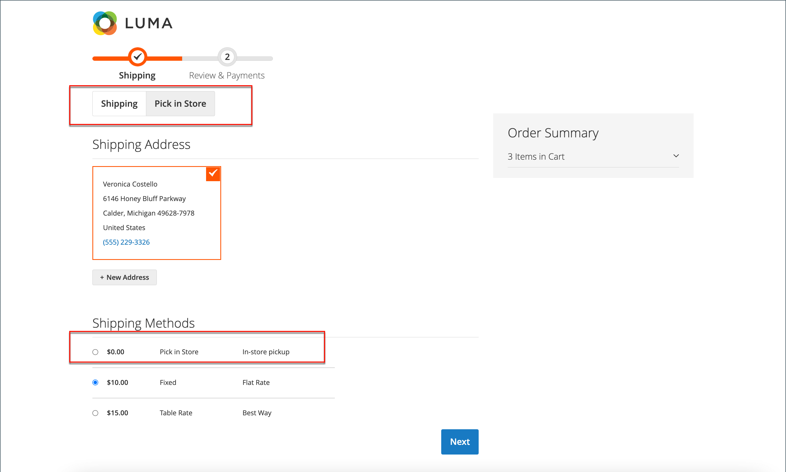

# 매장 내 배달

매장 내 배송 방법을 통해 고객은 체크아웃 시 픽업 장소로 사용할 소스를 선택할 수 있다.

{width="700" zoomable="yes"}

상점 앞에서 체크아웃하는 동안:

1. 고객이 **[!UICONTROL Pick In Store]**&#x200B;을(를) 클릭하거나 _[!UICONTROL In-Store Pickup Delivery]_배송 방법을 선택합니다.
1. _[!UICONTROL Pick In Store]_체크아웃 탭이 열립니다.

고객이 주소를 가지고 있거나 _[!UICONTROL Pick In Store]_탭으로 전환하기 전에 배송 주소 양식을 미리 채운 경우:

- 구성된 반경 내에서 고객 주소에 가장 가까운 출처는 자동으로 픽업 스토어로 미리 선택됩니다.
- 고객이 **[!UICONTROL Select Other]**&#x200B;을(를) 클릭하면 _[!UICONTROL Select Store]_검색 양식이 열립니다. 미리 선택한 스토어에 대해 구성된 거리(반경) 내의 스토어만 목록에 표시됩니다. 목록에 있는 모든 상점은 미리 선택한 상점과의 거리를 기준으로 정렬됩니다.
- 고객이 검색 필드에 우편 번호나 도시 이름을 입력하면 검색된 위치까지 구성된 거리(반경) 내 점포만 목록에 표시됩니다. 목록의 모든 매장은 검색된 위치까지의 거리로 정렬됩니다.
- 고객이 검색 필드에서 우편 번호나 도시 이름을 지우면 장바구니의 제품에 지정된 모든 픽업 매장이 고객에게 표시됩니다. 목록의 모든 저장소는 거리(반경) 제한 없이 소스 코드의 오름차순으로 정렬됩니다.

고객이 주소가 없거나 _[!UICONTROL Pick In Store]_탭으로 전환하기 전에 배송 주소 양식을 미리 채우지 않은 경우:

- 페이지에 _사용 가능한 정보를 기반으로 픽업 위치를 미리 선택할 수 없습니다_ 메시지가 표시됩니다.
- 고객이 **[!UICONTROL Select Store]**&#x200B;을(를) 클릭하면 _[!UICONTROL Select Store]_검색 양식이 열립니다.
- 장바구니의 제품에 할당된 모든 픽업 스토어는 거리(반경) 제한 없이 소스 코드 오름차순으로 표시됩니다.
- 고객이 검색 필드에 우편 번호나 도시 이름을 입력하면 검색된 위치까지 구성된 거리(반경) 내 점포만 목록에 표시됩니다. 목록의 모든 매장은 검색된 위치까지의 거리로 정렬됩니다.

## 설정 전

- 기본값이 아닌 재고 및 소스가 있는지 확인합니다. 소스를 픽업 위치로 구성하는 방법에 대한 자세한 내용은 [소스 추가](../inventory-management/sources-add.md)를 참조하십시오.
- 거리 우선 순위 알고리즘을 구성했는지 확인하십시오. 자세한 내용은 [거리 우선 순위 알고리즘 구성](../inventory-management/distance-priority-algorithm.md)을 참조하십시오.
- 오프라인 계산에 필요한 모든 지오코드를 [다운로드 및 가져오기](../inventory-management/cli.md#import-geocodes)했는지 확인하십시오.
- [기본 세금 대상 계산](../configuration-reference/sales/tax.md#default-tax-destination-calculation) 설정을 구성했는지 확인하십시오.

>[!IMPORTANT]
>
>**상점 앞에서 검색 결과가 거리(반경)별로 필터링되어 관련 결과를 표시합니다.**  
>고객의 배송 주소가 있는 경우 배송 주소에서 거리(반경)를 계산할 기본 위치를 가져옵니다.  
>고객에게 배송 주소가 없는 경우 거리를 계산할 기본 위치는 [기본 세금 대상 계산](../configuration-reference/sales/tax.md#default-tax-destination-calculation) 설정에서 가져옵니다. 이러한 설정은 저장소 보기별로 설정되며, 픽업 저장소 검색이 제대로 작동하도록 기본 세금 대상 계산 설정을 구성해야 합니다.

## 매장 내 게재 설정

먼저, 매장 내 게재가 활성화되었는지 확인합니다.

1. _관리자_ 사이드바에서 **[!UICONTROL Stores]** > _[!UICONTROL Settings]_>**[!UICONTROL Configuration]**(으)로 이동합니다.

1. 왼쪽 패널에서 **[!UICONTROL Sales]**&#x200B;을(를) 확장하고 **[!UICONTROL Delivery Methods]**&#x200B;을(를) 선택합니다.

1. **[!UICONTROL In-Store Delivery]** 섹션에서 를 확장합니다.

   {width="600" zoomable="yes"}

1. **[!UICONTROL Enabled]**&#x200B;을(를) `Yes`(으)로 설정합니다.

   >[!NOTE]
   >
   >필요한 경우 **[!UICONTROL Use system value]** 확인란의 선택을 취소하여 모든 필드의 기본값을 변경합니다.

1. 예상 배송을 생성하는 데 사용되는 계산 방법을 설명하는 **[!UICONTROL Method Name]**&#x200B;을(를) 입력하십시오.

   장바구니에서 계산된 예상 비율 옆에 메서드 이름이 표시됩니다.

1. 체크아웃 중에 _매장 내 배달_ 섹션에 표시할 **[!UICONTROL Title]**&#x200B;을(를) 입력하십시오.

   기본 제목은 `In-Store Pickup Delivery`입니다.

1. 매장 픽업 서비스에 대해 고객에게 요금을 청구하려면 **[!UICONTROL Price]** 필드에 요금을 입력합니다.

1. 상점 앞 체크아웃 시 상점 픽업 위치 검색을 위해 **[!UICONTROL Search Radius]**&#x200B;을(를) km 단위로 입력하십시오.

1. **[!UICONTROL Displayed Error Message]**&#x200B;의 경우 매장 내 게재를 사용할 수 없는 경우 표시되는 메시지를 입력하십시오.

   기본 메시지는 `In-Store Delivery is not available. To use this delivery method, please contact us.`입니다.

1. **[!UICONTROL Save Config]**&#x200B;을(를) 클릭합니다.
