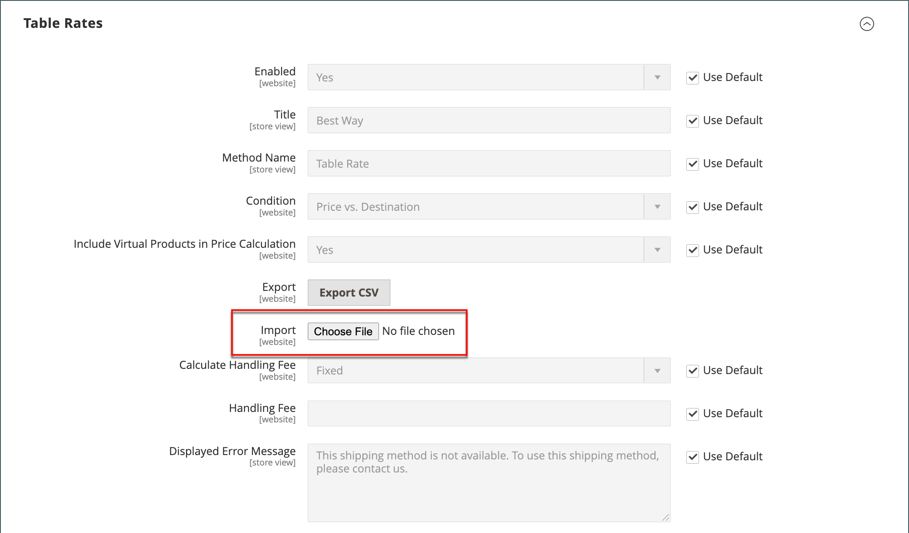

# 테이블 요금 배송

다음 _테이블 속도_ 운송 방법은 데이터 테이블을 참조하여 다음을 포함한 조건 조합을 기준으로 운송 요금을 계산합니다.

- 가중치 대 대상
- 가격 대 대상
- 항목 수 대 대상

예를 들어, 창고가 로스앤젤레스에 있다면, 샌디에이고로 배송하는 것이 버몬트로 배송하는 것보다 비용이 덜 듭니다. 테이블 요금 운송을 사용하여 절감액을 고객에게 전달할 수 있습니다.

테이블 비율을 계산하는 데 사용되는 데이터는 스프레드시트에 준비되어 스토어로 가져옵니다. 고객이 견적을 요청하면 결과는 장바구니의 배송 예상 섹션에 표시됩니다.

>[!NOTE]
>
>한 번에 하나의 테이블 속도 데이터 세트만 활성화할 수 있습니다.

{width="700" zoomable="yes"}

## 1단계: 기본 설정 완료

첫 번째 단계는 테이블 속도에 대한 기본 설정을 완료하는 것입니다. 구성 범위를 변경하지 않고 이 단계를 완료할 수 있습니다.

1. 다음에서 _관리자_ 사이드바, 이동 **[!UICONTROL Stores]** > _[!UICONTROL Settings]_>**[!UICONTROL Configuration]**.

1. 다음에서 _[!UICONTROL Sales]_왼쪽 패널의 섹션에서&#x200B;**[!UICONTROL Delivery Methods]**.

1. 확장  다음 **[!UICONTROL Table Rates]** 섹션.

   >[!NOTE]
   >
   >필요한 경우 먼저 **[!UICONTROL Use system value]** 확인란을 선택하여 설명된 대로 다음 설정을 변경합니다.

   {width="600" zoomable="yes"}

1. 설정 **[!UICONTROL Enabled]** 끝 `Yes`.

1. 다음을 입력합니다. **[!UICONTROL Title]** 체크아웃하는 동안 테이블 속도 섹션에 표시하려는 것입니다.

   기본 제목은 입니다. `Best Way`.

1. 다음을 입력합니다. **[!UICONTROL Method Name]** 장바구니에서 계산된 비율 옆에 레이블로 표시하려는 경우.

1. 설정 **[!UICONTROL Condition]** 다음 계산 방법 중 하나를 수행합니다.

   - `Weight v. Destination`
   - `Price v. Destination`
   - `Number of Items v. Destination`

1. 가상 제품이 포함된 주문의 경우 다음을 설정하십시오. **[!UICONTROL Include Virtual Products in Price Calculation]** 끝 `Yes` 가상 제품을 계산에 포함할 수 있도록 하려는 경우.

   >[!NOTE]
   >
   >서비스와 같은 가상 제품은 가중치가 없으므로 가중치 대 대상 조건을 기반으로 하는 계산 결과를 변경할 수 없습니다. 그러나 가상 제품은 가격 대 대상 또는 품목 수 대 대상 조건을 기반으로 하는 계산 결과를 변경할 수 있습니다.

1. 요구 사항에 따라 처리 요금 옵션을 구성합니다.

   처리 요금은 선택 사항이며 배송 비용에 추가되는 추가 비용으로 표시됩니다. 처리 수수료를 포함하려면 다음을 수행하십시오.

   - 설정 **[!UICONTROL Calculate Handling Fee]**:

      - `Fixed`
      - `Percent`

   - 다음을 입력합니다. **[!UICONTROL Handling Fee]** 요금 계산에 사용된 방법에 따른 요금.

     예를 들어, 요금이 고정 요금을 기준으로 하는 경우 다음과 같이 금액을 소수점으로 입력합니다. `4.90`. 단, 취급 수수료가 주문의 백분율을 기준으로 하는 경우 백분율로 금액을 입력합니다. 예를 들어 주문의 6%를 부과하려면 값을 다음과 같이 입력합니다. `.06`.

1. 필요한 경우 **[!UICONTROL Displayed Error Message]**.

   이 텍스트 상자는 기본 메시지로 사전 설정되어 있지만 이 전달 방법을 사용할 수 없는 경우 표시할 다른 메시지를 입력할 수 있습니다.

1. 설정 **[!UICONTROL Ship to Applicable Countries]**:

   - `All Allowed Countries` - 모든 고객의 고객 [국가](../getting-started/store-details.md#country-options) 저장소 구성에 지정된 경우 이 전달 방법을 사용할 수 있습니다.
   - `Specific Countries` - 이 옵션을 선택하면 _[!UICONTROL Ship to Specific Countries]_목록이 나타납니다. 목록에서 이 게재 방법을 사용할 수 있는 각 국가를 선택합니다.

1. 설정 **[!UICONTROL Show Method if Not Applicable]** 끝 `Yes` 테이블 비율을 항상 표시하려면

1. 대상 **[!UICONTROL Sort Order]**&#x200B;을 눌러 체크아웃 중에 다른 납품 방법과 함께 나열할 때 테이블 단가 운송이 나타나는 순서를 결정합니다.

   `0` = 첫 번째, `1` = 초, `2` = 세 번째 등입니다.

1. 클릭 **[!UICONTROL Save Config]**.

## 2단계: 테이블 비율 데이터 준비

1. 왼쪽 상단 모서리에서 을(를) 설정합니다. **[!UICONTROL Store View]** 끝 `Main Website`또는 구성이 적용되는 다른 모든 웹 사이트에 적용됩니다.

   >[!NOTE]
   >
   >필요한 경우 먼저 을(를) 선택 해제합니다. **[!UICONTROL Use system value]** 확인란을 선택하여 설명된 대로 다음 설정을 변경합니다.

1. 변경 **[!UICONTROL Condition]** 필요한 경우.

1. 클릭 **[!UICONTROL Export CSV]**.

   {width="700" zoomable="yes"}

1. 저장 `tablerates.csv` 파일을 시스템에 저장합니다.

1. 스프레드시트 애플리케이션에서 파일을 엽니다.

1. 운송 계산 조건에 대한 적절한 값으로 테이블을 완료합니다.

   - 모든 범주에서 가능한 모든 값을 나타내는 와일드카드로 별표(*)를 사용합니다.
   - 다음 _[!UICONTROL Country]_열에는 다음이 포함되어야 합니다: [유효한 세 문자 코드][1] 각 행에 대해.
   - 데이터 정렬 기준: _[!UICONTROL Region/State]_따라서 특정 위치는 목록의 맨 위에 있고 와일드카드 위치는 맨 아래에 있습니다. 이 방법을 사용하면 먼저 절대값이 있는 규칙을 처리하고 나중에 와일드카드 값을 처리합니다.
   - 의 값 _[!UICONTROL Weight (and above)]_열은 최대 4개의 소수 자리를 가질 수 있습니다(예: `2.5075`). 데이터에서 소수점 이하 자리 수를 더 많이 사용하면 가져오기가 실패합니다.

   {width="500"}

1. 저장 `tablerates.csv` 파일.

## 3단계: 테이블 단가 데이터 가져오기

1. (으)로 돌아가기 **[!UICONTROL Table Rates]** 섹션에 자세히 설명되어 있습니다.

1. 왼쪽 상단 모서리에서 을(를) 설정합니다. **[!UICONTROL Store View]** 이 방법을 사용하는 웹 사이트로 이동합니다.

1. 대상 **[!UICONTROL Import]**, 클릭 **[!UICONTROL Choose File]** 완료된 을(를) 선택합니다. `tablerates.csv` 파일 을 입력하여 비율을 가져옵니다.

   {width="600" zoomable="yes"}

1. 클릭 **[!UICONTROL Save Config]**.

## 4단계: 요금 확인

테이블 요금 데이터가 정확한지 확인하려면 여러 주소로 결제 프로세스를 진행하여 배송 및 처리 요금이 올바르게 계산되었는지 확인합니다.

### 예제 1: 가격 및 대상

이 예에서는 가격 대 목적지 조건을 사용하여 미국 대륙, 알래스카 및 하와이에 대한 주문 소계 금액을 기준으로 세 가지 다른 배송률 세트를 생성합니다. 별표(*)는 모든 값을 나타내는 와일드카드입니다.

| 국가 | 지역 / 주 | 우편 번호 | 주문 소계(및 이상) | 배송 가격 |
|--- |--- |--- |--- |--- |
| 미국 | 안녕하세요. | * | 100 | 10 |
| 미국 | 안녕하세요. | * | 50 | 15 |
| 미국 | 안녕하세요. | * | 0 | 20 |
| 미국 | AK | * | 100 | 10 |
| 미국 | AK | * | 50 | 15 |
| 미국 | AK | * | 0 | 20 |
| 미국 | * | * | 100 | 5 |
| 미국 | * | * | 50 | 10 |
| 미국 | * | * | 0 | 15 |

{style="table-layout:auto"}

### 예제 2: 무게 및 대상

이 예에서는 가중치 대 목적지 조건을 사용하여 주문의 가중치에 따라 다른 배송율을 생성합니다.

| 국가 | 지역 / 주 | 우편 번호 | 무게(이상) | 배송 가격 |
|--- |--- |--- |--- |--- |
| AUS | NT | * | 9 | 39.95 |
| AUS | NT | * | 0 | 19.95 |
| AUS | VIC | * | 9 | 19.95 |
| AUS | VIC | * | 0 | 5.95 |
| AUS | WA | * | 9 | 39.95 |
| AUS | WA | * | 0 | 19.95 |
| AUS | * | * | 9 | 29.95 |
| AUS | * | * | 0 | 9.95 |

{style="table-layout:auto"}

### 예제 3: 미국 대륙으로 무료 배송 제한

1. 만들기 `tablerates.csv` 무료 배송을 제공하려는 모든 주 대상을 포함하는 파일입니다.

1. 다음 설정으로 테이블 속도 구성을 완료합니다.

   | 설정 | 값 |
   |----------|-------|
   | [!UICONTROL Condition] | `Price v. Destination` |
   | [!UICONTROL Method Name] | `Free Shipping` |
   | [!UICONTROL Ship to Applicable Countries] | `Specific Countries` |
   | [!UICONTROL Ship to Specific Countries] | `Select only United States` |
   | [!UICONTROL Show method if not applicable] | `No` |

   {style="table-layout:auto"}

1. 왼쪽 상단 모서리에서 을(를) 설정합니다. **[!UICONTROL Store View]** 끝 `Main Website`또는 구성이 적용되는 다른 모든 웹 사이트에 적용됩니다.

1. 대상 **[!UICONTROL Import]**, 클릭 **[!UICONTROL Choose File]** 완료된 을(를) 선택합니다. `tablerates.csv` 파일 을 입력하여 비율을 가져옵니다.

[1]: https://en.wikipedia.org/wiki/ISO_3166-1_alpha-3
