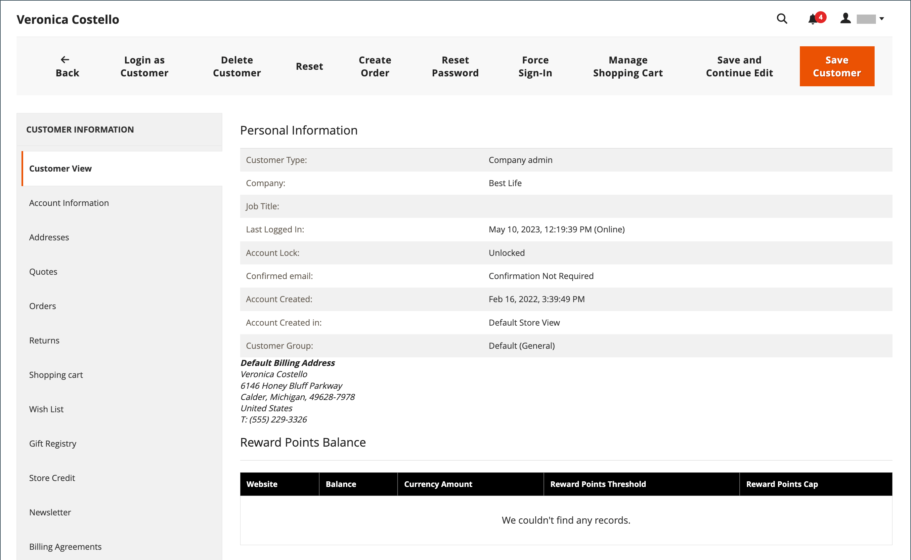
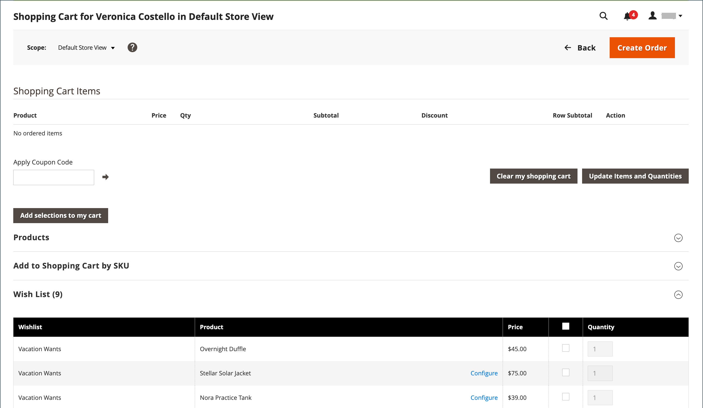
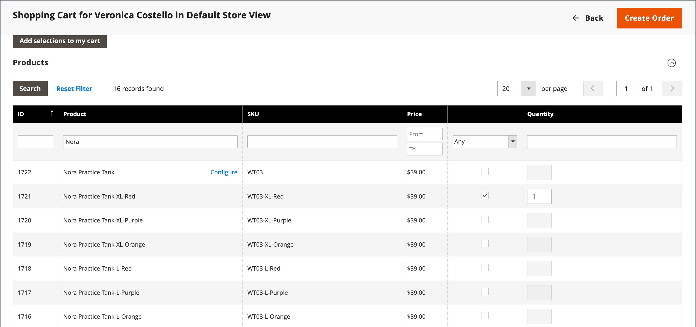

# 장바구니 관리

{{ee-feature}}

보조 쇼핑 세션을 시작하려면 고객이 상점에서 자신의 계정에 로그인하여 정보를 사용할 수 있도록 해야 합니다. 고객이 계정이 없는 경우 다음을 수행할 수 있습니다. [1개 만들기](../customers/account-create.md).

{width="600" zoomable="yes"}

## 작업 제어

| 옵션 | 설명 |
|--- |--- |
| [!UICONTROL Remove] | 현재 장바구니에서 항목 제거 |
| [!UICONTROL Move to Wish List] | 선택한 고객 위시리스트로 항목 이동 |

{style="table-layout:auto"}

## 컨트롤 단추

| 단추 | 설명 |
|--- |--- |
| [!UICONTROL Clear my shopping cart] | 모든 제품에서 현재 장바구니를 지웁니다. |
| [!UICONTROL Update Items and Quantities|]에 필요한 수량을 입력합니다. **[!UICONTROL Qty]** 필드를 작성하고 장바구니에 있는 항목 수를 업데이트합니다. |
| [!UICONTROL Add selections to my cart] | 모든 섹션의 제품을 장바구니에 추가합니다. |

{style="table-layout:auto"}

## 고객이 로그인되어 있는지 확인합니다.

1. 다음에서 _관리자_ 사이드바, 이동 **[!UICONTROL Customers]** > **[!UICONTROL Now Online]**.

   스토어 방문자와 로그인한 고객이 모두 목록에 표시됩니다.

   {width="700" zoomable="yes"}

## 지원 쇼핑 제공

1. 다음에서 _관리자_ 사이드바, 이동 **[!UICONTROL Customers]** > **[!UICONTROL All Customers]**.

1. 목록에서 고객 레코드를 편집 모드로 엽니다.

   >[!TIP]
   >
   >고객 레코드를 빠르게 찾으려면 [필터](../getting-started/admin-grid-controls.md) 제어.

   아래의 고객 프로필에서 _[!UICONTROL Personal Information]_,_[!UICONTROL Last Logged In]_ 날짜 및 시간은 고객이 온라인 상태임을 보여 줍니다.

   {width="600" zoomable="yes"}

1. 보조 쇼핑 모드로 전환하려면 **[!UICONTROL Manage Shopping Cart]** 을 클릭합니다.

   {width="600" zoomable="yes"}

## 속성별로 장바구니에 제품 추가

1. 확장  다음 **[!UICONTROL Products]** 섹션.

1. 각 열의 맨 위에 있는 필터를 사용하여 제품을 찾습니다.

1. 클릭 **[!UICONTROL Search]**.

1. 제품 유형에 따라 다음 단계 중 하나를 사용하십시오.

### 간단한 제품 추가

1. 주문하려는 제품을 클릭합니다.

   이 작업은 레코드를 선택하고 를 설정합니다. **[!UICONTROL Quantity]** 을 기본값으로 `1`.

1. 필요한 경우 주문 수량을 업데이트합니다.

1. 그리드 위의 왼쪽에서 **[!UICONTROL Add selections to my cart]**.

   {width="600" zoomable="yes"}

   라인 항목이 페이지 상단의 장바구니에 추가됩니다.

   {width="600" zoomable="yes"}

### 구성이 있는 제품 추가

장바구니에 추가하기 전에 구성해야 하는 세 가지 유형의 제품이 있습니다. `Bundle Product`, `Configurable Product`, 및 `Grouped Product`.

1. 그리드에서 **[!UICONTROL Configure]** 제품 이름 옆에 있습니다.

   {width="600" zoomable="yes"}

1. 다음에서 _관련 제품_ 대화 상자에서 각 제품 옵션을 선택하여 주문할 품목을 설명하고 **[!UICONTROL Quantity]**, 및 클릭 **[!UICONTROL OK]**.

   제품이 체크 표시로 선택되고 주문된 수량이 그리드에 나타납니다.

1. 제품을 장바구니에 추가하려면 다음을 클릭하십시오. **[!UICONTROL Add selections to my cart]**.

   {width="600" zoomable="yes"}

1. 필요한 경우 장바구니에서 제품 옵션을 업데이트합니다.

   - 클릭 **[!UICONTROL Configure]**.

   - 옵션을 업데이트한 다음 **[!UICONTROL OK]**.

## SKU별 제품 추가

1. 확장  다음 **[!UICONTROL Add to Shopping Cart by SKU]** 섹션.

1. 다음을 통해 개별적으로 제품 추가 **[!UICONTROL SKU]** 또는 CSV 파일을 업로드하여 제품을 추가합니다.

### SKU별로 개별적으로 항목 추가

1. 다음을 입력합니다. **[!UICONTROL SKU]** 및 **[!UICONTROL Qty]** 을(를) 참조하십시오.

1. 다른 제품을 주문하려면 **[!UICONTROL Add another]**.

   {width="600" zoomable="yes"}

1. 클릭 **[!UICONTROL Add selections to my cart]**.

1. 구성 가능한 제품인 경우 메시지가 표시되면 제품 옵션을 선택한 다음 를 클릭합니다 **[!UICONTROL Add to Shopping Cart]**.

### CSV 파일을 업로드하여 제품 추가

1. 준비 [csv 파일](../systems/data-csv.md) 장바구니에 추가할 항목이 있는 경우.

   파일에는 두 개의 열만 있어야 하며 `sku` 및 `qty` 헤더에서.

1. 준비된 파일을 업로드합니다.

   - 클릭 **[!UICONTROL Choose File]**.

   - 디렉토리에서 업로드할 파일을 선택합니다.

## 항목 전송

고객의 위시리스트와 최근에 본 항목, 비교한 항목 또는 주문한 항목을 장바구니로 전송할 수 있습니다. 각 섹션의 항목 수는 섹션 헤더 뒤에 괄호로 묶어 표시됩니다.

1. 확장  다음 섹션 중 하나:

   - [!UICONTROL Wish List]
   - [!UICONTROL Products in the Comparison List]
   - [!UICONTROL Recently Compared Products]
   - [!UICONTROL Recently Viewed Products]
   - [!UICONTROL Last Ordered Items]

1. 그리드에서 순서를 지정할 각 제품을 선택하고 **[!UICONTROL Quantity]**.

1. 구성 가능한 제품에 대한 옵션을 입력하려면 **[!UICONTROL Configure]** 필요에 따라 제품 옵션을 설정합니다.

1. 클릭 **[!UICONTROL Add selections to my cart]**.

1. 가능한 경우 하나 이상의 쿠폰 코드를 적용합니다.

   - 대상 **[!UICONTROL Apply Coupon Code]**&#x200B;올바른 쿠폰 코드를 입력합니다.

   - 다음을 클릭합니다. _적용_ (  ) 화살표를 클릭합니다.

1. 필요에 따라 주문 수량을 조정합니다.

   - 다음에서 **[!UICONTROL Qty]** 조정할 제품 열에 올바른 금액을 입력합니다.

   - 클릭 **[!UICONTROL Update Items and Quantities]**.

## 순서 만들기

1. 클릭 **[!UICONTROL Create Order]**.

   다음 _[!UICONTROL Create New Order]_페이지에는 장바구니의 항목, 배송 및 결제 정보가 표시됩니다.

1. 배송 및 결제 정보를 작성합니다.

1. 클릭 **[!UICONTROL Submit Order]**.

자세한 내용은 다음을 참조하십시오. [주문 만들기](customer-account-create-order.md).
