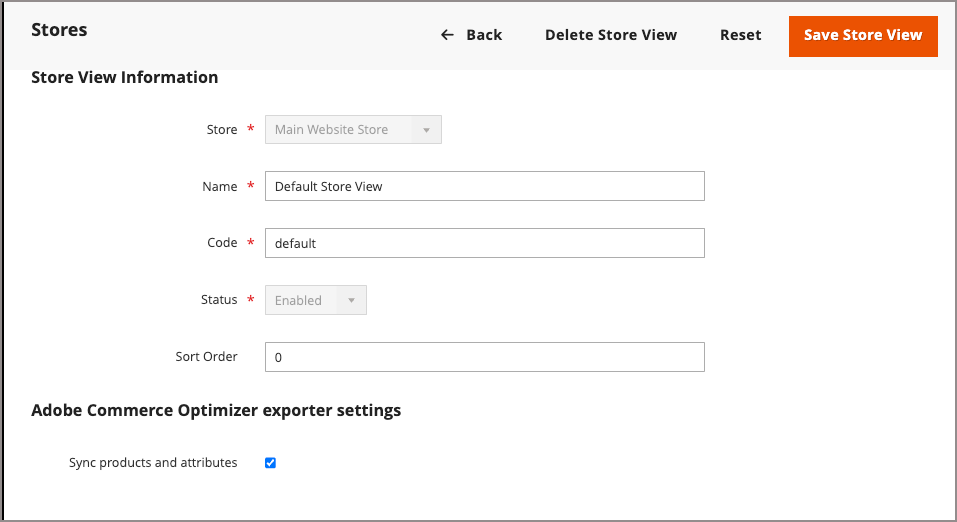

# 보기 저장

저장소 보기는 일반적으로 저장소를 다른 로케일에서 사용할 수 있도록 하는 데 사용됩니다. 쇼핑객은 매장 헤더에서 언어 선택기를 사용하여 매장 보기를 변경할 수 있습니다.

{width="550"}

## [!DNL Adobe Commerce Optimizer] 동기화 상태 {#optimizer-sync-status}

[!DNL Adobe Commerce Optimizer Connector]이(가) 설치되어 있고 웹 사이트 또는 스토어 보기에 대해 활성화된 경우 [!UICONTROL All Stores] 표에 동기화 상태 표시기가 표시됩니다. [!DNL Adobe Commerce Optimizer Connector for B2B]이(가) 설치된 경우 사용 가능한 B2B 공유 카탈로그에 대한 데이터도 동기화됩니다. [카탈로그 보기 관리](../b2b/catalog-views-manage.md)를 참조하세요.

| 열 | 지표 | 설명 |
| ----- | ----- | ----- |
| [!UICONTROL Web Site] | [!UICONTROL Price sync enabled for Commerce Optimizer] | 이 웹 사이트의 가격 및 가격 장부가 [!DNL Adobe Commerce Optimizer]에 동기화되었습니다. |
| [!UICONTROL Store View] | [!UICONTROL Product sync enabled for Commerce Optimizer] | 이 스토어 보기의 제품 및 특성이 [!DNL Adobe Commerce Optimizer]에 동기화되었습니다. |

{width="700" zoomable="yes"}

동기화를 활성화하거나 비활성화하려면 [웹 사이트를 만들거나](stores.md#step-1-create-a-website) [스토어 보기를 추가](#add-a-store-view)하거나 기존 웹 사이트 또는 스토어 보기를 업데이트할 때 **[!UICONTROL Adobe Commerce Optimizer exporter settings]**&#x200B;을(를) 편집하세요.

## 스토어 보기 추가

1. _관리자_ 사이드바에서 **[!UICONTROL Stores]** > _[!UICONTROL Settings]_>**[!UICONTROL All Stores]**(으)로 이동합니다.

   {width="700" zoomable="yes"}

1. **[!UICONTROL Create Store View]**&#x200B;을(를) 클릭합니다.

   {width="600" zoomable="yes"}

1. **[!UICONTROL Store]**&#x200B;을(를) 이 보기의 상위 저장소로 설정합니다.

1. 이 스토어 보기에 대한 **[!UICONTROL Name]**&#x200B;을(를) 입력하십시오.

   저장소 헤더의 언어 선택기에 이름이 표시됩니다. 예: `Spanish`.

1. **[!UICONTROL Code]**&#x200B;의 경우 보기를 식별하는 코드(소문자)를 입력하십시오.

   예: `spanish`.

1. 보기를 활성화하려면 **[!UICONTROL Status]**&#x200B;을(를) `Enabled`(으)로 설정합니다.

1. (선택 사항) **[!UICONTROL Sort Order]** 숫자를 입력하여 이 보기가 다른 보기와 함께 나열된 순서를 결정합니다.

1. (선택 사항) [!DNL Adobe Commerce Optimizer Connector]이(가) 설치되어 있으면 **[!UICONTROL Adobe Commerce Optimizer exporter settings]** 섹션에서 **[!UICONTROL Sync products and attributes]**&#x200B;을(를) 선택하여 이 저장소 보기의 제품 및 특성을 [!DNL Adobe Commerce Optimizer]과(와) 동기화합니다. [!DNL Adobe Commerce Optimizer Connector for B2B]도 설치되어 있으면 이 설정은 B2B 공유 카탈로그 데이터도 [!DNL Adobe Commerce Optimizer]에 동기화합니다. [카탈로그 보기 관리](../b2b/catalog-views-manage.md)를 참조하세요.

   {width="600" zoomable="yes"}

   초기 동기화 후에 이 설정을 변경하면 전체 다시 인덱싱이 트리거됩니다. *Commerce 커넥터 안내서*&#x200B;에서 [Adobe Commerce Optimizer 범위 내보내기 구성 사용자 지정](https://experienceleague.adobe.com/en/docs/commerce/aco-optimizer-connector/get-started#customize-the-commerce-scopes-export-configuration)을 참조하십시오.

1. **[!UICONTROL Save Store View]**&#x200B;을(를) 클릭합니다.

## 스토어 보기 편집

보기 이름이 언어 선택기에 표시되기 때문에 기본 보기의 이름을 좀 더 설명적인 이름으로 변경할 수 있습니다. _이름_ 필드는 단순히 레이블이므로 쉽게 변경할 수 있습니다.

Adobe Commerce 또는 Magento Open Source 설치에 다중 사이트 또는 다중 스토어 설정이 있는 경우 `index.php` 파일에서 값이 참조되지 않았는지 확인하지 않고 스토어 코드 필드를 변경하지 마십시오. 파일을 검사할 수 있는 서버 액세스 권한이 없는 경우 개발자에게 도움을 요청하십시오.

| 필드 | 원래 값 | 업데이트된 값 |
| ----- | -------------- | ------------- |
| [!UICONTROL Name] | `Default Store View` | `English` |
| [!UICONTROL Code] | `default` | `english` |

{style="table-layout:auto"}

1. _관리자_ 사이드바에서 **[!UICONTROL Stores]** > _[!UICONTROL Settings]_>**[!UICONTROL All Stores]**(으)로 이동합니다.

1. 그리드의 _[!UICONTROL Store View]_&#x200B;열에서 편집할 보기의 이름을 클릭합니다.

   기본 보기를 편집할 때 _[!UICONTROL Store]_&#x200B;및_[!UICONTROL Status]_ 필드를 사용할 수 없습니다.

   {width="600" zoomable="yes"}

1. 필요에 따라 다음 필드를 업데이트합니다.

   - **[!UICONTROL Store]**(기본이 아닌 보기만)
   - **[!UICONTROL Name]**
   - **[!UICONTROL Code]**(`index.php`에서 사용되지 않는 경우에만)
   - **[!UICONTROL Status]**(기본이 아닌 보기만)
   - **[!UICONTROL Sort Order]**
   - **[!UICONTROL Sync products and attributes]**([!DNL Adobe Commerce Optimizer Connector]이(가) 설치된 경우에만)

   {width="600" zoomable="yes"}

1. **[!UICONTROL Save Store View]**&#x200B;을(를) 클릭합니다.
