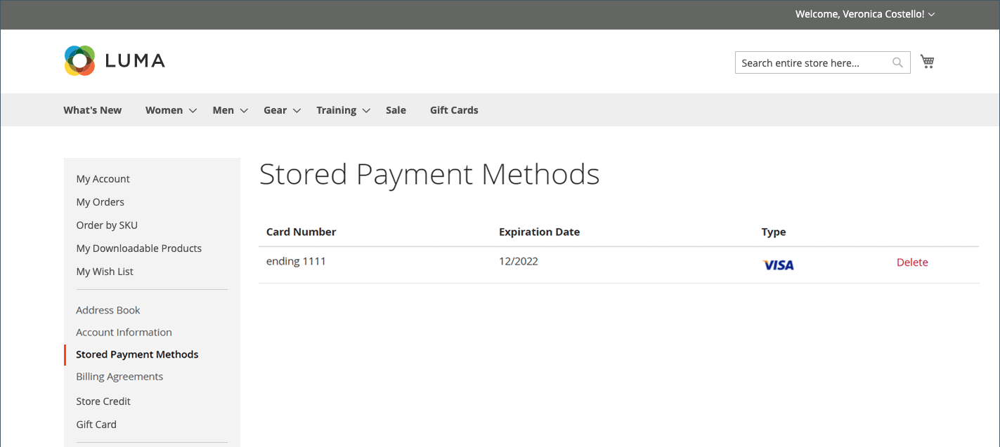

# 저장된 결제 방법

결제정보 보관용 보안 금고에 접근한 고객이 매번 신용카드 정보를 입력하지 않아도 체크아웃을 통해 속도를 낼 수 있다. [즉시 구매](checkout-instant-purchase.md)를 사용하도록 설정하면 고객은 2단계 체크아웃 프로세스를 무시하고 제품 페이지에서 주문할 수 있습니다.

[Braintree](braintree.md)과 같은 보안 자격 증명 모음을 지원하는 결제 방법이 필요합니다. 결제 방법 구성에서 보안 자격 증명 모음이 활성화된 경우 체크아웃 중에 고객이 신용 카드 정보를 저장된 결제 방법으로 저장할 수 있는 옵션이 제공됩니다. 고객은 계정 대시보드에서 저장된 결제 방법을 관리할 수 있습니다.

{width="700" zoomable="yes"}

## 체크아웃 시 저장된 결제 방법 추가

1. 상점 첫 화면에서 고객은 제품의 세부 사항 페이지로 이동합니다.

1. 장바구니에 제품을 추가합니다.

1. 체크아웃 페이지로 이동합니다.

1. _배달_ 단계를 완료합니다.

1. **[!UICONTROL Braintree Credit Card]** 결제 방법을 선택합니다.

1. 신용 카드 데이터를 채웁니다.

1. **[!UICONTROL Save for later use]** 확인란을 선택합니다.

1. **[!UICONTROL Place Order]**&#x200B;을(를) 클릭합니다.

저장된 결제 방법이 고객 대시보드의 _[!UICONTROL Stored Payment Methods]_탭에 표시됩니다.

## 저장된 결제 방법 삭제

이전에 추가되거나 저장된 결제 방법은 고객이 편집할 수 없으며 삭제만 가능합니다. 이 작업은 취소할 수 없습니다.

1. 계정의 사이드바에서 고객이 **[!UICONTROL Stored Payment Methods]**&#x200B;을(를) 선택합니다.

1. 삭제할 결제 방법 항목을 찾습니다.

1. **[!UICONTROL Delete]**&#x200B;을(를) 클릭합니다.

1. 작업을 확인하려면 **[!UICONTROL OK]**&#x200B;을(를) 클릭합니다.
