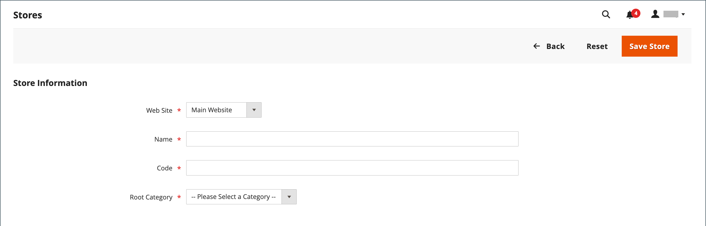
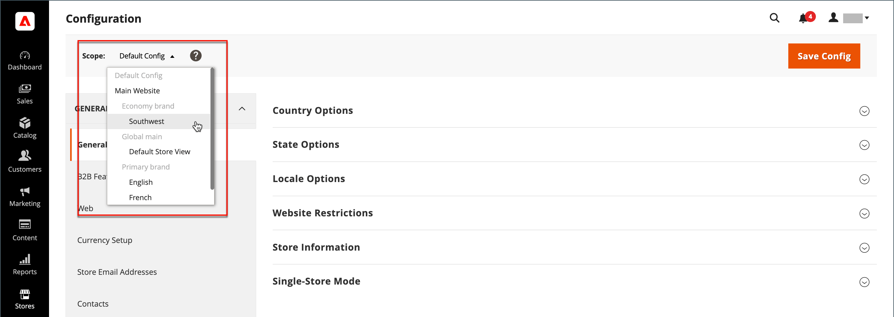

# 저장소 및 사이트 구조

Adobe Commerce 또는 Magento Open Source이 설치되면 기본 웹 사이트, 스토어 및 스토어 보기를 포함하는 계층 구조가 만들어집니다. 필요에 따라 추가 웹 사이트, 스토어 및 스토어 보기를 만들 수 있습니다. 예를 들어 기본 웹 사이트 외에 다른 도메인이 있는 추가 웹 사이트가 있을 수 있습니다. 각 웹 사이트 내에서 여러 스토어를 사용할 수 있으며 각 스토어 내에서 별도의 스토어 보기를 사용할 수 있습니다. 많은 설치에는 한 개의 웹 사이트와 한 개의 스토어가 있지만 서로 다른 언어를 지원하기 위해 여러 스토어 보기가 있습니다.

시작하기 전에 저장소 카탈로그 계층 구조를 미리 계획하십시오. 구성 전체에서 참조되기 때문입니다. 각 스토어에는 별도의 [루트 범주](../catalog/category-root.md)가 있을 수 있으므로 각 스토어에 대해 완전히 다른 기본 메뉴 옵션 집합을 사용할 수 있습니다.

{width="550"}

## 스토어 추가

Adobe Commerce 또는 Magento Open Source의 단일 설치에는 관리자를 공유하는 여러 저장소가 있을 수 있습니다. 동일한 웹 사이트 아래에 있는 스토어는 동일한 IP 주소 및 도메인을 가지고 동일한 보안 인증서를 사용하며 단일 체크아웃 프로세스를 공유합니다.

중요한 것은 스토어에서 동일한 코드를 사용하고 관리자를 공유한다는 것입니다. 각 스토어에는 별도의 카탈로그가 존재할 수도 있고, 매장들이 카탈로그를 공유할 수도 있다. 각 스토어에는 별도의 [루트 범주](../catalog/category-root.md)가 있을 수 있으므로 각 스토어마다 다른 기본 메뉴를 사용할 수 있습니다. 스토어는 다른 브랜딩, 프레젠테이션 및 콘텐츠를 가질 수도 있습니다. 저장소 계층 구조는 구성 전체에서 사용되므로 시작하기 전에 향후 성장을 염두에 두고 계획하십시오.

{width="550"}

다음은 여러 저장소에 대해 URL을 구성하는 방법의 몇 가지 예입니다.

| URL | 설명 |
| --- | ----------- |
| `yourdomain.com/store1` `yourdomain.com/store2` | 각 스토어에는 다른 경로가 있지만 도메인을 공유합니다. |
| `store1.yourdomain.com` `store2.yourdomain.com` | 각 스토어에는 주 도메인의 다른 하위 도메인이 있습니다. |

Adobe Commerce의 다중 스토어 설치는 관리자 및 서버의 명령줄에서 구성해야 합니다. Adobe Commerce [구성 안내서](https://experienceleague.adobe.com/docs/commerce-operations/configuration-guide/multi-sites/ms-overview.html)에서 서버 환경 구성에 대한 자세한 지침을 제공합니다.

### 1단계: 스토어 도메인 선택

첫 번째 단계는 스토어를 배치할 방법을 선택하는 것입니다. 스토어가 도메인을 공유해야 하거나, 각 스토어에 하위 도메인이 있거나, 명확히 다른 도메인이 있어야 합니까? 각 스토어에 대해 다음 중 하나를 수행합니다.

- 저장소를 기본 도메인 아래에 한 수준 배치하려면 아무 작업도 수행하지 않아도 됩니다.
- 주 도메인의 하위 도메인을 설정합니다.
- 다른 주 도메인을 설정합니다.

### 2단계: 저장소 만들기

1. _관리자_ 사이드바에서 **[!UICONTROL Stores]** > _[!UICONTROL Settings]_>**[!UICONTROL All Stores]**(으)로 이동합니다.

1. **[!UICONTROL Create Store]**&#x200B;을(를) 클릭하고 새 스토어에 대한 옵션을 설정합니다.

   - **[!UICONTROL Web Site]** — 새 스토어의 상위 웹 사이트를 선택합니다. 웹 사이트가 하나만 있는 경우 기본값(`Main Website`)을 사용합니다.

   - **[!UICONTROL Name]** — 새 스토어의 이름을 입력합니다. 내부 참조용으로만 사용됩니다.

   - **[!UICONTROL Code]** — 스토어를 식별하는 코드를 소문자로 입력합니다. 예: `mainstore`.

   - **[!UICONTROL Root Category]** — 새 저장소의 기본 메뉴에 대한 범주 구조를 정의하는 [루트 범주](../catalog/category-root.md)(으)로 설정합니다. 스토어에 대한 특정 루트 카테고리를 이미 만든 경우 선택합니다. 그렇지 않으면 `Default Category`을(를) 선택하십시오. 나중에 다시 와서 설정을 업데이트할 수 있습니다.

   {width="600" zoomable="yes"}

1. **[!UICONTROL Save Store]**&#x200B;을(를) 클릭합니다.

### 3단계: 기본 스토어 보기 만들기

1. **[!UICONTROL Create Store View]**&#x200B;을(를) 클릭하고 저장소 보기 옵션을 설정합니다.

   - **[!UICONTROL Store]** — 만든 새 저장소로 설정합니다.

   - **[!UICONTROL Name]** — 보기의 이름을 입력합니다. 예: `English`.

   - **[!UICONTROL Code]** — 보기의 코드를 소문자로 입력합니다.

   - **[!UICONTROL Status]** — `Enabled`(으)로 설정합니다.

   - **[!UICONTROL Sort Order]** — 다른 스토어와 함께 나열되는 경우 스토어의 위치를 확인하려면 숫자를 입력하십시오.

1. **[!UICONTROL Save Store View]**&#x200B;을(를) 클릭합니다.

   편집 모드로 스토어를 열면 이제 기본 보기가 있음을 알 수 있습니다.

   {width="600" zoomable="yes"}

### 4단계: 저장소 URL 구성

1. _관리자_ 사이드바에서 **[!UICONTROL Stores]** > _[!UICONTROL Settings]_>**[!UICONTROL Configuration]**&#x200B;을(를) 클릭합니다.

1. 왼쪽 패널의 _[!UICONTROL General]_&#x200B;에서&#x200B;**[!UICONTROL Web]**&#x200B;을(를) 선택합니다.

1. 왼쪽 상단 모서리에서 새 스토어에 대해 만든 보기로 **[!UICONTROL Store View]**&#x200B;을(를) 설정합니다.

1. [범위](../getting-started/websites-stores-views.md#scope-settings) 전환을 확인하는 메시지가 표시되면 **[!UICONTROL OK]**&#x200B;을(를) 클릭합니다.

   {width="600" zoomable="yes"}

1. **[!UICONTROL Base URLs]** 섹션에서 를 확장하고 스토어의 기본 URL을 입력합니다.

   필요한 경우 **[!UICONTROL Use system value]** 확인란의 선택을 취소하여 설정을 변경합니다.

   {width="600" zoomable="yes"}

1. 저장소 [보안 URL](store-urls.md)을(를) 구성하려면 **[!UICONTROL Secure Base URLs]** 섹션에서 을(를) 확장하고 이전 단계를 반복합니다.

1. **[!UICONTROL Save Config]**&#x200B;을(를) 클릭합니다.

### 5단계: 서버 구성

여러 웹 사이트를 지원하도록 서버를 구성하려면 _구성 안내서_&#x200B;에서 [여러 웹 사이트 또는 스토어](https://experienceleague.adobe.com/docs/commerce-operations/configuration-guide/multi-sites/ms-overview.html)를 참조하십시오.

웹 서버 구성에 대한 도움말을 보려면 다음 리소스를 참조하십시오.

- [NGNX로 여러 웹 사이트 설정](https://experienceleague.adobe.com/docs/commerce-operations/configuration-guide/multi-sites/ms-nginx.html)
- [Apache를 사용하여 여러 웹 사이트 설정](https://experienceleague.adobe.com/docs/commerce-operations/configuration-guide/multi-sites/ms-apache.html)

클라우드 인프라의 Adobe Commerce에 대해서는 [여러 웹 사이트 또는 스토어 설정](https://experienceleague.adobe.com/docs/commerce-cloud-service/user-guide/configure-store/multiple-sites.html)을 참조하십시오.

## 웹 사이트 추가

동일한 도메인이나 다른 도메인으로 단일 Adobe Commerce 또는 Magento Open Source 설치에서 여러 웹 사이트를 설정할 수 있습니다. 기본적으로 동일한 웹 사이트 아래에 있는 저장소는 동일한 IP 주소 및 도메인을 가지며, 동일한 보안 인증서를 사용하며, 단일 체크아웃 프로세스를 공유합니다. 각 스토어에서 자체 도메인 아래에 전용 체크아웃 프로세스를 갖도록 하려면 각 스토어에 고유한 IP 주소와 별도의 보안 인증서가 있어야 합니다.

Adobe Commerce 또는 Magento Open Source의 다중 사이트 설치는 관리자 및 서버의 명령줄에서 구성해야 합니다. Commerce [구성 안내서](https://experienceleague.adobe.com/docs/commerce-operations/configuration-guide/multi-sites/ms-overview.html)에서 서버 환경 구성에 대한 자세한 지침을 제공합니다.

{width="550"}

### 1단계: 웹 사이트 만들기

1. _관리자_ 사이드바에서 **[!UICONTROL Stores]** > _[!UICONTROL Settings]_>**[!UICONTROL All Stores]**(으)로 이동합니다.

1. 오른쪽 상단에서 **[!UICONTROL Create Website]**&#x200B;을(를) 클릭합니다.

1. **[!UICONTROL Web Site Information]** 옵션을 설정합니다.

   {width="600" zoomable="yes"}

   - **[!UICONTROL Name]** — 새 웹 사이트의 도메인을 입력합니다. 예: `domain.com`.

   - **[!UICONTROL Code]** — 도메인을 가리키기 위해 서버에서 사용되는 코드를 입력합니다.

     코드는 소문자(a-z) 문자로 시작해야 하며 문자(a-z), 숫자(0-9) 및 밑줄(_) 기호의 조합을 포함할 수 있습니다.

   - **[!UICONTROL Sort Order]** — _(선택 사항)_ 이 사이트가 다른 사이트와 함께 나열되는 순서를 확인하려면 숫자를 입력하십시오. 이 사이트를 목록의 맨 위에 표시하려면 0(`0`)을 입력하십시오.

1. **[!UICONTROL Save Web Site]**&#x200B;을(를) 클릭합니다.

1. 새 웹 사이트에 필요한 각 [스토어](#add-stores) 및 [스토어 보기](store-views.md)를 설정합니다.

   그런 다음 웹 사이트를 편집 모드로 열어 기본 스토어를 설정할 수 있습니다.

### 2단계: 저장소 URL 구성

[스토어 URL](store-urls.md)을(를) 구성하려면 지침을 따르십시오.

### 3단계: 서버 구성

여러 웹 사이트를 지원하도록 서버를 구성하려면 _구성 안내서_&#x200B;에서 [여러 웹 사이트 또는 스토어](https://experienceleague.adobe.com/docs/commerce-operations/configuration-guide/multi-sites/ms-overview.html)를 참조하십시오.

웹 서버 구성에 대한 도움말을 보려면 다음 튜토리얼을 참조하십시오.

- [NGNX로 여러 웹 사이트 설정](https://experienceleague.adobe.com/docs/commerce-operations/configuration-guide/multi-sites/ms-nginx.html)
- [Apache를 사용하여 여러 웹 사이트 설정](https://experienceleague.adobe.com/docs/commerce-operations/configuration-guide/multi-sites/ms-apache.html)

클라우드 인프라의 Adobe Commerce에 대해서는 [여러 웹 사이트 또는 스토어 설정](https://experienceleague.adobe.com/docs/commerce-cloud-service/user-guide/configure-store/multiple-sites.html)을 참조하십시오.
