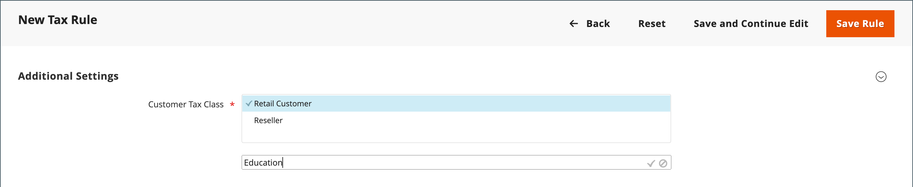

# 세금 등급

세금 분류는 고객, 제품 및 배송에 지정할 수 있습니다. Commerce은 각 고객의 장바구니를 분석하고, 고객의 등급, 장바구니에 있는 제품의 등급 및 지역에 따라 적절한 세금을 계산합니다. 지역은 고객의 배송 주소, 청구 주소 또는 배송 출처에 따라 결정됩니다. [세금 규칙](tax-rules.md)을(를) 정의하면 새 세금 클래스를 만들 수 있습니다.

- **고객** — 필요한 수만큼 고객 세금 클래스를 만들어 [고객 그룹](../customers/customer-groups.md)에 할당할 수 있습니다. 예를 들어, 일부 관할권에서 도매 거래는 과세되지 않지만 소매 거래는 과세된다. 도매 고객 그룹의 구성원을 도매 세금 분류와 연관시킬 수 있습니다.

- **제품** — 장바구니에 올바른 세율이 적용되는지 확인하기 위해 제품 클래스가 계산에 사용됩니다. 제품을 생성할 때 특정 세금 분류에 지정됩니다. 예를 들어, 식품에 대해 세금을 부과하지 않거나 다른 세율로 과세할 수 있습니다.

- **배송** — 상점에서 배송에 대해 추가 세금을 부과하는 경우 배송에 대한 특정 제품 세금 분류를 지정해야 합니다. 그런 다음 구성에서 배송에 사용되는 세금 분류로 지정합니다.

## 세금 분류 구성

배송에 사용되는 세금 클래스 및 [제품 및 고객](#add-a-product-tax-class)의 기본 세금 클래스가 _[!UICONTROL Sales]_구성에 설정되어 있습니다.

1. _관리자_ 사이드바에서 **[!UICONTROL Stores]** > _[!UICONTROL Settings]_>**[!UICONTROL Configuration]**(으)로 이동합니다.

1. 왼쪽 패널에서 **[!UICONTROL Sales]**&#x200B;을(를) 확장하고 **[!UICONTROL Tax]**&#x200B;을(를) 선택합니다.

1. **[!UICONTROL Tax Classes]** 섹션에서 를 확장합니다.

   {width="600" zoomable="yes"}

1. 다음 각각에 대한 세금 분류를 선택합니다.

   - **[!UICONTROL Set Tax Class for Shipping]**
   - **[!UICONTROL Tax Class for Gift Options]**
   - **[!UICONTROL Default Tax Class for Product]**
   - **[!UICONTROL Default Tax Class for Customer]**

1. 완료되면 **[!UICONTROL Save Config]**&#x200B;을(를) 클릭합니다.

## 세금 분류 추가

고객 및 제품에 대한 세목은 쉽게 추가한 다음 개별 고객 및 제품에 지정하여 세칙에 활용할 수 있다.

1. _관리자_ 사이드바에서 **[!UICONTROL Stores]** > _[!UICONTROL Taxes]_>**[!UICONTROL Tax Rules]**(으)로 이동합니다.

1. **[!UICONTROL Add New Tax Rule]**&#x200B;을(를) 클릭합니다.

1. **[!UICONTROL Additional Settings]** 섹션에서 를 확장합니다.

   {width="600" zoomable="yes"}

1. _고객 세금 클래스_&#x200B;에서 **[!UICONTROL Add New Tax Class]**&#x200B;을(를) 클릭합니다.

1. 텍스트 상자에 새 세금 클래스의 **[!UICONTROL Name]**&#x200B;을(를) 입력합니다.

   {width="600" zoomable="yes"}

1. 사용 가능한 고객 세금 분류 목록에 새 분류를 추가하려면 확인 표시를 누릅니다.

   {width="600" zoomable="yes"}

## 제품 세금 분류 추가

1. _제품 세금 클래스_&#x200B;에서 **[!UICONTROL Add New Tax Class]**&#x200B;을(를) 클릭합니다.

1. 텍스트 상자에 새 세금 클래스의 **[!UICONTROL Name]**&#x200B;을(를) 입력합니다.

1. 사용 가능한 제품 세금 분류 목록에 새 분류를 추가하려면 확인 표시를 누릅니다.

1. 완료되면 단추 모음에서 **[!UICONTROL Back]**&#x200B;을(를) 클릭하여 _세금 규칙_ 그리드로 돌아갑니다.

## 기본 세금 대상

기본 납세지 설정은 세금 계산의 기반으로 사용되는 국가, 주, 우편 번호를 결정합니다.

**_계산을 위한 기본 세금 대상을 구성하려면:_**

1. _관리자_ 사이드바에서 **[!UICONTROL Stores]** > _[!UICONTROL Settings]_>**[!UICONTROL Configuration]**(으)로 이동합니다.

1. 왼쪽 패널에서 **[!UICONTROL Sales]**&#x200B;을(를) 확장하고 **[!UICONTROL Tax]**&#x200B;을(를) 선택합니다.

1. **[!UICONTROL Default Tax Destination Calculation]** 섹션에서 를 확장합니다.

   {width="600" zoomable="yes"}

1. 세금 계산의 기반이 되는 국가에 **[!UICONTROL Default Country]**&#x200B;을(를) 설정합니다.

1. **[!UICONTROL Default State]**&#x200B;을(를) 세금 계산의 기반으로 사용되는 시/도로 설정합니다.

1. **[!UICONTROL Default Post Code]**&#x200B;을(를) 지방세 계산의 기준으로 사용되는 우편 번호로 설정합니다.

1. 완료되면 **[!UICONTROL Save Config]**&#x200B;을(를) 클릭합니다.
