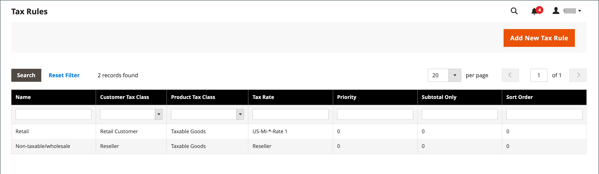
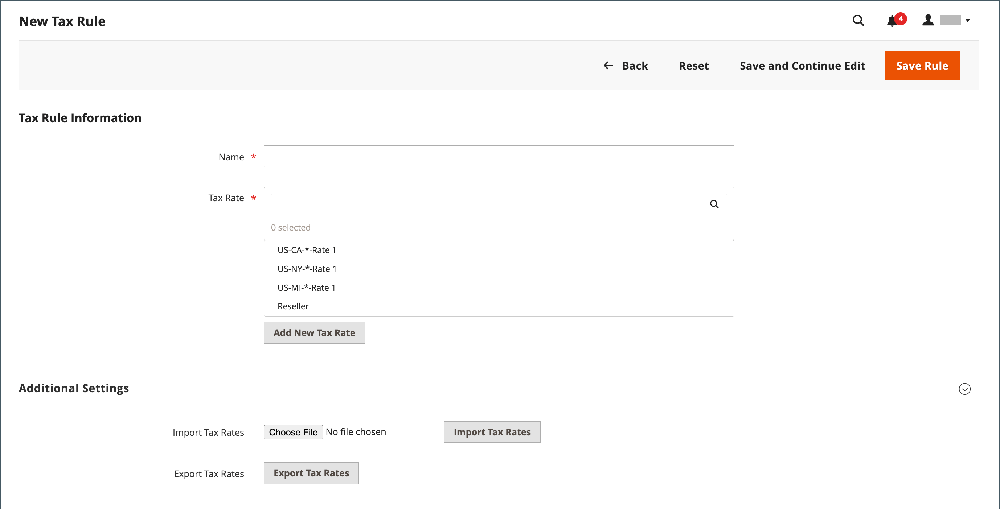
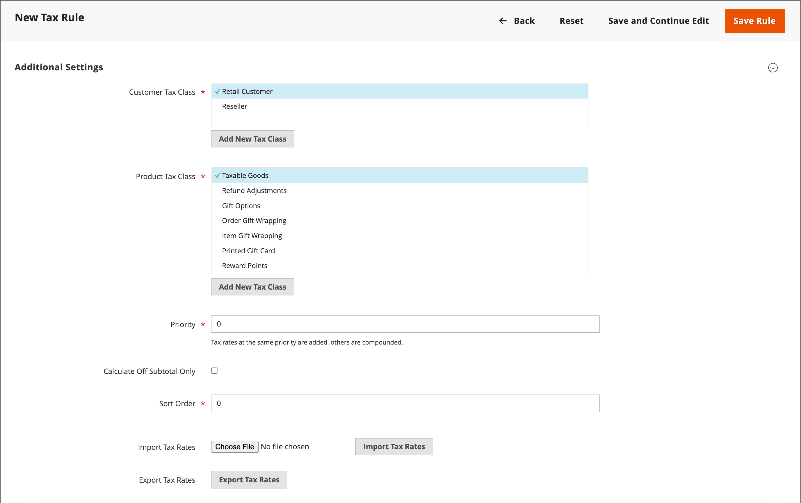

# 세금 규칙

세금 규칙은 제품 분류, 고객 분류 및 세율의 조합을 통합합니다. 각 고객은 고객 분류에 지정되고 각 제품은 제품 분류에 지정됩니다. Commerce은 각 고객의 장바구니를 분석하고, 고객 및 제품 등급과 지역에 따라 적절한 세금을 계산합니다. 지역은 고객의 배송 주소, 청구 주소 또는 배송 출처를 기반으로 합니다.

>[!NOTE]
>
>수많은 세율이 정의되어야 할 때 이를 수입하여 프로세스를 단순화할 수 있다.

{width="600" zoomable="yes"}

## 1단계: 세금 규칙 정보 완료

1. _관리자_ 사이드바에서 **[!UICONTROL Stores]** > _[!UICONTROL Taxes]_>**[!UICONTROL Tax Rules]**(으)로 이동합니다.

1. 오른쪽 상단에서 **[!UICONTROL Add New Tax Rule]**&#x200B;을(를) 클릭합니다.

1. _세금 규칙 정보_&#x200B;에서 새 규칙에 대한 **[!UICONTROL Name]**&#x200B;을(를) 입력하십시오.

   {width="600" zoomable="yes"}

1. 규칙에 적용되는 **[!UICONTROL Tax Rate]**&#x200B;을(를) 선택하십시오.

   기존 세율을 편집하려면 다음을 수행합니다.

   - 세율 위에 커서를 놓고 _편집_  아이콘을 클릭합니다.

   - 필요에 따라 양식을 업데이트하고 **[!UICONTROL Save]**&#x200B;을(를) 클릭합니다.

1. 세율을 입력하려면 다음 방법 중 하나를 사용합니다.

### 방법 1: 세율을 수동으로 입력

1. **[!UICONTROL Add New Tax Rate]**&#x200B;을(를) 클릭합니다.

1. 필요에 따라 양식을 작성합니다([세금 구역 및 세율](tax-zones-rates.md) 참조).

1. 완료되면 **[!UICONTROL Save]**&#x200B;을(를) 클릭합니다.

   {width="600" zoomable="yes"}

### 방법 2: 수입 세율

1. 페이지 하단에 있는 섹션으로 스크롤합니다.

1. 세율을 가져오려면 다음을 수행합니다.

   - **[!UICONTROL Choose File]**&#x200B;을(를) 클릭하고 가져올 세율이 포함된 CSV 파일로 이동합니다.

   - **[!UICONTROL Import Tax Rates]**&#x200B;을(를) 클릭합니다.

1. 세율을 내보내려면 **[!UICONTROL Export Tax Rates]**&#x200B;을(를) 클릭합니다([세율 가져오기/내보내기](../systems/data-transfer-tax-rates.md) 참조).

{width="600" zoomable="yes"}

## 2단계: 추가 설정 완료

1. 섹션을 열려면 **[!UICONTROL Additional Settings]**&#x200B;을(를) 클릭합니다.

   {width="600" zoomable="yes"}

1. 규칙이 적용되는 **[!UICONTROL Customer Tax Class]**&#x200B;을(를) 선택하십시오.

   - 고객 세금 클래스를 편집하려면 _편집_  아이콘을 클릭하고 필요에 따라 양식을 업데이트한 다음 **[!UICONTROL Save]**&#x200B;을(를) 클릭합니다.

   - 세금 클래스를 만들려면 **[!UICONTROL Add New Tax Class]**&#x200B;을(를) 클릭하고 필요에 따라 양식을 작성한 다음 **[!UICONTROL Save]**&#x200B;을(를) 클릭합니다.

1. 규칙이 적용되는 **[!UICONTROL Product Tax Class]**&#x200B;을(를) 선택하십시오.

   - 제품 세금 클래스를 편집하려면 _편집_  아이콘을 클릭하고 필요에 따라 양식을 업데이트한 다음 **[!UICONTROL Save]**&#x200B;을(를) 클릭합니다.

   - 세금 클래스를 만들려면 **[!UICONTROL Add New Tax Class]**&#x200B;을(를) 클릭하고 필요에 따라 양식을 작성한 다음 **[!UICONTROL Save]**&#x200B;을(를) 클릭합니다.

1. 두 개 이상의 세금이 적용되는 경우 **[!UICONTROL Priority]**&#x200B;에 대한 이 세금의 우선 순위를 나타내는 숫자를 입력하십시오.

   우선순위가 같은 두 가지 세칙이 적용되면 세금이 추가된다. 우선 순위 설정이 다른 두 세금이 적용되는 경우 세금이 합산됩니다.

1. 세금이 주문 소계를 기반으로 하도록 하려면 **[!UICONTROL Calculate off Subtotal Only]** 확인란을 선택하십시오.

1. **[!UICONTROL Sort Order]**&#x200B;의 경우 다른 사용자와 함께 나열될 때 이 세금 규칙의 순서를 나타내는 숫자를 입력하십시오.

1. 완료되면 **[!UICONTROL Save Rule]**&#x200B;을(를) 클릭합니다.

## 통화 및 세금 규칙 데모

이 비디오를 통해 통화 및 세금 규칙 관리에 대해 알아보십시오.

>[!VIDEO](https://video.tv.adobe.com/v/3410214/?quality=12&learn=on&captions=kor)
