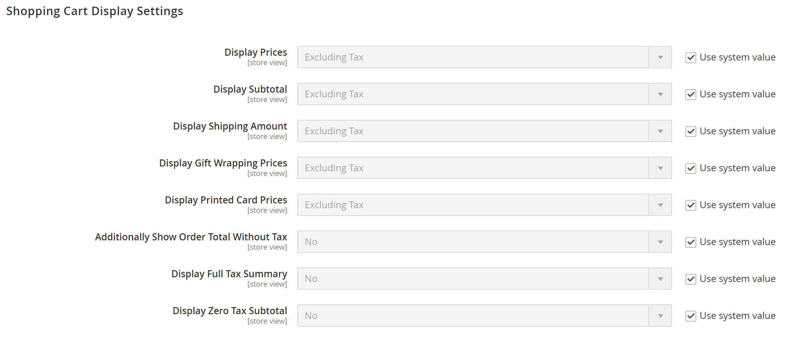

# 세금 구성 설정

다음 지침은 Commerce 인스턴스에 대한 기본 세금 구성을 안내합니다. 세금을 설정하기 전에 [locale](store-localize.md#step-3-change-the-locale-of-the-store-view)의 세금 요구 사항을 잘 알고 있는지 확인하십시오. 그런 다음 요구 사항에 따라 세금 구성을 완료합니다.

비즈니스 _알고 있어야 함_&#x200B;에 따라 관리자 [권한](../systems/permissions.md)을(를) 설정하여 세금 리소스에 [액세스](../systems/permissions-user-roles.md)을(를) 제한할 수 있습니다. 세금 설정에 액세스할 수 있는 관리자 역할을 생성하려면 판매/세금 및 시스템/세금 리소스를 모두 선택합니다. 기본 출하 출처와 다른 지역에 대한 웹 사이트를 설정하는 경우, 역할에 대한 시스템/출하 자원에 대한 액세스도 허용해야 합니다. 배송 설정에 따라 카탈로그 가격에 사용되는 스토어 세율이 결정됩니다.

## 일반 세금 설정 구성

1. _관리자_ 사이드바에서 **[!UICONTROL Stores]** > _[!UICONTROL Settings]_>**[!UICONTROL Configuration]**(으)로 이동합니다.

1. 다중 사이트 구성의 경우 **[!UICONTROL Store View]**&#x200B;을(를) 구성 대상인 웹 사이트 및 저장소에 설정합니다.

1. 왼쪽 패널에서 **[!UICONTROL Sales]**&#x200B;을(를) 확장하고 **[!UICONTROL Tax]**&#x200B;을(를) 선택합니다.

1. 다음 구성 설정을 완료합니다.

   필요한 경우 흐리게 표시된 설정의 **[!UICONTROL Use system value]** 확인란 선택을 취소하십시오.

### [!UICONTROL Tax Classes]

1. **[!UICONTROL Tax Classes]** 섹션에서 를 확장합니다.

   {width="600" zoomable="yes"}

   - **배송에 대한 세금 클래스** — 적절한 클래스로 설정합니다. 기본 클래스는 `None` 및 `Taxable Goods`입니다.
   - **선물 옵션에 대한 세금 클래스** — (Adobe Commerce만 해당) 적절한 클래스로 설정합니다. 기본 클래스는 `None` 및 `Taxable Goods`입니다.
   - **제품에 대한 기본 세금 클래스** — 적절한 클래스로 설정합니다. 기본 클래스는 `None` 및 `Taxable Goods`입니다.
   - **고객의 기본 세금 클래스** — 적절한 클래스로 설정합니다. 기본 클래스는 `Retail Customer` 및 `Wholesale Customer`입니다.

1. 완료되면 **[!UICONTROL Save Config]**&#x200B;을(를) 클릭합니다.

### [!UICONTROL Calculation Settings]

1. **[!UICONTROL Calculation Settings]** 섹션을 확장합니다.

   {width="600" zoomable="yes"}

1. **[!UICONTROL Tax Calculation Method Based On]**&#x200B;을(를) 다음 중 하나로 설정합니다.

   - `Unit Price` - 각 제품의 가격
   - `Row Total` - 주문의 라인 항목 합계, 할인 감소
   - `Total` - 주문 총계

1. **[!UICONTROL Tax Calculation Based On]**&#x200B;을(를) 다음 중 하나로 설정합니다.

   - `Shipping Address` - 주문을 배송할 주소
   - `Billing Address` - 고객 또는 회사의 청구 주소
   - `Shipping Origin` - 스토어의 [원본 지점](shipping-settings.md#point-of-origin)(으)로 지정된 주소

1. **[!UICONTROL Catalog Prices]**&#x200B;을(를) `Excluding Tax` 또는 `Including Tax`(으)로 설정합니다.

1. **[!UICONTROL Shipping Prices]**&#x200B;을(를) `Excluding Tax` 또는 `Including Tax`(으)로 설정합니다.

1. **[!UICONTROL Apply Customer Tax]**&#x200B;을(를) 다음 중 하나로 설정하여 세금이 원래 가격에 적용되는지 또는 할인된 가격에 적용되는지 여부를 결정합니다. `After Discount` 또는 `Before Discount`

1. **[!UICONTROL Apply Discount on Prices]**&#x200B;을(를) 다음 중 하나로 설정하여 할인에 세금이 포함되는지 또는 제외되는지 확인합니다. `Excluding Tax` 또는 `Including Tax`

1. **[!UICONTROL Apply Tax On]**&#x200B;을(를) `Custom price if available` 또는 `Original price only`(으)로 설정합니다.

1. **[!UICONTROL Enable Cross-Border Trade]**&#x200B;을(를) 다음 중 하나로 설정합니다.

   - `Yes` - 다양한 세율에서 일관된 가격을 사용합니다. 카탈로그 가격에 세금이 포함된 경우 이 설정을 선택하여 고객의 세율에 관계없이 가격을 고정합니다.
   - `No` - 세율에 따라 가격을 변경합니다.

   >[!IMPORTANT]
   >
   >[국경 간 무역](#cross-border-price-consistency)을 사용할 수 있는 경우 세율별로 이익 마진이 변경됩니다. 이익은 수식(`Revenue - CustomerVAT - CostOfGoodsSold`)에 의해 결정됩니다. 국경을 초월한 무역을 가능하게 하려면 가격에 세금이 포함되도록 설정해야 한다.

### [!UICONTROL Default Tax Destination Calculation]

1. **[!UICONTROL Default Tax Destination Calculation]** 섹션에서 를 확장합니다.

   {width="600" zoomable="yes"}

1. 세금 계산에 사용할 **[!UICONTROL Default Country]**&#x200B;을(를) 지정하십시오.

1. 해당하는 경우 세금 계산에 사용할 **[!UICONTROL Default State]**&#x200B;을(를) 지정하십시오.

1. 해당하는 경우 세금 계산에 사용할 **[!UICONTROL Default Post Code]**&#x200B;을(를) 지정하십시오.

1. 완료되면 **[!UICONTROL Save Config]**&#x200B;을(를) 클릭합니다.

### [!UICONTROL Price Display Settings]

>[!IMPORTANT]
>
>세금 포함 및 제외가 모두 포함된 가격 표시와 관련된 일부 설정 조합은 고객에게 혼란을 줄 수 있습니다. 경고 메시지가 트리거되지 않도록 하려면 [권장 설정](taxes.md#warning-messages)을 참조하세요.

1. **[!UICONTROL Price Display Settings]** 섹션에서 를 확장합니다.

   {width="600" zoomable="yes"}

1. **[!UICONTROL Display Product Prices in Catalog]**&#x200B;을(를) 다음 중 하나로 설정합니다.

   - `Excluding Tax` - 상점에 표시되는 카탈로그 가격에 세금이 포함되지 않습니다.
   - `Including Tax` - 상점의 카탈로그 가격에는 세금 규칙이 세금 원본과 일치하거나 고객 주소가 세금 규칙과 일치하는 경우에만 세금이 포함됩니다. 이 문제는 고객이 계정을 만들거나, 로그인하거나, 장바구니에서 세금 및 배송 예상 도구를 사용한 후에 발생할 수 있습니다.
   - `Including and Excluding Tax` - 상점 앞에 표시되는 카탈로그 가격이 세금 포함 여부와 관계없이 표시됩니다.

1. **[!UICONTROL Display Shipping Prices]**&#x200B;을(를) `Excluding Tax`, `Including Tax` 또는 `Including and Excluding Tax`(으)로 설정합니다.

1. 완료되면 **[!UICONTROL Save Config]**&#x200B;을(를) 클릭합니다.

### [!UICONTROL Shopping Cart Display Settings]

1. **[!UICONTROL Shopping Cart Display Settings]** 섹션에서 를 확장합니다.

   {width="600" zoomable="yes"}

1. 다음 각 설정에 대해 상점 및 로케일의 요구 사항에 따라 장바구니에 세금 및 가격을 표시할 방법을 선택합니다.

   - **[!UICONTROL Display Prices]**&#x200B;을(를) `Excluding Tax`, `Including Tax` 또는 `Including and Excluding Tax`(으)로 설정합니다.

   - **[!UICONTROL Display Subtotal]**&#x200B;을(를) `Excluding Tax`, `Including Tax` 또는 `Including and Excluding Tax`(으)로 설정합니다.

   - **[!UICONTROL Display Shipping Amount]**&#x200B;을(를) `Excluding Tax`, `Including Tax` 또는 `Including and Excluding Tax`(으)로 설정합니다.

   - (Adobe Commerce만 해당) **[!UICONTROL Display Gift Wrapping Prices]**&#x200B;을(를) `Excluding Tax`, `Including Tax` 또는 `Including and Excluding Tax`(으)로 설정합니다.

   - (Adobe Commerce만 해당) **[!UICONTROL Display Printed Card Prices]**&#x200B;을(를) `Excluding Tax`, `Including Tax` 또는 `Including and Excluding Tax`(으)로 설정합니다.

1. 필요에 따라 다음 표시 옵션을 `Yes` 또는 `No`(으)로 설정합니다.

   - **[!UICONTROL Include Tax in Order Total]**
   - **[!UICONTROL Display Full Tax Summary]**
   - **[!UICONTROL Display Zero Tax Subtotal]**

1. 완료되면 **[!UICONTROL Save Config]**&#x200B;을(를) 클릭합니다.

### [!UICONTROL Orders, Invoices, Credit Memos Display Settings]

1. **[!UICONTROL Orders, Invoices, Credit Memos Display Settings]** 섹션을 합니다.

   {width="600" zoomable="yes"}

1. 주문, 송장 및 대변 메모에 가격 및 세금이 표시되는 방식을 지정합니다.

   - **[!UICONTROL Display Prices]**&#x200B;을(를) `Excluding Tax`, `Including Tax` 또는 `Including and Excluding Tax`(으)로 설정합니다.

   - **[!UICONTROL Display Subtotal]**&#x200B;을(를) `Excluding Tax`, `Including Tax` 또는 `Including and Excluding Tax`(으)로 설정합니다.

   - **[!UICONTROL Display Shipping Amount]**&#x200B;을(를) `Excluding Tax`, `Including Tax` 또는 `Including and Excluding Tax`(으)로 설정합니다.

   - (Adobe Commerce만 해당) **[!UICONTROL Display Gift Wrapping Prices]**&#x200B;을(를) `Excluding Tax`, `Including Tax` 또는 `Including and Excluding Tax`(으)로 설정합니다.

   - (Adobe Commerce만 해당) **[!UICONTROL Display Printed Card Prices]**&#x200B;을(를) `Excluding Tax`, `Including Tax` 또는 `Including and Excluding Tax`(으)로 설정합니다.

1. 요구 사항에 따라 다음 표시 옵션을 `Yes` 또는 `No`(으)로 설정하십시오.

   - **[!UICONTROL Include Tax in Order Total]**
   - **[!UICONTROL Display Full Tax Summary]**
   - **[!UICONTROL Display Zero Tax Subtotal]**

1. 완료되면 **[!UICONTROL Save Config]**&#x200B;을(를) 클릭합니다.

### [!UICONTROL Fixed Product Taxes]

1. **[!UICONTROL Fixed Product Taxes]** 섹션에서 를 확장합니다.

   {width="600" zoomable="yes"}

1. 요구 사항에 따라 **[!UICONTROL Enable FPT]**&#x200B;을(를) `Yes` 또는 `No`(으)로 설정하십시오.

1. FPT가 활성화된 경우 FPT 표시 옵션을 지정합니다.

   - **[!UICONTROL Display Prices in Product Lists]**
   - **[!UICONTROL Display Price On Product view Page]**
   - **[!UICONTROL Display Prices in Sales Modules]**
   - **[!UICONTROL Display Prices in Emails]**

   - `Including FPT Only` - 표시된 가격에는 고정 제품 세금이 포함됩니다. FPT 금액은 별도로 표시되지 않습니다.
   - `Including FPT and FPT description` - 표시된 가격에는 고정 제품 세금이 포함됩니다. FPT 금액이 별도로 표시됩니다.
   - `Excluding FPT. Including FPT description and final price` - 표시된 가격에는 고정 제품 세금이 포함되지 않습니다. FPT 금액이 별도로 표시됩니다.
   - `Excluding FPT` - 표시된 가격에는 고정 제품 세금이 포함되지 않습니다. FPT 금액은 별도로 표시되지 않습니다.

1. 요구 사항에 따라 **[!UICONTROL Apply Discounts to FPT]**&#x200B;을(를) `Yes` 또는 `No`(으)로 설정합니다.

1. FPT 계산 방법을 결정하려면 **[!UICONTROL FPT Tax Configuration]**&#x200B;을(를) 설정하십시오.

   - `Not Taxed` - 과세 관할 구역에서 FPT에 대해 과세하지 않는 경우 이 옵션을 선택합니다. (예: 캘리포니아)
   - `Taxed` - 과세 관할 구역에서 FPT에 대해 세금을 부과하는 경우 이 옵션을 선택합니다. (예: 캐나다)
   - `Loaded and Displayed with Tax` - 세금을 적용하기 전에 주문 총계에 FPT가 추가되면 이 옵션을 클릭합니다. (예: EU 국가)

1. 요구 사항에 따라 **[!UICONTROL Include FPT in Subtotal]**&#x200B;을(를) `Yes` 또는 `No`(으)로 설정합니다.

1. 완료되면 **[!UICONTROL Save Config]**&#x200B;을(를) 클릭합니다.

## 국외 가격 일관성

국경 간 무역(가격 일관성이라고도 함)은 매장세율과 다른 세율을 적용하는 고객에 대해 일관된 가격을 유지하고자 하는 유럽연합(EU)과 기타 가맹점을 지원한다.

지역과 지역을 넘나들며 영업하는 상인들은 상품의 가격에 세금을 포함하여 하나의 가격을 표시할 수 있다. 가격책정은 국가마다 다른 세금 구조와 요율에 관계없이 깨끗하고 복잡하지 않습니다. 이러한 설정을 사용하려면 [Marketplace](../getting-started/commerce-marketplace.md)에서 세금 계산 확장을 설치해야 합니다(예: _Vertex Cloud_).

>[!NOTE]
>
>국경 간 무역이 활성화되면 세율에 따라 이익률이 변경됩니다. 이윤은 다음 수식에 의해 결정됩니다.  
>`Revenue - CustomerVAT - CostOfGoodsSold`

**_국외 가격 일관성을 사용하려면:_**

1. _관리자_ 사이드바에서 **[!UICONTROL Stores]** > _[!UICONTROL Settings]_>**[!UICONTROL Configuration]**(으)로 이동합니다.

1. 다중 사이트 구성의 경우 **[!UICONTROL Store View]**&#x200B;을(를) 구성 대상인 웹 사이트 및 저장소에 설정합니다.

1. 왼쪽 패널에서 **[!UICONTROL Sales]**&#x200B;을(를) 확장하고 **[!UICONTROL Tax]**&#x200B;을(를) 선택합니다.

1. **[!UICONTROL Calculation Settings]** 섹션에서 를 확장합니다.

1. **[!UICONTROL Catalog Prices]**&#x200B;을(를) `Including Tax`(으)로 설정합니다.

1. 국외 가격 일관성을 사용하려면 **[!UICONTROL Enable Cross Border Trade]**&#x200B;을(를) `Yes`(으)로 설정하십시오.

   {width="600" zoomable="yes"}

1. 완료되면 **[!UICONTROL Save Config]**&#x200B;을(를) 클릭합니다.
