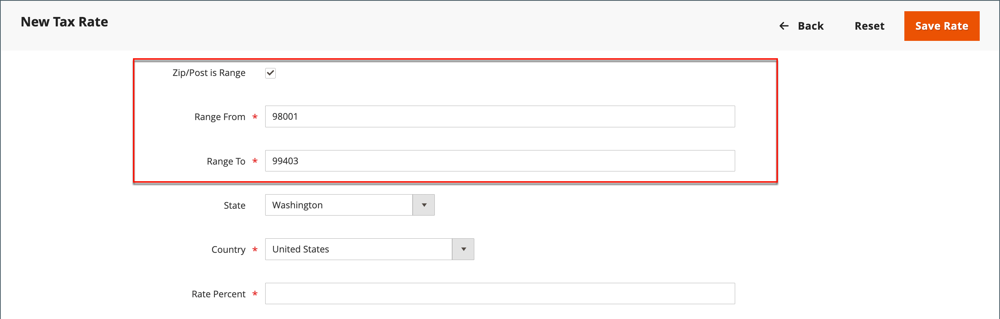

# 조세 구역 및 세율

세율은 일반적으로 특정 지리적 지역 내에서 이루어지는 거래에 적용된다. _조세 구역 및 세율_ 도구를 사용하여 세금을 징수하고 송금하는 각 지역에 대한 세율을 지정합니다. 각 조세 구역 및 세율에는 고유 식별자가 있으므로 주어진 지리적 영역(예: 음식이나 의약품에 과세하지 않지만 다른 품목에 과세하는 장소)에 대해 여러 세율을 가질 수 있습니다.

상점세는 상점의 주소를 기준으로 계산됩니다. 주문에 대한 실제 고객 세금은 고객이 주문 정보를 완료한 후에 계산됩니다. 그런 다음 Commerce은 매장의 세금 구성에 따라 세금을 계산합니다.

{width="600" zoomable="yes"}

## 새 세율 정의

1. _관리자_ 사이드바에서 **[!UICONTROL Stores]** > _[!UICONTROL Taxes]_>**[!UICONTROL Tax Zones and Rates]**(으)로 이동합니다.

1. 오른쪽 상단에서 **[!UICONTROL Add New Tax Rate]**&#x200B;을(를) 클릭합니다.

   {width="600" zoomable="yes"}

1. **[!UICONTROL Tax Identifier]** 입력.

1. 단일 우편 번호에 세율을 적용하려면 **[!UICONTROL Zip/Post Code]**&#x200B;의 코드를 입력하십시오.

   별표 와일드카드(`*`)를 사용하여 코드에서 최대 10개의 문자를 일치시킬 수 있습니다. 예를 들어 `90*`은(는) 90000부터 90999까지의 모든 ZIP 코드를 나타냅니다.

1. ZIP 또는 우편 번호 범위에 세율을 적용하려면 다음을 수행합니다.

   - **[!UICONTROL Zip/Post is Range]** 확인란을 선택하고 **[!UICONTROL Range From]** 및 **[!UICONTROL Range To]**&#x200B;의 첫 번째 및 마지막 우편 번호를 입력하여 범위를 정의합니다.

     {width="600" zoomable="yes"}

   - 세율이 적용되는 **[!UICONTROL State]**&#x200B;을(를) 선택합니다.

   - 세율이 적용되는 **[!UICONTROL Country]**&#x200B;을(를) 선택합니다.

   - 세율 계산에 사용되는 **[!UICONTROL Rate Percent]**&#x200B;을(를) 입력합니다.

1. 여러 스토어가 있는 경우 각 스토어 보기에 대해 **[!UICONTROL Tax Titles]**&#x200B;을(를) 설정할 수 있습니다.

   >[!NOTE]
   >
   >세금 식별자를 사용하려면 이 필드를 비워 둡니다.

1. 완료되면 **[!UICONTROL Save Rate]**&#x200B;을(를) 클릭합니다.

## 기존 세율 편집

1. _관리자_ 사이드바에서 **[!UICONTROL Stores]** > _[!UICONTROL Taxes]_>**[!UICONTROL Tax Zones and Rates]**(으)로 이동합니다.

1. _[!UICONTROL Tax Zones and Rates]_&#x200B;그리드에서 세율을 찾고 편집 모드에서 레코드를 엽니다.

   목록에 요금이 많으면 [필터 컨트롤](../getting-started/admin-grid-controls.md)을 사용하여 필요한 요금을 찾으십시오.

1. **[!UICONTROL Tax Rate Information]**&#x200B;을(를) 필요한 대로 변경합니다.

1. 필요에 따라 **[!UICONTROL Tax Titles]**&#x200B;을(를) 업데이트합니다.

1. 완료되면 **[!UICONTROL Save Rate]**&#x200B;을(를) 클릭합니다.

## 세율 삭제

1. _관리자_ 사이드바에서 **[!UICONTROL Stores]** > _[!UICONTROL Taxes]_>**[!UICONTROL Tax Zones and Rates]**(으)로 이동합니다.

1. 삭제할 세율을 찾아 편집 모드로 엽니다.

1. 메뉴 모음에서 **[!UICONTROL Delete Rate]**&#x200B;을(를) 클릭합니다.

1. 작업을 확인하려면 **[!UICONTROL OK]**&#x200B;을(를) 클릭합니다.
