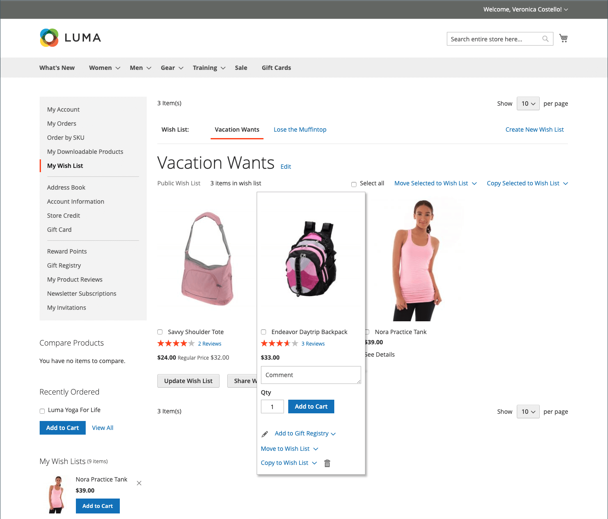
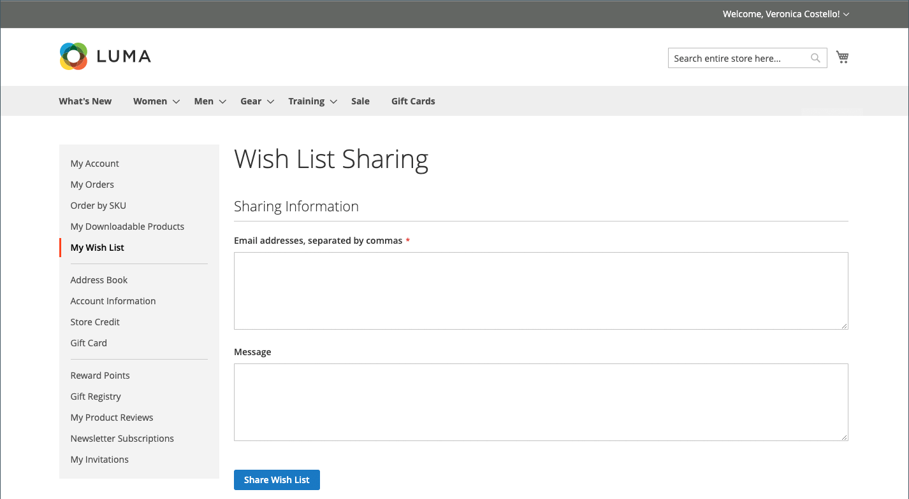

# 상점 환경 위시리스트

위시리스트는 고객이 좋아하지만 아직 구입할 준비가 되지 않은 제품을 리콜할 수 있는 편리한 방법입니다. 위시리스트의 항목을 다른 사람과 공유하거나 장바구니에 추가할 수 있습니다. 고객에게 여러 개의 위시리스트가 있는 경우 현재 위시리스트의 이름이 페이지 상단에 나타납니다. 고객은 계정 대시보드에서 위시리스트를 관리할 수 있습니다. 스토어 관리자는 고객이 관리자로부터 위시 목록을 관리하도록 지원할 수도 있습니다.

{width="700" zoomable="yes"}

 Adobe Commerce은 고객 계정당 여러 위시리스트 사용을 지원합니다.

 Magento Open Source 코드 베이스는 고객 계정당 단일 위시리스트 사용을 지원합니다.

## 위시리스트 만들기

 (Adobe Commerce 전용)

상점 첫 화면에서 고객은 계정 대시보드, 제품 페이지, 카탈로그 페이지 및 장바구니에서 위시리스트를 만들 수 있습니다.

### 방법 1: 고객 계정에서

1. 계정 대시보드의 사이드바에서 고객은 **[!UICONTROL My Wish List]**.

1. 오른쪽 상단에서 **[!UICONTROL Create New Wish List]**.

1. 위시리스트 이름을 입력합니다.

1. 다른 사용자가 자신의 위시리스트를 볼 수 있도록 하려면 다음을 선택합니다. **[!UICONTROL Public Wish List]** 확인란.

   >[!NOTE]
   >
   >의 주요 차이점 `Public` 및 `Private` 위시리스트는 개인 위시리스트가 아닌 것입니다. [검색 가능](wishlist-configuration.md#add-wish-list-search) 소원 목록을 통해.

1. 완료되면 다음을 클릭하십시오. **[!UICONTROL Save]**.

   {width="700" zoomable="yes"}

### 방법 2: 카탈로그 페이지에서

1. 상점 첫 화면에서 고객은 위시리스트에 추가할 제품이 포함된 카탈로그 페이지로 이동합니다.

1. 제품 위로 마우스를 가져갑니다.

1. 고객이 _위시리스트에 추가_ 아이콘을 클릭하고 **[!UICONTROL Create New Wish List]**.

1. 위시리스트 이름을 입력합니다.

1. 다른 사용자가 자신의 위시리스트를 볼 수 있도록 하려면 다음을 선택합니다. **[!UICONTROL Public Wish List]** 확인란.

1. 완료되면 클릭 수 **[!UICONTROL Save]**.

### 방법 3: 제품 세부 사항 페이지에서

1. 상점 첫 화면에서 고객은 위시리스트에 추가하려는 제품의 세부 정보 페이지로 이동합니다.

1. 옆에 있는 화살표를 클릭합니다. **[!UICONTROL Add to Wish List]** 및 선택 **[!UICONTROL Create New Wish List]**.

1. 다음을 입력합니다. **[!UICONTROL Wish List Name]**.

1. 다른 사용자가 자신의 위시리스트를 볼 수 있도록 하려면 다음을 선택합니다. **[!UICONTROL Public Wish List]** 확인란.

1. 완료되면 클릭 수 **[!UICONTROL Save]**.

   {width="700" zoomable="yes"}

### 방법 4: 장바구니에서

1. 고객이 다음을 엽니다. **[!UICONTROL Shopping Cart]** 페이지를 가리키도록 업데이트하는 중입니다.

1. 항목 아래에서 옆에 있는 화살표를 클릭합니다. **[!UICONTROL Move to Wishlist]** 및 선택 **[!UICONTROL Create New Wish List]**.

1. 다음을 입력합니다. **[!UICONTROL Wish List Name]**.

1. 다른 사용자가 자신의 위시리스트를 볼 수 있도록 하려면 다음을 선택합니다. **[!UICONTROL Public Wish List]** 확인란.

1. 완료되면 클릭 수 **[!UICONTROL Save]**.

{width="700" zoomable="yes"}

## 제품 목록 업데이트

1. 고객은 위시리스트에서 제품을 가리키며 옵션을 표시합니다.

1. 을(를) 추가하려면 **[!UICONTROL Comment]** 제품에 대해 가격 아래 상자에 텍스트를 입력합니다.

   {width="700" zoomable="yes"}

1. 제품 옵션 선택을 변경하려면 **[!UICONTROL Edit]** 및 은 다음을 수행합니다.

   - 제품 세부 사항 페이지의 옵션을 업데이트합니다.
   - 클릭수 **[!UICONTROL Update Wish List]**.

## 장바구니에 위시리스트 제품 추가

1. 위시리스트에서 고객이 추가하려는 제품을 가리킵니다.

1. 업데이트 **[!UICONTROL Qty]** 필요에 따라 다른 옵션을 편집합니다.

1. 클릭수 **[!UICONTROL Add to Cart]**.

## 위시리스트 공유

1. 고객이 클릭 **[!UICONTROL Share Wishlist]**.

1. 위시리스트를 받을 각 사람의 이메일 주소를 쉼표로 구분하여 입력합니다.

1. 를 추가합니다. **[!UICONTROL Message]** 이메일에 포함될 예정입니다.

1. 클릭수 **[!UICONTROL Share Wish List]**.

   {width="700" zoomable="yes"}

   메시지가 기본에서 전송됩니다. [저장소 연락처](../getting-started/store-details.md#store-email-addresses) 각 제품의 썸네일 이미지와 스토어 링크가 포함되어 있습니다.

   {width="500" zoomable="yes"}

## 위시리스트 편집

고객은 계정 대시보드에서 다양한 방법으로 위시리스트를 수정할 수 있습니다.

### 항목을 다른 목록으로 이동

 (Adobe Commerce 전용)

1. 고객은 이동할 각 항목의 확인란을 선택합니다.

1. 클릭수 **[!UICONTROL Move Selected to Wish List]** 및 은 다음 중 하나를 수행합니다.

   - 기존 위시리스트를 선택합니다.
   - 클릭수 **[!UICONTROL Create New Wish List]**.

### 다른 목록에 항목 복사

 (Adobe Commerce 전용)

1. 이동할 각 항목의 확인란을 선택합니다.

1. 클릭수 **[!UICONTROL Copy Selected to Wish List]** 및 은 다음 중 하나를 수행합니다.

   - 기존 위시리스트를 선택합니다.
   - 클릭수 **[!UICONTROL Create New Wish List]**.

## 위시리스트 삭제

 (Adobe Commerce 전용)

1. 고객이 삭제할 위시리스트를 엽니다.

1. 클릭수 **[!UICONTROL Delete Wish List]**.

1. 확인 메시지가 표시되면 **[!UICONTROL OK]**.

>[!IMPORTANT]
>
>이 작업은 취소할 수 없습니다.

## 위시리스트 항목을 장바구니에 전송

모든 위시리스트 항목을 장바구니에 이전하려면 고객이 클릭 **[!UICONTROL Add All to Cart]**.

단일 품목을 추가하기 위해 고객은 다음을 수행합니다.

1. 항목을 마우스로 가리킨 다음 **[!UICONTROL Qty]** 장바구니에 추가하려는 경우.

1. 클릭수 **[!UICONTROL Add to Cart]**.

## 고객 위시리스트 찾기

다음과 같은 경우 [위시리스트 검색 위젯](wishlist-configuration.md#add-wish-list-search) 스토어 페이지에 포함된 에서 고객은 위시리스트 소유자의 이름이나 이메일 주소로 검색할 수 있습니다.

1. 위시리스트 검색 위젯에서 고객은 검색 옵션을 선택한다.

1. 위시리스트 소유자 이름 또는 이메일 주소를 입력하고 클릭 수 **[!UICONTROL Search]**.

   다음 _위시리스트 검색_ 페이지가 열리고 일치하는 모든 위시리스트가 검색 결과 섹션에 표시됩니다.

   >[!NOTE]
   >
   >공개 위시리스트만 검색 결과에 표시되며 고객의 비공개 위시리스트는 공개적으로 볼 수 없습니다.

1. 위시리스트 항목 목록을 보려면 **[!UICONTROL View]**.

   각 위시리스트에 대한 소유자 이름 및 마지막 업데이트 날짜가 표시됩니다.

1. 장바구니에 제품을 추가하려면 고객은 제품 아래의 확인란을 선택하고 을 클릭합니다 **[!UICONTROL Add to Cart]**.

   다른 고객의 위시리스트에서 원하는 항목을 자신의 위시리스트에 추가할 수도 있습니다.
