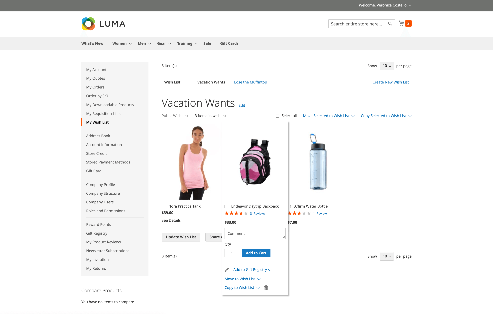

# 위시리스트

위시리스트는 등록된 고객이 친구와 공유하거나 나중에 장바구니로 전송하기 위해 저장할 수 있는 제품 목록입니다. 위시리스트를 활성화하면 스토어에 있는 각 제품의 범주 및 제품 페이지에 위시리스트에 추가 링크가 나타납니다. 테마에 따라 텍스트 링크 또는 그래픽 이미지일 수 있습니다.

 Adobe Commerce은 고객 계정당 여러 개의 위시리스트 사용을 지원합니다.

 Magento Open Source에서는 고객 계정당 하나의 위시리스트 사용을 지원합니다.

공유 위시 목록은 스토어 이메일 주소에서 전송되지만, 메시지 본문에는 고객의 개인화된 메모가 포함됩니다. 위시리스트를 공유할 때 사용되는 이메일 템플릿을 사용자 정의하고 발신자로 표시되는 스토어 연락처를 선택할 수 있습니다.

[고객 계정](../customers/account-dashboard.md)의 대시보드에서 희망 목록을 업데이트할 수 있습니다. 고객은 또는 스토어 관리자가 위시리스트와 장바구니 사이에 항목을 추가하거나 전송할 수 있습니다.

{width="700" zoomable="yes"}

여러 옵션이 있는 제품을 위시리스트에 추가하면 고객이 선택한 모든 옵션이 위시리스트 항목 설명에 포함됩니다. 예를 들어 고객이 세 가지 색상으로 동일한 신발 쌍을 추가하면 각 쌍이 별도의 위시리스트 항목으로 나타납니다. 그러나 고객이 동일한 제품을 위시리스트에 여러 번 추가하면 제품은 한 번만 표시되지만 제품 페이지에서 수량이 선택되어 있습니다.

## 관리자의 위시리스트 지원

고객은 상점의 계정에 로그인하여 [위시리스트를 관리](wishlist-storefront.md)할 수 있습니다. 스토어 관리자는 관리자로부터 고객 위시 목록을 관리할 수도 있습니다.

**_관리자로부터 위시리스트 항목을 업데이트하려면:_**

1. _관리자_ 사이드바에서 **[!UICONTROL Customers]** > **[!UICONTROL All Customers]**(으)로 이동합니다.

1. 목록에서 고객을 찾고 _[!UICONTROL Action]_열에서&#x200B;**[!UICONTROL Edit]**을(를) 클릭합니다.

1. 왼쪽 패널에서 **[!UICONTROL Wish List]**&#x200B;을(를) 선택하고 목록에서 편집할 항목을 찾습니다.

   제품에 대해 선택한 모든 옵션이 제품 이름 아래에 나타납니다.

   {width="600" zoomable="yes"}

1. 제품 옵션을 편집하려면 다음 작업을 수행하십시오.

   - **[!UICONTROL Action]** 열에서 **[!UICONTROL Configure]**&#x200B;을(를) 클릭합니다.

   - 제품 페이지에서 필요에 따라 옵션 및 **[!UICONTROL Quantity]**&#x200B;을(를) 업데이트합니다.

   - **[!UICONTROL OK]**&#x200B;을(를) 클릭합니다.

1. 완료되면 **[!UICONTROL Save Customer]** 또는 **[!UICONTROL Save and Continue Edit]**&#x200B;을(를) 클릭합니다.
