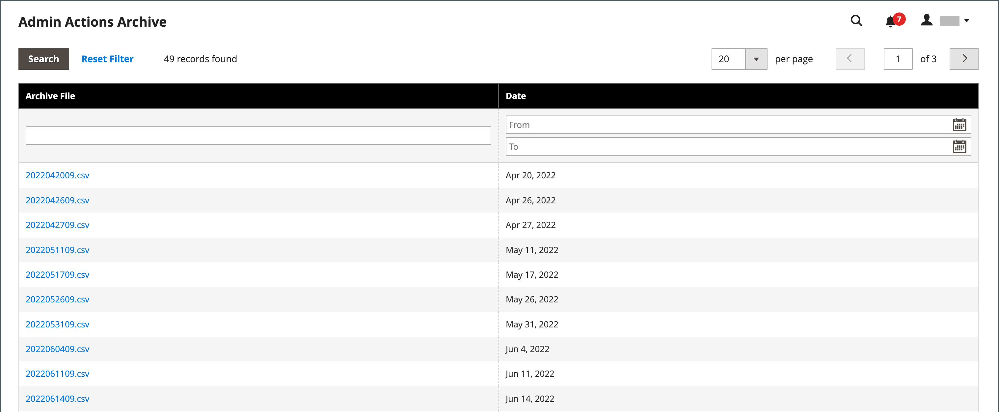

# 작업 로그 아카이브

{{ee-feature}}

관리 [작업](action-log.md) 보관 파일에 서버에 저장된 CSV 로그 파일이 나열됩니다. 구성에서는 로그 항목이 저장되는 기간 및 아카이브되는 빈도를 지정할 수 있습니다. 기본적으로 파일 이름에는 현재 날짜가 ISO 형식으로 포함되어 있습니다.  `yyyyMMddHH`

>[!NOTE]
>
>로그 보관을 사용하려면 [cron 작업](cron.md)을 설정해야 합니다.

## 로그 아카이브 구성

1. _관리자_ 사이드바에서 **[!UICONTROL Stores]** > _[!UICONTROL Settings]_>**[!UICONTROL Configuration]**(으)로 이동합니다.

1. 왼쪽 패널에서 **[!UICONTROL Advanced]**&#x200B;을(를) 확장하고 **[!UICONTROL System]**&#x200B;을(를) 선택합니다.

1. **[!UICONTROL Admin Actions Log Archiving]** 섹션에서 를 확장하고 다음 옵션을 설정합니다.

   - **[!UICONTROL Log Entry Lifetime, Days]** — 로그 항목을 제거하기 전에 데이터베이스에 보관할 일 수를 입력합니다.
   - **[!UICONTROL Log Archiving Frequency]** — `Daily`, `Weekly` 또는 `Monthly`(으)로 설정합니다.

   {width="600" zoomable="yes"}

   구성 설정의 자세한 목록을 보려면 _구성 참조_&#x200B;에서 [관리 작업 로그 보관](../configuration-reference/advanced/system.md)을 참조하십시오.

1. 완료되면 **[!UICONTROL Save Config]**&#x200B;을(를) 클릭합니다.

## 아카이브 보기

_관리자_ 사이드바에서 **[!UICONTROL System]** > _[!UICONTROL Actions Logs]_>**[!UICONTROL Archive]**(으)로 이동합니다.

{width="600" zoomable="yes"}
