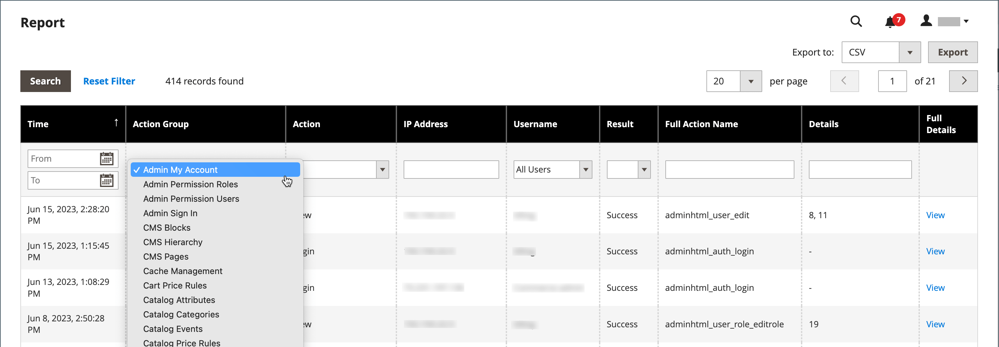

# 작업 로그 보고서

{{ee-feature}}

다음 _작업 로그_ 보고서는 로깅이 활성화된 모든 관리 작업에 대한 세부 레코드를 표시합니다. 각 레코드에는 타임스탬프가 지정되며 사용자의 IP 주소와 이름을 기록합니다. 로그 세부 사항에는 작업 중에 수행된 관리 사용자 데이터 및 관련 변경 사항이 포함됩니다.

보고서에 표시할 작업은 [관리자 작업 로깅](action-log.md) 스토어 설정의 화면입니다. 작업 유형을 선택(활성화)하면 이러한 유형의 관리 작업이 작업 로그 보고서에 표시됩니다.

보고서는 각 열의 옵션을 사용하여 필터링할 수 있습니다. 특정 작업을 나열하도록 보고서 범위를 좁히려면 단일 필터 옵션을 설정하거나 여러 열에 대한 필터 옵션을 설정할 수 있습니다. 보고서 데이터를 CSV 또는 Excel XML 형식으로 내보낼 수도 있습니다.

작업 로그 보고서에는 다음 정보가 포함됩니다.

- **[!UICONTROL Time]** - 작업이 발생한 날짜 및 시간
- **[!UICONTROL Action Group]** - 작업 유형을 표시하며, 에서 활성화된 작업과 상관 관계가 있습니다. _관리자 작업 로깅_ 스토어 설정의 화면
- **[!UICONTROL Action]** - 기록된 작업을 표시합니다.
- **[!UICONTROL IP Address]** - 작업이 수행된 컴퓨터의 IP 주소를 표시합니다.
- **[!UICONTROL Username]** - 작업을 수행한 사용자의 로그인 ID를 표시합니다
- **[!UICONTROL Result]** - 사용자 작업의 성공 또는 실패를 표시합니다.
- **[!UICONTROL Full Action Name]** - 백엔드 작업 이름을 표시합니다.
- **[!UICONTROL Details]** - 백엔드 작업 범주를 표시합니다.
- **[!UICONTROL Full Details]** - 관리 작업의 기록된 모든 세부 정보를 표시합니다.

## 작업 로그 보고서 보기

1. 다음에서 _관리자_ 사이드바, 이동 **[!UICONTROL System]** > _[!UICONTROL Actions Logs]_>**[!UICONTROL Report]**.

   {width="600" zoomable="yes"}

1. 나열된 관리 작업에 대한 전체 세부 정보를 보려면 **[!UICONTROL View]**.

   {width="600" zoomable="yes"}

## 작업 로그 보고서 필터링

필터 옵션 필드를 정의한 다음 **[!UICONTROL Search]** 을 클릭하여 표시되는 작업의 범위를 좁힐 수 있습니다.

필터 옵션을 지우고 전체 보고서로 돌아가려면 **[!UICONTROL Reset Filter]**.

{width="600" zoomable="yes"}

| 필드 | 설명 |
|--- |--- |
| [!UICONTROL Time] | 위치 **[!UICONTROL From]**&#x200B;를 클릭하고, 동적 달력에서 날짜를 선택하여 필터의 시작 날짜를 정의합니다. 위치 **[!UICONTROL To]**&#x200B;를 클릭하고 날짜를 선택하여 필터의 종료 날짜를 정의합니다. |
| [!UICONTROL Action Group] | 작업 그룹을 선택합니다. |
| [!UICONTROL Action] | 작업을 선택합니다. |
| [!UICONTROL IP Address] | 작업에 사용되는 컴퓨터의 IP 주소를 입력합니다. |
| [!UICONTROL Username] | 사용자 이름을 선택합니다. 기본값은 입니다 `All Users`. |
| [!UICONTROL Result] | 성공 또는 실패를 선택합니다. |
| [!UICONTROL Full Action Name] | 필드에 일치시킬 검색 텍스트를 입력합니다. |
| [!UICONTROL Details] | 필드에 일치시킬 검색 텍스트를 입력합니다. |

{style="table-layout:auto"}

## 작업 로그 보고서 내보내기

1. 대상 **[!UICONTROL Export to]**&#x200B;내보내기 형식을 선택합니다.

   - `CSV` - 일반 텍스트 데이터를 포함하는 쉼표로 구분된 값 파일
   - `Excel XML` - XML 기반의 스프레드시트 데이터 형식

1. 클릭 **[!UICONTROL Export]**.

   생성된 파일은 다운로드를 위해 지정된 폴더에 자동으로 저장됩니다.

   {width="200"}
