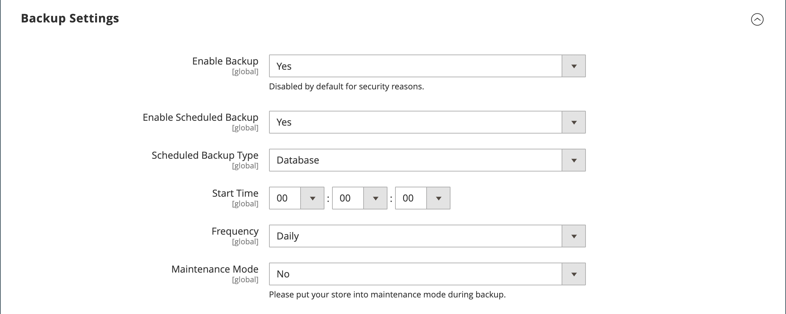

# 시스템 백업

Adobe Commerce 및 Magento Open Source을 사용하면 파일 시스템, 데이터베이스 및 미디어 파일과 같은 시스템의 여러 부분을 백업하고 자동으로 롤백할 수 있습니다. 각 백업에 대한 레코드가 _백업_ 페이지의 그리드에 나타납니다. 목록에서 레코드를 삭제하면 보관된 파일도 삭제됩니다. 데이터베이스 백업 파일은 GZ 형식을 사용하여 압축됩니다. 시스템 백업과 데이터베이스 및 미디어 백업의 경우 TGZ 형식이 사용됩니다. 확장 및 업데이트를 설치하기 전에 백업 도구에 대한 액세스를 제한하고 백업하는 것이 좋습니다.

- **백업 도구에 대한 액세스를 제한합니다.** 백업 및 롤백 리소스에 대해 [사용자 역할](permissions-user-roles.md)을(를) 구성하여 백업 및 롤백 관리 도구에 대한 액세스를 제한할 수 있습니다. 액세스를 제한하려면 해당 확인란을 선택하지 않은 상태로 둡니다. 리소스를 롤백하기 위한 액세스 권한을 부여하려면 백업 리소스에도 액세스 권한을 부여해야 합니다.

- **확장 및 업데이트를 설치하기 전에 백업하십시오.** 확장을 설치하거나 업데이트하기 전에 항상 백업을 수행하십시오.

{{$include /help/_includes/backups-note.md}}

## 백업 활성화 및 예약

1. _관리자_ 사이드바에서 **[!UICONTROL Stores]** > _[!UICONTROL Settings]_>**[!UICONTROL Configuration]**(으)로 이동합니다.

1. 왼쪽 패널에서 **[!UICONTROL Advanced]**&#x200B;을(를) 확장하고 **[!UICONTROL System]**&#x200B;을(를) 선택합니다.

1. 확장 선택기&#x200B;**[!UICONTROL Backup Settings]**&#x200B;을 확장합니다.

1. **[!UICONTROL Enabled Schedule Backup]**&#x200B;을(를) `Yes`(으)로 설정합니다.

1. 자동 손짓을 예약하려면 예약 옵션을 설정합니다.

   - **[!UICONTROL Enabled Schedule Backup]**&#x200B;을(를) `Yes`(으)로 설정합니다.
   - 예약된 간격으로 실행할 백업 유형으로 **[!UICONTROL Scheduled Backup Type]**&#x200B;을(를) 설정하십시오.
   - 백업 작업을 실행하려면 **[!UICONTROL Start Time]**&#x200B;을(를) 시간으로 설정하십시오.
   - **[!UICONTROL Frequency]**&#x200B;을(를) `Daily`, `Weekly` 또는 `Monthly`(으)로 설정합니다.
   - **[!UICONTROL Maintenance Mode]**&#x200B;을(를) `Yes`(으)로 설정합니다.

   {width="600" zoomable="yes"}

1. 완료되면 **[!UICONTROL Save Config]**&#x200B;을(를) 클릭합니다.

## 백업 만들기

1. _관리자_ 사이드바에서 **[!UICONTROL System]** > _[!UICONTROL Tools]_>**[!UICONTROL Backups]**(으)로 이동합니다.

1. 오른쪽 상단 모서리에서 작성할 백업 유형을 클릭합니다.

   - **[!UICONTROL System Backup]** - 데이터베이스 및 파일 시스템의 전체 백업을 만듭니다. 프로세스 중에 미디어 폴더를 백업에 포함하도록 선택할 수 있습니다.

   - **[!UICONTROL Database and Media Backup]** - 데이터베이스 및 미디어 폴더의 백업을 만듭니다.

   - **[!UICONTROL Database Backup]** - 데이터베이스의 백업을 만듭니다.

   {width="600" zoomable="yes"}

1. 백업 중에 저장소를 유지 관리 모드로 전환하려면 확인란을 선택합니다.

   백업이 완료되면 유지 관리 모드가 자동으로 꺼집니다.

1. 시스템 백업의 경우 미디어 폴더를 포함하려면 **[!UICONTROL Include Media folder to System Backup]** 확인란을 선택하십시오.

1. 메시지가 표시되면 작업을 확인합니다.

<!-- Last updated from includes: 2023-02-22 09:59:54 -->
