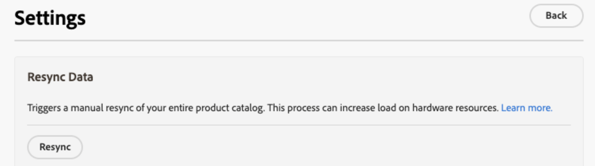

# 데이터 관리 대시보드

데이터 관리 대시보드는 Commerce 데이터베이스에서 Commerce SaaS 서비스로 전송되는 제품 데이터의 동기화 상태에 대한 개요를 제공합니다. 사용자는 제품 동기화 상태를 편리하게 모니터링하고 통합 대시보드에서 데이터 재동기화를 시작할 수 있습니다. 이 기능은 상점 데이터의 가용성에 대한 중요한 통찰력을 제공하여 구매자에게 즉시 표시되도록 합니다.

## 대상자

데이터 관리 대시보드는 을 사용하는 모든 Commerce 가맹점에서 추가 비용 없이 사용할 수 있습니다. [[!DNL Product Recommendations]](https://experienceleague.adobe.com/en/docs/commerce-merchant-services/product-recommendations/guide-overview), [[!DNL Live Search]](https://experienceleague.adobe.com/en/docs/commerce-merchant-services/live-search/guide-overview), 또는 [[!DNL Catalog Service]](https://experienceleague.adobe.com/en/docs/commerce-merchant-services/catalog-service/guide-overview) 활성 라이선스 포함.

데이터 관리 대시보드는 다음 위치에 있습니다. *시스템* > 데이터 전송 > *데이터 관리 대시보드*.

대시보드에는 다음 필드가 포함되어 있습니다.

| 필드 | 설명 |
|--- |--- |
| 범위 | 동기화된 데이터에 대한 특정 웹 사이트입니다. |
| [!DNL Product Recommendations] | 동기화 상태, 동기화된 제품 수 및 [표시 가능](https://experienceleague.adobe.com/en/docs/commerce-admin/config/catalog/inventory#stock-options) 에 대해 동기화된 제품 [!DNL Product Recommendations]. |
| [!DNL Live Search] | 동기화 상태, 동기화된 제품 수 및 [표시 가능](https://experienceleague.adobe.com/en/docs/commerce-admin/config/catalog/inventory#stock-options) 에 대해 동기화된 제품 [!DNL Live Search]. |
| [!DNL Catalog Service] | 동기화 상태, 동기화된 제품 수 및 동기화된 제품 테이블을 표시합니다. [!DNL Catalog Service]. |
| 설정 | 대화 상자를 열어 다음과 같은 작업을 수행할 수 있습니다 [카탈로그 데이터 수동 재동기화](#resync-catalog-data). |
| 동기화 상태 | 지난 3시간 내에 Commerce 데이터베이스에서 SaaS 서비스로 전송된 제품 수를 표시합니다. 카탈로그를 자주 업데이트하지 않는 경우 이 값은 0인 경우가 많습니다. 동기화가 진행 중이면 **[!UICONTROL Refresh]** 업데이트된 수를 가져오려면 . |
| 제품 수 | 서비스에 사용할 수 있는 총 카탈로그 제품 수를 반영합니다. 다음 [!DNL Product Recommendations] 및 [!DNL Live Search] 대시보드에 다음의 총 수가 표시됨 _표시 가능_ 제품. [!DNL Catalog Service] 은 표시 가능으로 제품을 필터링하지 않으므로 두 가지가 모두 있는 경우 [!DNL Catalog Service] 및 [!DNL Live Search] 또는 [!DNL Product Recommendations] 설치되면 두 대시보드에서 제품 수에 대한 두 개의 다른 값을 표시할 수 있습니다. |
| 동기화된 제품 | 핵심 Commerce 인덱스의 제품에 대한 세부 정보를 제공합니다. 기본적으로 이 테이블은 &#39;최근 업데이트&#39;별로 정렬됩니다. 특정 제품을 찾으려면 다음을 사용하십시오. **[!UICONTROL Search by SKU]** 필드. 표시할 열을 제어하려면 **[!UICONTROL Customize Table]** 테이블 오른쪽에 있습니다. |

## 데이터 관리 대시보드 사용

Commerce 데이터베이스에서 제품을 업데이트하면 시스템 구성에 따라 제품 데이터가 SaaS 서비스로 전송됩니다. 동기화 프로세스가 시작되면 **제품 수** SaaS 서비스로 전송된 제품 수를 나타냅니다.

>[!IMPORTANT]
>
>동기화를 완료하는 데 걸리는 시간은 카탈로그 크기 및 업데이트된 데이터의 볼륨에 따라 다릅니다.

처리된 제품 수가 업데이트된 제품 수와 일치하면 동기화가 완료되었음을 나타냅니다.

### 동기화된 제품 목록

동기화된 제품에 대한 세부 정보를 보려면 표에서 제품을 클릭합니다.

### 카탈로그 데이터 재동기화

Commerce SaaS 서비스가 항상 최신 제품 정보로 업데이트되도록 하려면 다음을 수행해야 합니다 [일정 구현](https://experienceleague.adobe.com/en/docs/commerce-operations/configuration-guide/cli/manage-indexers#reindex) 카탈로그 데이터를 동기화합니다.

할 수 있을 때 [수동 시작](#manually-resync-catalog) Commerce 데이터베이스에서 SaaS 서비스로 카탈로그 데이터를 재동기화하면 하드웨어 리소스의 로드를 늘릴 수 있으므로 권장되지 않습니다. 그러나 다음 시나리오에서는 카탈로그를 수동으로 다시 동기화해야 할 수 있습니다.

- 새 제품 추가, 제품 세부 사항 업데이트 또는 범주 수정과 같이 제품 카탈로그에 중요한 변경 사항이 적용될 때마다

- 상점에 제품 데이터를 표시할 때 불일치나 성능 문제가 발생하는 경우

- Commerce 데이터베이스와 SaaS 서비스 간의 통합에 대한 모든 업데이트 또는 변경 사항 준수

- 제품 데이터 관리 또는 동기화 프로세스에 영향을 주는 사용자 지정 또는 구성 배포 시

이러한 지침을 준수하고 필요에 따라 사전 예방적으로 카탈로그 데이터를 재동기화함으로써 Adobe Commerce 에코시스템 전반에서 데이터 일관성, 정확성 및 안정성을 유지할 수 있습니다.

#### 수동으로 카탈로그 재동기화

카탈로그 데이터를 다시 동기화해야 하는 경우 **[!UICONTROL Settings]** 페이지 오른쪽에 재동기화를 시작할 수 있는 대화 상자가 표시됩니다. 카탈로그 데이터를 다시 동기화하면 서비스가 Commerce 데이터베이스의 데이터를 SaaS 서비스로 다시 가져옵니다.

