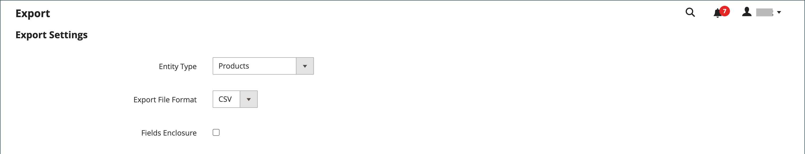

# 데이터 내보내기

데이터베이스의 구조에 익숙해지는 가장 좋은 방법은 데이터를 내보내고 스프레드시트로 여는 것입니다. 프로세스에 익숙해지면 대량의 정보를 효율적으로 관리할 수 있습니다.

등호, 보다 큼 및 보다 작음 기호, 작은따옴표와 큰따옴표, 백슬래시, 파이프 및 앰퍼샌드 기호와 같은 특수 문자는 데이터 전송 중에 문제를 일으킬 수 있습니다. 이러한 특수 문자가 올바르게 해석되도록 다음과 같이 표시할 수 있습니다. _이스케이프 시퀀스_. 예를 들어 데이터에 와 같은 텍스트 문자열이 포함된 경우 `code="str"`, `code="str2"`를 사용하여 텍스트를 큰 따옴표로 묶으면 원래 큰 따옴표가 데이터의 일부로 인식됩니다. `"code="str""`. 시스템에 큰따옴표 집합이 나타나면 큰따옴표 바깥쪽 집합이 실제 데이터를 둘러싸고 있음을 인식합니다.

데이터 내보내기는 작업이 완료될 때까지 기다리지 않고 관리자 작업을 계속할 수 있도록 백그라운드에서 실행되는 비동기 작업입니다. 작업이 완료되면 시스템이 메시지를 표시합니다.

## 내보내기 기준

내보내기 필터는 속성 값을 기반으로 내보내기 파일에 지정할 데이터를 지정하는 데 사용됩니다. 또한 내보내기에서 포함 또는 제외할 속성 데이터를 지정할 수 있습니다.

{width="600" zoomable="yes"}

### 필터 내보내기

필터를 사용하여 내보내기 파일에 포함된 SKU를 결정할 수 있습니다. 예를 들어 제조 국가 필터에 값을 입력하면 내보낸 CSV 파일에는 해당 국가에서 제조된 제품만 포함됩니다.

필터 유형은 데이터 유형에 해당합니다. 날짜 필드의 경우 달력에서 날짜를 선택할 수 있습니다 . 다음을 참조하십시오 [속성 입력 유형](../catalog/attributes-input-types.md) 추가 정보.

날짜 형식은 다음에 의해 결정됩니다. [로케일](../getting-started/store-details.md#locale-options).

SKU와 같이 특정 값이 있는 레코드만 포함하려면 필터 필드에 값을 입력합니다. 가격, 가중치 및 새 제품으로 설정 제품 과 같은 일부 필드에는 값 부터/까지 범위가 있습니다.

### 속성 제외

첫 번째 열의 확인란은 내보내기 파일에서 속성을 제외하는 데 사용됩니다. 속성이 제외되면 내보내기 데이터의 연결된 열이 포함되지만 비어 있습니다.

| 제외 | 필터 | 결과 |
|--- |--- |--- |
|  | 아니요 | 내보낸 파일에는 기존의 모든 레코드에 대한 각 속성이 포함되어 있습니다. |
|  | 예 | 내보내기 파일에는 필터에서 허용하는 레코드만 있는 각 속성이 포함되어 있습니다. |
|  | 아니요 | 내보내기 파일에는 제외된 속성에 대한 열이 포함되지 않고 기존의 모든 레코드가 포함됩니다. |
|  | 예 | 내보내기 파일에는 제외된 속성에 대한 열이 포함되지 않고 필터에서 허용하는 레코드만 포함됩니다. |

{style="table-layout:auto"}

## 데이터 내보내기

1. 다음에서 _관리자_ 사이드바, 이동 **[!UICONTROL System]** > _[!UICONTROL Data Transfer]_>**[!UICONTROL Export]**.

1. 다음에서 _내보내기 설정_ 섹션, 설정 **[!UICONTROL Entity Type]** 다음 중 하나를 수행합니다.

   - `Advanced Pricing`
   - `Products`
   - `Customer Finances`
   - `Customers Main File`
   - `Customer Addresses`
   - `Stock Sources`

   {width="600" zoomable="yes"}

1. 기본값 적용 **[!UICONTROL Export File Format]** CSV로 내보내기

1. 데이터에서 로 찾을 수 있는 특수 문자를 묶으려면 _이스케이프 시퀀스_&#x200B;를 선택하고 **[!UICONTROL Fields Enclosure]** 확인란.

1. 필요한 경우 엔티티 속성의 표시를 변경합니다.

   기본적으로 [엔티티 속성] 섹션에는 사용 가능한 모든 속성이 알파벳순으로 나열됩니다. 표준을 사용할 수 있습니다 [목록 컨트롤](../getting-started/admin-grid-controls.md) 특정 속성을 검색하고 목록을 정렬합니다. 검색 및 재설정 필터 컨트롤은 목록 표시를 제어하지만 내보내기 파일에 포함할 속성을 선택해도 영향을 미치지 않습니다.

   {width="600" zoomable="yes"}

1. 내보낸 데이터를 속성 값을 기준으로 필터링하려면 다음을 수행합니다.

   - 특정 속성 값이 있는 레코드만 내보내려면 **[!UICONTROL Filter]** 열. 다음 예제에서는 특정 SKU만 내보냅니다.

   - 내보내기에서 속성을 생략하려면 **[!UICONTROL Exclude]** 행의 시작 부분에 있는 확인란입니다. 예를 들어 만 내보내려면 `sku` 및 `image` 열을 선택하고 다른 모든 속성의 확인란을 선택합니다. 열은 내보내기 파일에 표시되지만 값은 표시되지 않습니다.

1. 아래로 스크롤하여 클릭 **[!UICONTROL Continue]** 페이지의 오른쪽 하단에 있습니다.

   작업이 완료되면 메시지 큐를 통해 파일이 처리됩니다(cron 작업이 실행 중인지 확인). 내보낸 파일은에 저장됩니다. `var/export/ folder`. 메시지 대기열에 대한 자세한 내용은 [메시지 대기열 관리](https://experienceleague.adobe.com/docs/commerce-operations/configuration-guide/message-queues/manage-message-queues.html) 다음에서 _구성 안내서_.

   내보낸 CSV 파일을 스프레드시트로 저장하거나 연 다음 데이터를 편집하고 다시 스토어로 가져올 수 있습니다.

   >[!NOTE]
   >
   >기본적으로 내보낸 모든 파일은 `<Magento-root-directory>/var/export` 폴더를 삭제합니다. 원격 스토리지 모듈이 활성화된 경우 내보낸 모든 파일은 `<remote-storage-root-directory>/import_export/export` 폴더를 삭제합니다.

## 리소스 문제 해결

데이터 내보내기 문제를 해결하는 데 대한 도움말을 보려면 다음 Commerce 지원 기술 문서를 참조하십시오.

- [내보낸 제품 .csv 파일이 표시되지 않음](https://experienceleague.adobe.com/docs/commerce-knowledge-base/kb/troubleshooting/miscellaneous/exported-products-.csv-file-does-not-appear.html)
- [제품 내보내기 파일이 관리자에 표시되지 않음](https://experienceleague.adobe.com/docs/commerce-knowledge-base/kb/support-tools/patches/v1-0-9/mdva-31168-magento-patch-product-export-file-does-not-show-in-admin.html)
- [주문을 CSV 형식으로 내보내는 중 문제 발생](https://experienceleague.adobe.com/docs/commerce-knowledge-base/kb/support-tools/patches/v1-0-8/mdva-31242-magento-patch-issue-in-exporting-orders-in-csv-format.html)
