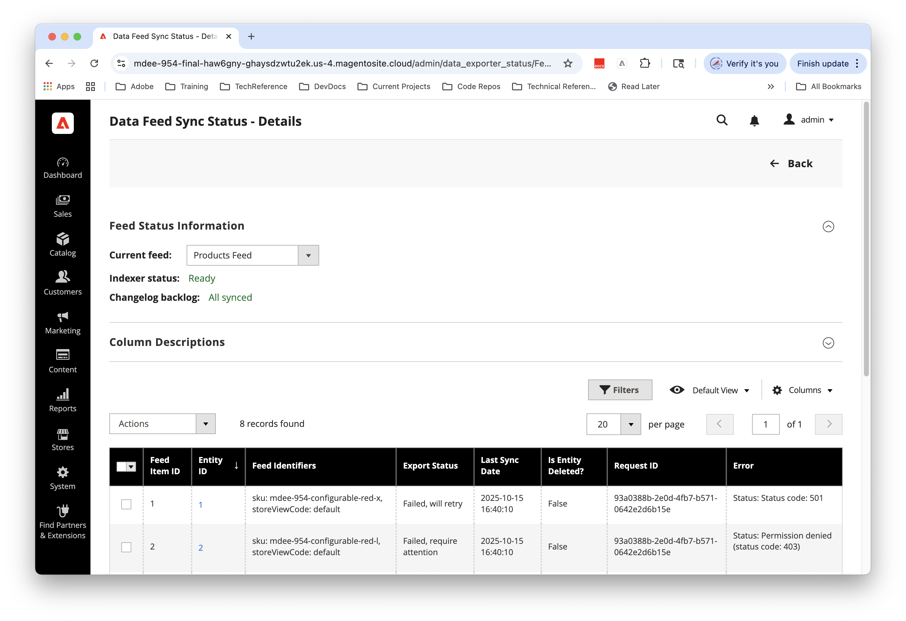

# 데이터 피드 동기화 상태 모니터링

[!UICONTROL Data Feed Sync Status] 페이지를 통해 Commerce 관리자는 관리 영역에서 제품 및 범주 데이터 피드에 대한 내보내기 상태를 모니터링할 수 있습니다.

## 대상자 및 가용성 {#audience}

데이터 피드 동기화 상태 페이지는 다음 서비스 중 하나에 대한 활성 라이선스를 가진 Commerce 판매자에게 추가 비용 없이 제공됩니다.

- [[!DNL Product Recommendations v6.0.0]](https://experienceleague.adobe.com/en/docs/commerce/product-recommendations/guide-overview)
- [[!DNL Live Search v4.1.0]](https://experienceleague.adobe.com/en/docs/commerce/live-search/overview)
- [[!DNL Catalog Service v1.17]](https://experienceleague.adobe.com/en/docs/commerce/catalog-service/guide-overview)
- [[!DNL Adobe Commerce Optimizer Connector]](https://experienceleague.adobe.com/en/docs/commerce/aco-optimizer-connector/overview)

데이터 피드 동기화 상태 페이지는 지원되는 Commerce 서비스 구성에서 자동으로 사용할 수 있습니다. Adobe Commerce 온 클라우드 인프라 및 온프레미스 배포에서 적격 서비스 또는 커넥터가 활성화된 후 페이지가 누락된 경우 아래의 수동 설치 지침을 따르십시오. 제품 관리 SaaS 경험에 Composer 설치 절차를 사용하지 마십시오.

## 동기화 상태 페이지에 액세스 {#access-data-feed-sync-status-page}

관리 영역에서 **[!UICONTROL System]** > **[!UICONTROL Data Transfer]** > **[!UICONTROL Data Feed Sync Status]**(으)로 이동합니다.

데이터 피드 내보내기 활동을 요약하는 {width="600" zoomable="yes"}

>[!NOTE]
>
> 이 페이지는 내보내기 상태만 보고합니다. 성공 상태는 데이터를 성공적으로 내보냈음을 의미합니다. 연결된 서비스에서 데이터를 사용할 수 있는지 여부는 확인되지 않습니다. 자세한 내용은 [연결된 서비스에서 데이터 확인](#confirm-data-in-connected-services)을 참조하십시오.

## 사용 가능한 내보내기 피드

데이터 동기화 상태 페이지에서 관리할 수 있는 사용 가능한 내보내기 피드 목록은 연결된 Commerce 서비스에 따라 다릅니다.

- **Commerce 서비스가 구성된 [!DNL Adobe Commerce on Cloud, On Premises, and Commerce as a Cloud Service]의 경우:** _SaaS 데이터 내보내기 안내서_&#x200B;에서 [지원되는 피드](https://experienceleague.adobe.com/en/docs/commerce/saas-data-export/reference/feed-table-reference#supported-feeds)를 참조하십시오.

- **[!DNL Adobe Commerce Optimizer Connector]:**(으)로 구성된 Adobe Commerce 온 클라우드 또는 온-프레미스 배포의 경우 _Adobe Commerce Optimizer Connector 안내서_&#x200B;에서 [지원되는 피드](https://experienceleague.adobe.com/en/docs/commerce/aco-optimizer-connector/reference/connector-reference#supported-feeds)를 참조하세요.


## 데이터 피드 동기화 상태 요약 {#data-feed-sync-status-summary}

요약 그리드에는 각 피드와 해당 내보내기 수가 나열됩니다.

| 필드 | 설명 |
| ----------------------------- | ---------------------------------------------------------------------------------------------------------------------------------------------------------------------------------------------------------------------------------------- |
| **피드 이름** | 엔터티 또는 엔터티 일부의 피드 인덱서(제품, 제품 가격)입니다. |
| **Source 레코드** | 동기화가 필요한 Commerce 레코드 수입니다. 피드 항목의 범위가 지정되기 때문에(예: 스토어 보기 코드) 관리 그리드 수를 초과할 수 있습니다. |
| **레코드를 보냈습니다** | Commerce에서 구성된 서비스 끝점으로 성공적으로 제출된 피드 항목 수입니다. 다운스트림 수집 또는 카탈로그 가용성을 확인하지 않습니다. 동기화 오류가 발생한 경우 이 숫자는 소스 레코드 수보다 작을 수 있습니다. |
| **실패한 레코드** | 연결된 Commerce 서비스로 전송되지 않은 레코드 수입니다. |
| **작업** | 피드에 대한 동기화 활동을 보려면 **[!UICONTROL Details]**&#x200B;을(를) 선택하십시오. |

## 데이터 피드 동기화 상태 세부 정보 {#data-feed-sync-status-details}

요약 페이지에서 피드 이름을 선택하거나 **[!UICONTROL Details]**&#x200B;을(를) 선택하여 각 피드 항목에 대한 내보내기 상태를 확인합니다.

{width="600" zoomable="yes"}

| 필드 | 설명 |
| ---------------------- | -------------------------------------------------------------------------------------------------------------------------------------------------------------------------------------------------- |
| **피드 항목 ID** | 시스템 용도로 사용되는 자동 생성된 식별자 |
| **엔터티 ID** | 소스 엔티티의 고유 식별자(제품 ID, 카테고리 ID 등) |
| **피드 식별자** | 피드 항목에 대한 고유 식별자. 예를 들어 제품 피드에 대한 SKU 및 스토어 보기 코드가 있습니다. 값은 피드에 따라 다릅니다. |
| **내보내기 상태** | 색상으로 구분된 표시기가 있는 피드 항목의 [동기화 상태](#export-status-types) |
| **마지막 동기화 날짜** | Commerce에서 가장 최근 내보내기 시도 또는 제출 날짜와 시간. 이 타임스탬프에서는 다운스트림 가용성을 확인하지 않습니다. |
| **엔티티가 삭제되었습니까?** | Adobe Commerce에서 엔티티가 삭제되었는지 여부를 나타냅니다. 삭제된 항목은 동기화에 실패한 경우에만 표시됩니다. |
| **요청 ID** | 동기화 요청에 대한 고유 ID. 엔티티 업데이트 문제를 해결할 때 지원 팀에 제공하십시오. |
| **오류** | 동기화 실패에 대한 자세한 오류 정보 |

다음 컨트롤을 사용하여 보기를 관리할 수 있습니다.

- [!UICONTROL Mass Action]: 선택한 피드 항목에 대한 재동기화를 예약합니다.
- [!UICONTROL Filters] 및 [!UICONTROL Columns]
- [!UICONTROL Default View]: 필터링된 보기를 만들고 저장하고 보기 간에 전환합니다.

### 피드 상태 표시기 {#feed-health-indicators}

| **표시기** | **설명** |
| ------------- | --------------- |
| 인덱서 상태 | <ul><li>**준비**: 인덱서가 최신 상태입니다. 색인 재지정이 필요하지 않습니다.</li><li>**다시 인덱싱해야 함**: Source 데이터가 변경되었습니다. 최근 변경 사항을 캡처하려면 색인 재지정을 실행하십시오.</li><li>**처리 중**: 인덱싱이 진행 중입니다.</li></ul> |
| 로그 백로그 변경 | <ul><li>**모두 동기화됨**: 처리 중인 보류 중인 변경 내용이 없습니다.</li><li>**백로그에 있는 항목**: 처리 대기 중인 보류 중인 변경 내용 수입니다. 1,000개가 넘는 항목의 백로그는 성능 문제를 나타낼 수 있습니다.</li></ul> |
| 인덱서 모드 | <ul><li>**일정 모드**(권장): 인덱서가 일정에 따라 실행되므로 데이터 손실 위험이 줄어듭니다.</li><li>**저장 시 업데이트**(실시간): 페이지에 경고로 표시됩니다. 실시간 모드는 예상되지 않으며 로드 중 데이터 손실 위험이 증가합니다.</li></ul> |

>[!TIP]
>
> 인덱스 처리에 대한 자세한 내용은 [인덱스 관리](index-management.md) 항목을 참조하십시오.

### 내보내기 상태 유형 {#export-status-types}

| **상태** | **설명** | **필요한 작업** |
| ----------------------------- | ------------------------------------------------------------ | ------------------------------------------------------------------ |
| **서비스에 제출됨** | 피드 항목이 다운스트림 처리를 위해 Commerce에서 제출되었습니다. | 없음 |
| **실패, 다시 시도** | 보내지 못했지만 시스템이 다시 보내려고 합니다. | 문제 해결 모니터링 |
| **실패, 주의 필요** | 애플리케이션 또는 데이터 오류로 인해 실패했습니다. | [!UICONTROL Error] 열에서 문제를 조사하고 해결합니다. |
| **제출 대기 중** | 변경 로그에서 변경 사항이 감지되었지만 아직 처리되지 않았습니다. | 정상 처리 상태 |

## 데이터 피드 상태 모니터링

Commerce 데이터베이스에서 제품 및 카테고리 관련 엔터티를 업데이트하면 피드 구성에 따라 데이터가 Commerce 서비스로 전송됩니다. [!UICONTROL Data Feed Sync Status] 요약 페이지에서 내보내기 활동 및 현재 상태를 모니터링할 수 있습니다.

>[!IMPORTANT]
>
> 데이터 동기화를 완료하는 데 걸리는 시간은 카탈로그 크기, 업데이트된 데이터의 볼륨 및 외부 서비스 성능에 따라 다릅니다.

성공적으로 전송된 카운트가 피드의 소스 카운트와 일치하고 제출 대기 중인 항목이 없거나 실패한 경우 Commerce은 해당 피드에 대한 내보내기를 완료했습니다. 적절한 대시보드를 사용하여 [다운스트림 가용성을 확인](#confirm-data-in-connected-services)하세요.

>[!NOTE]
>
> Adobe은 또한 개발자와 시스템 통합자가 동기화 작업을 관리하고 추적하는 데 사용할 수 있는 명령줄 인터페이스 도구와 시스템 로그를 제공합니다. 자세한 내용은 [SaaS 데이터 내보내기 안내서](https://experienceleague.adobe.com/en/docs/commerce/saas-data-export/overview)를 참조하십시오.

### 실패한 내보내기 관리 {#manage-failed-exports}

실패한 내보내기를 검토하고 재동기화 일정을 예약하려면 다음을 수행하십시오.

1. 요약 페이지에서 실패한 레코드가 있는 피드를 찾습니다.
1. **[!UICONTROL Details]**&#x200B;을(를) 선택합니다.
1. [!UICONTROL Error] 열에서 오류 메시지를 검토합니다.
1. 확인란을 사용하여 다시 동기화할 레코드를 선택합니다.
1. [!UICONTROL Mass Action] 메뉴에서 **[!UICONTROL Schedule Resync]**&#x200B;을(를) 선택하고 **[!UICONTROL Submit]**&#x200B;을(를) 선택한 다음 작업을 확인합니다.
1. 세부 정보 페이지에서 상태 변경 사항 모니터링

시스템에서 특정 실패를 자동으로 다시 시도합니다.

#### 수동으로 다시 동기화하는 경우 {#resync-feed-items}

이러한 경우 수동으로 재동기화:

- 인증 또는 권한 오류(401 또는 403 상태 코드)가 지속됨
- 페이로드 오류의 원인이 된 데이터 형식 문제를 해결했습니다
- 외부 서비스 구성 또는 엔드포인트가 변경됨
- 데이터 내보내기에 영향을 주는 사용자 지정이 배포되었습니다.

### 연결된 서비스에서 데이터 확인 {#confirm-data-in-connected-services}

내보내기가 완료된 후 엔드 투 엔드 동기화를 확인하려면 다음 방법 중 하나를 사용하십시오. 이 페이지의 내보내기 상태 제한에 대해서는 [위의 참고](#export-status-scope)를 참조하십시오.

- **[!DNL Adobe Commerce as a Cloud Service](Commerce 서비스 포함):** 해당 [데이터 관리 대시보드](data-dashboard.md)를 확인하여 다운스트림 가용성을 확인하십시오.
- **Adobe Commerce on Cloud 또는 Adobe Commerce Optimizer Connector를 사용하는 온-프레미스**: 먼저 Commerce 관리자 내보내기 상태를 확인한 다음 [!DNL Commerce Optimizer Studio]의 [데이터 동기화 페이지](https://experienceleague.adobe.com/en/docs/commerce/optimizer/setup/data-sync)를 확인하세요.
- **[!DNL Adobe Commerce Optimizer](독립 실행형):** 데이터를 Commerce 백엔드에서 내보내지 않습니다. [!DNL Commerce Optimizer Studio]의 [데이터 동기화 페이지](https://experienceleague.adobe.com/en/docs/commerce/optimizer/setup/data-sync)를 사용하여 데이터 가용성을 확인하십시오.

>[!TIP]
>
> 데이터 동기화 프로세스에 대한 자세한 내용은 *SaaS 데이터 내보내기 안내서*&#x200B;에서 [SaaS 데이터 내보내기와 데이터 동기화](https://experienceleague.adobe.com/en/docs/commerce/saas-data-export/data-synchronization/data-sync-manage#view-and-manage-the-synchronization-process)를 참조하십시오.

## 우수 사례 {#best-practices}

- 실패율이 높은 피드에 대해서는 요약 페이지를 매일 검토합니다.
- 매주 제품 및 가격과 같은 중요한 피드에 대한 세부 정보를 검사합니다.
- 매월 내보내기 성공 트렌드를 추적하여 반복되는 문제를 식별합니다.

## 일반적인 문제 해결 {#troubleshoot-common-issues}

| 문제 | 증상 | 할 일 |
| ---------------------------------- | -------------------------------------------------------------------------------------------------------------------------------------------- | ------------------------------------------------------------------------------------------------------------------------------------------------------------------------------------------------------------------------------------ |
| 높은 실패율 | 많은 레코드에 *실패, 주의 필요* 상태가 표시됩니다. | <ul><li>외부 서비스 상태 및 구성 확인</li><li>[!UICONTROL Error] 열의 패턴에 대한 오류 메시지 검토</li><li>기본 문제를 해결한 후 [내보내기 관리 및 재동기화 실패](#manage-failed-exports)를 참조하십시오.</li><li>필요한 경우 외부 서비스 지원에 문의하십시오</li></ul> |
| 느린 내보내기 성능 | 높은 변경 로그 백로그 또는 느린 상태 업데이트 | <ul><li>인덱서 및 백로그 상태에 대해 [피드 상태 표시기](#feed-health-indicators)를 확인하십시오.</li><li>**인덱스 다시 지정 필요**&#x200B;가 표시되면 인덱싱을 다시 실행하십시오.</li><li>외부 서비스 응답 시간 모니터링</li><li>가능한 경우 사용량이 적은 시간 동안 내보내기 예약</li><li>시스템 리소스 및 성능 검토</li></ul> |
| 인증 실패 | [!UICONTROL Error] 열의 401 또는 403 상태 코드 | <ul><li>API 자격 증명 및 토큰 확인</li><li>외부 서비스 계정 권한 확인</li><li>만료된 토큰을 갱신하거나 서비스 공급업체에 문의하십시오</li><li>자격 증명을 복원한 후 [영향을 받는 레코드를 다시 동기화](#manage-failed-exports)</li></ul> |
| 데이터 피드 동기화 상태 페이지 누락 | 연결된 서비스를 사용하도록 설정한 후 **[!UICONTROL Data Feed Sync Status]**&#x200B;이(가) **[!UICONTROL System]** > **[!UICONTROL Data Transfer]** 아래에 나열되지 않습니다. | <ul><li>Commerce as a Cloud Service의 경우 적합한 서비스가 활성화되어 있는지 확인합니다([대상 및 가용성](#audience) 참조).</li><li>Cloud 또는 온-프레미스의 Commerce에 대해서만 [확장을 수동으로 설치](#install-the-extension)</li></ul> |

Adobe Commerce on Cloud Infrastructure 또는 온-프레미스: 적격 서비스 또는 Adobe Commerce Optimizer 커넥터가 활성화되었는지 확인합니다. 페이지가 여전히 없으면 수동 설치 지침을 따릅니다.
ACCS 또는 Adobe Commerce Optimizer: 모듈을 수동으로 설치하지 마십시오. 제품 관리 동기화 환경을 사용하거나 해당 서비스 지원 팀에 문의하십시오.

## 확장 설치 {#install-the-extension}

적격 서비스를 사용하도록 설정한 후 관리 영역에서 [!UICONTROL Data Feed Sync Status] 페이지가 누락된 경우에만 Adobe Commerce on Cloud 또는 온-프레미스 배포에 수동으로 설치해야 합니다. [대상자 및 가용성](#audience)을 참조하세요.

### 사전 요구 사항

- Adobe Commerce 2.4.4+. 자세한 요구 사항은 [시스템 요구 사항](https://experienceleague.adobe.com/en/docs/commerce-operations/installation-guide/system-requirements)을 참조하십시오.
- [Adobe Commerce 데이터 내보내기 확장](https://experienceleague.adobe.com/en/docs/commerce/saas-data-export/reference/manage-extension), 버전 103.4.15 이상
- Adobe Commerce 저장소에서 필요한 패키지를 다운로드할 수 있는 권한이 있는 인증 키입니다. 인증 키를 만들고 필요한 패키지 액세스 권한을 얻으려면 [인증 키 가져오기](https://experienceleague.adobe.com/en/docs/commerce-operations/installation-guide/prerequisites/authentication-keys)를 참조하십시오. 클라우드 설치의 경우 [Commerce on Cloud Infrastructure Guide](https://experienceleague.adobe.com/en/docs/commerce-on-cloud/user-guide/develop/authentication-keys)를 참조하십시오.
- Adobe Commerce 애플리케이션 서버의 명령줄에 액세스합니다.

### 설치 단계

작성기를 사용하여 `magento/module-data-exporter-status` 모듈 추가:

```shell
composer require magento/module-data-exporter-status
```

자세한 설치 단계는 다음 안내서를 참조하십시오.

- [클라우드 인프라에 Adobe Commerce 확장 설치](https://experienceleague.adobe.com/en/docs/commerce-on-cloud/user-guide/configure-store/extensions)
- [Adobe Commerce 온-프레미스에 확장 설치](https://experienceleague.adobe.com/en/docs/commerce-operations/installation-guide/tutorials/extensions)

>[!MORELIKETHIS]
>
> - [데이터 관리 대시보드](data-dashboard.md)
> - [SaaS 데이터 내보내기 안내서](https://experienceleague.adobe.com/en/docs/commerce/saas-data-export/overview)
