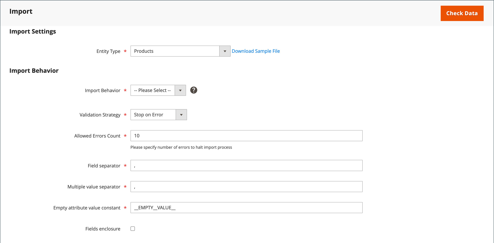
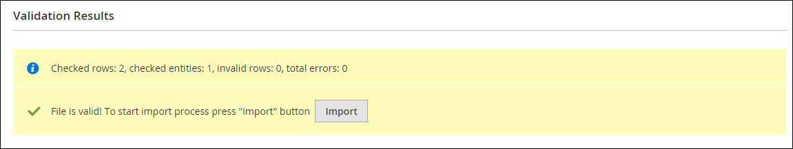
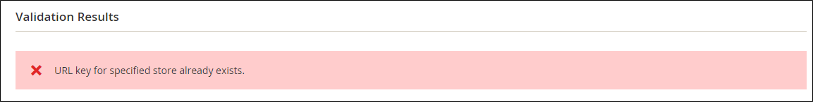

# 데이터 가져오기

모든 제품 유형에 대한 데이터를 스토어로 가져올 수 있습니다. 또한 제품, 고급 가격 데이터, 고객 데이터, 고객 주소 데이터 및 제품 이미지를 가져올 수 있습니다. 가져오기는 다음 작업을 지원합니다.

- 추가/업데이트
- 바꾸기
- 삭제

## 가져오기 지침

### 새 엔티티

- 엔티티는 CSV 파일에 지정된 속성 값과 함께 추가됩니다.
- 기본값이 설정되지 않은 필수 속성의 경우 값이 없거나 잘못된 값이 있으면 엔티티(해당 행)를 가져올 수 없습니다.
- 기본값이 설정된 필수 속성의 경우 엔티티(해당 행)를 가져오고 값이 없거나 잘못된 값이 있는 경우 속성에 대해 기본값이 설정됩니다.
- 복합 데이터가 올바르지 않으면 엔티티(해당 행)를 가져올 수 없습니다.

### 기존 엔티티

- 복잡한 데이터가 아닌 속성의 경우, 비필수 속성에 대한 빈 값을 포함하여 가져오기 파일의 값이 기존 값을 바꿉니다.
- 필수 속성에 대한 값이 없거나 잘못된 값이 있으면 기존 값이 대체되지 않습니다.
- 엔티티에 대한 복합 데이터가 유효하지 않은 경우 가져오기 동작 드롭다운 메뉴에서 엔티티 삭제 를 선택한 경우를 제외하고 엔티티(해당 행 또는 행)를 가져올 수 없습니다.

### 복잡한 데이터

가져오기 파일에 지정된 속성이 있고 해당 값이 정의된 값 집합에서 파생된 경우 다음이 적용됩니다.

- 값이 정의된 값 집합에 아직 포함되지 않은 경우 행을 가져올 수 있으며, 기본값이 정의된 경우 속성에 대해 설정됩니다.
- 값이 정의된 집합에 이미 포함되어 있으면 해당 행을 가져올 수 없습니다.
- 가져오기 파일에서 시스템에 아직 정의되지 않은 속성 이름을 지정하면 해당 속성 이름이 만들어지지 않고 해당 값을 가져오지 않습니다.

### 잘못된 파일

- 모든 행이 잘못된 경우 파일을 가져올 수 없습니다.
- 존재하지 않는 서비스 데이터나 복잡한 데이터 이름이 가져오기 파일에 지정됩니다(예: `_<non-existing name>` 머리글이 있는 열).

Adobe Commerce의 가져오기 프로세스는 BOM(바이트 순서 표시)을 사용하는 UTF-8로 인코딩된 파일을 제대로 인식하지 못할 수 있습니다. BOM이 포함된 파일은 가져오기 프로세스 중에 문제나 실패를 초래할 수 있습니다.

## 가져오기 작업

| 작업 | 설명 |
| --------- | ----------- |
| 추가/업데이트 | 새 제품 데이터가 데이터베이스의 기존 항목에 대한 기존 제품 데이터에 추가됩니다. `sku`을(를) 제외한 모든 필드를 업데이트할 수 있습니다.  가져오기 데이터에 지정된 새 세금 클래스가 자동으로 만들어집니다.  가져오기 파일에 지정된 새 제품 범주가 자동으로 만들어집니다.  가져오기 파일에 지정된 새 SKU가 자동으로 만들어집니다&#x200B;  **_참고:_**&#x200B;제품의 경우 가져오기를 통해 SKU를 제외한 모든 필드를 업데이트할 수 있습니다.  **_중요:_** 웹 사이트 또는 범주와 같은 여러 필드 값은 _추가/업데이트_ 가져오기 동작을 사용하여 제거할 수 없습니다. 이러한 필드는 CSV 파일에 나열되지 않으면 가져오기 후 데이터베이스에 유지됩니다. |
| 바꾸기 | 기존 제품 데이터가 새 데이터로 교체됩니다.  **_중요:_**&#x200B;기존 제품 데이터가 지워지고 시스템의 모든 참조가 손실되므로 데이터를 바꿀 때 주의하십시오.  가져오기 데이터의 SKU가 기존 엔터티의 SKU와 일치하는 경우 SKU를 포함한 모든 필드가 삭제되고 CSV 데이터를 사용하여 새 레코드가 만들어집니다. CSV 파일이 데이터베이스에 없는 SKU를 참조하는 경우 오류가 발생합니다. 데이터를 확인하여 오류를 표시할 수 있습니다. |
| 삭제 | 데이터베이스에 있는 가져오기 데이터의 모든 엔티티는 데이터베이스에서 삭제됩니다.  삭제 작업은 SKU를 제외하고 가져오기 데이터의 모든 열을 무시합니다. 데이터의 다른 모든 속성을 무시할 수 있습니다.  CSV 파일이 데이터베이스에 없는 SKU를 참조하는 경우 오류가 발생합니다. 데이터를 확인하여 오류를 표시할 수 있습니다. |

{style="table-layout:auto"}

## 가져오기 프로세스

가져오기 파일의 크기는 서버의 `php.ini` 파일에 있는 설정에 따라 결정됩니다. _가져오기_ 페이지의 시스템 메시지는 현재 크기 제한을 나타냅니다. 기본 크기는 2MB입니다.

등호, 보다 큼 및 보다 작음 기호, 작은따옴표와 큰따옴표, 백슬래시, 파이프 및 앰퍼샌드 기호와 같은 특수 문자는 데이터 전송 중에 문제를 일으킬 수 있습니다. 이러한 특수 문자가 올바르게 해석되도록 하려면 _이스케이프 시퀀스_(으)로 표시할 수 있습니다. 예를 들어 데이터에 `code="str"`, `code="str2"`과(와) 같은 텍스트 문자열이 포함된 경우 텍스트를 큰따옴표로 묶도록 선택하면 원래 큰따옴표가 데이터의 일부로 인식됩니다. 시스템에 큰따옴표 집합이 나타나면 큰따옴표 바깥쪽 집합이 실제 데이터를 둘러싸고 있음을 인식합니다.

제품 데이터를 가져올 때 새 제품 데이터가 데이터베이스의 기존 제품 데이터 항목에 추가됩니다. 가져오기를 통해 SKU를 제외한 모든 필드를 업데이트할 수 있습니다. 기존의 모든 제품 데이터가 가져온 새 데이터로 대체됩니다. 데이터를 바꿀 때 주의하십시오. 기존의 모든 제품 데이터가 지워지고 시스템의 모든 참조가 손실됩니다.

{width="600" zoomable="yes"}

### 1단계: 데이터 준비

1. _관리자_ 사이드바에서 **[!UICONTROL System]** > _[!UICONTROL Data Transfer]_>**[!UICONTROL Import]**(으)로 이동합니다.

1. _설정 가져오기_&#x200B;에서 **[!UICONTROL Entity Type]**&#x200B;을(를) 다음 중 하나로 설정합니다.

   - `Advanced Pricing`
   - `Products`
   - `Customer Finances`
   - `Customers and Addresses`
   - `Customers Main File`
   - `Customer Addresses`
   - `Stock Sources`

1. **[!UICONTROL Download Sample File]**&#x200B;을(를) 클릭합니다.

1. 웹 브라우저의 다운로드 위치에서 내보내기 파일을 찾아 파일을 엽니다.

   샘플 파일에는 제품 유형에 대한 자리 표시자 데이터가 있는 열 제목이 포함되어 있습니다.

   {width="600" zoomable="yes"}

1. 샘플 파일의 구조를 검사하고 이를 사용하여 CSV 가져오기 파일을 준비합니다. 열 제목의 맞춤법이 올바른지 확인하십시오.

1. 가져오기 파일의 크기가 메시지에 표시된 제한을 초과하지 않는지 확인합니다.

   {width="600"}

1. 가져오기 데이터에 제품 이미지에 대한 경로가 포함된 경우 이미지 파일이 적절한 위치에 업로드되었는지 확인하십시오.

   Commerce 서버의 기본 위치는 `pub/media/import`입니다.

   이미지가 외부 서버에 있는 경우 이미지가 포함된 디렉토리에 대한 전체 URL이 있는지 확인합니다.

### 2단계: 가져오기 동작 선택

{width="600" zoomable="yes"}

1. **[!UICONTROL Import Behavior]**&#x200B;을(를) 다음 중 하나로 설정합니다.

   - `Add/Update`(제품의 경우 가져오기를 통해 SKU를 제외한 모든 필드를 업데이트할 수 있습니다.)
   - `Replace`
   - `Delete`

1. 데이터를 가져올 때 오류가 발생할 때 발생하는 상황을 확인하려면 다음 중 하나를 선택하십시오.

   - `Stop on Error`
   - `Skip error entries`

1. **[!UICONTROL Allowed Errors Count]**&#x200B;에 가져오기를 취소하기 전에 발생할 수 있는 오류 수를 입력하십시오.

   기본값은 10입니다.

1. **[!UICONTROL Field separator]**&#x200B;에 대해 쉼표(`,`)의 기본값을 사용합니다.

1. **[!UICONTROL Multiple value separator]**&#x200B;에 대해 쉼표(`,`)의 기본값을 사용합니다.

   CSV 파일에서 쉼표가 기본 구분 기호입니다. 다른 문자를 사용하려면 CSV 파일의 데이터가 지정한 문자와 일치하는지 확인하십시오.

1. **[!UICONTROL Empty attribute value constant]**&#x200B;의 기본값 `_EMPTY_VALUE_`을(를) 수락합니다.

1. 데이터에서 _이스케이프 시퀀스_(으)로 찾을 수 있는 특수 문자를 묶으려면 **[!UICONTROL Fields Enclosure]** 확인란을 선택하십시오.

### 3단계: 가져오기 파일 식별

{width="600" zoomable="yes"}

1. 가져올 파일을 선택하려면 **[!UICONTROL Choose File]**&#x200B;을(를) 클릭하십시오.

1. 가져오려고 준비한 CSV 파일을 찾아 **[!UICONTROL Open]**&#x200B;을(를) 클릭합니다.

1. **[!UICONTROL Images File Directory]**&#x200B;의 경우 업로드된 이미지가 저장된 Commerce 서버의 위치에 대한 상대 경로를 입력하십시오.

   예: `product_images`.

   >[!NOTE]
   >
   >Adobe Commerce 및 Magento Open Source `2.3.2` 릴리스부터 _[!UICONTROL Images File Directory]_&#x200B;에 지정된 경로가 이미지 기본 디렉터리로 가져오기 위해 연결됩니다. `<Magento-root-folder>/var/import/images`. 예를 들어 `product_images` 파일을 `<Magento-root-directory>/var/import/images/product_images` 폴더에 배치합니다. `\Magento\ImportExport\etc\config.xml` 파일에서 이미지 가져오기 기본 디렉터리를 구성할 수 있습니다. 원격 저장소 모듈을 사용하도록 설정한 경우 `<remote-storage-root-directory>/var/import/images/product_images` 폴더로 파일을 가져옵니다.

   제품 이미지 가져오기에 대한 자세한 내용은 [제품 이미지 가져오기](data-import-product-images.md)를 참조하세요.

### 4단계: 가져오기 데이터 확인

1. 오른쪽 상단에서 **[!UICONTROL Check Data]**&#x200B;을(를) 클릭합니다.

1. 유효성 검사 프로세스가 완료될 때까지 잠시 기다립니다.

   가져오기 데이터가 유효한 경우 다음과 같은 메시지가 나타납니다.

   {width="600"}

1. 파일이 올바른 경우 **[!UICONTROL Import]**&#x200B;을(를) 클릭합니다.

   그렇지 않으면 메시지에 나열된 데이터의 각 문제를 수정한 다음 파일을 다시 가져오십시오.

1. 오류가 발생하지 않는 한 가져오기 프로세스는 데이터 끝까지 계속됩니다.

   유효성 검사 결과에 오류 메시지가 나타나면 데이터의 문제를 수정하고 파일을 다시 가져옵니다.

   {width="600"}

   가져오기가 완료되면 메시지가 나타납니다.

## 가져오기 기록

Commerce은 시작 날짜 및 시간, 사용자, 실행 시간 및 가져온 파일에 대한 링크를 포함하여 스토어로 가져온 데이터의 레코드를 유지 관리합니다. _실행 시간_&#x200B;은(는) 가져오기 프로세스의 기간입니다.

**_가져오기 기록을 보려면:_**

_관리자_ 사이드바에서 **[!UICONTROL System]** > _[!UICONTROL Data Transfer]_>**[!UICONTROL Import History]**(으)로 이동합니다.

{width="600" zoomable="yes"}

>[!NOTE]
>
>기본적으로 가져오기 기록 파일은 `<Magento-root-directory>/var/import_history` 폴더에 있습니다. 원격 저장소 모듈을 사용하도록 설정한 경우 가져오기 기록 파일이 `<remote-storage-root-directory>/import_export/import_history` 폴더에 있습니다.

| 필드 | 설명 |
|--- |--- |
| [!UICONTROL ID] | 전송을 지정하는 데 사용되는 내부 번호입니다. |
| [!UICONTROL Start Date & Time] | 전송이 발생한 특정 날짜 및 시간입니다. |
| [!UICONTROL User] | 전송을 수행한 고객. |
| [!UICONTROL Imported file] | 가져온 파일을 다운로드하기 위한 링크입니다. |
| [!UICONTROL Error file] | 해당 오류 파일. |
| [!UICONTROL Execution Time] | 가져오기 프로세스의 시간 간격입니다. |
| [!UICONTROL Summary] | 생성, 업데이트 및 삭제된 항목 수 또는 오류 메시지입니다. |

{style="table-layout:auto"}

_가져온/오류_ 파일을 다운로드하려면 **[!UICONTROL Download]**&#x200B;을(를) 클릭하십시오.
