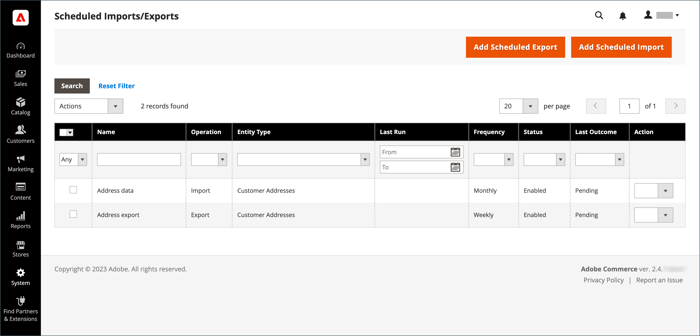
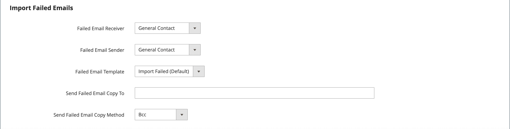

# 예약된 가져오기 및 내보내기

{{ee-feature}}

예약된 가져오기 및 내보내기는 일별, 주별 또는 월별 기준으로 실행할 수 있습니다. 가져오거나 내보낼 파일은 로컬 Adobe Commerce 서버 또는 원격 FTP 서버에 있을 수 있습니다. 예약된 가져오기/내보내기는 기본적으로 구현되며 추가 구성이 필요하지 않습니다. 모든 예약된 가져오기와 내보내기는 Cron 작업 스케줄러에서 관리합니다.

## 예약된 가져오기/내보내기 액세스

1. _관리자_ 사이드바에서 **[!UICONTROL System]** > _[!UICONTROL Data Transfer]_>**[!UICONTROL Scheduled Imports/Exports]**(으)로 이동합니다.

   {width="700" zoomable="yes"}

1. 새 예약된 가져오기 또는 내보내기 작업을 생성하려면 해당 단추를 누르고 예약된 작업 유형에 대한 지침을 따릅니다.

   - [예약된 내보내기 추가](#schedule-an-export)
   - [예약된 가져오기 추가](#schedule-an-import)

1. 레코드를 저장하면 작업이 _[!UICONTROL Scheduled Import/Export]_&#x200B;표에 나타납니다.

   >[!NOTE]
   >
   >예약된 가져오기/내보내기를 생성하거나 업데이트하면 시스템 구성이 변경됩니다. 저장 후 새 일정 또는 업데이트된 일정을 적용하려면 관리 페이지 상단에 표시되는 캐시 무효화 알림을 해결하고 캐시를 플러시해야 합니다.

1. 예약된 각 작업 후 파일의 복사본이 Adobe Commerce 로컬 서버의 `var/log/import_export` 디렉터리에 배치됩니다.

   각 작업의 세부 사항이 로그에 기록되지 않습니다. 오류가 발생하면 실패한 가져오기/내보내기 작업에 대한 알림과 함께 오류 설명이 전송됩니다.

## 가져오기 예약

사용 가능한 가져오기 파일 형식 및 가져오기 엔티티 유형의 경우 예약된 가져오기 프로세스는 수동 가져오기 프로세스와 유사합니다.

- 가져오기 파일은 .CSV 형식이어야 합니다.
- 제품 및 고객 데이터를 가져올 수 있습니다

예약된 가져오기를 사용하면 가져오기 매개 변수와 일정을 한 번만 지정한 후 데이터 파일을 여러 번 자동으로 가져올 수 있다는 이점이 있습니다.

각 가져오기 작업의 세부 정보가 로그에 기록되지 않지만 오류가 발생하면 오류에 대한 설명이 포함된 _가져오기 실패_ 전자 메일을 받게 됩니다. 마지막으로 일정이 잡힌 가져오기 작업의 결과는 [일정이 잡힌 가져오기/내보내기] 페이지의 [마지막 결과] 열에 표시됩니다.

각 가져오기 작업 후 가져오기 파일의 복사본은 Adobe Commerce 또는 Magento Open Source이 배포된 서버의 `var/log/import_export` 디렉터리에 배치됩니다. 타임스탬프, 가져온 엔티티(제품 또는 고객)의 마커 및 작업 유형(이 경우 가져오기)이 가져오기 파일 이름에 추가됩니다.

예약된 각 가져오기 작업 후 색인 재지정 작업이 자동으로 수행됩니다. 전면에서는 설명서 등 텍스트 정보의 변화분이 업데이트된 데이터가 데이터베이스로 넘어간 후 반영되며 가격의 변화분은 리인덱싱 작업 후에만 반영된다.

### 1단계: 가져오기 설정 완료

1. _관리자_ 사이드바에서 **[!UICONTROL System]** > _[!UICONTROL Data Transfer]_>**[!UICONTROL Scheduled Import/Export]**(으)로 이동합니다.

1. 오른쪽 상단에서 **[!UICONTROL Add Scheduled Import]**&#x200B;을(를) 클릭합니다.

1. 예약 및 가져오기 옵션을 설정합니다.

   - **[!UICONTROL Name]** — 예약된 가져오기의 이름을 입력합니다.

   - **[!UICONTROL Description]** — 가져오기의 목적과 사용 방법을 설명하는 간단한 설명을 입력합니다.

   - **[!UICONTROL Entity Type]** — 다음 중 하나로 설정합니다.

      - `Products`
      - `Advanced Pricing`
      - `Customers and Addresses (single file)`
      - `Customer Addresses`
      - `Customer Finances`
      - `Customers Main File`
      - `Stock Sources`

   - **[!UICONTROL Import Behavior]** — 다음 중 하나로 설정합니다.

      - `Add/Update Complex Data` — 데이터베이스의 기존 항목에 대한 기존 복합 데이터에 새 복합 데이터를 추가하거나 업데이트합니다. 이 값은 기본값입니다.
      - `Replace` — 데이터베이스의 기존 엔터티에 대한 기존 복합 쓰기를 덮어씁니다.
      - `Delete Entities` — 데이터베이스의 기존 항목을 삭제합니다.
      - `Custom Action` - 데이터베이스의 기존 엔터티를 사용자 지정합니다.

     >[!NOTE]
     >
     >_[!UICONTROL Advanced Pricing]_,_[!UICONTROL Products]_, _[!UICONTROL Customers and Addresses (single file)]_&#x200B;및_[!UICONTROL Stock Sources]_ 엔터티 형식의 경우 다음과 같은 가져오기 동작이 표시됩니다. `Add/Update`, `Replace` 및 `Delete`. _고객 재무_, _고객 기본 파일_ 및 _고객 및 주소_ 엔터티 형식의 경우 다음과 같은 가져오기 동작이 표시됩니다. `Add/Update Complex Data`, `Delete Entities` 및 `Custom Action`.

   - **[!UICONTROL Start Time]** — 가져오기가 시작되도록 예약된 시간, 분 및 초로 설정합니다.

   - **[!UICONTROL Frequency]** — `Daily`, `Weekly` 또는 `Monthly` 중 하나로 설정합니다.

   - **[!UICONTROL On Error]** - `Stop Import` 또는 `Continue Processing` 중 하나로 설정합니다.

   - **[!UICONTROL Status]** — 예약된 가져오기를 활성화하려면 `Enabled`(으)로 설정합니다.

   - **[!UICONTROL Field Separator]** — 가져오기 파일에서 필드를 구분하는 데 사용되는 문자를 입력합니다. 기본 문자는 쉼표입니다.

   - **[!UICONTROL Multiple Value Separator]** — 필드 내에서 여러 값을 구분하는 데 사용되는 문자를 입력합니다.

   {width="600" zoomable="yes"}

### 2단계: 파일 가져오기 정보 완료

1. **[!UICONTROL Server Type]**&#x200B;을(를) 다음 중 하나로 설정합니다.

   - `Local Server` - Adobe Commerce이 설치된 동일한 서버에서 데이터를 가져옵니다.
   - `Remote FTP` - 원격 서버에서 데이터를 가져옵니다.

   {width="600" zoomable="yes"}

   >[!NOTE]
   >
   >원격 저장소 모듈을 사용하도록 설정하면 `Local Server`이(가) 자동으로 `Remote Storage`(으)로 전환합니다.

1. 가져오기 파일이 생성되는 **[!UICONTROL File Directory]**&#x200B;을(를) 입력하십시오.

   - `Local Server` - Commerce 설치에서 상대 경로를 입력하십시오. 예: `var/import`. 원격 저장소 모듈이 구성되어 있으면 `import_export/import`을(를) 사용합니다.
   - `Remote FTP server` - 원격 서버의 가져오기 폴더에 대한 전체 URL 및 경로를 입력합니다.

1. 가져올 **[!UICONTROL File Name]** 입력.

1. **[!UICONTROL Images File Directory]**&#x200B;의 경우 제품 이미지가 저장된 디렉터리의 경로를 입력하십시오.

   로컬 서버에서 `var/import`과(와) 같은 상대 경로를 입력하십시오. 원격 저장소에서 `import_export/import` 또는 `import_export/import/some/dir` 등의 상대 경로를 입력하십시오.

### 3단계: 실패한 이메일 가져오기 구성

{width="600" zoomable="yes"}

1. 가져오는 동안 오류가 발생하면 알림을 받을 저장소 연락처로 **[!UICONTROL Failed Email Receiver]**&#x200B;을(를) 설정합니다.

1. 알림을 보낸 사람으로 표시되는 스토어 연락처로 **[!UICONTROL Failed Email Sender]**&#x200B;을(를) 설정합니다.

1. 알림에 사용되는 템플릿으로 **[!UICONTROL Failed Email Template]**&#x200B;을(를) 설정합니다.

1. **[!UICONTROL Send Failed Email Copy To]**&#x200B;의 경우 알림 복사본을 받을 사용자의 전자 메일 주소를 입력하십시오.

   여러 이메일 주소는 쉼표로 구분합니다.

1. **[!UICONTROL Failed Email Copy Method]**&#x200B;을(를) 다음 중 하나로 설정합니다.

   - `Bcc` - 실패한 가져오기 알림에 대한 블라인드 참조 복사본을 보냅니다. 수신자의 이름과 주소는 원래 이메일 배포에 포함되지만 보기에는 숨겨집니다.
   - `Separate Email` - 실패한 가져오기 알림의 복사본을 별도의 전자 메일로 보냅니다.

1. 완료되면 **[!UICONTROL Save]**&#x200B;을(를) 클릭합니다.

   예약된 새 가져오기 작업이 _[!UICONTROL Scheduled Import/Export]_&#x200B;페이지의 목록에 추가됩니다. 이 페이지에서 테스트 및 편집을 위해 즉시 실행할 수 있습니다. 가져오기 파일은 각 가져오기 작업을 실행하기 전에 유효성이 검사됩니다.

>[!NOTE]
>
>예약된 가져오기/내보내기를 생성하거나 업데이트하면 시스템 구성이 변경됩니다. 저장 후 새 일정 또는 업데이트된 일정을 적용하려면 관리 페이지 상단에 표시되는 캐시 무효화 알림을 해결하고 캐시를 플러시해야 합니다.

### 필드 설명

#### [!UICONTROL Import Settings]

| 필드 | 설명 |
| ----- | ----------- | 
| [!UICONTROL Name] | 가져오기의 이름입니다. 서로 다른 예약된 가져오기가 많이 만들어지는 경우 구분하는 데 도움이 됩니다. |
| [!UICONTROL Description] | (선택 사항) 설명을 입력할 수 있습니다. |
| [!UICONTROL Entity Type] | 가져올 데이터를 정의합니다. |
| [!UICONTROL Import Behavior] | 가져오는 엔터티가 데이터베이스에 있을 경우 복잡한 데이터를 처리하는 방법을 정의합니다. 제품에 대한 복잡한 데이터에는 카테고리, 웹 사이트, 사용자 지정 옵션, 계층 가격, 관련 제품, 상향 판매, 교차 판매 및 관련 제품 데이터가 포함됩니다. 고객을 위한 복잡한 데이터에는 주소가 포함됩니다. 옵션: **[!UICONTROL Add/Update Complex Data]**- 데이터베이스의 기존 항목에 대한 기존 복합 데이터에 새 복합 데이터가 추가되거나 업데이트됩니다. 이 값은 기본값입니다. **[!UICONTROL Add/Update]** - 새 데이터가 데이터베이스의 기존 항목에 추가됩니다. 제품에 대해 `sku`을(를) 제외한 모든 필드를 업데이트할 수 있습니다. CSV 파일에 나열되지 않은 여러 필드 값(예: 범주 또는 웹 사이트)은 가져온 후 데이터베이스에 남아 있습니다. **[!UICONTROL Replace]**- 기존 엔터티의 기존 복합 데이터가 대체됩니다. **[!UICONTROL Delete Entities]** - 가져온 엔터티가 데이터베이스에 있으면 데이터베이스에서 삭제됩니다. **[!UICONTROL Custom Action]**- 가져오기 프로세스 중에 기존 복합 엔터티를 사용자 지정합니다. |
| [!UICONTROL Start Time] | 가져오기의 시작 시간, 분 및 초를 설정합니다. |
| [!UICONTROL Frequency] | 가져오기가 실행되는 빈도를 정의합니다. 옵션: `Daily` / `Weekly` / `Monthly` |
| [!UICONTROL On Error] | 파일 유효성 검사 중에 오류가 발견될 경우에 대비하여 시스템 동작을 정의합니다. 옵션: **가져오기 중지** — 유효성 검사 중에 오류가 발견되면 파일을 가져오지 않습니다. 이 값은 기본값입니다. **계속 처리** - 유효성 검사 중에 오류가 발견되었지만 가져올 수 있는 경우 파일을 가져옵니다. |
| [!UICONTROL Status] | 가져오기는 기본적으로 활성화되어 있습니다. 상태를 `Disabled`(으)로 설정하여 일시 중단할 수 있습니다. |
| [!UICONTROL Field Separator] | 필드를 구분하는 데 사용할 문자를 결정합니다. 기본값: `,`(쉼표) |
| [!UICONTROL Multiple Value Separator] | 필드 내에서 여러 값을 구분하는 데 사용되는 문자를 결정합니다. 기본값: `,`(쉼표) |

{style="table-layout:auto"}

#### [!UICONTROL Import File Information]

| 필드 | 설명 |
| ----- | ----------- | 
| [!UICONTROL Server Type] | Commerce이 배포된 동일한 서버의 파일(`Local Server` 선택)이나 원격 FTP 서버(`Remote FTP` 선택)에서 가져올 수 있습니다. _[!UICONTROL Remote FTP]_&#x200B;을(를) 선택하면 자격 증명 및 파일 전송 설정에 대한 추가 옵션이 나타납니다. 원격 저장소 모듈을 사용하도록 설정하면 `Local Server` 형식이 자동으로 `Remote Storage`(으)로 전환됩니다. |
| [!UICONTROL File Directory] | 가져오기 파일이 있는 디렉토리를 지정합니다. 서버 유형이 _[!UICONTROL Local Server]_(으)로 설정된 경우 Commerce 설치 디렉터리에 상대적인 경로를 지정하십시오. 예: 원격 저장소용 `var/import` 또는 `import_export/import`. |
| [!UICONTROL File Name] | 가져오기 파일의 이름을 지정합니다. |
| [!UICONTROL Images File Directory] | 제품 이미지가 저장되는 디렉토리의 경로를 입력합니다. 로컬 서버의 경우 상대 경로를 입력합니다. 예: 원격 저장소용 `var/import` 또는 `import_export/import`. |

{style="table-layout:auto"}

#### [!UICONTROL Import Failed Emails]

| 필드 | 설명 |
| ----- | ----------- | 
| [!UICONTROL Failed Email Receiver] | 가져오기가 실패할 경우 이메일 알림(이메일 가져오기 실패)을 보낼 이메일 주소를 지정합니다. |
| [!UICONTROL Failed Email Sender] | 가져오기 실패 이메일의 발신자로 사용되는 이메일 주소를 지정합니다. |
| [!UICONTROL Failed Email Template] | 가져오기 실패 이메일에 대한 템플릿을 선택합니다. 기본적으로 가져오기 실패(로케일에서 기본 템플릿) 옵션만 사용할 수 있습니다. 사용자 지정 템플릿은 _[!UICONTROL System]_>_[!UICONTROL Transactional Emails]_&#x200B;에서 만들 수 있습니다. |
| [!UICONTROL Send Failed Email Copy To] | 가져오기 실패 이메일 사본이 전송되는 이메일 주소. |
| [!UICONTROL Send Failed Email Copy Method] | 가져오기 실패 이메일에 대한 복사 전송 방법을 선택합니다. |

{style="table-layout:auto"}

## 내보내기 예약

예약된 내보내기는 사용 가능한 내보내기 파일 형식 및 내보낼 수 있는 엔터티 형식의 수동 [내보내기](data-export.md)와 유사합니다.

- CSV 형식으로 내보낼 수 있습니다
- 제품 및 고객 데이터 내보내기

예약된 내보내기를 사용하는 장점은 내보내기 매개 변수를 지정한 후 데이터를 자동으로 여러 번 내보내고 한 번만 예약할 수 있다는 것입니다.

각 내보내기의 세부 정보는 로그에 기록되지 않지만, 오류가 있는 경우 오류 설명이 포함된 내보내기 실패 이메일을 받게 됩니다. 마지막 내보내기 작업의 결과가 예약된 가져오기/내보내기 페이지의 마지막 결과 열에 나타납니다.

각 내보내기 후에는 내보내기 파일이 사용자 정의 위치에 배치되고, Adobe Commerce 또는 Magento Open Source이 배포된 서버의 `var/log/import_export` 디렉터리에 복사본이 배치됩니다. 내보낸 엔티티(제품 또는 고객)의 타임스탬프 및 마커와 작업 유형(이 경우 내보내기)이 내보내기 파일 이름에 추가됩니다.

### 1단계: 내보내기 설정 완료

1. _관리자_ 사이드바에서 **[!UICONTROL System]** > _[!UICONTROL Data Transfer]_>**[!UICONTROL Scheduled Import/Export]**(으)로 이동합니다.

1. 오른쪽 상단 모서리에서 **[!UICONTROL Add Scheduled Export]**&#x200B;을(를) 클릭하고 다음을 수행합니다.

   - 예약된 내보내기에 대한 **[!UICONTROL Name]**&#x200B;을(를) 입력하십시오.

   - 내보내기의 목적과 사용 방법을 설명하는 간단한 **[!UICONTROL Description]**&#x200B;을(를) 입력하십시오.

   - **[!UICONTROL Entity Type]**&#x200B;을(를) 다음 중 하나로 설정합니다.

      - `Advanced Pricing`
      - `Products`
      - `Customer Financing`
      - `Customers Main File`
      - `Customer Addresses`
      - `Stock Sources`

     페이지 하단의 _[!UICONTROL Entity Attributes]_&#x200B;섹션이 선택한 엔터티 형식을 반영하도록 업데이트됩니다.

   - 내보내기가 시작되도록 예약된 시간, 분, 초로 **[!UICONTROL Start Time]**&#x200B;을(를) 설정합니다.

   - **[!UICONTROL Frequency]**&#x200B;을(를) 다음 중 하나로 설정합니다.

      - `Daily`
      - `Weekly`
      - `Monthly`

1. 예약된 내보내기를 활성화하려면 **[!UICONTROL Status]**&#x200B;을(를) `Enabled`(으)로 설정합니다.

1. `CSV`을(를) 기본 **[!UICONTROL File Format]**(으)로 수락합니다.

   {width="600" zoomable="yes"}

### 2단계: 파일 내보내기 정보 완료

1. **[!UICONTROL Server Type]**&#x200B;을(를) 다음 중 하나로 설정합니다.

   - `Local Server` - Commerce이 설치된 동일한 서버에 내보내기 파일을 저장합니다.
   - `Remote FTP` — 원격 서버에 내보내기 파일을 저장합니다.

   {width="600" zoomable="yes"}

   >[!NOTE]
   >
   >원격 저장소 모듈을 사용하도록 설정하면 `Local Server`이(가) 자동으로 `Remote Storage`(으)로 전환됩니다.

1. **[!UICONTROL File Directory]**&#x200B;의 경우 다음과 같이 내보내기 파일을 저장할 디렉터리를 입력하십시오.

   - **[!UICONTROL Local Server]**&#x200B;의 경우 Commerce 설치 내에서 상대 경로를 입력하십시오(예: `var/export`). 원격 저장소 모듈이 구성되어 있으면 `import_export/export`을(를) 사용합니다.
   - **[!UICONTROL Remote FTP server]**&#x200B;의 경우 대상 서버의 대상 폴더에 대한 전체 URL 및 경로를 입력하십시오.

1. _[!UICONTROL Remote FTP]_&#x200B;서버를 선택한 경우 서버에 연결 자격 증명을 입력하고 추가 설정을 선택하십시오.

   - **[!UICONTROL FTP Host[:Port]]**&#x200B;의 경우 원격 FTP 호스트 주소를 입력하십시오.
   - **[!UICONTROL User Name]**&#x200B;의 경우 원격 서버에 액세스하는 데 사용되는 사용자 이름을 입력하십시오.
   - **[!UICONTROL Password]**&#x200B;의 경우 입력한 사용자 이름 계정의 암호를 입력하십시오.
   - **[!UICONTROL File Mode]**&#x200B;의 경우 `Binary` 또는 `ASCII`을(를) 선택하십시오.
   - **[!UICONTROL Passive Mode]**&#x200B;의 경우 `No` 또는 `Yes`을(를) 선택하십시오.

### 3단계: 내보내기 실패 이메일 구성

1. 내보내는 동안 오류가 발생하면 알림을 받을 저장소 연락처로 **[!UICONTROL Failed Email Receiver]**&#x200B;을(를) 설정합니다.

1. 알림을 보낸 사람으로 표시되는 스토어 연락처로 **[!UICONTROL Failed Email Sender]**&#x200B;을(를) 설정합니다.

1. 알림에 사용되는 템플릿으로 **[!UICONTROL Failed Email Template]**&#x200B;을(를) 설정합니다.

1. **[!UICONTROL Send Failed Email Copy To]**&#x200B;의 경우 알림 복사본을 받을 사용자의 전자 메일 주소를 입력하십시오.

   여러 이메일 주소의 경우 쉼표로 구분하십시오.

1. **[!UICONTROL Failed Email Copy Method]**&#x200B;을(를) 다음 중 하나로 설정합니다.

   - `Bcc` - 블라인드 참조 복사본을 보냅니다. 수신자의 이름과 주소는 원래 이메일 배포에 포함되지만 보기에는 숨겨집니다.
   - `Separate Email` — 복사본을 별도의 전자 메일로 보냅니다.

### 4단계: 엔티티 속성 선택

1. _[!UICONTROL Entity Attributes]_&#x200B;섹션에서 내보내기 데이터에 포함할 특성을 선택합니다.

   - 내보내기 데이터를 특성 값으로 필터링하려면 _[!UICONTROL Filter]_&#x200B;열에 특성 값을 입력하십시오.
   - 특정 속성 값을 가진 제품이나 고객을 제외하려면 제외할 속성 값을 입력하고 건너뛰기 열에서 확인란을 선택합니다.

1. 완료되면 **[!UICONTROL Save]**&#x200B;을(를) 클릭합니다.

   예약된 새 내보내기 작업이 _[!UICONTROL Scheduled Import/Export]_&#x200B;페이지의 목록에 추가됩니다. 이 페이지에서 즉시 실행하여 테스트하고 편집할 수 있습니다.

>[!NOTE]
>
>예약된 가져오기/내보내기를 생성하거나 업데이트하면 시스템 구성이 변경됩니다. 저장 후 새 일정 또는 업데이트된 일정을 적용하려면 관리 페이지 상단에 표시되는 캐시 무효화 알림을 해결하고 캐시를 플러시해야 합니다.

### 필드 설명

#### [!UICONTROL Export Settings]

| 필드 | 설명 |
| ----- | ----------- | 
| [!UICONTROL Name] | 내보내기의 이름입니다. 서로 다른 예약된 내보내기가 많이 만들어지는 경우 구분하는 데 도움이 됩니다. |
| [!UICONTROL Description] | (선택 사항) 예약된 내보내기에 대한 설명입니다. |
| [!UICONTROL Entity Type] | 내보낼 데이터를 식별합니다. 선택한 후 엔티티 속성이 아래에 나타납니다. 옵션: `Advanced Pricing` / `Products` / `Customer Finances` / `Customers Main File` / `Customer Addresses` / `Stock Sources` |
| [!UICONTROL Start Time] | 내보내기의 시작 시간, 분 및 초를 설정합니다. |
| [!UICONTROL Frequency] | 내보내기 작업이 실행되는 빈도를 정의합니다. 옵션: `Daily` / `Weekly` / `Monthly` |
| [!UICONTROL Status] | 새 예약된 내보내기는 기본적으로 활성화됩니다. 상태를 사용 안 함으로 설정하여 일시 중단할 수 있습니다. 옵션: `Enabled` / `Disabled` |
| [!UICONTROL File Format] | 내보내기 파일의 형식을 선택합니다. 현재 `.CSV` 옵션만 사용할 수 있습니다. |

{style="table-layout:auto"}

#### [!UICONTROL Export Settings Information]

| 필드 | 설명 |
| ----- | ----------- | 
| [!UICONTROL Server Type] | 내보내기 파일의 위치를 결정합니다. 옵션: **로컬 서버** — Commerce이 배포된 동일한 서버에 내보내기 파일을 배치합니다. 원격 저장소 모듈을 사용하도록 설정하면 `Local Server`이(가) `Remote Storage`(으)로 전환됩니다. **원격 FTP** — 내보내기 파일을 원격 서버에 배치합니다. 자격 증명 및 파일 전송 설정에 대한 추가 옵션이 표시됩니다. |
| [!UICONTROL File Directory] | 내보내기 파일이 있는 디렉토리를 지정합니다. _[!UICONTROL Server Type]_&#x200B;이(가) `Local Server`(으)로 설정된 경우 Commerce 설치 경로를 기준으로 경로를 지정하십시오. 예: 원격 저장소용 `var/export` 또는 `import_export/export`. |

{style="table-layout:auto"}

#### [!UICONTROL Export Failed Emails]

| 필드 | 설명 |
| ----- | ----------- | 
| [!UICONTROL Failed Email Receiver] | 내보내기가 실패할 경우 이메일 알림(내보내기 실패 이메일)을 보낼 이메일 주소를 지정합니다. |
| [!UICONTROL Failed Email Sender] | 내보내기 실패 이메일 발신자로 사용되는 이메일 주소를 지정합니다. |
| [!UICONTROL Failed Email Template] | 실패한 내보내기 이메일의 템플릿을 선택합니다. 기본적으로 `Export Failed (Default Template from Locale)` 옵션만 사용할 수 있습니다. |
| [!UICONTROL Send Failed Email Copy To] | 실패한 내보내기 이메일 사본이 전송되는 이메일 주소. |
| [!UICONTROL Send Failed Email Copy Method] | 내보내기 실패 이메일에 대한 복사 전송 방법을 지정합니다. |

{style="table-layout:auto"}
