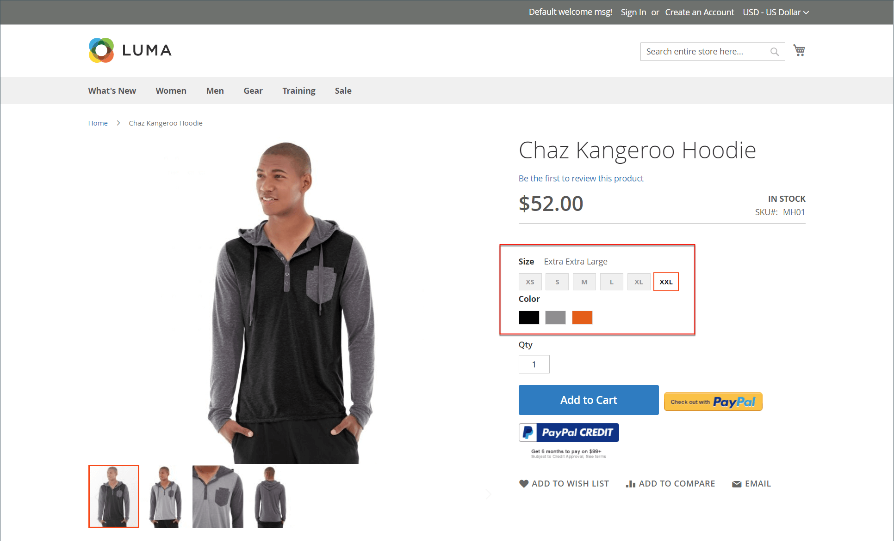

# 구성 가능한 제품 가져오기

구성 가능한 제품 데이터가 구성되는 방식을 이해하는 가장 좋은 방법은 구성 가능한 제품과 해당 변형을 내보내고 스프레드시트에서 데이터를 검사하는 것입니다.

다음 예제에서는 각 색상의 새 크기에 대한 제품 변형 세트를 추가합니다. 먼저 구성 가능한 제품을 내보내고 데이터 구조를 검사합니다. 그런 다음 데이터를 업데이트하고 다시 카탈로그로 가져옵니다. 데이터를 내보내는 연습을 수행하지 않으려면 예제에 사용된 CSV 파일을 다운로드할 수 있습니다.

{width="700" zoomable="yes"}

## 1단계: 속성 설정 및 값 확인

1. 시작하기 전에 제품 변형에 사용되는 속성에 필요한 속성 설정이 있는지 확인하십시오.

   - [**[!UICONTROL Scope]**](../getting-started/websites-stores-views.md#scope-settings) - `Global`
   - [**[!UICONTROL Catalog Input Type for Store Owner]**](data-attributes-product.md) - 제품 변형에 사용되는 속성의 입력 유형은 다음 중 하나여야 합니다.

      - `Dropdown`
      - `Visual Swatch`
      - `Text Swatch`
      - `Multi-Select`

   - **[!UICONTROL Values Required]** - `Yes`

1. 크기나 색상을 추가하거나 기존 속성을 변경하는 경우 속성을 새 값으로 업데이트해야 합니다.

1. 다음에서 _관리자_ 사이드바, 이동 **[!UICONTROL Stores]** > _[!UICONTROL Attributes]_>**[!UICONTROL Product]**.

1. 목록에서 속성을 찾아 편집 모드로 엽니다.

1. 속성에 새 값을 추가합니다.

   다음 예제에서는 새 크기가 텍스트 견본에 추가됩니다.

   {width="500" zoomable="yes"}

1. 완료되면 다음을 클릭하십시오. **[!UICONTROL Save Attribute]**.

1. 속성을 추가하는 경우 다음 지침을 따르십시오. [속성 만들기](../catalog/attribute-product-create.md) 시작하기 전에.

## 2단계: 구성 가능한 제품 내보내기

1. 다음에서 _관리자_ 사이드바, 이동 **[!UICONTROL Catalog]** > **[!UICONTROL Products]**.

1. 내보낼 구성 가능한 제품을 찾습니다.

   - 클릭 **[!UICONTROL Filters]**.
   - 설정 **[!UICONTROL Type]** 끝 `Configurable Product` 및 클릭 **[!UICONTROL Apply Filters]**.
   - 테스트 내보내기에 사용할 구성 가능한 제품을 선택하고 **[!UICONTROL SKU]**.

1. 다음에서 _관리자_ 사이드바, 이동 **[!UICONTROL System]** > _[!UICONTROL Data Transfer]_>**[!UICONTROL Export]**.

   {width="600" zoomable="yes"}

1. 아래 _[!UICONTROL Export Setting]s_&#x200B;를 사용하여 다음을 수행합니다.

   - 설정 **[!UICONTROL Entity Type]** 끝 `Products`.

   - 설정 **[!UICONTROL Export File Format]** 끝 `CSV`.

1. 아래 _[!UICONTROL Entity Attributes]_, 아래로 스크롤하거나 속성 레이블 필터를 사용하여&#x200B;**[!UICONTROL SKU]**속성을 지정하고 다음 작업을 수행합니다.

   - 내보내도록 선택한 구성 가능한 제품의 SKU를 입력하고 **[!UICONTROL Continue]**.

     {width="600" zoomable="yes"}

   - 웹 브라우저의 다운로드 위치에서 파일을 찾아 스프레드시트로 엽니다.

     CSV 파일에는 각 간단한 제품 변형에 대해 별도의 행이 있고 구성 가능한 제품에 대해 하나의 행이 있습니다. 다음 `product_type column` 하나의 구성 가능한 제품과 관련된 여러 가지 간단한 제품 변형을 표시합니다.

     {width="600" zoomable="yes"}

   - 워크시트의 맨 오른쪽으로 스크롤하여 다음 열을 찾습니다.

      - `configurable_variations` - 구성 가능한 제품 레코드와 각 변형 간의 일대다 관계를 정의합니다.
      - `configurable_variation_labels` - 각 변형을 식별하는 레이블을 정의합니다.

     이 예에서, 데이터는 열들(CG 및 CH)에서 발견될 수 있다. 변형의 수에 따라 `configurable_variations` 열은 길 수 있습니다. 데이터는 관련 제품 변형에 대한 색인으로 사용되며 다음 구조를 가집니다.

     ```text
     sku={{SKU_VALUE}},attribute1={{VALUE}},attribute2={{VALUE}}| sku={{SKU_VALUE}},attribute1={{VALUE}},attribute2={{VALUE}}
     ```

     각 SKU는 파이프 기호(|)로 구분되고 속성은 쉼표로 구분됩니다. 각 속성의 값은 속성 레이블이 아니라 속성 코드로 표시됩니다. 실제 데이터는 다음과 같이 표시됩니다.

     ```text
     sku=MH01-XS-Black,size=XS,color=Black|sku=MH01-XS-Gray,size=XS,color=Gray|sku=MH01-XS-Orange,size=XS,color=Orange</pre>
     ```

1. 구성 가능한 제품 데이터의 구조를 이해하면 데이터를 편집하거나 새 변형을 CSV 파일에 직접 추가할 수 있습니다.

   자세한 내용은 다음을 참조하십시오. [복잡한 데이터](data-attributes-product.md#complex-product-data-attributes).

## 3단계: 데이터 편집

다음 예제에서는 XL 크기 집합을 워크시트에 복사하여 각 색상의 새 크기에 대한 제품 변형 집합을 만듭니다.

1. 새 제품에 대한 템플릿으로 사용할 제품 변형 세트를 복사합니다.

   {width="600" zoomable="yes"}

1. 복사한 행 레코드를 워크시트에 삽입합니다.

   이제 두 개의 동일한 단순 제품 변형 세트가 있습니다.

   {width="600" zoomable="yes"}

1. 필요에 따라 새 변형의 다음 열에서 데이터를 업데이트합니다.

   - `sku`
   - `name`
   - `url_key`
   - `additional_attributes`

   이 예제의 경우 `XL` 참조가 (으)로 변경되었습니다. `XXL`.

1. 에서 정보를 업데이트합니다. `product_variations` 새 변형이 구성 가능한 제품의 일부로 포함되도록 구성 가능한 제품 레코드의 열.

   구성 가능한 제품 레코드가 있는 행에서 `product_variations` 데이터. 그런 다음 공식 막대에서 파이프 기호로 시작하는 마지막 매개변수 세트를 복사합니다.

   {width="600" zoomable="yes"}

1. 매개변수를 데이터 끝에 붙여넣고 필요에 따라 새 변형을 위해 편집합니다.

   이 예에서는 `sku` 및 `size` 새 XXL 크기에 대한 매개 변수가 업데이트됩니다.

1. 데이터를 카탈로그로 다시 가져오기 전에 변경되지 않은 행을 삭제합니다.

   이 예제에서는 새로운 크기에 대한 세 가지 새로운 변형과 업데이트된 구성 가능한 제품이 있는 행만 다시 카탈로그로 가져옵니다. 다른 행은 CSV 파일에서 삭제할 수 있습니다. 단, 열 레이블이 있는 머리글 행은 삭제하지 마십시오.

   {width="600" zoomable="yes"}

1. **[!UICONTROL Save]** csv 파일입니다.

   데이터를 카탈로그로 가져올 준비가 되었습니다.

   >[!NOTE]
   >
   >가져오기 파일의 크기는 2MB보다 클 수 없습니다.

## 4단계: 업데이트된 데이터 가져오기

1. 다음에서 _관리자_ 사이드바, 이동 **[!UICONTROL System]** > _[!UICONTROL Data Transfer]_>**[!UICONTROL Import]**.

1. 아래 _[!UICONTROL Import Settings]_, 설정됨&#x200B;**[!UICONTROL Entity Type]**끝 `Products`.

1. 아래 _[!UICONTROL Import Behavior]_, 설정됨&#x200B;**[!UICONTROL Import Behavior]**끝 `Add/Update`.

   {width="600" zoomable="yes"}

1. 아래 _[!UICONTROL File to Import]_, 클릭&#x200B;**[!UICONTROL Choose File]**가져오기를 위해 준비한 CSV 파일로 이동하여 파일을 선택합니다.

   {width="600" zoomable="yes"}

1. 오른쪽 위 모서리에서 을(를) 클릭합니다. **[!UICONTROL Check Data]**.

1. 파일이 유효하면 **[!UICONTROL Import]**.

   그렇지 않으면 데이터에서 발견된 문제를 수정하고 다시 시도하십시오.

   {width="600" zoomable="yes"}

1. 가져오기가 완료되면 다음을 클릭하십시오. **[!UICONTROL Cache Management]** 페이지 맨 위에 있는 메시지에서 유효하지 않은 모든 캐시를 새로 고칩니다.

   이제 새 제품 변형을 관리자의 카탈로그 및 상점 첫 화면에서 사용할 수 있습니다. 이 예에서, 후드(hoodie)는 이제 모든 컬러에 대해 사이즈 XXL로 이용 가능하다.
