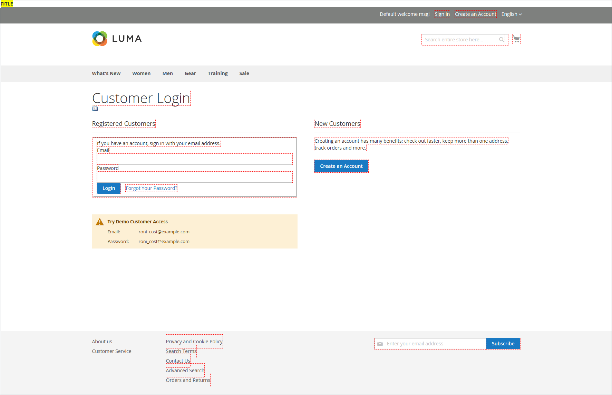

# 개발자 도구

고급 도구를 사용하여 프론트엔드 개발 모드를 결정하고, IP 주소 허용 목록 중 개발자 및 템플릿 경로 힌트를 표시합니다. 상점 및 관리자의 인터페이스에서 텍스트를 쉽게 스팟 변경할 수 있는 도구도 있습니다.

- [작업 로그](action-log.md) (Adobe Commerce 전용)
- [프론트엔드 개발 워크플로](#frontend-development-workflow)
- [정적 파일 서명 사용](#static-file-signatures)
- [리소스 파일 최적화](#optimizing-resource-files)
- [개발자 클라이언트 제한 사항](#client-restrictions)
- [템플릿 경로 힌트](#template-path-hints)
- [인라인 번역](#translate-inline)

## 작업 모드

Adobe Commerce 또는 Magento Open Source 인스턴스를 배포하여 _프로덕션_ 또는 _개발자 모드_&#x200B;에서 실행할 수 있습니다. 개발자를 위해 특별히 설계된 도구 및 구성 설정은 저장소가 _개발자 모드_&#x200B;에서 실행되는 동안에만 액세스할 수 있습니다.

적절한 권한이 있는 사용자가 서버의 명령줄에서만 작업 모드를 변경할 수 있습니다. 자세한 내용은 _구성 가이드_&#x200B;에서 [작업 모드 설정](https://experienceleague.adobe.com/docs/commerce-operations/configuration-guide/cli/set-mode.html)을 참조하십시오.

판매자 설명서의 대부분의 항목은 프로덕션 모드에서 실행되는 Commerce 인스턴스에 적용됩니다. 그러나 다음 구성 설정 및 도구는 설치가 개발자 모드에서 실행되는 경우에만 사용할 수 있습니다.

## 프론트엔드 개발 워크플로

프론트엔드 개발 워크플로 유형은 개발 중에 클라이언트측에서 컴파일이 적게 발생하는지 또는 서버측에서 컴파일이 적게 발생하는지를 결정합니다. 추가 기능 및 규칙이 있고 간소화된 코드를 생성하는 CSS의 확장이 더 적습니다. 테마 개발에는 클라이언트측 컴파일 작업을 사용하지 않는 것이 좋습니다. 서버 측 컴파일이 기본 모드입니다. 프로덕션 모드의 저장소에는 개발 워크플로우 옵션을 사용할 수 없습니다.
Commerce 개발자 설명서에서 [클라이언트측 LESS 컴파일과 서버측 비교](https://developer.adobe.com/commerce/frontend-core/guide/css/quickstart/compilation-mode/){:target=&quot;_blank&quot;}를 참조하십시오.

>[!NOTE]
>
>프론트엔드 개발 워크플로 구성은 [개발자 모드](../systems/developer-tools.md#operation-modes)에서만 사용할 수 있습니다.

{width="600" zoomable="yes"}

1. _관리자_ 사이드바에서 **[!UICONTROL Stores]** > _[!UICONTROL Settings]_>**[!UICONTROL Configuration]**(으)로 이동합니다.

1. 왼쪽 패널에서 **[!UICONTROL Advanced]**&#x200B;을(를) 확장하고 **[!UICONTROL Developer]**&#x200B;을(를) 선택합니다.

1. **[!UICONTROL Front-end Development Workflow]** 섹션에서 를 확장합니다.

1. **[!UICONTROL Workflow Type]**&#x200B;을(를) 다음 중 하나로 설정합니다.

   - `Client side less compilation` - 기본 `less.js` 라이브러리를 사용하여 브라우저에서 컴파일이 수행됩니다.
   - `Server side less compilation` - Less PHP 라이브러리를 사용하여 서버에서 컴파일이 수행됩니다. 프로덕션 기본 모드입니다.

1. 완료되면 **[!UICONTROL Save Config]**&#x200B;을(를) 클릭합니다.

## 정적 파일 서명

정적 파일의 URL에 디지털 서명을 추가하면 브라우저는 파일의 최신 버전을 사용할 수 있는 시기를 감지할 수 있습니다. 디지털 서명을 사용하여 추적할 수 있는 정적 파일에는 JavaScript, CSS, 이미지 및 글꼴이 포함됩니다. 서명은 기본 URL 바로 뒤에 경로에 추가됩니다. 파일의 서명이 브라우저의 캐시에 저장된 것과 다른 경우 파일의 최신 버전이 사용됩니다.

Commerce 개발자 설명서에서 [정적 콘텐츠 서명](https://experienceleague.adobe.com/docs/commerce-operations/configuration-guide/cache/static-content-signing.html){:target=&quot;_blank&quot;}을 참조하십시오.

>[!NOTE]
>
>정적 파일 설정 구성은 [개발자 모드](../systems/developer-tools.md#operation-modes)에서 작업하는 경우에만 사용할 수 있습니다.

{width="600" zoomable="yes"}

구성 설정의 자세한 목록을 보려면 _구성 참조_&#x200B;에서 [_정적 파일 설정_](../configuration-reference/advanced/developer.md)&#x200B;을 참조하십시오.

**_서명된 정적 파일을 사용하려면:_**

1. _관리자_ 사이드바에서 **[!UICONTROL Stores]** > _[!UICONTROL Settings]_>**[!UICONTROL Configuration]**(으)로 이동합니다.

1. 왼쪽 패널에서 **[!UICONTROL Advanced]**&#x200B;을(를) 확장하고 **[!UICONTROL Developer]**&#x200B;을(를) 선택합니다.

1. **[!UICONTROL Static Files Settings]** 섹션에서 를 확장합니다.

1. **[!UICONTROL Sign Static Files]**&#x200B;을(를) `Yes`(으)로 설정합니다.

1. 완료되면 **[!UICONTROL Save Config]**&#x200B;을(를) 클릭합니다.

## 리소스 파일 최적화

파일을 병합하고 번들로 묶어 코드를 최소화함으로써 리소스 파일을 로드하는 데 걸리는 시간을 줄일 수 있습니다.

- 병합하면 동일한 유형의 개별 파일이 단일 파일로 결합됩니다.
- 번들링 은 페이지를 로드하는 데 필요한 HTTP 요청 수를 줄이기 위해 개별 파일을 그룹화하는 기술입니다.
- 축소는 공백, 줄 바꿈 및 주석을 제거하지만 코드의 기능에는 영향을 주지 않습니다. 최소화된 파일은 편집할 수 없으므로 프로덕션으로 이동할 준비가 된 경우에만 프로세스를 적용해야 합니다.

기본적으로 Adobe Commerce 및 Magento Open Source은 파일을 병합, 번들 또는 최소화하지 않으며 프로젝트 개발자가 사용해야 하는 파일 최적화 방법을 결정해야 합니다.

자세한 내용은 [성능 모범 사례](https://experienceleague.adobe.com/docs/commerce-operations/performance-best-practices/overview.html)를 참조하세요.

>[!NOTE]
>
>CSS 및 JavaScript 파일은 [개발자 모드](../systems/developer-tools.md#operation-modes)에서만 최적화할 수 있습니다.

| 파일 유형 | 지원되는 작업 |
| --------------- | -------------------- |
| CSS 파일 | `MergeMinify` |
| JavaScript 파일 | `MergeBundleMinify` |
| 템플릿 파일 | `Minify` |

{style="table-layout:auto"}

**_리소스 파일을 최적화하려면:_**

1. _관리자_ 사이드바에서 **[!UICONTROL Stores]** > _[!UICONTROL Settings]_>**[!UICONTROL Configuration]**(으)로 이동합니다.

1. 왼쪽 패널에서 **[!UICONTROL Advanced]**&#x200B;을(를) 확장하고 **[!UICONTROL Developer]**&#x200B;을(를) 선택합니다.

1. CSS 파일을 최적화하려면 **[!UICONTROL CSS Settings]** 섹션에서 를 확장하고 다음을 수행합니다.

   - **[!UICONTROL Merge CSS Files]**&#x200B;을(를) `Yes`(으)로 설정합니다.
   - **[!UICONTROL Minify CSS Files]**&#x200B;을(를) `Yes`(으)로 설정합니다.

   {width="600" zoomable="yes"}

[_CSS 설정_](../configuration-reference/advanced/developer.md)

1. JavaScript 파일을 최적화하려면 **[!UICONTROL JavaScript Settings]** 섹션에서 를 확장하고 다음을 수행합니다.

   - **[!UICONTROL Merge JavaScript Files]**&#x200B;을(를) `Yes`(으)로 설정합니다.
   - **[!UICONTROL Minify JavaScript Files]**&#x200B;을(를) `Yes`(으)로 설정합니다.

   {width="600" zoomable="yes"}

1. PHTML 템플릿 파일을 축소하려면 **[!UICONTROL Template Settings]** 섹션에서 를 확장하고 **[!UICONTROL Minify Html]**&#x200B;을(를) `Yes`(으)로 설정합니다.

   {width="600" zoomable="yes"}

1. 완료되면 **[!UICONTROL Save Config]**&#x200B;을(를) 클릭합니다.

## 클라이언트 제한 사항

허용 목록에 추가하다 [템플릿 경로 힌트](#template-path-hints)와 같은 도구를 사용하기 전에 개발자 클라이언트 제한 사항에 IP 주소를 추가하여 스토어에서 고객이 쇼핑 경험을 중단하지 않도록 하십시오. IP 주소를 모르면 온라인에서 검색할 수 있습니다.

>[!NOTE]
>
>개발자 클라이언트 제한 사항은 [개발자 모드](../systems/developer-tools.md#operation-modes)에서만 설정할 수 있습니다.

자세한 내용은 _Commerce on Cloud Infrastructure Guide_&#x200B;의 [요청을 허용하는 사용자 지정 VCL](https://experienceleague.adobe.com/docs/commerce-cloud-service/user-guide/cdn/custom-vcl-snippets/fastly-vcl-allowlist.html)을 참조하십시오.

**_IP 주소를 허용 목록에 추가하려면:_**

1. _관리자_ 사이드바에서 **[!UICONTROL Stores]** > _[!UICONTROL Settings]_>**[!UICONTROL Configuration]**(으)로 이동합니다.

1. 왼쪽 패널에서 **[!UICONTROL Advanced]**&#x200B;을(를) 확장하고 **[!UICONTROL Developer]**&#x200B;을(를) 선택합니다.

1. **[!UICONTROL Developer Client Restrictions]** 섹션에서 를 확장합니다.

   {width="600" zoomable="yes"}

1. **[!UICONTROL Allow IPs]**&#x200B;의 경우 IP 주소를 입력하십시오.

   여러 IP 주소에서 액세스해야 하는 경우 쉼표로 각각 구분하십시오.

1. 완료되면 **[!UICONTROL Save Config]**&#x200B;을(를) 클릭합니다.

1. 메시지가 표시되면 잘못된 캐시를 새로 고칩니다.

## 템플릿 경로 힌트

템플릿 경로 힌트는 페이지에서 사용되는 각 템플릿에 경로와 함께 표기법을 추가하는 진단 도구입니다. 상점 또는 관리자에 대해 템플릿 경로 힌트를 활성화할 수 있습니다.

>[!NOTE]
>
>템플릿 경로 힌트는 [개발자 모드](../systems/developer-tools.md#operation-modes)에서만 편집할 수 있습니다.

Commerce 개발자 설명서에서 [템플릿, 레이아웃 및 스타일 찾기](https://developer.adobe.com/commerce/frontend-core/guide/themes/debug/){:target=&quot;_blank&quot;}를 참조하십시오.

{width="700" zoomable="yes"}

### 단계 1: 허용 목록에 추가하다에 IP 주소 추가

템플릿 경로 힌트를 사용하기 전에 [허용 목록에 추가하다](#client-restrictions)에 IP를 추가하여 스토어에서 쇼핑하는 고객과의 간섭을 피하십시오. 완료되면 Commerce 캐시를 지워 저장소에서 모든 힌트를 제거해야 합니다.

{width="600" zoomable="yes"}

### 2단계: 템플릿 경로 힌트 활성화

1. _관리자_ 사이드바에서 **[!UICONTROL Stores]** > _[!UICONTROL Settings]_>**[!UICONTROL Configuration]**(으)로 이동합니다.

1. 왼쪽 패널에서 **[!UICONTROL Advanced]**&#x200B;을(를) 확장하고 **[!UICONTROL Developer]**&#x200B;을(를) 선택합니다.

1. **[!UICONTROL Debug]** 섹션에서 를 확장하고 다음을 수행합니다.

   {width="600" zoomable="yes"}

   - 저장소에 대한 템플릿 경로 힌트를 활성화하려면 **[!UICONTROL Enabled Template Path Hints for Storefront]**&#x200B;을(를) `Yes`(으)로 설정하십시오.

   - URL에 `templatehints` 매개 변수가 포함된 경우에만 저장소에 대한 템플릿 경로 힌트를 활성화하려면 **URL 매개 변수가 있는 Storefront에 대한 힌트 활성화**&#x200B;를 `Yes`(으)로 설정하십시오. 그런 다음 필요한 경우 매개 변수의 값을 설정합니다. 기본값은 `magento`이지만 사용자 지정 값을 사용할 수 있습니다. 예를 들어 값을 `lorem`(으)로 변경하면 `mymagento.com?templatehints=lorem`을(를) 사용하여 템플릿 힌트를 표시합니다.

   - 관리자에 대한 템플릿 경로 힌트를 활성화하려면 **[!UICONTROL Enabled Template Path Hints for Admin]**&#x200B;을(를) `Yes`(으)로 설정하십시오.

   - 블록 이름을 포함하려면 **[!UICONTROL Add Block Class Type to Hints]**&#x200B;을(를) `Yes`(으)로 설정하십시오.

1. 완료되면 **[!UICONTROL Save Config]**&#x200B;을(를) 클릭합니다.

### 3단계: 캐시 지우기

1. _관리자_ 사이드바에서 **[!UICONTROL System]** > _[!UICONTROL Tools]_>**[!UICONTROL Cache Management]**(으)로 이동합니다.

1. 오른쪽 상단에서 **[!UICONTROL Flush Magento Cache]**&#x200B;을(를) 클릭합니다.

## 인라인 번역

[개발자 모드](../systems/developer-tools.md#operation-modes)에서 인라인 번역 도구를 사용하여 사용자의 음성 및 브랜드를 반영하도록 인터페이스에서 텍스트를 터치할 수 있습니다. 인라인 번역 모드가 활성화되면 편집할 수 있는 페이지의 모든 텍스트가 빨간색으로 윤곽선이 표시됩니다. 상점 및 관리자 전체에 표시되는 필드 레이블, 메시지 및 기타 텍스트를 쉽게 편집할 수 있습니다. 예를 들어, 많은 테마는 _내 계정_, _내 위시리스트_, _내 대시보드_&#x200B;와 같은 용어를 사용하여 고객이 자신의 진로를 찾는 데 도움을 줍니다. 하지만 _계정_, _위시리스트_, _대시보드_&#x200B;라는 단어를 사용하는 것이 좋습니다.

>[!NOTE]
>
>인라인 번역 도구는 [개발자 모드](../systems/developer-tools.md#operation-modes)에서 작업할 때만 사용할 수 있습니다.

Commerce 개발자 설명서에서 [번역 개요](https://developer.adobe.com/commerce/frontend-core/guide/translations/)를 참조하십시오.

{width="700" zoomable="yes"}

스토어를 여러 언어로 사용할 수 있는 경우 로케일에 대한 번역된 텍스트를 세밀하게 조정할 수 있습니다. 서버에서 인터페이스 텍스트는 각 출력 블록에 대해 별도의 CSV 파일로 유지 관리되며 로케일로 구성됩니다. 다른 방법으로 _인라인 번역_ 도구를 사용하는 대신 서버에서 직접 CSV 파일을 편집할 수도 있습니다. 번역 파일은 `app/code/Magento/<module_name>/i18n/<language_locale>.csv`에 저장됩니다.

>[!NOTE]
>
>인라인 번역 도구를 사용하려면 브라우저에서 팝업을 허용해야 합니다.

### 1단계: 출력 캐시 비활성화

1. _관리자_ 사이드바에서 **[!UICONTROL System]** > _[!UICONTROL Tools]_>**[!UICONTROL Cache Management]**(으)로 이동합니다.

1. 다음 확인란을 선택합니다.

   - `Blocks HTML output`
   - `Page Cache`
   - `Translations`

1. **[!UICONTROL Actions]** 컨트롤을 `Disable`(으)로 설정하고 **[!UICONTROL Submit]**&#x200B;을(를) 클릭합니다.

### 2단계: 인라인 번역 도구 활성화

1. _관리자_ 사이드바에서 **[!UICONTROL Stores]** > _[!UICONTROL Settings]_>**[!UICONTROL Configuration]**(으)로 이동합니다.

1. 특정 스토어 보기로 작업하려면 **[!UICONTROL Store View]**&#x200B;을(를) 업데이트하도록 설정하십시오.

1. 왼쪽 패널에서 **[!UICONTROL Advanced]**&#x200B;을(를) 확장하고 **[!UICONTROL Developer]**&#x200B;을(를) 선택합니다.

1. **[!UICONTROL Translate Inline]** 섹션에서 를 확장합니다.

   필요에 따라 **[!UICONTROL Use Website]** 확인란의 선택을 취소하여 이 설정을 수정합니다.

   특정 스토어 보기를 편집할 때는 _[!UICONTROL Enabled for Admin]_옵션을 사용할 수 없습니다.

   {width="600" zoomable="yes"}

1. **[!UICONTROL Enabled for Storefront]**&#x200B;을(를) `Yes`(으)로 설정합니다.

1. 완료되면 **[!UICONTROL Save Config]**&#x200B;을(를) 클릭합니다.

1. 메시지가 표시되면 유효하지 않은 캐시를 새로 고치지만 비활성화된 캐시는 그대로 둡니다.

### 3단계: 텍스트 업데이트

1. 브라우저에서 상점을 열고 편집할 페이지로 이동합니다.

   필요한 경우 언어 선택기를 사용하여 스토어 보기를 변경합니다. 번역할 수 있는 각 텍스트 문자열은 빨간색으로 윤곽선이 표시됩니다. 텍스트 상자 위로 마우스를 가져가면 책 아이콘()이 나타납니다.

1. 책 아이콘을 클릭하여 _번역_ 창을 열고 다음을 수행합니다.

   - 특정 스토어 보기에 대한 변경 사항인 경우 **[!UICONTROL Store View Specific]** 확인란을 선택하십시오.

   - 새 **[!UICONTROL Custom]** 텍스트를 입력하십시오.

1. 완료되면 **[!UICONTROL Submit]**&#x200B;을(를) 클릭합니다.

   {width="700" zoomable="yes"}

1. 스토어에서 변경 사항을 보려면 브라우저를 새로 고치십시오.

1. 변경할 저장소의 모든 요소에 대해 이 프로세스를 반복합니다.

### 4단계: 원래 설정 복원

1. 스토어의 관리자로 돌아갑니다.

1. _관리자_ 사이드바에서 **[!UICONTROL Stores]** > _[!UICONTROL Settings]_>**[!UICONTROL Configuration]**(으)로 이동합니다.

1. 편집된 특정 보기로 **[!UICONTROL Store View]**&#x200B;을(를) 설정합니다.

1. 왼쪽 패널에서 **[!UICONTROL Advanced]**&#x200B;을(를) 확장하고 **[!UICONTROL Developer]**&#x200B;을(를) 선택합니다.

1. **[!UICONTROL Translate Inline]** 섹션에서 를 확장합니다.

1. **[!UICONTROL Enabled for Frontend]**&#x200B;을(를) `No`(으)로 설정합니다.

1. 완료되면 **[!UICONTROL Save Config]**&#x200B;을(를) 클릭합니다.

1. _관리자_ 사이드바에서 **[!UICONTROL System]** > _[!UICONTROL Tools]_>**[!UICONTROL Cache Management]**(으)로 이동합니다.

1. 이전에 비활성화되었던 다음 출력 캐시의 확인란을 선택합니다.

   - `Blocks HTML output`
   - `Page Cache`
   - `Translations`

1. **[!UICONTROL Actions]** 컨트롤을 `Enable`(으)로 설정하고 **[!UICONTROL Submit]**&#x200B;을(를) 클릭합니다.

1. 메시지가 표시되면 잘못된 캐시를 새로 고칩니다.

### 5단계: 스토어에서 변경 사항 확인

상점으로 이동하여 업데이트된 각 페이지를 검사하여 변경 사항이 올바른지 확인하십시오. 이 예제에서 `Customer Login`이(가) `Customer Sign In`(으)로 변경되었습니다. 특정 보기가 변경된 경우 언어 선택기를 사용하여 올바른 보기로 전환합니다.

{width="700" zoomable="yes"}
