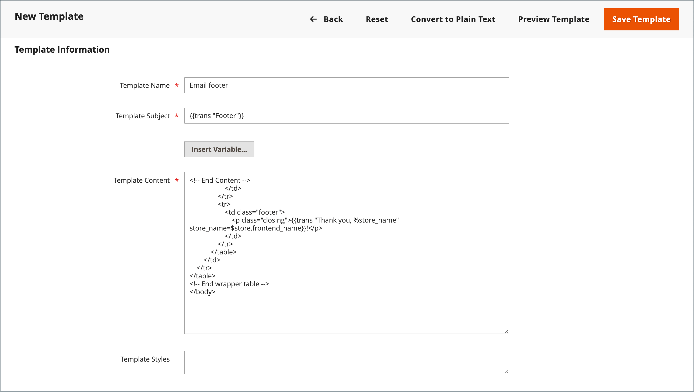

# 이메일 템플릿 사용자 지정

Commerce에는 시스템에서 전송하는 각 메시지의 본문 섹션에 대한 기본 이메일 템플릿이 포함되어 있습니다. 본문 콘텐츠의 템플릿은 머리글 및 바닥글 템플릿과 결합하여 전체 메시지를 작성합니다. 콘텐츠는 HTML 및 CSS로 포맷되며, 추가하여 쉽게 편집하고 맞춤화할 수 있습니다 [변수](variables-predefined.md) 및 [위젯](../content-design/widgets.md). 각 웹 사이트, 스토어 또는 스토어 보기에 대해 이메일 템플릿을 사용자 지정할 수 있습니다. 사용자 지정 템플릿을 사용하는 경우 [시스템 구성](email-templates.md#configure-email-templates) 올바른 템플릿이 사용되는지 확인합니다.

{width="500" zoomable="yes"}

기본 템플릿에는 로고 및 저장소 정보가 포함되며 추가 사용자 지정 없이 사용할 수 있습니다. 그러나 우수 사례로서, 각 템플릿을 보고 고객에게 보내기 전에 필요한 사항을 변경해야 합니다.

- [헤더 템플릿](email-template-custom.md#header-template)
- [바닥글 템플릿](email-template-custom.md#footer-template)
- [메시지 템플릿](email-template-custom.md#message-templates)

{width="700" zoomable="yes"}

## 템플릿 정보

| 필드 | 설명 |
| ----- | ----------- |
| [!UICONTROL Template Name] | 사용자 지정 템플릿의 이름입니다. |
| [!UICONTROL Insert Variable] | 커서 위치에서 템플릿에 변수를 삽입합니다. |
| [!UICONTROL Template Subject] | 템플릿 제목은 제목 열에 표시되며, 목록에서 템플릿을 정렬 및 필터링하는 데 사용할 수 있습니다. |
| [!UICONTROL Template Content] | HTML 내 템플릿의 콘텐츠입니다. |
| [!UICONTROL Template Styles] | 템플릿 형식을 지정하는 데 필요한 모든 CSS 스타일 선언은 _[!UICONTROL Template Styles]_상자. |

{style="table-layout:auto"}

## 헤더 템플릿

완료 후 [구성](email-templates.md#configure-email-templates), 이메일 헤더 템플릿에는 스토어에 연결된 로고가 포함됩니다. HTML에 대한 기본 지식이 있으면 쉽게 사용할 수 있습니다 [사전 정의된 변수](variables-predefined.md) 헤더에 스토어 연락처 정보를 추가합니다.

### 1단계. 기본 템플릿 로드

1. 다음에서 _관리자_ 사이드바, 이동 **[!UICONTROL Marketing]** > _[!UICONTROL Communications]_>**[!UICONTROL Email Templates]**.

1. 클릭 **[!UICONTROL Add New Template]**.

1. 다음에서 **[!UICONTROL Load default template]** 섹션에서 **[!UICONTROL Template]** 선택기 및 선택 `Magento_Email` > `Header`.

   {width="600" zoomable="yes"}

1. 클릭 **[!UICONTROL Load Template]**.

   템플릿의 HTML 코드와 변수가 양식에 나타납니다.

### 2단계. 템플릿 사용자 정의

1. 다음을 입력합니다. **[!UICONTROL Template Name]** 사용자 지정 헤더에 사용할 수 있습니다.

1. 입력 **[!UICONTROL Template Subject]** 템플릿을 구성하는 데 도움이 됩니다.

   그리드에서 템플릿 목록을 정렬 및 필터링할 수 있는 기준: _[!UICONTROL Subject]_열.

   {width="600" zoomable="yes"}

1. 다음에서 **[!UICONTROL Template Content]** 상자에서 필요에 따라 HTML을 수정합니다.

   >[!NOTE]
   >
   >템플릿 코드에서 작업할 때는 이중 중괄호로 묶인 항목을 덮어쓰지 않도록 주의하십시오.

1. 를 삽입하려면 [변수](variables-reference.md)를 클릭하고 변수를 배치할 코드에 커서를 놓고 을 클릭합니다 **[!UICONTROL Insert Variable]**.

1. 삽입할 변수를 선택합니다.

   {width="600" zoomable="yes"}

   변수를 선택하면 [태그](markup-tags.md) 변수에 대한 가 코드에 삽입됩니다.

   저장소 이메일 주소 변수가 헤더에 가장 자주 포함되는 변수이지만 시스템 또는 [사용자 지정 변수](variables-custom.md) 템플릿에 직접 액세스합니다.

1. CSS 선언을 해야 하는 경우 **[!UICONTROL Template Styles]** 상자.

1. 작업을 검토할 준비가 되면 다음을 클릭합니다. **[!UICONTROL Preview Template]**.

   필요한 경우 템플릿을 변경합니다.

1. 완료되면 다음을 클릭하십시오. **[!UICONTROL Save Template]**.

   이제 사용자 지정 헤더가 사용 가능한 이메일 템플릿 목록에 표시됩니다.

### 3단계. 구성 업데이트

1. 다음에서 _관리자_ 사이드바, 이동 **[!UICONTROL Content]** > _[!UICONTROL Design]_>**[!UICONTROL Configuration]**.

1. 격자에서 구성할 저장소 보기를 찾아 를 클릭합니다 **[!UICONTROL Edit]** 다음에서 _[!UICONTROL Action]_열.

1. 아래로 스크롤하고 확장합니다.  다음 **[!UICONTROL Transactional Emails]** 섹션.

1. 다음을 선택합니다. **[!UICONTROL Header Template]** 이메일 알림의 기본값으로 사용됩니다.

1. 완료되면 다음을 클릭하십시오. **[!UICONTROL Save Config]**.

{width="600" zoomable="yes"}

## 바닥글 템플릿

이메일 템플릿 바닥글에는 이메일 메시지의 닫는 줄과 서명란이 포함되어 있습니다. 스타일에 맞게 닫기를 변경하고 회사 이름과 주소 등의 추가 정보를 이름 아래에 추가할 수 있습니다.

### 1단계. 기본 템플릿 로드

1. 다음에서 _관리자_ 사이드바, 이동 **[!UICONTROL Marketing]** > _[!UICONTROL Communications]_>**[!UICONTROL Email Templates]**.

1. 클릭 **[!UICONTROL Add New Template]**.

1. 다음에서 **[!UICONTROL Load default template]** 섹션에서 **[!UICONTROL Template]** 선택기 및 선택 `Magento_Email` > `Footer`.

1. 클릭 **[!UICONTROL Load Template]**.

   템플릿의 HTML 코드와 변수가 양식에 나타납니다.

### 2단계. 템플릿 사용자 정의 및 미리 보기

1. 다음을 입력합니다. **[!UICONTROL Template Name]** 사용자 지정 바닥글에 사용됩니다.

1. 입력 **[!UICONTROL Template Subject]** 템플릿을 구성하는 데 도움이 됩니다.

   그리드에서 템플릿은 _[!UICONTROL Subject]_열.

   {width="600" zoomable="yes"}

1. 다음에서 **[!UICONTROL Template Content]** 상자에서 필요에 따라 HTML을 수정합니다.

   >[!NOTE]
   >
   >템플릿 코드에서 작업할 때는 이중 중괄호로 묶인 항목을 덮어쓰지 않도록 주의하십시오.

1. 를 삽입하려면 [변수](variables-reference.md)를 클릭하고 변수를 배치할 코드에 커서를 놓고 을 클릭합니다 **[!UICONTROL Insert Variable]**.

1. 삽입할 변수를 선택합니다.

   변수를 선택하면 [태그](markup-tags.md) 변수에 대한 가 코드에 삽입됩니다.

   연락처 저장 변수가 바닥글에 가장 많이 포함된 변수이지만 모든 시스템에 대한 코드나 [사용자 지정 변수](variables-custom.md) 템플릿에 직접 액세스합니다.

1. CSS 선언을 해야 하는 경우 **[!UICONTROL Template Styles]** 상자.

### 3단계. 구성 업데이트

1. 다음에서 _관리자_ 사이드바, 이동 **[!UICONTROL Content]** > _[!UICONTROL Design]_>**[!UICONTROL Configuration]**.

1. 격자에서 구성할 저장소 보기를 찾아 를 클릭합니다 **[!UICONTROL Edit]** 다음에서 _[!UICONTROL Action]_열.

1. 아래로 스크롤하고 확장합니다.  다음 **[!UICONTROL Transactional Emails]** 섹션.

1. 다음을 선택합니다. **[!UICONTROL Footer Template]** 이메일 알림에서 기본 바닥글로 사용됩니다.

1. 완료되면 다음을 클릭하십시오. **[!UICONTROL Save Config]**.

{width="600" zoomable="yes"}

## 메시지 템플릿

각 메시지의 본문을 사용자 지정하는 프로세스는 머리글이나 바닥글을 사용자 지정하는 프로세스와 동일합니다. 유일한 차이점은 알림을 트리거하는 각 활동 또는 이벤트에 대한 메시지 템플릿입니다. 템플릿을 그대로 사용하거나 사용자의 음성과 브랜드에 맞게 사용자 지정할 수 있습니다. 템플릿 텍스트 외에도 다양한 선택이 가능합니다 [미리 정의됨](variables-predefined.md) 변수 및 [사용자 정의](variables-custom.md) 변수를 만들어 템플릿에 통합할 수 있습니다.

### 1단계. 기본 템플릿 로드

1. 다음에서 _관리자_ 사이드바, 이동 **[!UICONTROL Marketing]** > _[!UICONTROL Communications]_>**[!UICONTROL Email Templates]**.

1. 클릭 **[!UICONTROL Add New Template]**.

   {width="600" zoomable="yes"}

1. 다음을 수행합니다.

   - 아래 **[!UICONTROL Load default template]**, 을(를) 선택합니다. **[!UICONTROL Template]** 사용자 지정할 수 있습니다.

   - 클릭 **[!UICONTROL Load Template]**.

### 2단계. 템플릿 사용자 정의

1. 대상 **[!UICONTROL Template Name]**&#x200B;사용자 지정 템플릿의 이름을 입력합니다.

1. 필요한 경우 **[!UICONTROL Template Subject]**.

   이것은 메시지의 첫 번째 줄이며, 기본적으로 인사입니다. 그대로 두거나 좀 더 설명적인 내용을 입력할 수 있습니다.

1. 다음 사항에 유의하십시오. **[!UICONTROL Currently Used For]** 템플릿 경로(구성 업데이트에 사용되는 경로).

   {width="600" zoomable="yes"}

1. 다음에서 **[!UICONTROL Template Content]** 상자에서 필요에 따라 HTML을 수정합니다.

   콘텐츠는 HTML 태그, CSS 지시문, 변수 및 텍스트의 조합으로 구성됩니다.

   >[!NOTE]
   >
   >템플릿 코드에서 작업할 때는 이중 중괄호로 묶인 코드를 실수로 입력하지 않도록 주의하십시오.

1. 변수를 삽입하려면 변수를 표시할 코드에 커서를 놓습니다.

   변수 선택은 템플릿에 따라 다르며 허용되는 다음을 포함합니다 [미리 정의됨](variables-predefined.md) 및 [사용자 정의](variables-custom.md) 변수(사용 가능한 경우)

1. 클릭 **[!UICONTROL Insert Variable]** 삽입할 변수를 선택합니다.

   변수를 삽입하는 명령은 중괄호로 묶여 커서 위치에 있는 코드에 추가됩니다. For example:

   `customVar code=my_custom_variable`

1. CSS 선언을 하려면 **[!UICONTROL Template Styles]**.

   {width="600" zoomable="yes"}

   >[!NOTE]
   >
   >사용자 정의 스타일은 다음의 경우에만 이메일에 적용됩니다. `{{template config_path="design/email/header_template"}}` 이(가)에 있습니다. _[!UICONTROL Template Styles]_. 기본 헤더 템플릿 없이 사용자 지정 CSS를 사용하려면 다음 내에서 여기에 제공해야 합니다. `<style>` HTML 태그입니다.

### 3단계. 구성 업데이트

다음 _[!UICONTROL Currently Used For]_이동 경로는 템플릿이 사용되는 위치를 보여 줍니다. 이 예제에서 템플릿 구성은_[!UICONTROL Customer Configuration]_ 페이지, _[!UICONTROL Create New Account Options]_섹션 및_[!UICONTROL Default Welcome Email]_ 필드.

- 페이지 - [!UICONTROL Customer Configuration]
- 섹션 - [!UICONTROL Create New Account Options]
- 필드 - [!UICONTROL Default Welcome Email]

1. 다음에서 **[!UICONTROL Currently Used For]** 이동 경로 추적에서 링크를 클릭하여 템플릿 구성 페이지를 엽니다.

   {width="600" zoomable="yes"}

1. 확장  섹션을 참조하고 사용자 지정한 이메일 템플릿에 대한 필드를 찾습니다.

1. 지우기 **[!UICONTROL Use system value]** 확인란을 선택하고 사용자 지정 템플릿의 이름을 클릭합니다.

   {width="600" zoomable="yes"}

1. 완료되면 다음을 클릭하십시오. **[!UICONTROL Save Config]**.

1. 작업 영역 상단에 있는 메시지에서 **[!UICONTROL Cache Management]** 잘못된 캐시를 지웁니다.

### 4단계. 템플릿 미리 보기 및 저장

1. 작업을 검토할 준비가 되면 다음을 클릭합니다. **[!UICONTROL Preview Template]**.

1. 필요에 따라 템플릿을 업데이트합니다.

1. 완료되면 다음을 클릭하십시오. **[!UICONTROL Save Template]**.

   이제 사용자 지정 템플릿을 이메일 템플릿 목록에서 사용할 수 있습니다.
