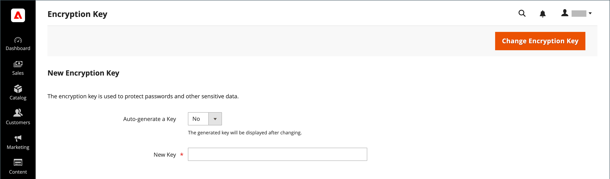

# 암호화 키

Adobe Commerce과 Magento Open Source은 암호 및 기타 민감한 데이터를 보호하기 위해 암호화 키를 사용합니다. 업계 표준 [!DNL ChaCha20-Poly1305] 알고리즘은 암호화가 필요한 모든 데이터를 암호화하기 위해 256비트 키와 함께 사용됩니다. 여기에는 신용 카드 데이터 및 통합(결제 및 배송 모듈) 암호가 포함됩니다. 또한 강력한 보안 해시 알고리즘(SHA-256)을 사용하여 암호 해독이 필요하지 않은 모든 데이터를 해시합니다.

초기 설치 중에 Commerce에서 암호화 키를 생성하거나 사용자 키 중 하나를 입력하라는 메시지가 표시됩니다. 암호화 키 도구를 사용하면 필요에 따라 키를 변경할 수 있습니다. 보안을 향상하기 위해 암호화 키를 정기적으로 변경해야 하며, 언제든지 원본 키가 손상될 수 있습니다. 키가 변경될 때마다 모든 기존 데이터는 새 키를 사용하여 다시 인코딩됩니다.

기술 정보는 다음을 참조하십시오. [고급 온-프레미스 설치](https://experienceleague.adobe.com/docs/commerce-operations/installation-guide/advanced.html) 다음에서 _설치 안내서_.

## 1단계: 파일을 쓰기 가능 상태로 만들기

암호화 키를 변경하려면 다음 파일에 쓸 수 있는지 확인하십시오. `[your store]/app/etc/env.php`

## 2단계: 암호화 키 변경

1. 다음에서 _관리자_ 사이드바, 이동 **[!UICONTROL System]** > _[!UICONTROL Other Settings]_>**[!UICONTROL Manage Encryption Key]**.

   {width="700" zoomable="yes"}

1. 다음 중 하나를 수행합니다.

   - 새 키를 생성하려면 를 설정합니다. **[!UICONTROL Auto-generate Key]** 끝 `Yes`.
   - 다른 키를 사용하려면 을 설정합니다. **[!UICONTROL Auto-generate Key]** 끝 `No`. 그런 다음 **[!UICONTROL New Key]** 필드에서 사용할 키를 입력하거나 붙여넣습니다.

1. 클릭 **[!UICONTROL Change Encryption Key]**.

1. 새 키를 안전한 위치에 기록하십시오.

   파일에 문제가 발생하는 경우 데이터를 해독해야 합니다.
