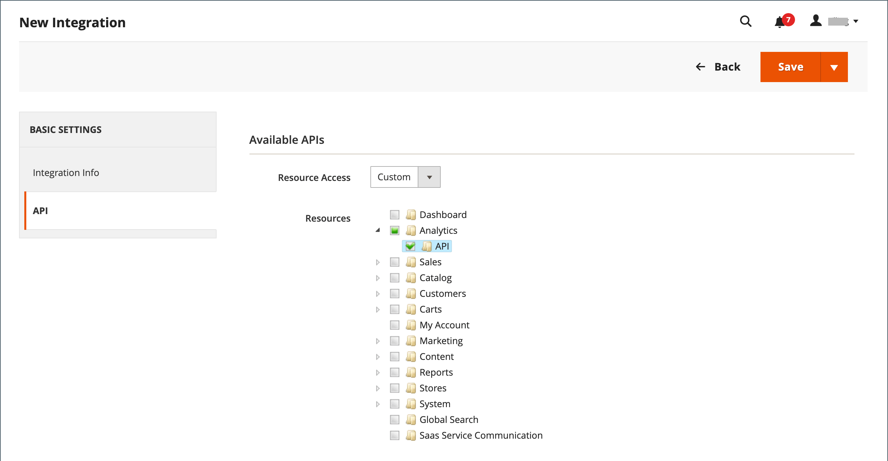

# 통합

Commerce 관리에서 통합을 정의하면 서드파티 통합을 위한 OAuth 자격 증명 및 리디렉션 URL의 위치가 설정되고 통합에 필요한 사용 가능한 API 리소스가 식별됩니다. 통합 등록 프로세스에 대한 자세한 내용은 Commerce 개발자 설명서에서 [OAuth 기반 인증](https://developer.adobe.com/commerce/webapi/get-started/authentication/gs-authentication-oauth/)을 참조하십시오.

{width="700" zoomable="yes"}

## 온보딩 워크플로우

1. **통합 승인** - **[!UICONTROL System]** > _[!UICONTROL Extensions]_>**[!UICONTROL Integrations]**페이지로 이동하여 관련 통합을 찾은 다음 권한을 부여합니다.
1. **로그인 확인 및 설정** - 메시지가 표시되면 요청된 액세스 권한을 수락합니다. 서드파티로 리디렉션되면 시스템에 로그인하거나 계정을 만듭니다. 로그인에 성공하면 통합 페이지로 돌아갑니다.
1. **인증된 통합의 확인을 받습니다** - 시스템이 통합이 인증되었음을 알리는 알림을 보냅니다. 통합을 설정하고 자격 증명을 받은 후 더 이상 액세스 또는 요청 토큰에 대한 호출을 수행할 필요가 없습니다.

## 통합 추가

1. _관리자_ 사이드바에서 **[!UICONTROL System]** > _[!UICONTROL Extensions]_>**[!UICONTROL Integrations]**(으)로 이동합니다.

   {width="600" zoomable="yes"}

1. 다음 통합 정보를 입력합니다.

   - 통합의 **[!UICONTROL Name]**&#x200B;과(와) 연락처 **[!UICONTROL Email]** 주소를 입력하십시오.

   - 토큰 교환에 OAuth를 사용할 때 OAuth 자격 증명을 보낼 수 있는 **[!UICONTROL Callback URL]**&#x200B;을(를) 입력하십시오. `https://`을(를) 사용하는 것이 좋습니다.

   - 이러한 Adobe Commerce 또는 Magento Open Source 통합 자격 증명을 사용하여 사용자를 서드파티 계정으로 리디렉션하려면 **[!UICONTROL Identity Link URL]**&#x200B;을(를) 입력하십시오.

   >[!NOTE]
   >
   > `Integration not secure` 경고 레이블은 HTTPS URL이 [!UICONTROL Callback URL] 및 [!UICONTROL Identity Link URL] 필드에 저장될 때까지 [!UICONTROL Integrations] 그리드의 각 통합 이름 근처에 미리 알림으로 표시됩니다.

   - 메시지가 표시되면 암호를 입력하여 ID를 확인합니다.

1. 왼쪽 패널에서 **[!UICONTROL API]**&#x200B;을(를) 선택하고 다음을 수행합니다.

   - **[!UICONTROL Resource Access]**&#x200B;을(를) 다음 중 하나로 설정합니다.

      - `All`
      - `Custom`

   - 사용자 지정 액세스의 경우 필요한 각 리소스의 확인란을 선택합니다.

     {width="600" zoomable="yes"}

1. 완료되면 **[!UICONTROL Save]**&#x200B;을(를) 클릭합니다.

## 통합 활성화

기본적으로 저장된 통합은 `Inactive` 상태로 그리드에 표시됩니다. 활성화하려면 다음 단계를 완료하십시오.

1. _관리자_ 사이드바에서 **[!UICONTROL System]** > _[!UICONTROL Extensions]_>**[!UICONTROL Integrations]**(으)로 이동합니다.

1. 새로 만든 통합을 찾아 **[!UICONTROL Activate]** 링크를 클릭합니다.

1. 오른쪽 상단에서 **[!UICONTROL Allow]**&#x200B;을(를) 클릭합니다.

   이 작업은 확장을 위한 통합 토큰을 표시합니다. 이 정보를 통합에 사용할 안전하고 암호화된 위치에 복사합니다.

   {width="600" zoomable="yes"}

1. 오른쪽 상단에서 **[!UICONTROL Done]**&#x200B;을(를) 클릭합니다.

## 통합 재인증

새 통합 액세스 토큰 및 액세스 토큰 암호를 생성하려면 관리자로부터 통합을 다시 승인하십시오.

1. _관리자_ 사이드바에서 **[!UICONTROL System]** > _[!UICONTROL Extensions]_>**[!UICONTROL Integrations]**(으)로 이동합니다.

1. **[!UICONTROL Active]** 상태와의 통합을 찾습니다.

1. _[!UICONTROL Activate]_열에서&#x200B;**[!UICONTROL Reauthorize]**을(를) 클릭합니다.

1. API 리소스에 대한 액세스를 승인하려면 **[!UICONTROL Reauthorize]**&#x200B;을(를) 클릭하십시오.

1. 확장에 대한 새 통합 토큰을 저장하고 **[!UICONTROL Done]**&#x200B;을(를) 클릭합니다.

## API 게스트 액세스 보안 설정 변경

기본적으로 시스템에서는 CMS, 카탈로그 및 기타 저장소 리소스에 대한 익명 게스트 액세스를 허용하지 않습니다. 설정을 변경해야 하는 경우 다음을 수행합니다.

1. _관리자_ 사이드바에서 **[!UICONTROL Stores]** > _[!UICONTROL Settings]_>**[!UICONTROL Configuration]**(으)로 이동합니다.

1. 왼쪽 패널에서 **[!UICONTROL Services]**&#x200B;을(를) 확장하고 **[!UICONTROL Magento Web API]**&#x200B;을(를) 선택합니다.

1. **[!UICONTROL Web API Security Setting]** 섹션에서 를 확장합니다.

   {width="600" zoomable="yes"}

1. **[!UICONTROL Allow Anonymous Guest Access]**&#x200B;을(를) `Yes`(으)로 설정합니다.

1. 완료되면 **[!UICONTROL Save Config]**&#x200B;을(를) 클릭합니다.

자세한 내용은 Commerce 개발자 설명서에서 [익명 웹 API에 대한 액세스 제한](https://developer.adobe.com/commerce/webapi/rest/use-rest/anonymous-api-security/)을 참조하십시오.

## 통합 삭제

1. _관리자_ 사이드바에서 **[!UICONTROL System]** > _[!UICONTROL Extensions]_>**[!UICONTROL Integrations]**(으)로 이동합니다.

1. 기존 통합을 찾아 **[!UICONTROL Delete]** 열에서 아이콘()을 클릭합니다.

1. 작업을 확인하려면 **[!UICONTROL OK]**&#x200B;을(를) 클릭합니다.
