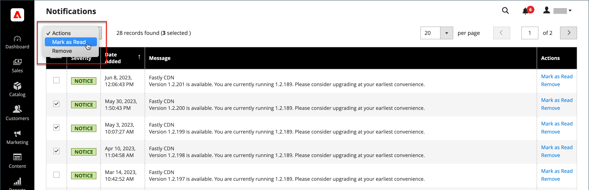

# 시스템 알림

다음 _알림_ 페이지 에는 심각도별로 순위가 매겨진 모든 메시지가 나열되며, 가장 최근 메시지는 맨 위에 있습니다. 작업 명령을 사용하여 개별 메시지를 읽은 상태로 표시하거나 자세한 정보를 보거나 받은 편지함에서 메시지를 제거할 수 있습니다.

1. 다음 중 하나를 수행하여 _[!UICONTROL Notifications]_페이지:

   - 다음을 클릭합니다. _알림_ 아이콘으로 표시됩니다. 새 메시지가 하나 이상 표시되면 **[!UICONTROL See All]**.

   - 다음에서 _관리자_ 사이드바, 이동 **[!UICONTROL System]** > _[!UICONTROL Other Settings]_>**[!UICONTROL Notifications]**.

1. 다음에서 **[!UICONTROL Action]** column에서 다음 중 하나를 수행합니다.

   - 자세한 내용을 보려면 **[!UICONTROL Read Details]** 링크된 페이지를 새 창에서 엽니다.

   - 메시지를 받은 편지함에 보관하려면 **[!UICONTROL Mark As Read]**.

     {width="700" zoomable="yes"}

   - 메시지를 삭제하려면 **[!UICONTROL Remove]**.

1. 여러 메시지에 작업을 적용하려면 다음 중 하나를 수행합니다.

   - 관리할 각 메시지에 대해 첫 번째 열의 확인란을 선택합니다.
   - 여러 메시지를 선택하려면 다음을 설정하십시오. **[!UICONTROL Mass Actions]** 필요에 따라 제어합니다.

1. 설정 **[!UICONTROL Actions]** 다음 중 하나를 제어하십시오.

   - `Mark as Read`
   - `Remove`

1. 클릭 **[!UICONTROL Submit]** 을 클릭하여 프로세스를 완료합니다.
