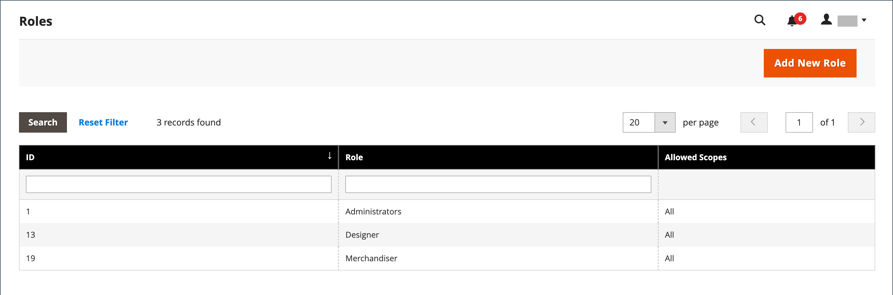
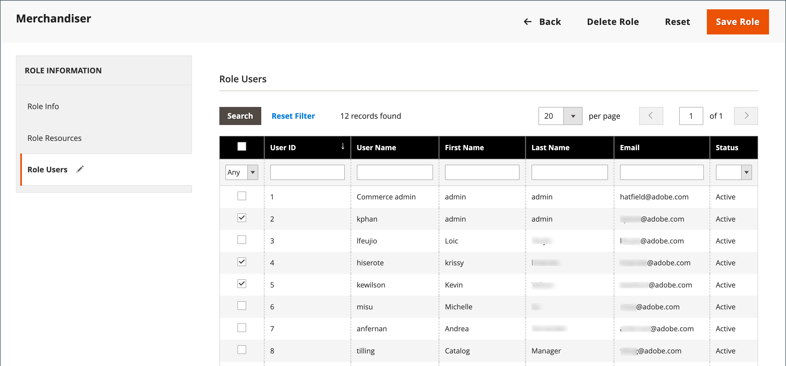

# 사용자 역할

누군가에게 관리자에 대한 제한된 액세스 권한을 부여하기 위한 첫 번째 단계는 적절한 수준의 권한이 있는 역할을 만드는 것입니다. 역할을 저장한 후 새 사용자를 추가하고 제한된 역할을 할당하여 관리자에게 제한된 액세스 권한을 부여할 수 있습니다.

{width="600" zoomable="yes"}

## 역할 정의

1. _관리자_ 사이드바에서 **[!UICONTROL System]** > _[!UICONTROL Permissions]_>**[!UICONTROL User Roles]**(으)로 이동합니다.

1. 오른쪽 상단에서 **[!UICONTROL Add New Role]**&#x200B;을(를) 클릭합니다.

1. 역할을 정의하는 단계를 완료합니다.

### 1단계: 역할 이름 추가

1. _[!UICONTROL Role Information]_&#x200B;에서 설명&#x200B;**[!UICONTROL Role Name]**&#x200B;을(를) 입력하십시오.

1. _[!UICONTROL Current User Identity Verification]_&#x200B;에서 암호를 입력하십시오.

   {width="600" zoomable="yes"}

### 2단계: 리소스 할당

>[!IMPORTANT]
>
>리소스를 할당할 때 주어진 역할에 대한 액세스를 제한하는 경우 권한 도구에 대한 액세스를 비활성화해야 합니다. 그렇지 않으면 사용자가 자신의 권한을 수정할 수 있습니다.

1. **[!UICONTROL Role Scopes]**&#x200B;을(를) 다음 중 하나로 설정합니다.

   - `All`
   - `Custom`

   다중 사이트 설치를 위해 `Custom`(으)로 설정된 경우 역할을 사용할 웹 사이트 및 저장소의 확인란을 선택합니다.

   {width="600" zoomable="yes"}

   >[!NOTE]
   >
   >`Custom` 역할 범위를 가진 사용자는 제한된 스토어에 할당된 경우 웹 사이트 및 범주를 만들거나, 제품을 범주에 할당하거나, _[!UICONTROL All Store Views]_&#x200B;범위에서 제품을 편집할 수 없습니다. 이러한 사용자는 액세스 권한이 없는 범위에 영향을 주는 다른_&#x200B;전역&#x200B;_작업도 수행할 수 없습니다.

1. _[!UICONTROL Roles Resources]_&#x200B;에서&#x200B;**[!UICONTROL Resource Access]**&#x200B;을(를) `Custom`(으)로 설정합니다.

   >[!NOTE]
   >
   >관리자에 로그인하는 데 2단계 인증(2FA)이 필요한 경우 이 역할에 대해 `Permissions` > `Two Factor Auth` 리소스를 사용하도록 설정해야 합니다. 그렇지 않으면 이 `Custom` 역할 범위를 사용하여 새로 만든 사용자가 처음으로 관리자에 액세스할 때 2FA를 설정할 수 없습니다.

1. **[!UICONTROL Resource]** 트리 구조에서 역할이 액세스할 수 있는 각 관리 기능의 확인란을 선택합니다.

   세금 설정에 액세스할 수 있는 관리자 역할을 생성하려면 판매/세금 및 시스템/세금 리소스를 모두 선택합니다. 기본 [배송 지점](../stores-purchase/shipping-settings.md#point-of-origin)과(와) 다른 지역에 대한 웹 사이트를 설정하는 경우 해당 역할에 대한 시스템/배송 리소스에 대한 액세스를 허용해야 합니다. 배송 설정에 따라 카탈로그 가격에 사용되는 스토어 세율이 결정됩니다.

   {width="600" zoomable="yes"}

   사용 가능한 권한 목록에는 번들 및 설치된 확장에 대한 추가 옵션이 포함될 수 있습니다. 각 기능에 대해 가장 높은 권한을 선택하면 사용자가 사용할 수 있는 모든 권한이 할당됩니다.

   >[!NOTE]
   >
   >**[!UICONTROL Sales / Archive]**, _[!UICONTROL Invoices]_&#x200B;및_[!UICONTROL Credit Memos]_ 순서 _[!UICONTROL Shipments]_&#x200B;탭[을 보려면 관리자 사용자에게 역할 범위에 대한 &#x200B;](../stores-purchase/order-processing.md) 권한이 있어야 합니다.

1. 완료되면 **[!UICONTROL Save Role]**&#x200B;을(를) 클릭합니다.

   이제 역할이 표에 표시되며 사용자 계정에 할당할 수 있습니다.

## 사용자에게 역할 할당

1. _[!UICONTROL Roles]_&#x200B;그리드에서 레코드를 편집 모드로 엽니다.

1. _[!UICONTROL Current User Identity Verification]_&#x200B;에서 사용자 계정 암호를 입력합니다.

1. 왼쪽 패널에서 **[!UICONTROL Role Users]**&#x200B;을(를) 선택합니다.

   _[!UICONTROL Role Users]_&#x200B;옵션은 새 역할이 저장된 후에만 나타납니다.

   {width="600" zoomable="yes"}

1. 특정 사용자 레코드를 검색하려면 다음을 수행합니다.

   - 열 맨 위에 있는 검색 필터에 값을 입력하고 **Enter**&#x200B;를 누릅니다.

   - 전체 목록으로 돌아갈 준비가 되면 **[!UICONTROL Reset Filter]**&#x200B;을(를) 클릭합니다.

1. 역할에 할당할 사용자의 확인란을 선택합니다.

1. **[!UICONTROL Save Role]**&#x200B;을(를) 클릭합니다.

## 역할 편집

1. _관리자_ 사이드바에서 **[!UICONTROL System]** > _[!UICONTROL Permissions]_>**[!UICONTROL User Roles]**(으)로 이동합니다.

1. 그리드 위에 있는 필터를 사용하여 역할을 찾은 다음 역할 이름을 클릭합니다.

1. 필요한 사항을 변경합니다.

   역할 설정에 대한 자세한 내용은 사용자 역할 만들기 단계를 검토하십시오.

1. 메시지가 표시되면 암호를 입력하여 ID를 확인합니다.

1. **[!UICONTROL Save Role]**&#x200B;을(를) 클릭합니다.

## 역할 삭제

1. _관리자_ 사이드바에서 **[!UICONTROL System]** > _[!UICONTROL Permissions]_>**[!UICONTROL User Roles]**(으)로 이동합니다.

1. 그리드 위에서 필터를 사용하여 역할을 찾은 다음 편집 모드에서 엽니다.

1. 오른쪽 상단에서 **[!UICONTROL Delete Role]**&#x200B;을(를) 클릭합니다.

1. 작업을 확인하려면 **[!UICONTROL OK]**&#x200B;을(를) 클릭합니다.

## 사용자 역할 데모

이 비디오를 통해 사용자 역할 관리에 대해 알아보십시오.

>[!VIDEO](https://video.tv.adobe.com/v/343654?quality=12&learn=on)

## 역할 리소스

다음 리소스에 대한 액세스 권한을 사용자 지정 역할에 할당할 수 있습니다. 각 리소스와 연결된 기능에 대한 자세한 내용은 연결된 페이지를 참조하십시오.

 - Adobe Commerce 전용

 - Adobe Commerce B2B에서만 사용 가능

| 리소스 |   |   |
| --- | --- | --- |
| [`Dashboard`](../getting-started/admin-dashboard.md) |  |  |
| [`Sales`](../stores-purchase/sales-menu.md) | [`Operations`](../stores-purchase/orders.md) |  |
|  | [`Quotes`](../b2b/quotes.md)   [`Orders`](../stores-purchase/orders.md) [`Invoices`](../stores-purchase/invoices.md) [`Shipments`](../stores-purchase/shipments.md) [`Credit Memos`](../stores-purchase/credit-memos.md) [`Billing Agreements`](../stores-purchase/paypal-billing-agreements.md) [`Returns`](../stores-purchase/returns.md)  [`Transactions`](../stores-purchase/transactions.md) |
|  | [`Archive`](action-log-archive.md)![Adobe Commerce] |  |
|  | [`Shopping Cart Management`](../stores-purchase/cart.md) |  |
| [`Catalog`](../catalog/catalog-menu.md) | [`Category Permissions`](../catalog/categories.md)  |  |
|  | [`Inventory`](../inventory-management/introduction.md) | [`Products`](../catalog/products-list.md) [`Categories`](../catalog/categories.md) |
|  | [`Shared Catalog`](../b2b/catalog-shared-create.md)  | [`Manage Shared Catalog`](../b2b/catalog-shared-manage.md) |
| [`Customers`](../customers/guide-overview.md) | [`All Customers`](../customers/customers-all.md) [`Now Online`](../customers/now-online.md) [`Customer Groups`](../customers/customer-groups.md) [`Segments`](../customers/customer-segments.md)  |  |
|  | [`Login as Customer`](../customers/login-as-customer.md) | `Allow Login as Customer Button` `View Login as Customer Log`  |
|  | [`Companies`](../b2b/account-companies.md)  | [`Manage Companies`](../b2b/account-company-manage.md)  `Add New Company`  `Delete Company`  `Reimburse Balance` |
| [`Carts`](../stores-purchase/shopping-assisted-cart-manage.md) | [`Manage carts`](../stores-purchase/shopping-assisted-cart-manage.md) |  |
| [`My Account`](../customers/account-dashboard-my-account.md) |  |  |
| [`Marketing`](../merchandising-promotions/marketing-menu.md) | [`Promotions`](../merchandising-promotions/marketing-menu.md#uicontrol-promotions) | [`Catalog Price Rule`](../merchandising-promotions/price-rules-catalog.md)  [`Cart Price Rules`](../merchandising-promotions/price-rules-cart.md)  [`Related Products Rules`](../merchandising-promotions/product-related-rules.md) [`Gift Card Accounts`](../stores-purchase/product-gift-card-accounts.md)  |
|  | [`Private Sales`](../merchandising-promotions/events-private-sales.md)  | [`Events`](../merchandising-promotions/event-create.md)  [`Invitations`](../merchandising-promotions/invitations.md) |
|  | `Communications` | [`Email Templates`](email-templates.md)  [`Newsletter Template`](../merchandising-promotions/newsletter-template.md)  [`Newsletter Queue`](../merchandising-promotions/newsletter-queue.md)  [`Newsletter Subscribers`](../merchandising-promotions/newsletter-subscribers.md)  [`Email Reminders`](../merchandising-promotions/email-reminder-rules.md) |
|  | `Sales Channel` | [`Amazon Sales Channel`](https://experienceleague.adobe.com/docs/commerce-channels/amazon/overview.html) |
|  | [`SEO & Search`](../merchandising-promotions/marketing-menu.md#uicontrol-seo--search) | [`Search Terms`](../catalog/search-terms.md)  [`Search Synonyms`](../catalog/search-terms.md#search-synonyms)  [`URL Rewrites`](../merchandising-promotions/url-rewrite-custom.md)  [`Site Map`](../merchandising-promotions/sitemap-xml.md) |
|  | [`User Content`](../merchandising-promotions/product-reviews-moderate.md) | [`All Reviews`](../merchandising-promotions/product-reviews.md)  [`Pending Reviews`](../merchandising-promotions/product-reviews-moderate.md)   |  |
| [`Content`](../content-design/content-menu.md) | [`Elements`](../content-design/content-menu.md#uicontrol-elements)) | [`Pages`](../content-design/pages.md) [`Hierarchy`](../content-design/page-hierarchy.md)  [`Blocks`](../content-design/blocks.md) [`Dynamic Blocks`](../content-design/dynamic-blocks.md)  [`Widgets`](../content-design/widgets.md) [`Media Gallery`](../content-design/media-gallery.md) |  |
|  | [`Design`](../content-design/introduction.md#design) | [`Themes`](../content-design/themes.md) [`Schedule`](../content-design/schedule.md) |  |
|  | [컨텐츠 스테이징](../content-design/content-staging.md)   |  |
| [`Reports`](../getting-started/reports-menu.md) | [`Marketing`](../getting-started/marketing-reports.md) | `Shopping Cart` [`Search Terms`](../catalog/search-terms.md#search-terms-report) `Newsletter Problem Reports` |  |
|  | [`Reviews`](../getting-started/review-reports.md)  |  |
|  | [`Sales`](../getting-started/sales-reports.md) |  |
|  | `System Insights`  | [`Site-Wide Analysis Tool`](https://experienceleague.adobe.com/docs/commerce-operations/tools/site-wide-analysis-tool/access.html) |
|  | [`Customers`](../getting-started/customer-reports.md) [`Products`](../getting-started/product-reports.md) [`Private Sales`](../getting-started/private-sales-reports.md)  [`Statistics`](../getting-started/reports-menu.md#uicontrol-statistics) [`Business Intelligence`](../getting-started/business-intelligence.md) |  |
| [`Stores`](../stores-purchase/stores.md) | [`Settings`](../stores-purchase/stores-menu.md) | [`All Stores`](../stores-purchase/stores.md) [`Configuration`](../configuration-reference/guide-overview.md) [`Terms and Conditions`](../stores-purchase/terms-and-conditions.md) [`Order Status`](../stores-purchase/order-status.md) |  |
|  | [`Inventory`](../inventory-management/sources-stocks.md) | [`Sources`](../inventory-management/sources-manage.md) [`Stocks`](../inventory-management/stocks-manage.md) |  |
|  | [`Taxes`](../stores-purchase/taxes.md) |  |  |
|  | [`Currency`](../stores-purchase/currency.md) | [`Currency Rates`](../stores-purchase/currency-update.md) [`Currency Symbols`](../stores-purchase/currency-configuration.md#step-5-customize-currency-symbols-optional) |  |
|  | [`Attributes`](../catalog/product-attributes.md) | [`Product`](../catalog/attribute-product-create.md) [`Update Attributes`](../catalog/attribute-product-create.md) [`Attribute Set`](../catalog/attribute-sets.md) [`Ratings`](../merchandising-promotions/product-reviews.md#create-custom-ratings) |
|  | [`Other Settings`](../stores-purchase/stores-menu.md) | [`Customer Groups`](../customers/customer-groups.md) |
| [`System`](system-menu.md) | [`Data Transfer`](data-transfer.md) | [`Import`](data-import.md) [`Export`](data-export.md) [`Import/Export Tax Rates`](data-transfer-tax-rates.md) [`Import History`](data-import.md#import-history) |  |
|  | [`Magento Connect`](../getting-started/commerce-marketplace.md) | `Connect Manager` `Package Extensions` |  |
|  | [`Tools`](system-menu.md#tools) | [`Cache Management`](cache-management.md) [`Backups`](backups.md) [`Index Management`](index-management.md) [`Change Indexer Mode`](index-management.md) |  |
|  | [`Permissions`](permissions.md) | [`All Users`](permissions-users-all.md) [`Locked Users`](permissions-users-all.md#locked-users) [`User Roles`](permissions-user-roles.md) |
| [`Action Log`](action-log.md) | [`Report`](action-log.md) [`Archive`](action-log-archive.md) |
|  | [`Other Settings`](system-menu.md) | [`Notifications`](notifications.md) [`Custom Variables`](variables-custom.md) [`Manage Encryption Key`](encryption-key.md) |  |
| [`Global Search`](../getting-started/admin-workspace.md#workspace-search) |  |  |

{style="table-layout:auto"}
