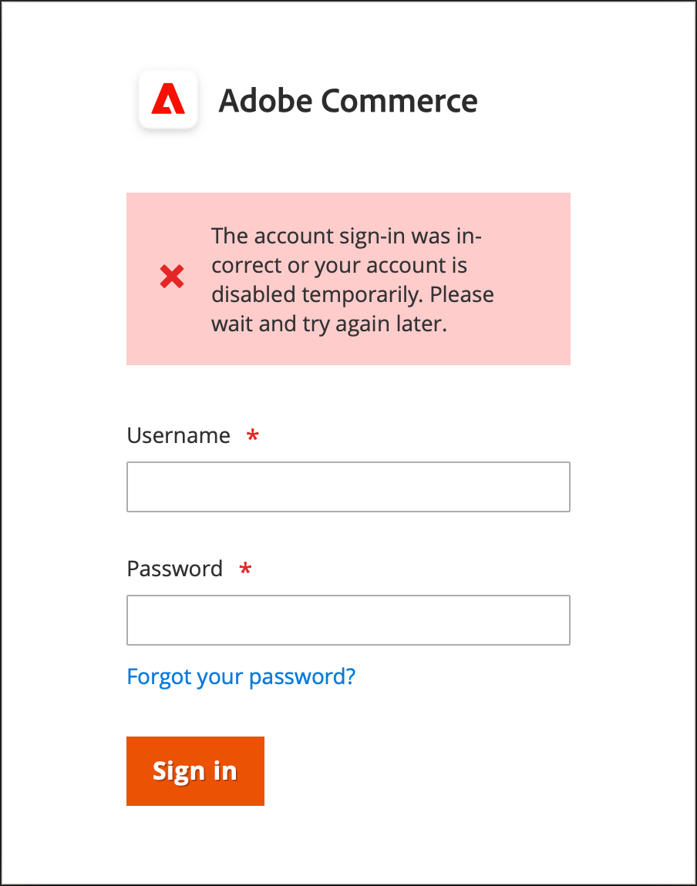
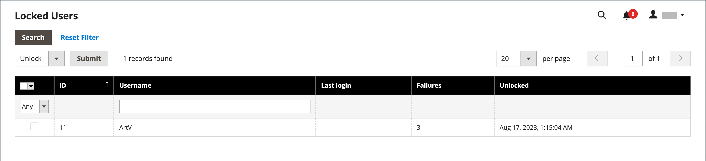

# 관리 사용자 계정 관리

스토어를 처음 설치하면 전체 관리 액세스 권한을 제공하는 로그인 자격 증명으로 기본 관리자 계정이 만들어집니다. 가장 좋은 방법은 전체 관리자 액세스 권한을 가진 다른 사용자 계정을 만드는 것입니다. 그렇게 하면 일상적인 관리 활동에 대해 하나의 계정을 사용하고 다른 계정을 &quot;슈퍼 관리자&quot; 계정으로 예약할 수 있습니다. 이 기능은 일반 자격 증명을 잊어버렸거나 자격 증명을 사용할 수 없게 된 경우 유용합니다.

다른 팀원이나 서비스 공급자가 액세스 권한이 필요한 경우 해당 사용자의 개별 사용자 계정을 만들고 특정 비즈니스 요구 사항에 따라 제한된 액세스 권한을 할당할 수 있습니다. 관리자가 액세스할 수 있는 웹 사이트 또는 스토어를 제한하려면 먼저 범위가 제한된 [역할을 만들고](permissions-user-roles.md) 필요한 리소스만 선택해야 합니다. 그런 다음 특정 사용자 계정에 역할을 할당할 수 있습니다. 제한된 역할에 할당된 관리자는 역할과 연결된 웹 사이트 또는 스토어에 대한 데이터만 보고 변경할 수 있지만 전역 설정이나 데이터는 변경할 수 없습니다.

>[!NOTE]
>
>Adobe ID을 보유하고 있으며 Adobe Commerce 및 Adobe 비즈니스 제품에 간소화된 로그인을 원하는 Adobe Commerce 판매자는 Commerce 인증을 Adobe IMS 인증 워크플로와 통합할 수 있습니다. Commerce 스토어에 대해 이 통합이 활성화되면 각 관리자는 Commerce 자격 증명이 아닌 Adobe 자격 증명을 사용하여 로그인해야 합니다. [Adobe IMS(Identity Management 서비스) 통합 개요](https://experienceleague.adobe.com/docs/commerce-admin/start/admin/ims/adobe-ims-integration-overview.html?lang=ko)를 참조하세요.

일시적인 사용자 또는 역할의 경우 사용자 계정의 만료 날짜를 설정할 수도 있습니다.

<!--  update this to a better info-graphic  -->

## 사용자 만들기

1. _관리자_ 사이드바에서 **[!UICONTROL System]** > _[!UICONTROL Permissions]_>**[!UICONTROL All Users]**(으)로 이동합니다.

1. 오른쪽 상단에서 **[!UICONTROL Add New User]**&#x200B;을(를) 클릭합니다.

   기존 사용자를 편집하려면 그리드에서 사용자 이름을 클릭합니다. 필요에 따라 _[!UICONTROL User Info]_&#x200B;및_[!UICONTROL User Role]_ 섹션을 수정할 수 있습니다.

1. _[!UICONTROL Account Information]_&#x200B;섹션에서 다음을 수행합니다.

   {width="600" zoomable="yes"}

   - 계정의 **[!UICONTROL User Name]**&#x200B;을(를) 입력하십시오.

     사용자 이름은 기억하기 쉬워야 합니다. 대/소문자를 구분하지 않습니다. 예를 들어 사용자 이름이 `John`이면 `john`(으)로 로그인할 수도 있습니다.

   - 다음 정보를 입력합니다.

      - **[!UICONTROL First Name]**
      - **[!UICONTROL Last Name]**
      - **[!UICONTROL Email address]**

     각 사용자 계정에는 고유한 이메일 주소가 있어야 합니다.

   - 계정에 대한 **[!UICONTROL Password]**&#x200B;을(를) 입력하십시오.

     >[!NOTE]
     >
     >관리자 암호는 7자 이상이어야 하며 문자와 숫자를 모두 포함해야 합니다. 추가 암호 옵션은 [관리자 보안 구성](security-admin.md)을 참조하십시오.

   - **[!UICONTROL Password Confirmation]**&#x200B;에 대해 암호를 다시 입력하여 암호를 올바르게 입력했는지 확인하십시오.

   - 저장소에 여러 언어가 있는 경우 **[!UICONTROL Interface Locale]**&#x200B;을(를) 관리 인터페이스에 사용할 언어로 설정하십시오.

1. **[!UICONTROL This Account is]**&#x200B;을(를) `Active`(으)로 설정합니다.

1. 달력 아이콘을 클릭하여 사용자 계정의 **[!UICONTROL Expiration Date]**&#x200B;을(를) 설정합니다.

   만료 날짜 정의는 사용자 또는 역할이 임시적일 때 유용합니다. 만료 날짜 이후에 사용자 계정 상태가 `Inactive`(으)로 변경되며 필요한 경우 업데이트할 수 있습니다.

1. _[!UICONTROL Current User Identity Verification]_&#x200B;에서 사용자 계정 암호를 입력합니다.

>[!IMPORTANT]
>
>_[!UICONTROL Account Information]_&#x200B;섹션이 완료되면 사용자를 저장할 수 있습니다. 새 사용자가&#x200B;_[!UICONTROL Users]_ 그리드에 표시되지만 역할을 할당할 때까지 사용자 이름이 로그인할 수 없습니다.

## 사용자 역할 할당

1. 왼쪽 패널에서 **[!UICONTROL User Role]**&#x200B;을(를) 클릭합니다.

   그리드에 기존 사용자 역할이 모두 나열됩니다. 새 스토어의 경우 _[!UICONTROL Administrators]_&#x200B;역할만 사용할 수 있습니다.

   {width="600" zoomable="yes"}

1. _[!UICONTROL Assigned]_&#x200B;열에서 사용자 역할을 선택합니다.

   [기존 역할을 보거나 추가 사용자 역할을 정의할 수 있습니다](permissions-user-roles.md). 역할이 정의된 후에는 사용자 계정을 편집하여 새 역할을 할당해야 합니다.

## 2FA 공급자 확인 또는 재설정

1. 관리자 사용자 계정을 엽니다.

1. 왼쪽 패널에서 **[!UICONTROL 2FA]**&#x200B;을(를) 클릭합니다.

   {width="600" zoomable="yes"}

1. _관리자_ 사용자가 사용할 수 있는 2FA 솔루션을 확인하고 각 사용자에게 로그인할 때 사용할 솔루션을 설치하도록 알립니다.

   _관리자_&#x200B;에 로그인하려면 하나의 2FA 솔루션에서만 인증해야 합니다.

1. 사용자가 2FA 솔루션을 다시 설치해야 하는 경우 현재 2FA 구성을 재설정할 수 있습니다.

   이렇게 하려면 사용자가 설정 프로세스를 반복해야 다시 로그인할 수 있습니다. 예를 들어 사용자에게 새 스마트폰이 있을 수 있으므로 Google Authenticator를 다시 설치해야 합니다. 사용자의 현재 2FA 설정을 지우려면 지우려는 각 솔루션에 대해 **[!UICONTROL Reset (Provider)]**&#x200B;을(를) 클릭합니다. 메시지가 표시되면 **[!UICONTROL OK]**&#x200B;을(를) 클릭하여 확인합니다.

   사용자가 [2FA 구성](security-two-factor-authentication.md)에 대한 링크가 포함된 전자 메일을 받습니다. 링크는 한 번만 사용할 수 있습니다. 사용자가 여러 번 로그인하려고 하면 각 시도 후에 새 링크가 전송됩니다.

1. **[!UICONTROL Save User]**&#x200B;을(를) 클릭합니다.

1. 메시지가 표시되면 암호를 입력하여 ID를 확인한 다음 **[!UICONTROL Save User]**&#x200B;을(를) 다시 클릭합니다.

   _[!UICONTROL Users]_&#x200B;그리드가 열리고 모든 사용자가 나열됩니다.

## 관리자 삭제

1. _관리자_ 사이드바에서 **[!UICONTROL System]** > _[!UICONTROL Permissions]_>**[!UICONTROL All Users]**(으)로 이동합니다.

1. 그리드 위에 있는 필터를 사용하여 사용자 계정을 찾은 다음 사용자 이름을 클릭합니다.

1. 메시지가 표시되면 암호를 입력하여 ID를 확인합니다.

1. 오른쪽 상단에서 **[!UICONTROL Delete User]**&#x200B;을(를) 클릭합니다.

1. 작업을 확인하려면 **[!UICONTROL OK]**&#x200B;을(를) 클릭합니다.

## 암호 분실 및 이메일 재설정

관리자 이메일 템플릿 구성은 사용자가 암호를 잊어버리고 재설정할 때 전송되는 이메일을 결정합니다. 이 구성은 메시지를 보낸 사람으로 표시되는 저장소 연락처 및 암호 복구 링크가 유효한 상태로 유지되는 기간을 지정합니다.

**_관리자 전자 메일 서식 파일을 구성하려면:_**

1. _관리자_ 사이드바에서 **[!UICONTROL Stores]** > _[!UICONTROL Setting]_>**[!UICONTROL Configuration]**(으)로 이동합니다.

1. 왼쪽 패널에서 **[!UICONTROL Advanced]**&#x200B;을(를) 확장하고 **[!UICONTROL Admin]**&#x200B;을(를) 선택합니다.

1. **[!UICONTROL Admin User Emails]** 섹션에서 를 확장합니다.

   {width="600" zoomable="yes"}

1. 관리자가 암호를 잊어버렸을 때 보내는 템플릿에 **[!UICONTROL Forgot Password Email Template]**&#x200B;을(를) 설정합니다.

1. 메시지를 보낸 사람으로 표시되는 저장소 연락처로 **[!UICONTROL Forgot and Reset Email Sender]**&#x200B;을(를) 설정합니다.

1. 관리자 알림의 기본값으로 사용되는 전자 메일 서식 파일로 **[!UICONTROL User Notification Template]**&#x200B;을(를) 설정합니다.

1. 완료되면 **[!UICONTROL Save Config]**&#x200B;을(를) 클릭합니다.

## 잠긴 사용자

비즈니스 보안을 위해 관리자 계정에 [로그인](../getting-started/admin-signin.md)을 여섯 번 시도했으나 실패한 후에는 사용자 계정이 기본적으로 잠깁니다. 현재 잠긴 모든 사용자 계정이 잠긴 사용자 그리드에 나타납니다. 전체 관리자 권한이 있는 다른 사용자는 계정을 잠금 해제할 수 있습니다.

추가 암호 보안 조치는 [고급 관리자](../configuration-reference/advanced/admin.md#security) 구성에서 구현할 수 있습니다. [관리자 보안](security-admin.md)을 참조하세요.

{width="300"}

**_관리자 계정을 잠금 해제하려면:_**

1. _관리자_ 사이드바에서 **[!UICONTROL System]** > _[!UICONTROL Permissions]_>**[!UICONTROL Locked Users]**(으)로 이동합니다.

1. 그리드에서 잠긴 계정의 확인란을 선택합니다.

   {width="600" zoomable="yes"}

1. 왼쪽 상단 모서리에서 **[!UICONTROL Actions]**&#x200B;을(를) `Unlock`(으)로 설정합니다.

1. **[!UICONTROL Submit]**&#x200B;을(를) 클릭하여 계정의 잠금을 해제합니다.
