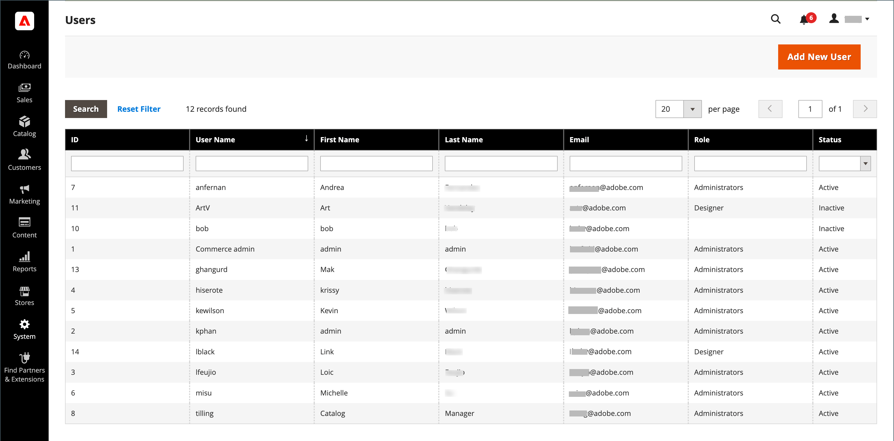

# 관리자 권한

Adobe Commerce 및 Magento Open Source은 역할 및 권한을 사용하여 관리자에 대한 다양한 액세스 수준을 만듭니다. 스토어를 처음 설정하면 전체 권한이 있는 관리자 역할에 대한 로그인 자격 증명 세트를 받게 됩니다. 그러나 사이트에서 작업하는 다른 사람에 대해 &quot;알아야 할 사항&quot;을 기준으로 권한 수준을 제한할 수 있습니다. 예를 들어 디자인 팀의 팀원에게는 콘텐츠 디자인 도구에만 액세스할 수 있고 고객 및 주문 정보가 있는 영역에는 액세스할 수 없습니다.

또한 특정 사이트 또는 사이트 집합 및 관련 데이터에 대한 관리자 액세스를 추가로 제한할 수 있습니다. 동일한 Commerce 설치에 별도의 스토어가 있는 여러 브랜드 또는 비즈니스 단위가 있는 경우, 각 비즈니스 단위에 대한 관리자 액세스 권한을 제공하면서도 다른 관리자 사용자로부터 해당 데이터를 숨기고 보호할 수 있습니다.

관리자 사용자의 액세스가 특정 웹 사이트 또는 스토어로 제한되는 경우 권한이 없는 웹 사이트는 표시되지 않거나 회색으로 표시됩니다. 사용자에게 허용된 웹 사이트 및 스토어의 매출액 및 기타 데이터만 표시됩니다.

- (Adobe Commerce만 해당) 기본적으로 사용자가 변경 사항을 저장소에 적용할 때 수행한 모든 작업을 자동으로 기록합니다. 관리자 작업은 [작업 로그 보고서](action-log-report.md)에서 검토할 수 있습니다. 스토어의 고급 관리 설정에서 [관리 작업 로깅](action-log.md)에 대한 로깅을 구성합니다.

{width="700" zoomable="yes"}
