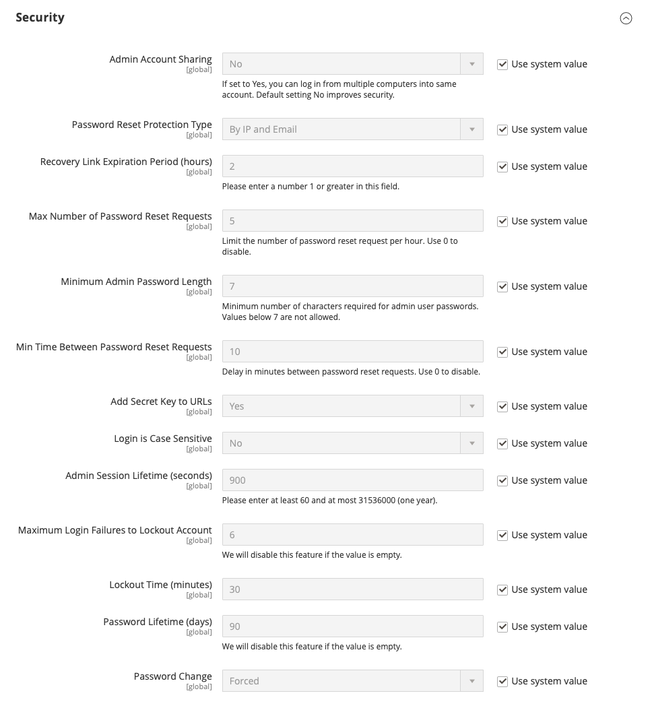

# 관리자 보안 구성

매장 보안을 보호하기 위해 다각적인 방법을 사용하는 것이 좋습니다. 명확한 &quot;관리자&quot; 또는 &quot;백엔드&quot;가 아니라 쉽게 추측할 수 없는 [사용자 지정 관리자 URL](../stores-purchase/store-urls.md#use-a-custom-admin-url)을 사용하여 시작할 수 있습니다. 기본적으로 관리자에 [로그인](../getting-started/admin-signin.md)하는 데 사용되는 암호는 7자 이상이어야 하며 문자와 숫자를 모두 포함해야 합니다. 조직의 요구 사항에 따라 보안을 강화하기 위해 최소 암호 길이 요구 사항을 구성할 수 있습니다. [우수 사례](https://experienceleague.adobe.com/docs/commerce-operations/implementation-playbook/best-practices/launch/security-best-practices.html)로서 문자, 숫자 및 기호의 조합을 포함하는 강력한 관리자 암호만 사용하십시오. Adobe Commerce 및 Magento Open Source에서는 계정에 할당된 마지막 4개의 암호를 재사용할 수 없습니다.

관리자 보안 구성을 통해 다음과 같은 기능을 사용할 수 있습니다.

- URL에 비밀 키 추가
- 암호를 대소문자를 구분해야 함
- 최소 암호 길이 요구 사항 구성
- 관리 세션 길이 제한
- 암호 수명 제한
- 관리자 사용자 계정이 [잠김](permissions-users-all.md#locked-users)되기 전에 수행할 수 있는 로그인 시도 횟수를 제한합니다.

보안을 강화하기 위해 현재 세션이 만료되기 전에 키보드 비활성화 시간을 구성하고 사용자 이름과 암호는 대소문자를 구분해야 합니다.

이 섹션의 보안 설정 외에 앱 또는 장치에서 생성한 일회용 암호로 사용자 ID를 확인하려면 [2단계 인증](security-two-factor-authentication.md)(2FA)이 필요합니다. Admin에 처음 로그인할 때 2FA를 설정하라는 메시지가 표시됩니다. 보안을 강화하기 위해 [CAPTCHA](security-captcha.md)를 사용하도록 관리자 로그인을 구성할 수도 있습니다.

>[!NOTE]
>
>[!DNL Adobe Identity Management Services]&#x200B;(IMS) 인증을 사용하도록 설정한 저장소에 기본 Adobe Commerce 및 Magento Open Source 2FA가 사용하지 않도록 설정되어 있습니다. Adobe 자격 증명으로 Commerce 인스턴스에 로그인한 관리자는 많은 관리 작업에 대해 다시 인증할 필요가 없습니다. Adobe IMS는 관리자 가 현재 세션에 로그인할 때 인증을 처리합니다. [[!DNL Adobe Identity Management Service] (IMS) 통합 개요](../getting-started/adobe-ims-integration-overview.md)를 참조하십시오.

기술 정보는 개발자 설명서에서 [보안 개요](https://developer.adobe.com/commerce/php/architecture/basics/security/){:target="_blank"}를 참조하십시오.

{width="600" zoomable="yes"}

## 관리자 보안 구성

1. _관리자_ 사이드바에서 **[!UICONTROL Stores]** > _[!UICONTROL Settings]_>**[!UICONTROL Configuration]**(으)로 이동합니다.

1. _[!UICONTROL Advanced]_아래의 왼쪽 패널에서&#x200B;**[!UICONTROL Admin]**을(를) 선택합니다.

1. **[!UICONTROL Security]** 섹션에서 를 확장합니다.

1. 관리자 사용자가 다른 장치의 동일한 계정에서 로그인하지 못하도록 하려면 **[!UICONTROL Admin Account Sharing]**&#x200B;을(를) `No`(으)로 설정합니다.

1. 암호 재설정 요청을 관리하는 데 사용되는 메서드를 확인하려면 **[!UICONTROL Password Reset Protection Type]**&#x200B;을(를) 다음 중 하나로 설정하십시오.

   - `By IP and Email` — 알림에서 응답을 받은 후 관리자 계정과 연결된 전자 메일 주소로 전송되면 암호를 온라인으로 다시 설정할 수 있습니다.
   - `By IP` — 추가 확인 없이 암호를 온라인으로 다시 설정할 수 있습니다.
   - `By Email` — 관리자 계정과 연결된 전자 메일 주소로 전송된 알림에 전자 메일을 통해서만 암호를 재설정할 수 있습니다.
   - `None` — 저장소 관리자만 암호를 재설정할 수 있습니다.

1. 로그인 보안 옵션을 설정합니다.

   - **[!UICONTROL Recovery Link Expiration Period (hours)]**&#x200B;의 경우 암호 복구 링크가 유효한 시간(시간)을 입력하십시오.

   - 시간당 제출할 수 있는 최대 암호 요청 수를 확인하려면 **[!UICONTROL Max Number of Password Reset Requests]**&#x200B;의 수를 입력하십시오.

   - **[!UICONTROL Min Time Between Password Reset Requests]**&#x200B;의 경우 암호 재설정 요청 사이에 경과해야 하는 최소 시간(분)을 입력하십시오.

   - 악용 방지를 위해 관리자 URL에 비밀 키를 추가하려면 **[!UICONTROL Add Secret Key to URLs]**&#x200B;을(를) `Yes`(으)로 설정합니다. 이 설정은 기본적으로 활성화되어 있습니다.

   - 입력한 로그인 자격 증명에서 대문자와 소문자를 모두 사용하도록 하려면 **[!UICONTROL Login is Case Sensitive]**&#x200B;을(를) `Yes`(으)로 설정하십시오.

   - 시간이 초과되기 전에 관리 세션의 길이를 확인하려면 **[!UICONTROL Admin Session Lifetime (seconds)]** 필드에 세션 기간(초)을 입력합니다. 값은 60초 이상이어야 합니다.

   - **[!UICONTROL Maximum Login Failures to Lockout Account]**&#x200B;의 경우 계정이 잠기기 전에 사용자가 관리자에 로그인할 수 있는 횟수를 입력합니다. 기본적으로 6번의 시도가 허용됩니다. 무제한 로그인을 시도하려면 필드를 비워 둡니다.

   - **[!UICONTROL Lockout Time (minutes)]**&#x200B;에 최대 시도 횟수를 충족할 때 관리자 계정이 잠기는 시간(분)을 입력합니다.

1. 암호 옵션 설정:

   - **[!UICONTROL Minimum Admin Password Length]**&#x200B;에 관리자 암호에 필요한 최소 문자 수를 입력합니다. 기본값은 7이며, 최소 허용 값은 7입니다.

     >[!WARNING]
     >
     >이 값을 기본값에서 변경하면 기존 서비스와의 이전 버전과의 호환성 문제가 발생할 수 있습니다. 이 설정은 관리자 암호 변경, 관리자 인터페이스와 CLI의 새로운 관리자 사용자 생성 및 관리자의 암호 재설정 작업에 영향을 줍니다.

   - 관리자 암호의 수명을 제한하려면 **[!UICONTROL Password Lifetime (days)]**&#x200B;에 대해 암호가 유효한 일 수를 입력하십시오. 무제한으로 사용하려면 필드를 비워 둡니다.

   - **[!UICONTROL Password Change]**&#x200B;을(를) 다음 중 하나로 설정합니다.

      - `Forced` — 계정 설정 후 관리자 사용자가 암호를 변경해야 합니다.
      - `Recommended` — 관리자 사용자는 계정을 설정한 후 암호를 변경할 것을 권장합니다.

1. 완료되면 **[!UICONTROL Save Config]**&#x200B;을(를) 클릭합니다.

## 관리자 암호 요구 사항

기본적으로 관리자 암호는 7자 이상이어야 하며 문자와 숫자를 모두 포함해야 합니다. **[!UICONTROL Minimum Admin Password Length]** 설정을 사용하여 조직의 보안 표준을 충족하도록 최소 암호 길이 요구 사항을 구성할 수 있습니다. 그러나 이 값을 늘리면 기존 서비스 및 통합과의 호환성에 영향을 줄 수 있습니다.
