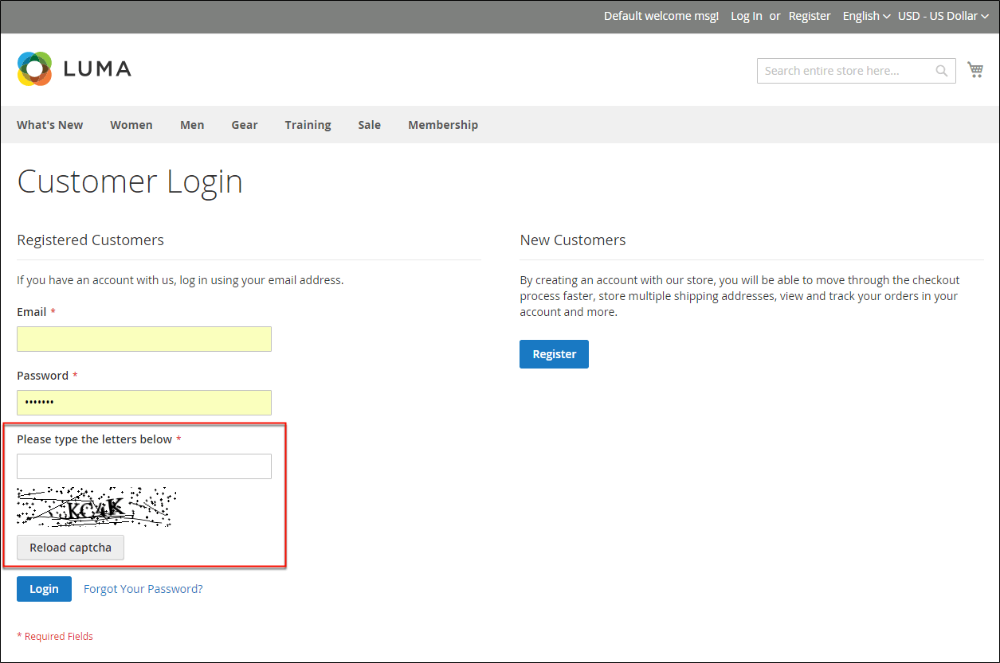
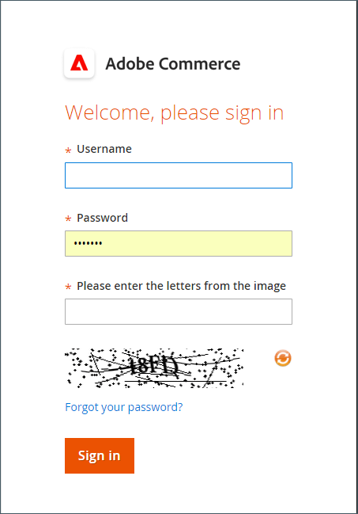

# CAPTCHA

CAPTCHA는 컴퓨터(또는 &quot;보트&quot;)가 아닌 사람이 사이트와 상호 작용하도록 보장하는 시각적 장치입니다. CAPTCHA는 _컴퓨터와 인간을 구분하기 위한 완전 자동화된 공용 튜링 테스트_&#x200B;의 약어입니다. 관리자 액세스 및 등록된 고객이 시작한 다양한 상점 첫 번째 작업 모두에 사용할 수 있습니다. Adobe Commerce 및 Magento Open Source에서는 이 항목에 설명된 표준 CAPTCHA와 [Google reCAPTCHA](security-google-recaptcha.md)를 지원합니다.

이미지의 오른쪽 상단에 있는 다시 로드 아이콘을 클릭하여 CAPTCHA를 필요한 만큼 다시 로드할 수 있습니다. CAPTCHA는 완전히 구성 가능하며 설정될 수 있으며, 매번 또는 정의된 로그인 시도 실패 횟수가 지정된 후에만 나타납니다.

{width="700" zoomable="yes"}

## 관리자용 CAPTCHA 구성

보안 수준을 높이기 위해 관리자 로그인 및 암호 찾기 페이지에 CAPTCHA를 추가할 수 있습니다. 관리자는 이미지의 오른쪽 상단에 있는 _다시 로드_  아이콘을 클릭하여 표시된 CAPTCHA를 다시 로드할 수 있습니다. 다시 로드 횟수는 제한이 없습니다.

{width="300"}

1. _관리자_ 사이드바에서 **[!UICONTROL Stores]** > _[!UICONTROL Settings]_>**[!UICONTROL Configuration]**(으)로 이동합니다.

1. 왼쪽 패널에서 **[!UICONTROL Advanced]**&#x200B;을(를) 확장하고 **[!UICONTROL Admin]**&#x200B;을(를) 선택합니다.

1. 오른쪽 상단 모서리에서 **[!UICONTROL Store View]**&#x200B;을(를) `Default`(으)로 설정합니다.

   Commerce 설치의 [범위](../getting-started/websites-stores-views.md#scope-settings)에 여러 웹 사이트가 포함된 경우 CAPTCHA 구성을 적용할 웹 사이트를 선택하십시오.

1. **[!UICONTROL CAPTCHA]** 섹션에서 를 확장합니다.

1. **[!UICONTROL Enable CAPTCHA in Admin]**&#x200B;을(를) `Yes`(으)로 설정합니다. 그런 다음 나머지 옵션을 다음과 같이 완료합니다.

   {width="600" zoomable="yes"}

   - CAPTCHA 기호에 사용할 **[!UICONTROL Font]**&#x200B;의 이름을 입력하십시오(기본값: `LinLibertine`).

     고유한 글꼴을 추가하려면 글꼴 파일이 Commerce 설치와 동일한 디렉터리에 있어야 하며 `app/code/Magento/Captcha/etc`에 있는 Captcha 모듈의 `config.xml` 파일에서 선언되어야 합니다.

   - CAPTCHA를 사용할 다음 **[!UICONTROL Forms]** 중 하나를 선택하십시오. 여러 양식을 선택하려면 Ctrl 키(PC) 또는 Command 키(Mac)를 누른 채로 선택합니다.

      - `Admin Login`
      - `Admin Forgot Password`

   - **[!UICONTROL Displaying Modes]**&#x200B;을(를) 다음 중 하나로 설정합니다.

      - `Always` — CAPTCHA는 항상 관리자에 로그인해야 합니다.
      - `After number of attempts to login` — 이 옵션은 관리자 로그인 양식에만 적용됩니다. 선택하면 _[!UICONTROL Number of Unsuccessful Attempts to Login]_&#x200B;필드가 나타납니다. 허용할 로그인 시도 횟수를 입력합니다. 값이 0(영)이면 표시 모드를 `Always`(으)로 설정하는 것과 비슷합니다.

     실패한 로그인 시도 횟수를 추적하기 위해 하나의 이메일 주소와 하나의 IP 주소에서 로그인을 시도한 각 시도가 계산됩니다. 동일한 IP 주소에서 허용되는 최대 로그인 시도 횟수는 1,000회입니다. 이 제한은 CAPTCHA가 활성화된 경우에만 적용됩니다.

   - CAPTCHA가 나타나기 전에 관리자가 로그인을 시도할 수 있는 횟수를 **[!UICONTROL Number of Unsuccessful Attempts to Login]**&#x200B;에 입력하십시오. 0(`0`)으로 설정하면 항상 CAPTCHA가 필요합니다.

   - **[!UICONTROL CAPTCHA Timeout (minutes)]**&#x200B;의 경우 CAPTCHA가 만료되기 전 시간(분)을 입력하십시오. CAPTCHA가 만료되면 관리자는 페이지를 다시 로드해야 합니다.

   - CAPTCHA에 표시할 **[!UICONTROL Number of Symbols]**&#x200B;을(를) 입력하십시오. 최대 8개(`8`)의 기호를 사용할 수 있습니다. 각 CAPTCHA에 따라 변경되는 다양한 수의 기호에 대해 범위(예: `5-8`)를 입력하십시오.

   - **[!UICONTROL Symbols Used in CAPTCHA]**&#x200B;의 경우 CAPTCHA에 임의로 표시할 문자(a-z 및 A-Z)와 숫자(0-9)를 입력합니다. `i`, `l` 또는 `1` 등의 다른 기호와 구별하기 어려운 기호는 기본 CAPTCHA 기호 집합에 포함되지 않습니다.

   - 관리자가 CAPTCHA에 표시된 대로 문자를 대문자나 소문자로 정확히 입력하도록 하려면 **[!UICONTROL Case Sensitive]**&#x200B;을(를) `Yes`(으)로 설정하십시오.

1. 완료되면 **[!UICONTROL Save Config]**&#x200B;을(를) 클릭합니다.

## 상점 첫 화면의 CAPTCHA 구성

고객이 계정에 로그인할 때마다 또는 로그인을 여러 번 시도한 후 CAPTCHA를 입력해야 할 수 있습니다. 또한 상점 전체에서 사용되는 다양한 양식은 CAPTCHA에 의한 확인이 필요하도록 구성할 수 있습니다.

체크아웃 중 {width="700" zoomable="yes"}

1. _관리자_ 사이드바에서 **[!UICONTROL Stores]** > _[!UICONTROL Settings]_>**[!UICONTROL Configuration]**(으)로 이동합니다.

1. 왼쪽 패널에서 **[!UICONTROL Customers]**&#x200B;을(를) 확장하고 **[!UICONTROL Customer Configuration]**&#x200B;을(를) 선택합니다.

1. **[!UICONTROL CAPTCHA]** 섹션에서 를 확장합니다.

{width="600" zoomable="yes"}

1. **[!UICONTROL Enable CAPTCHA on Storefront]**&#x200B;을(를) `Yes`(으)로 설정합니다. 그런 다음 나머지 옵션을 다음과 같이 완료합니다.

   - CAPTCHA 기호에 사용할 **[!UICONTROL Font]**&#x200B;의 이름을 입력하십시오(기본값: `LinLibertine`).

     고유한 글꼴을 추가하려면 글꼴 파일이 Commerce 설치와 동일한 디렉터리에 있어야 하며 CAPTCHA 모듈의 `config.xml` 파일에서 선언되어야 합니다.

   - CAPTCHA를 사용할 다음 **[!UICONTROL Forms]** 중 하나를 선택하십시오. 여러 양식을 선택하려면 Ctrl 키(PC) 또는 Command 키(Mac)를 누른 채로 선택합니다.

      - `Applying coupon code`
      - `Checkout/Placing Order`
      - `Create user`
      - `Login`
      - `Forgot password`
      - `Contact Us`
      - `Change password`
      - `Share Wishlist Form`
      - `Payflow Pro`([보안 패치](https://experienceleague.adobe.com/docs/commerce-knowledge-base/kb/troubleshooting/payments/paypal-payflow-pro-active-carding-activity.html?lang=ko) _기술 자료_ 문서 참조)
      - `Send to Friend Form` (Magento Open Source 전용)
      - `Add Gift Card Code` (Adobe Commerce 전용)
      - `Create company` (Adobe Commerce B2B에서만 사용 가능)

   - **[!UICONTROL Displaying Mode]**&#x200B;을(를) 다음 중 하나로 설정합니다.

      - `Always` — 선택한 양식에 액세스하려면 항상 CAPTCHA가 필요합니다.
      - `After number of attempts to login` — CAPTCHA가 나타나기 전에 로그인 시도 횟수를 입력합니다. 값이 0(영)이면 &quot;항상&quot;과 비슷합니다. 선택하면 실패한 로그인 시도 횟수가 표시됩니다. 이 옵션은 암호 분실 양식에는 적용되지 않으며 활성화된 경우 항상 CAPTCHA를 표시합니다.

   - **[!UICONTROL Number of Unsuccessful Attempts to Login]**&#x200B;에 CAPTCHA가 나타나기 전에 고객이 로그인하지 못한 횟수를 입력하십시오. 0(`0`)으로 설정하면 CAPTCHA가 항상 사용됩니다.

   - **[!UICONTROL CAPTCHA Timeout (minutes)]**&#x200B;의 경우 CAPTCHA가 만료되기 전 시간(분)을 입력하십시오. CAPTCHA가 만료되면 고객은 페이지를 다시 로드하여 새 CAPTCHA를 생성해야 합니다.

   - CAPTCHA에 표시할 **[!UICONTROL Number of Symbols]**&#x200B;을(를) 입력하십시오. 최대 8개(`8`)의 기호를 사용할 수 있습니다. 각 CAPTCHA에 따라 변경되는 다양한 수의 기호에 대해 범위(예: `5-8`)를 입력하십시오.

   - **[!UICONTROL Symbols Used in CAPTCHA]**&#x200B;의 경우 CAPTCHA에 임의로 표시할 문자(a-z 및 A-Z)와 숫자(0-9)를 입력합니다. 기본 문자 집합에는 `I` 또는 `1`과(와) 같은 유사한 기호가 포함되어 있지 않습니다. 최상의 결과를 얻으려면 사용자가 쉽게 식별할 수 있는 기호를 사용하십시오.

   - 고객이 CAPTCHA에 표시된 대로 문자를 대문자나 소문자로 정확히 입력하도록 하려면 **[!UICONTROL Case Sensitive]**&#x200B;을(를) `Yes`(으)로 설정하십시오.

1. 완료되면 **[!UICONTROL Save Config]**&#x200B;을(를) 클릭합니다.
