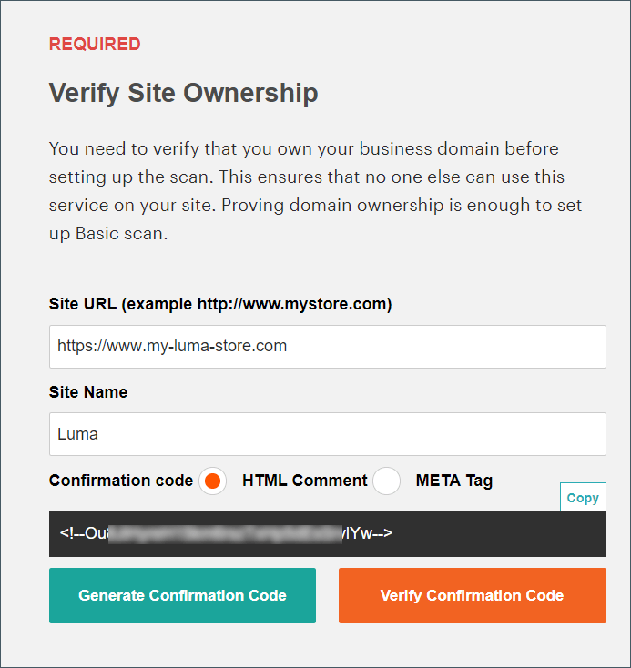
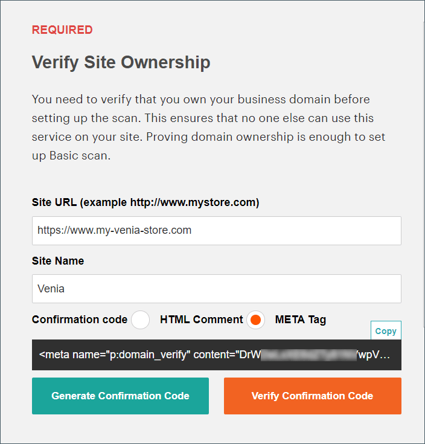

# 보안 검사

향상된 보안 검사를 사용하면 PWA을 포함하여 Adobe Commerce 및 Magento Open Source 사이트 각각을 모니터링하여 알려진 보안 위험 및 맬웨어를 확인하고 패치 업데이트 및 보안 알림을 받을 수 있습니다.

- insight을 통해 스토어의 실시간 보안 상태를 확인할 수 있습니다.
- 문제 해결에 도움이 되는 모범 사례를 기반으로 제안을 받습니다.
- 매주, 매일 또는 온디맨드로 보안 검사를 실행하도록 예약합니다.
- 잠재적인 맬웨어를 식별하는 데 도움이 되는 21,000개 이상의 보안 테스트를 실행합니다.
- 사이트의 진행 상황을 추적 및 모니터링하는 기간별 보안 보고서에 액세스합니다.
- 모든 권장 작업과 함께 성공 및 실패한 검사를 표시하는 검사 보고서에 액세스합니다.

보안 검색 도구는 [Commerce/Magento 계정](../getting-started/commerce-account-create.md)의 대시보드에서 무료로 사용할 수 있습니다. 자세한 내용은 _Commerce on Cloud Infrastructure Guide_&#x200B;에서 [보안 검색 도구 설정](https://experienceleague.adobe.com/docs/commerce-cloud-service/user-guide/launch/overview.html#set-up-the-security-scan-tool)을 참조하십시오.

{width="600" zoomable="yes"}

## 보안 검사 실행

1. [Commerce/Magento 계정](../getting-started/commerce-account-create.md)에 로그인합니다.

1. 왼쪽 패널에서 [!UICONTROL Security Scan] 탭을 클릭합니다. (필요한 경우 Security scan 도구 사용에 대한 업데이트된 약관을 검토하고 동의하십시오.)

   - 왼쪽 패널에서 **[!UICONTROL Security Scan]**&#x200B;을(를) 선택합니다.
   - **[!UICONTROL Go to Security Scan]**&#x200B;을(를) 클릭합니다.
   - **[!UICONTROL Terms and Conditions]**&#x200B;을(를) 읽습니다.
   - 계속하려면 **[!UICONTROL Agree]**&#x200B;을(를) 클릭하십시오.

1. _[!UICONTROL Monitored Websites]_페이지에서&#x200B;**[!UICONTROL +Add Site]**을(를) 클릭합니다.

   여러 사이트가 있고 도메인이 다른 경우 각 도메인에 대해 별도의 검사를 구성합니다.

   {width="600" zoomable="yes"}

1. 확인 코드를 추가하여 사이트 도메인의 소유권을 확인하려면 다음 중 하나를 수행하십시오.

   **Commerce 상점**:

   - **[!UICONTROL Site URL]** 및 **[!UICONTROL Site Name]**&#x200B;을(를) 입력하십시오.
   - **[!UICONTROL Generate Confirmation Code]**&#x200B;을(를) 클릭합니다.
   - 확인 코드를 클립보드에 복사하려면 **복사**&#x200B;를 클릭하십시오.

     {width="400" zoomable="yes"}

   - 저장소 관리자에 전체 관리자 권한이 있는 사용자로 로그인하고 다음을 수행합니다.

      - _관리자_ 사이드바에서 **[!UICONTROL Content]** > _[!UICONTROL Design]_>**[!UICONTROL Configuration]**(으)로 이동합니다.
      - 목록에서 사이트를 찾은 다음 **[!UICONTROL Edit]**&#x200B;을(를) 클릭합니다.
      - **[!UICONTROL HTML Head]** 섹션에서 를 확장합니다.
      - **[!UICONTROL Scripts and Style Sheets]**(으)로 스크롤하여 기존 코드의 끝에 있는 텍스트 상자를 클릭하고 확인 코드를 텍스트 상자에 붙여 넣습니다.

        {width="600" zoomable="yes"}

      - 완료되면 **[!UICONTROL Save Configuration]**&#x200B;을(를) 클릭합니다.

   **PWA 상점**:

   - **[!UICONTROL Site URL]** 및 **[!UICONTROL Site Name]**&#x200B;을(를) 입력하십시오.

   - **[!UICONTROL Confirmation Code]**&#x200B;에 대해 `META Tag` 옵션을 선택한 다음 **[!UICONTROL Generate Code]**&#x200B;을(를) 클릭합니다.

   - 생성된 확인 코드 META Tag를 클립보드에 복사하려면 **[!UICONTROL Copy]**&#x200B;을(를) 클릭합니다.

     {width="400" zoomable="yes"}

   - PWA Studio 상점 프로젝트 디렉토리로 이동하여 다음을 수행합니다.

      - PWA Studio 프로젝트 디렉터리 아래의 `packages > venia-concept > template.html`(으)로 이동합니다.
      - 복사된 확인 코드(생성된 META 태그)를 HTML 헤드에 추가하고 변경 사항을 저장합니다.

        {width="600" zoomable="yes"}

      - PWA Studio CLI로 돌아가서 yarn을 사용하여 프로젝트 종속성을 설치하고 프로젝트 빌드 명령을 실행합니다.

        ```sh
        yarn install &&
        yarn build
        ```

      - *클라우드 프로젝트에서*&#x200B;을(를) `pwa` 폴더를 만들고 Storefront 프로젝트의 `dist` 폴더 내에 콘텐츠를 복사하세요.

        ```sh
        mkdir pwa && cp -r <path to your storefront project>/dist/* pwa
        ```

      - Git CLI 도구를 사용하여 이러한 변경 사항을 클라우드 프로젝트에 스테이징하고, 커밋하고, 푸시합니다.

        ```sh
        git add . &&
        git commit -m "Added storefront file bundles" &&
        git push origin
        ```

        빌드 프로세스가 완료되면 변경 사항이 PWA 스토어 전면에 배포됩니다.

1. Commerce 계정의 _[!UICONTROL Security Scan]_페이지로 돌아가서&#x200B;**[!UICONTROL Verify Confirmation Code]**을(를) 클릭하여 도메인의 소유권을 설정합니다.

1. 확인 후 다음 유형 중 하나에 대해 **[!UICONTROL Set Automatic Security Scan]** 옵션을 구성합니다.

   **주별 검사(권장)**:

   - 매주 검사할 **[!UICONTROL Week Day]**, **[!UICONTROL Time]** 및 **[!UICONTROL Time Zone]**&#x200B;을(를) 선택하십시오.
   - 기본적으로 스캔은 매주 토요일 자정(UTC)에 시작되고 일요일 초까지 계속되도록 예약되어 있습니다.

     {width="500" zoomable="yes"}

   **매일 검사**:

   - 매일 검사할 **[!UICONTROL Time]** 및 **[!UICONTROL Time Zone]**&#x200B;을(를) 선택하십시오.
   - 기본적으로 검색은 매일 자정(UTC)에 시작되도록 예약되어 있습니다.

     {width="500" zoomable="yes"}

1. 완료된 검사 및 보안 업데이트에 대한 알림을 받을 **[!UICONTROL Email Address]**&#x200B;을(를) 입력하십시오.

   {width="400" zoomable="yes"}

1. 완료되면 **[!UICONTROL Submit]**&#x200B;을(를) 클릭합니다.

   도메인의 소유권이 확인되면 사이트가 Commerce 계정의 모니터링되는 웹 사이트 목록에 표시됩니다.

1. 도메인이 다른 여러 웹 사이트가 있는 경우 이 프로세스를 반복하여 각각에 대한 보안 검사를 설정합니다.

## 보안 검색 삭제

>[!NOTE]
>
>원래 검사를 설정한 사람만 계정에서 삭제할 수 있습니다. 2022년 8월 이후 [계정](https://account.magento.com)에 로그인하지 않은 사용자는 먼저 [Adobe ID에 등록](https://account.magento.com)했는지 확인해야 합니다.

**검사 삭제**

1. [Commerce/Magento 계정](../getting-started/commerce-account-create.md)에 로그인합니다.

1. 왼쪽 패널에서 [!UICONTROL Security Scan] 탭을 클릭합니다. (필요한 경우 Security scan 도구 사용에 대한 업데이트된 약관을 검토하고 동의하십시오.)

   - **[!UICONTROL Go to Security Scan]**&#x200B;을(를) 클릭합니다.
   - **[!UICONTROL Terms and Conditions]**&#x200B;을(를) 읽습니다.
   - 계속하려면 **[!UICONTROL Agree]**&#x200B;을(를) 클릭하십시오.

1. _[!UICONTROL Monitored Websites]_페이지에서 [!UICONTROL Actions] 열 아래의 드롭다운을 찾은 다음 적절한 웹 사이트에 대해&#x200B;**[!UICONTROL Delete]**을(를) 선택합니다.
